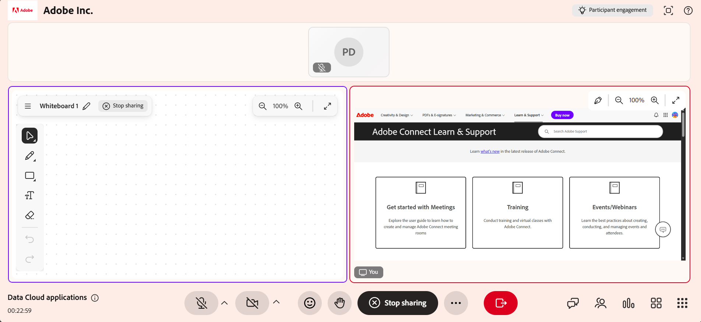

# Condividere lo schermo come Istruttore

La condivisione dello schermo consente di presentare contenuti dal dispositivo ai partecipanti durante una sessione di Hub dal vivo. Condividi una scheda del browser, una finestra dell’applicazione o l’intero schermo per dimostrare i flussi di lavoro, distribuire presentazioni e guidare gli Allievi attraverso le attività in tempo reale.

È possibile migliorare le presentazioni visualizzando fino a due contenuti affiancati in una doppia visualizzazione, utilizzando una lavagna accanto ai contenuti condivisi e annotando direttamente sullo schermo per enfatizzare le informazioni chiave. Puoi anche consentire agli Allievi di condividere le schermate mantenendo il controllo sulla sessione.

Questo articolo spiega come condividere lo schermo, annotare i contenuti, utilizzare la Visualizzazione divisa e gestire la condivisione dello schermo dell’Allievo nell’Hub live.

## Condividere lo schermo in una sessione

È possibile avviare la condivisione dello schermo durante una sessione per presentare i contenuti a tutti i partecipanti in tempo reale. In questo modo è possibile mostrare le applicazioni, scorrere i flussi di lavoro o eseguire presentazioni direttamente dal dispositivo.

Segui questi passaggi per condividere lo schermo:

1. Selezionare  dalla barra di controllo. Viene visualizzata una finestra a comparsa.

1. Selezionate una delle seguenti opzioni:

   1. **Scheda Chrome**: condividete una scheda del browser.

   1. **Finestra**: condividete un&#39;applicazione specifica.

   1. **Schermo intero**: condividete lo schermo intero.

   
   *Finestra a comparsa per la condivisione dello schermo con più opzioni.*

1. (Facoltativo) Abilita **Condividi anche l&#39;audio della scheda** per includere l&#39;audio dalla scheda condivisa.

1. Seleziona i contenuti che desideri condividere.

1. Seleziona **Condividi**. Il contenuto selezionato viene visualizzato da tutti gli Allievi.

Puoi condividere fino a due contenuti durante una sessione. Quando vengono condivisi contenuti aggiuntivi, il layout si adatta automaticamente per visualizzarli insieme.

### Interrompi condivisione schermo

Per interrompere la condivisione dello schermo, selezionare **Interrompi condivisione** dall&#39;interfaccia dello schermo condiviso.

*Barra di controllo che mostra l&#39;opzione per interrompere la condivisione dello schermo.*

La condivisione dello schermo nella sessione termina e il contenuto condiviso viene rimosso dall&#39;interfaccia della room.

## Condividere più contenuti in una sessione

Virtual Classroom supporta la visualizzazione combinata quando durante una sessione vengono condivisi più tipi di contenuto. Ciò consente agli Istruttori di presentare più tipi di contenuto contemporaneamente, ad esempio una condivisione dello schermo, una lavagna o un pannello di coinvolgimento.

### Funzionamento della divisione della vista

Quando sono attivi più contenuti:

* È possibile visualizzare un massimo di due contenuti alla volta.

* Viene visualizzato un contenuto nell&#39;area dello stage principale.

* L’altro contenuto viene visualizzato in una vista secondaria.

* Quando viene condiviso nuovo contenuto, il contenuto esistente può essere spostato nella vista secondaria.

>[!NOTE]
>
> I pannelli di coinvolgimento, ad esempio i sondaggi, hanno la priorità e vengono visualizzati per primi nella vista divisa.

### Passare alla visualizzazione singola

Quando sono visualizzati più contenuti, gli Istruttori possono passare allo stato attivo per un singolo contenuto.

Per passare a una vista singola:

1. Selezionate i contenuti da mettere a fuoco.

1. Scegliere **Ingrandisci**. Il contenuto selezionato viene visualizzato sullo stage principale, mentre il contenuto rimanente viene spostato in una vista secondaria.

## Usare la condivisione dello schermo con una lavagna

È possibile eseguire la condivisione dello schermo insieme a una lavagna durante una sessione per presentare contenuti durante l&#39;aggiunta di spiegazioni o annotazioni.

Quando una lavagna viene condivisa durante una condivisione attiva dello schermo o quando la condivisione dello schermo viene avviata mentre una lavagna è già attiva, la sessione passa automaticamente alla visualizzazione suddivisa.

Per utilizzare la condivisione dello schermo con una lavagna:

1. Condividi lo schermo.

1. Selezionate l’icona della lavagna dalla barra di controllo.

1. Seleziona **Condividi lavagna**. Entrambi i contenuti vengono visualizzati nella vista combinata.

   
   *L&#39;interfaccia Hub live mostra una vista divisa con la lavagna a sinistra e il contenuto condiviso a destra.*

Per passare dalla lavagna alla schermata condivisa e viceversa:

1. Seleziona il contenuto da visualizzare.

1. Selezionare **Ingrandisci**. Il contenuto selezionato viene spostato sullo stage principale. L’altro contenuto viene spostato in una vista secondaria.

   
   *L&#39;interfaccia Hub dal vivo mostra una vista divisa con la lavagna ingrandita e il contenuto condiviso nella parte inferiore dell&#39;interfaccia.*

## Annota contenuto condiviso

È possibile annotare contenuti condivisi durante una sessione per evidenziare informazioni importanti, spiegare concetti o guidare visivamente gli Allievi. Le annotazioni vengono applicate a un&#39;istantanea della schermata condivisa. Sono progettate per spiegazioni in tempo reale e forniscono un&#39;esperienza mirata e priva di distrazioni.

Durante la condivisione dello schermo, selezionate l&#39;icona Annota (penna) nell&#39;angolo superiore destro dell&#39;interfaccia di condivisione dello schermo. Gli strumenti di annotazione vengono visualizzati automaticamente nell’interfaccia di condivisione dello schermo.

### Usare gli strumenti di annotazione

Quando iniziate ad aggiungere annotazioni, viene visualizzata una barra degli strumenti di annotazione.

*Interfaccia Hub dal vivo che mostra la barra degli strumenti delle annotazioni per interagire con i contenuti condivisi.*

La barra degli strumenti delle annotazioni offre le seguenti opzioni:

| **Strumento** | **Descrizione** |
|----|----|
| **Seleziona** | Gestire le annotazioni esistenti. È possibile spostare, ridimensionare, duplicare o eliminare gli elementi di annotazione. |
| **Disegno** | Creare disegni a mano libera. Potete regolare il thickness e il colore della traccia. |
| **Forme** | Aggiungi forme strutturate come rettangoli o cerchi. Potete personalizzare le proprietà del tratto e del riempimento. |
| **Testo** | Aggiungi etichette o spiegazioni. Potete formattare il testo e regolarne la posizione. |
| **Gomma** | Rimuovere le annotazioni dalla schermata. Potete cancellare singoli elementi o tutte le annotazioni. |
| **Interrompi annotazione** | Esci dalla modalità di annotazione e riprendi la condivisione dello schermo. Tutte le annotazioni vengono eliminate. |
| **Annulla** | Inverte l’azione più recente. |
| **Ripeti** | Riapplica l&#39;azione annullata in precedenza. |

## Consenti ai partecipanti di condividere lo schermo

È possibile consentire ai partecipanti di condividere il proprio schermo durante una sessione. Ciò consente di presentare contenuti, dimostrare i flussi di lavoro o supportare discussioni.

Quando la condivisione dello schermo è abilitata per gli Allievi:

* Gli Allievi possono avviare la condivisione dello schermo dai controlli della sessione.

* È possibile attivare una sola condivisione dello schermo alla volta.

* Gli istruttori mantengono il pieno controllo sulla condivisione dello schermo durante la sessione.
