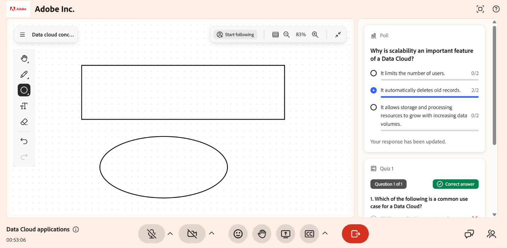

# Utilizzare la lavagna come Allievo

La lavagna fornisce un&#39;area di lavoro visiva condivisa durante una sessione di Hub dal vivo. Quando l’Istruttore abilita l’accesso alla lavagna, puoi disegnare, aggiungere forme e testo e cancellare il contenuto nell’area di lavoro condivisa. Utilizza la lavagna per illustrare idee, risolvere problemi e partecipare ad attività collaborative in tempo reale.

Questo articolo spiega come utilizzare la lavagna nell’Hub live come Allievo.

## Usare la lavagna

Quando un Istruttore consente agli Allievi di modificare una lavagna, puoi interagire con essa durante una sessione dal vivo. Nella sessione è possibile:

* Disegna sulla lavagna usando lo strumento marcatore.

* Aggiungi forme e testo per creare o contribuire al contenuto.

* Cancella disegni, forme o oggetti dalla lavagna.

*Gli Allievi possono disegnare, aggiungere forme e testo e cancellare il contenuto sulla lavagna condivisa.*

Per ulteriori informazioni, vedere [Utilizzare gli strumenti lavagna](../getting-started-with-live-hub/share-a-whiteboard.md#use-whiteboard-tools).
