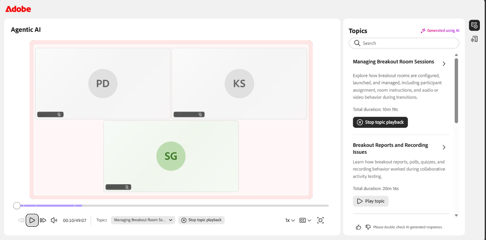

# Visualizzare le registrazioni della sessione come Allievo

Al termine di una sessione Hub dal vivo, nella pagina del corso diventa disponibile una registrazione. Come Allievo, puoi guardare la registrazione, sfogliare gli argomenti generati dall’intelligenza artificiale per accedere a sezioni specifiche e rivedere la trascrizione della data e dell’ora accanto al video.

## Accedere alla registrazione della sessione

Le registrazioni della sessione sono disponibili nella sezione **Registrazioni della sessione** nella pagina del corso. Il collegamento di registrazione è in genere disponibile circa **quaranta** minuti dopo l&#39;ora di fine della sessione pianificata. Se si accede alla pagina del corso prima del completamento dell’elaborazione, il collegamento alla registrazione non viene visualizzato.

>[!NOTE]
>
>Quando un Istruttore registra una sessione, nella registrazione viene inclusa solo la sessione principale. La registrazione si interrompe automaticamente quando i partecipanti si spostano in sale d&#39;attesa e riprende quando tutti tornano alla sessione principale. Di conseguenza, le attività della breakout room non vengono registrate.

Per accedere alla registrazione:

1. Apri la pagina del corso per la sessione.

1. Selezionare la scheda **Moduli**. Viene visualizzata la pagina dei dettagli del corso.

   
   *Registrazioni della sessione nella pagina del corso*.

1. Passa alla sezione **Registrazioni sessione**.

1. Seleziona il collegamento per la registrazione. La registrazione si apre in una nuova scheda del browser.

   
   *Il lettore per la registrazione è in modalità di riproduzione e visualizza il video della sessione e il pannello Trascrizione.*

1. Utilizza i seguenti controlli di riproduzione per regolare l’esperienza di visualizzazione:

| **Controllo** | **Descrizione** |
|----|----|
| **Riproduci/Pausa** | Avvia o sospende la riproduzione. |
| **Volume** | Regola il livello audio. |
| **Barra di avanzamento** | Spostarsi in un punto specifico della registrazione. La durata trascorsa e la durata totale vengono visualizzate accanto ai controlli. |
| **Velocità di riproduzione** | Modifica la velocità di riproduzione. Le opzioni disponibili sono **0.25x**, **0.5x**, **0.75x**, **1x**, **1.25x**, **1.5x** e **2x**. |
| **Sottotitoli codificati (CC)** | Attiva o disattiva i sottotitoli. Seleziona la freccia accanto a **CC** per scegliere uno stile di sottotitolo e una dimensione del font. |
| **Schermo intero** | Visualizza la registrazione in modalità a schermo intero. |

## Visualizza argomenti nella registrazione

Gli argomenti generati dall&#39;intelligenza artificiale semplificano la revisione delle registrazioni evidenziando le aree di discussione principali e consentendo di passare direttamente alle sezioni pertinenti.

Per le registrazioni di **trenta** minuti o più, Live Hub genera automaticamente argomenti basati sull&#39;intelligenza artificiale per dividere la sessione in sezioni significative.

>[!NOTE]
>
> Gli argomenti sono disponibili solo quando gli argomenti generati dall’intelligenza artificiale sono abilitati per l’account e non sono stati disabilitati dall’Istruttore per la sessione.

Per visualizzare e navigare tra gli argomenti:

1. Nel pannello **Argomenti**, sfogliate l&#39;elenco degli argomenti o utilizzate la casella **Cerca** per trovare un argomento utilizzando le parole chiave.

1. Seleziona un argomento per espanderlo e visualizzarne il riepilogo, i dettagli e la durata totale.

1. Seleziona **Riproduci argomento**. La registrazione inizia dalla sezione dell&#39;argomento selezionato.

   
   *Il pannello Argomenti, in cui gli argomenti generati dall&#39;intelligenza artificiale consentono di spostarsi all&#39;interno della registrazione.*

## Visualizza trascrizione

La trascrizione fornisce una versione di testo della sessione con data e ora che puoi leggere insieme alla registrazione. Ogni voce include il nome dell&#39;oratore e l&#39;ora in cui il testo è stato pronunciato.

Per visualizzare la trascrizione:

1. Seleziona l’icona **Trascrizione** dal pannello per passare al lato destro del lettore. Viene aperto il pannello **Trascrizione** e viene visualizzata la trascrizione con data e ora.

1. (Facoltativo) Utilizza la casella **Cerca** per trovare parole o frasi specifiche all&#39;interno della trascrizione.

Per passare a una parte specifica della registrazione, seleziona una voce di trascrizione. La registrazione passa al timestamp corrispondente e inizia la riproduzione da quel punto.

*Il pannello Trascrizione, in cui ogni voce si collega al proprio punto nella registrazione.*

### Modifica la dimensione del testo della trascrizione

Puoi regolare le dimensioni del testo della trascrizione per semplificarne la lettura.

Per modificare le dimensioni del testo:

1. Nel pannello **Trascrizione**, seleziona l&#39;icona **dimensioni testo** accanto all&#39;intestazione **Trascrizione**.

1. Selezionate una dimensione di testo dall&#39;elenco. Le dimensioni disponibili sono 12, 14, 16, 18, 20, 24, 30 e 36. La dimensione predefinita è 14. Il testo della trascrizione si aggiorna alle dimensioni selezionate.

   
   *Per facilitare la lettura delle voci, scegli una dimensione del testo della trascrizione.*
