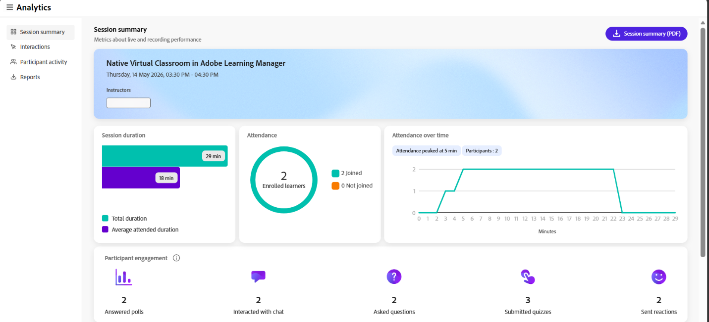

# Visualizza dashboard sessione

Il dashboard delle sessioni nell’Hub live fornisce informazioni dettagliate sulla partecipazione degli Allievi, sul coinvolgimento e sulle prestazioni delle sessioni. Consente agli Istruttori di esaminare il modo in cui gli Allievi interagivano durante una sessione e valutarne l’efficacia.

Il dashboard consolida le metriche chiave quali la partecipazione, la partecipazione e le interazioni, consentendo un&#39;analisi e un processo decisionale migliori per le sessioni future.

## Vantaggi principali

* **Visibilità centralizzata**: monitora la partecipazione, la partecipazione e le interazioni degli Allievi da un singolo dashboard.

* **Informazioni sul coinvolgimento**: scopri come gli Allievi interagiscono durante la sessione e identifica i modelli di coinvolgimento.

* **Analisi delle prestazioni**: valuta l&#39;efficacia della sessione utilizzando i dati di partecipazione e interazione.

* **Miglioramenti basati sui dati**: utilizza gli approfondimenti del dashboard per migliorare le sessioni future e i risultati dell&#39;apprendimento.

## Accesso al dashboard sessione

Seguite questi passaggi per visualizzare il dashboard della sessione per una sessione di Hub dinamico:

1. Accedi a Adobe Learning Manager come Istruttore.

1. Seleziona **Sessioni passate** da **Sessioni personali**. Viene aperta la pagina **Le tue sessioni passate**.

   
   *Selezionare Sessioni passate da Sessioni per aprire la pagina Sessioni passate.*

1. Apri il corso di cui desideri verificare l’analisi della sessione.   Viene visualizzata la pagina **Panoramica sessione**.

1. Passa alla sezione **Hub live** e seleziona **Visualizza pagina di analisi**.   Viene aperto il dashboard **Analytics** con informazioni dettagliate sulla sessione selezionata.

   
   *Seleziona Visualizza pagina di analisi nella sezione Hub dal vivo per aprire il dashboard di analisi.*

## Quali approfondimenti sono disponibili

Il dashboard della sessione presenta i dati della sessione in più schede, ognuna incentrata su un aspetto specifico della partecipazione e delle prestazioni degli Allievi. Queste viste consentono agli Istruttori di analizzare insieme la partecipazione, i livelli di coinvolgimento e i modelli di interazione per la sessione.

*Il dashboard della sessione presenta i dati nelle schede Riepilogo sessione, Interazioni, Attività partecipante e Report.*

Nel dashboard della sessione sono disponibili le schede riportate di seguito.

| **Scheda** | **Descrizione** |
|----|----|
| **Riepilogo della sessione** | Offre una panoramica di alto livello delle prestazioni in tempo reale e di registrazione, tra cui la durata della sessione, il numero di Allievi iscritti e iscritti, la durata media dei partecipanti, la partecipazione nel tempo, il coinvolgimento dei partecipanti e la registrazione di approfondimenti, come le visualizzazioni totali e la durata media della visualizzazione. |
| **Interazioni** | Visualizza il coinvolgimento dei partecipanti per metodo di interazione, organizzato in sondaggi, quiz, interruzioni e altre interazioni, consentendo l’analisi del modo in cui gli Allievi hanno preso parte alle attività interattive. |
| **Attività partecipante** | Fornisce informazioni dettagliate sui singoli partecipanti, inclusi i dati di partecipazione e interazione, per tenere traccia del loro coinvolgimento. |
| **Report** | Consente di scaricare analisi e dati delle sessioni per la revisione offline. |

Per ulteriori informazioni, vedere [Componenti del dashboard di sessione](./components-of-the-session-dashboard.md).
