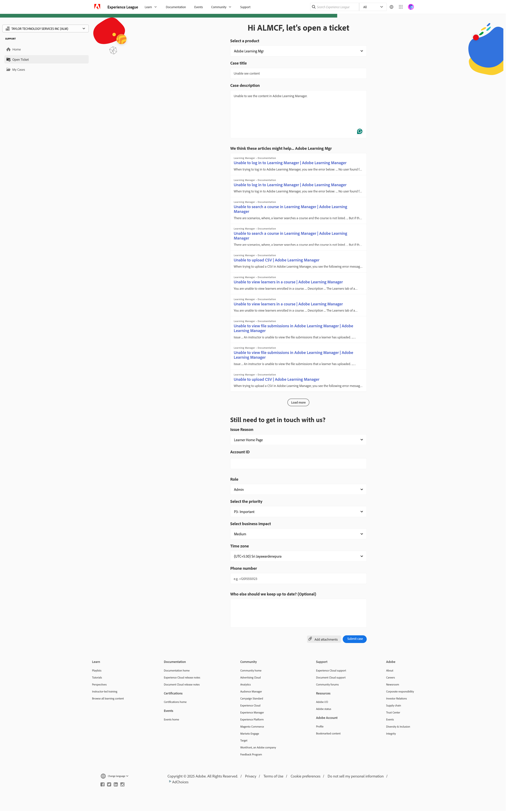

# Come inviare un ticket di supporto all&#39;Experience League

La procedura di invio dei ticket di supporto Adobe Learning Manager è ora direttamente integrata con la piattaforma di supporto per gli Experienci League. Questo è un portale self-service che è stato recentemente riprogettato per offrire maggiore personalizzazione e facilità d&#39;uso per i clienti autorizzati. Consulta questa guida di seguito per ulteriori informazioni su come accedere al portale di supporto degli Experienci League e registrare un ticket.

L&#39;invio di un ticket di supporto è disponibile solo per i contatti del supporto autorizzati. Per eventuali domande di supporto, continuate a inviare i ticket di supporto a Adobe Learning Manager via e-mail fino all’11 maggio 2025. Dopo questa data, puoi inviare i ticket di supporto tramite il portale di supporto per Experienci League come descritto di seguito, oltre al canale e-mail esistente.

1. Per accedere al portale del supporto, visita il sito Web **[!UICONTROL Experience League]** e seleziona la scheda **[!UICONTROL Supporto]** nella parte superiore della pagina. In alternativa, puoi visitare il [collegamento diretto](https://experienceleague.adobe.com/home?lang=it#support).

   
   _Pagina principale del supporto_

2. Dalla pagina principale del **[!UICONTROL supporto]**, puoi accedere facilmente ai casi aperti, registrare un nuovo caso, visualizzare gli articoli del supporto principale o esplorare risorse di apprendimento aggiuntive.

   
   _Apri ticket_

3. Per inviare un caso, selezionare l&#39;opzione **[!UICONTROL Apri un caso di supporto]**. Puoi anche selezionare l&#39;opzione **[!UICONTROL Apri ticket]** nel menu della barra laterale. Verrai reindirizzato alla pagina di creazione del caso, dove potrai immettere il nome del prodotto (Adobe Learning Manager, Audience Manager, Campagna, Target, ecc.), **[!UICONTROL Titolo del caso]** e **[!UICONTROL Descrizione del caso]**. Per velocizzare il processo di risoluzione dei problemi, cercate di fornire una descrizione il più possibile dettagliata del problema.

   Verso la fine del modulo, compila i seguenti campi per fornirci informazioni più specifiche che ci aiuteranno a risolvere i problemi:

   * Motivo del problema (selezionare il menu a discesa appropriato per un tipo di problema)
   * ID account
   * Ruolo (Amministratore, Autore, Allievo, Amministratore dell’integrazione, ecc.)
   * Priorità del caso (bassa, media, alta, critica)
   * Impatto sul business
   * Fuso orario
   * Opzione per copiare gli utenti previsti.

   Infine, assicurati di caricare tutti i file pertinenti prima di fare clic su **[!UICONTROL Invia]**. (La dimensione dell&#39;allegato non è superiore a 24 MB)

   
   _Modulo ticket_

4. Dopo aver fatto clic su **[!UICONTROL Invia caso]**, verrai reindirizzato alla pagina **[!UICONTROL I miei casi]**, in cui potrai visualizzare tutti i casi che la tua organizzazione ha inviato. Puoi anche accedere a questa pagina facendo clic sul pulsante **[!UICONTROL Le mie cause]** nel menu della barra laterale. In questa pagina potrai visualizzare tutti i tuoi casi di supporto aperti e chiusi. Utilizzando le opzioni nella parte superiore della pagina, è possibile filtrare per stato del caso (aperto o chiuso) o per soluzione di Experience Cloud. Puoi anche utilizzare la barra di ricerca per cercare qualsiasi parola chiave relativa ai problemi di supporto.

   
   _Casi aperti_

5. Per visualizzare ulteriori dettagli su un caso, fai clic sul caso per accedere alla relativa vista del caso. Nella vista caso puoi visualizzare i commenti più recenti con il proprietario del caso assegnato e aggiungere eventuali allegati o risposte aggiuntivi.

È possibile inoltrare un caso a un livello superiore selezionando l’opzione &quot;Inoltra alla gestione&quot; a destra della pagina in Dettagli caso. È inoltre possibile chiudere la custodia selezionando l&#39;adiacente pulsante &quot;Chiudi custodia&quot;.

## Note aggiuntive

Affinché il team di supporto possa gestire le richieste di assistenza nel modo più efficiente possibile, è necessario inviare una richiesta di assistenza solo nel caso in cui l&#39;intervento abbia un impatto grave sull&#39;organizzazione, sui partner o sui clienti.

Se hai altre domande su come utilizzare il portale **[!UICONTROL Supporto Experience League]**, ti preghiamo di farcelo sapere nella sezione dei commenti di seguito, oppure contatta direttamente il nostro team di supporto a questo indirizzo e-mail [almdynsupp@adobe.com](mailto:almdynsupp@adobe.com).

Per aggiungere un contatto autorizzato in grado di aprire i ticket di supporto tramite l&#39;Experience League (EXL), visitare la pagina [http://licensing.adobe.com](http://licensing.adobe.com).

