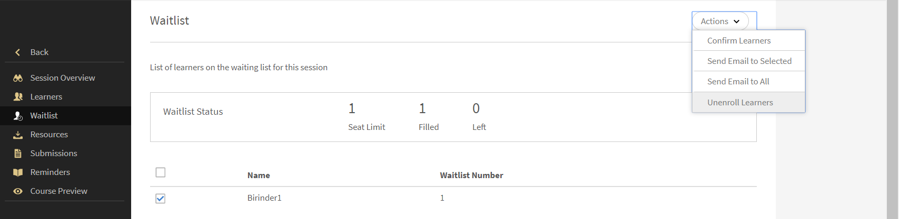

# Gestione degli Allievi per la sessione

Leggi questo articolo per sapere come gestire i partecipanti, inviare e-mail relative al corso e promemoria delle sessioni.

## Visualizza sessioni o moduli con revisioni in sospeso {#pending}

In qualità di Istruttore, puoi visualizzare le sessioni o i moduli con revisioni in sospeso.

Nella pagina Sessioni/Moduli è disponibile una colonna **Revisioni in sospeso** che mostra il numero di revisioni in sospeso per la sessione/attività corrispondente.

## Gestione della lista d’attesa per la sessione {#managewaitlistforyoursession}

Man mano che gli Allievi si registrano al modulo, lo stato più recente dell’iscrizione e della lista d’attesa viene visualizzato nella pagina Lista d’attesa.

1. Nell’app dell’Istruttore, seleziona Sessioni imminenti > Lista di attesa nel riquadro di navigazione a sinistra.

   Puoi visualizzare il Limite di posti, il numero di posti attualmente occupati e il numero di posti vacanti. Nella tabella sono inoltre elencati gli Allievi inseriti in lista d’attesa. Questo campo è vuoto se non sono presenti code in lista d&#39;attesa.

   
   *Visualizza Allievi in lista d’attesa*

1. Nella tabella Lista di attesa selezionare gli Allievi che si desidera confermare.
1. Seleziona Azioni > Conferma allievi.

   Gli Allievi che hai confermato vengono aggiunti all’elenco Allievi confermati.

Gli istruttori hanno la possibilità di annullare l’iscrizione degli allievi alle sessioni. Viene inoltre annullata l’iscrizione agli Allievi corrispondenti. Seleziona **[!UICONTROL Lista d&#39;attesa]** scheda. Seleziona gli Allievi a cui annullare l’iscrizione utilizzando la casella di controllo. Per annullare l’iscrizione, seleziona **[!UICONTROL Azioni]** > **[!UICONTROL Annullamento dell’iscrizione degli Allievi]**.

*Annullamento dell’iscrizione degli Allievi*

## Contrassegna la partecipazione per la sessione {#markattendanceforyoursession}

Puoi visualizzare il numero di Allievi confermati che partecipano alla sessione, i loro nomi, lo stato di partecipazione degli Allievi e altri dettagli dalla pagina Allievi.

1. Nel riquadro di navigazione a sinistra, fai clic su Sessioni successive > Allievi.
1. Seleziona l’Allievo o gli allievi dall’elenco dei partecipanti ed effettua una delle seguenti operazioni:

   * Per contrassegnare una partecipazione, fai clic su Azioni > Contrassegna partecipazione. Una volta che lo stato è stato contrassegnato come Partecipato, non è possibile modificarlo.
   * Per segnalare la mancata partecipazione, fai clic su Azioni > Non partecipato.
   * Per eliminare un Allievo a causa dell’annullamento o per altri motivi, fai clic su Azioni > Elimina Allievi.

   Un Allievo non può completare un modulo finché lo stato della partecipazione non legge Partecipazione avvenuta.

   
   *Contrassegna partecipazione Allievo*

## Invia e-mail agli Allievi {#sendemailstolearners}

Puoi inviare e-mail a partecipanti specifici o a tutti i partecipanti per la tua sessione. La funzione Invia e-mail è molto utile se desideri confermare la partecipazione degli Allievi o se desideri inviare comunicazioni relative alla sessione. Puoi anche utilizzare l’opzione Invia e-mail a tutti per inviare tramite e-mail il materiale su compiti e sessioni o per inviare comunicazioni generali a tutti gli Allievi.

Per inviare e-mail agli Allievi, dalla pagina Allievi nell’app dell’Istruttore, effettua una delle seguenti operazioni:

* Per inviare e-mail a partecipanti specifici, seleziona il partecipante e fai clic su Azioni > Invia e-mail a selezionati.
* Per inviare e-mail a tutti i partecipanti e richiedere l’invio di materiale per un corso o un compito, fai clic su Azioni > Invia e-mail a tutti.

## Esportazione dell’elenco degli Allievi {#exportinglearnerslist}

In qualità di Istruttore, puoi contrassegnare facilmente la partecipazione di tutti gli Allievi esportando l’elenco dei partecipanti come PDF. Per esportare l’elenco dei partecipanti, dall’Allievo nel riquadro a sinistra. Fai clic su Azioni > Esporta elenco Allievi (PDF).

Una volta confermato l’elenco dei partecipanti per la sessione, puoi esportarlo come PDF. Questo PDF di facile stampa mostra gli Allievi come una tabella. Puoi quindi contrassegnare la partecipazione o fornire punteggi e creare o fornire note per l’Allievo, tutto nello stesso PDF.

Nota un codice QR nell’angolo in alto a destra di questo PDF. Questa funzionalità consente ai singoli Allievi di scansionare il codice utilizzando l’app mobile Learning Manager per contrassegnare la propria partecipazione.

*Scansiona il codice QR per contrassegnare la partecipazione*

## Approva o rifiuta gli invii {#approveorrejectsubmissions}

Se gli Allievi hanno caricato documenti come assegnazioni, report o valutazioni per la sessione, puoi visualizzare i documenti nella pagina Invii. È possibile utilizzare i materiali per la valutazione dell’Allievo e approvare o rifiutare l’invio.

1. Nel riquadro a sinistra, fai clic su Sessioni in arrivo o Sessioni passate, in base alla pianificazione della sessione.
1. Fai clic sul corso per il quale desideri visualizzare gli invii.

   Nel riquadro a sinistra, fai clic su Invii.

1. Puoi visualizzare gli invii degli Allievi per la sessione selezionata. Selezionare l&#39;inoltro che si desidera approvare o rifiutare e fare clic su Approva o Rifiuta.

   Lo stato dell&#39;invio cambia in Approvato o Rifiutato, in base all&#39;azione eseguita.

## Configurare i promemoria per la sessione {#configureremindersforyoursession}

1. Nel riquadro a sinistra, fai clic su Sessioni pianificate.
1. Fai clic sul corso per il quale desideri impostare il promemoria. Nel riquadro a sinistra, fai clic su Promemoria.
1. Nella sezione Seleziona promemoria fare clic su Imposta promemoria.

   
   *Configurare i promemoria per la sessione*

1. Effettuate una delle seguenti operazioni:

   * Nella finestra di dialogo Impostazioni promemoria, imposta l’opzione su quando inviare il promemoria agli Allievi: Prima della scadenza, Alla scadenza o Dopo la scadenza.
   * Nel campo giorni prima della scadenza, imposta il numero di giorni precedenti alla scadenza in cui desideri inviare il promemoria agli Allievi.
   * Imposta la ricorrenza per il promemoria.

   
   *Visualizza impostazioni promemoria*

1. Effettuate una delle seguenti operazioni:

   * Fai clic sul segno di spunta per salvare il promemoria.
   * Fai clic sulla crocetta per annullare il promemoria.

   Un promemoria del corso automatico viene inviato a tutti gli allievi alla data impostata indicata nelle impostazioni del promemoria.

   Se hai già impostato promemoria per le sessioni, puoi visualizzarli nelle sezioni Promemoria esistenti. Inoltre, puoi anche aggiungere ulteriori promemoria ai promemoria esistenti.

   Per eliminare un promemoria esistente, fai clic sul promemoria. Dal pop-up visualizzato, fai clic sull&#39;icona Elimina (icona Cestino) per eliminare il promemoria.
