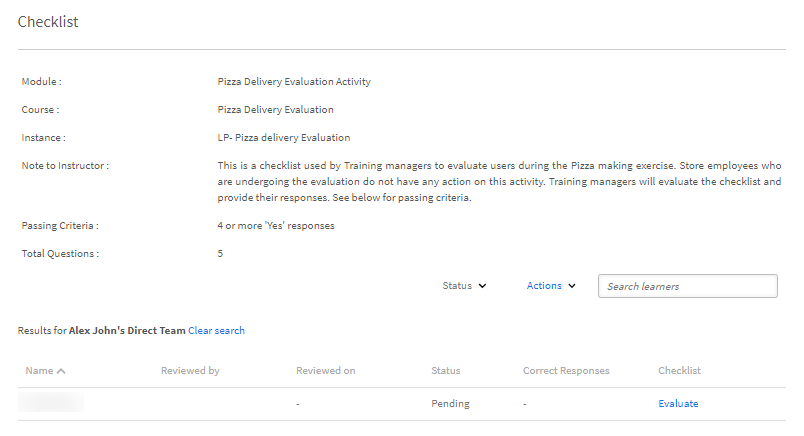
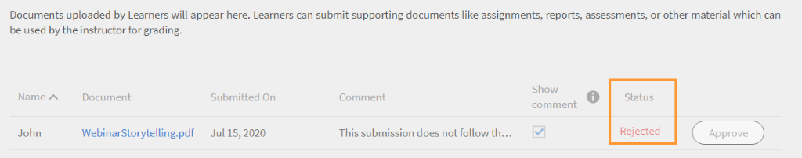

# Moduli

Leggi questo articolo per scoprire come gestire i moduli come Istruttore in Learning Manager.

## Visualizza panoramica della sessione {#viewsessionoverview}

1. Nel riquadro a sinistra, fai clic su Sessione successiva.
1. Dall’elenco delle sessioni future, seleziona la sessione di cui desideri visualizzare i dettagli.

   L’app mostra la panoramica della sessione con dettagli come il nome della sessione, il luogo, gli orari, il limite di iscrizione, il limite della lista d’attesa e così via.

   
   *Visualizza sessioni future*

## Configurazione dei dettagli della sessione {#configuresessiondetails}

1. Nel riquadro a sinistra, fai clic su Sessione successiva.
1. Seleziona la sessione che desideri aggiornare.
1. Fai clic su Modifica nell’angolo in alto a destra.

   
   *Configurazione dei dettagli della sessione*

1. Dalla pagina Panoramica sessione è possibile modificare gli orari delle sessioni, la data, il luogo e così via. Puoi anche modificare o aggiungere i seguenti dettagli della sessione:

   * Specifica il limite di iscrizione per impostare il numero massimo di allievi consentiti per la sessione.
   * Specifica il limite della lista d’attesa per impostare il numero massimo di Allievi consentito in lista d’attesa per la sessione.
   * Nel campo Consenti invii, seleziona Sì per consentire agli Allievi di inviare compiti. Se selezioni No, gli Allievi non potranno caricare gli invii delle assegnazioni per la sessione.

   
   *Modificare i dettagli della sessione*

1. Fai clic su Salva.

   Non è possibile modificare il campo Istruttore da questa pagina.

## Carica i file di risorse per la sessione {#uploadresourcefilesforyoursession}

In qualità di Istruttore, puoi caricare file di risorse come file delle assegnazioni o presentazioni per i moduli, o file delle attività per il modulo. Utilizzare il menu Risorse per aggiungere file di risorse per il modulo o la sessione.

1. Dall’app dell’Istruttore, fai clic su Sessioni successive > Risorse.

   Puoi visualizzare la pagina Risorse, che contiene già un collegamento alle risorse che gli autori potrebbero aver caricato per il corso associato al modulo. Inoltre, gli istruttori possono anche caricare file di risorse per i moduli.

1. Fai clic su Aggiungi.

   
   *Aggiungi una risorsa per la sessione*

1. Individuate il file appropriato nel computer. Selezionate il file e fate clic su Apri.
1. Dopo aver caricato il file, puoi visualizzarlo insieme alla data in cui è stato aggiunto.

   Gli Allievi iscritti a questo modulo potranno vedere i file una volta caricati, nella sezione Risorse in Corsi.

   Per eliminare un file di risorse, selezionare il file o i file da eliminare. Fai clic su Azioni > Elimina file dalla pagina Risorse.

## Invio di file per i moduli attività {#filesubmissionforactivitymodules}

Il modulo attività supporta il flusso di lavoro Invio file. In qualità di Autore, crea un modulo attività e seleziona  **[!UICONTROL Invio di file]** opzione. Ciò consente agli Allievi di inviare un file.

Questi file possono essere approvati/rifiutati dagli Istruttori del modulo. Il modulo viene completato solo dopo che l’Istruttore approva l’invio.

 
*Approva o rifiuta i file*

## Valuta modulo elenco di controllo {#evaluate-checklist-module}

Dopo che l’Allievo segue il corso, l’Istruttore vede il modulo dell’elenco di controllo nella pagina Invii/Elenchi di controllo in **Moduli** sezione. Questa pagina contiene tutti i moduli di elenco di controllo delle attività insieme ai moduli di invio delle attività per i quali sono necessarie le revisioni. Per ogni modulo, viene visualizzato il numero di allievi per i quali è prevista la valutazione.

Nella pagina seguente, puoi visualizzare i moduli di tipo **Invio** e **Checklist**. Per questo esempio, utilizzeremo il modulo Checklist.

*Visualizzare l’elenco dei moduli*

Fare clic sul modulo Elenco di controllo. Nella **Checklist** pagina, viene visualizzato quanto segue:

* Nome del modulo
* Nome del corso
* Istanza a cui appartiene il corso
* Criteri di superamento impostati dall&#39;autore
* Numero di domande dell&#39;elenco di controllo

*Visualizzare la pagina dell’elenco di controllo*

Per valutare un Allievo, fai clic su **[!UICONTROL Valutare]** nella **[!UICONTROL Checklist]** colonna. È inoltre possibile verificare che lo stato della revisione sia **In sospeso**.

Valuta l’Allievo e fai clic su **[!UICONTROL Invia]**. In qualità di Istruttore, devi rispondere a tutte le domande di valutazione.

*Elenco di controllo per la valutazione*

A seconda dei criteri di superamento, lo stato sarà Non riuscito o Superato.

Una volta valutato, un elenco di controllo non può essere rivalutato.

L’Istruttore può anche visualizzare le risposte inviate dagli altri istruttori del modulo.

Puoi esportare gli Allievi come file CSV in base al filtro di ricerca applicato.

Dopo che l’istruttore ha valutato il corso utilizzando l’elenco di controllo, l’Allievo vede lo stato del modulo come **Superata** e stato del corso come **Completato** oppure lo stato del modulo come **Non riuscito** e stato del corso come **Completato**.

## Commenti dell’istruttore per il rifiuto di un’attività {#rejection-comments}

Un Allievo può visualizzare il commento di un Istruttore nella notifica inviata per il rifiuto. L’Allievo può quindi inviare nuovamente il modulo fornendo ulteriori informazioni sotto forma di commenti.

Flusso di lavoro:

1. Un Autore crea un corso con un modulo di attività, assegna un Istruttore e quindi pubblica il corso.

1. Un Allievo segue il corso e, dopo averlo completato, invia la prova di completamento.

   
   *Invia prova di completamento*

1. L’Istruttore seleziona quindi il modulo di attività che gli viene assegnato. Nella pagina Invii del modulo, l’istruttore fa clic su **Modifica**. Potrà quindi immettere i commenti per il rifiuto e abilitare l’opzione Mostra commento, in modo che l’Allievo possa visualizzare il commento nella notifica.

   
   *Immettere i commenti di completamento*

1. L’istruttore può fare clic su **Rifiuta**. Lo stato dell&#39;inoltro cambia in **Contrassegnato per il rifiuto**.

   
   *Rifiutare un inoltro*

1. Dopo l’invio, lo stato diventa **Rifiutato**.

   
   *Visualizza stato rifiuto*

1. L’Allievo ora riceve una notifica in cui comunica che la sua domanda è stata rifiutata. I commenti dell’istruttore appaiono anche nella notifica.

   
   *Ricevi notifica rifiuto*

Per tenere conto delle modifiche, l’Adobe ha aggiornato il modello e-mail per **Invio rifiutato**.

## Aggiungere punteggi e commenti per i moduli attività {#addscoresandcommentsforactivitymodules}

Per aggiungere punteggi e commenti per i moduli di attività inviati per l&#39;invio, procedere come segue:

1. Nel riquadro a sinistra, fai clic su **[!UICONTROL Allievo]**.

   
   *Seleziona un Allievo*

1. Nella pagina dell’Allievo, fai clic su **[!UICONTROL Azioni]** > **[!UICONTROL Modifica punteggi e commenti]**.

   
   *Aggiungere commenti*

   Per gli Allievi che non hanno completato il corso, il campo di input Punteggio e commenti non verrà visualizzato.

   
   *Modificare punteggi e commenti*

1. Fai clic **[!UICONTROL Salva]**.
