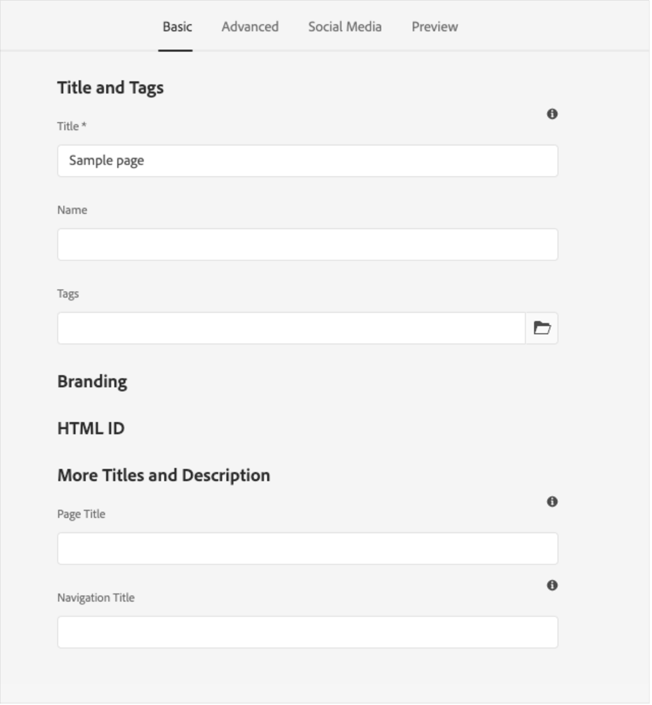
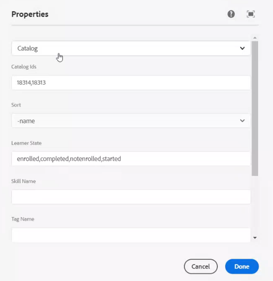

# Integrazione di Adobe Learning Manager con AEM

Adobe Learning Manager (ALM) viene integrato con Adobe Experience Manager (AEM) Sites. In questo modo, potrai creare il tuo sito Web e interfacce per dispositivi mobili reattive per Adobe Learning Manager con il minimo sforzo di codifica. Grazie a questa integrazione, puoi creare esperienze di apprendimento personalizzate per i tuoi utenti.

Per creare un&#39;esperienza di questo tipo, ALM fornisce un pacchetto per il sito di riferimento di Adobe Learning Manager (pacchetto per il sito di riferimento ALM) per AEM Sites sotto forma di file ZIP, che è possibile installare nell&#39;istanza di AEM Sites.

Il pacchetto include i modelli di pagine Web e i componenti dei siti Web di AEM Sites, oltre a widget incorporabili, ad esempio, catalogo di apprendimento, calendario e così via.

Dopo aver installato il pacchetto per il sito di riferimento ALM, puoi iniziare a creare un sito Web per Adobe Learning Manager che puoi ospitare sulla tua istanza di AEM Sites. Gli utenti possono quindi trascinare e rilasciare i componenti sul sito Web.

>[!IMPORTANT]
>
>I pacchetti Adobe Learning Manager (ALM) per AEM Sites forniscono un blocco di codice di avvio rapido per l&#39;implementazione. Questo pacchetto è progettato per le distribuzioni headless. All&#39;atto dell&#39;attuazione del codebase fornito, la manutenzione e l&#39;ulteriore sviluppo continui sono di competenza della parte attuatrice, come avviene di norma con le applicazioni headless basate su Adobe Learning Manager.

## Installazione del pacchetto per il sito di riferimento ALM

### Prerequisiti

* Licenze per AEM Sites e Adobe Commerce.
* AEM locale 6.5 o Adobe Experience Manager - Cloud Service
* Adobe Commerce 2.4.3

Dopo aver protetto l&#39;ambiente di AEM Sites, è necessario installare il pacchetto per il sito di riferimento ALM. Questo pacchetto include pagine Web e componenti dei siti Web AEM che consentono di creare la piattaforma di apprendimento.

Il pacchetto del sito di riferimento è ospitato nel [**repository GitHub**](https://github.com/adobe/adobe-learning-manager-reference-site/releases/tag/1.0.0).

Per ulteriori informazioni, consulta il README.

## Download del pacchetto dei contenuti {#downloadthecontentpackage}

Il programma di installazione viene fornito come pacchetto di contenuti AEM. [***Scarica il pacchetto***](https://github.com/adobe/adobe-learning-manager-reference-site).

Il pacchetto dei contenuti è disponibile come file zip ed è compatibile con AEM 6.4 e AEM 6.5.

## Installazione del pacchetto Learning Manager {#installcaptivateprimecomponent}

Installa il pacchetto dei contenuti Learning Manager utilizzando il gestore pacchetti AEM:

>[!NOTE]
>
>Per informazioni sull&#39;installazione dei pacchetti, vedere [***Come utilizzare i pacchetti***](https://experienceleague.adobe.com/docs/experience-manager-65/administering/contentmanagement/package-manager.html?lang=it#how-to-work-with-packages).

1. Come Autore AEM, apri il gestore pacchetti AEM.
1. Fai clic sul pulsante **[!UICONTROL Carica pacchetto]**.
1. Fai clic su **[!UICONTROL Sfoglia]** e carica il pacchetto di contenuti.
1. Fai clic su **[!UICONTROL Carica]**.
1. Dopo aver caricato il pacchetto, installalo selezionandolo e facendo clic su **[!UICONTROL Installa]**.

   

   *Installare il pacchetto dei contenuti*

## Crea un&#39;applicazione in [!DNL Adobe Learning Manager]

Dopo aver installato il pacchetto per il sito di riferimento AEM, è necessario configurare un’applicazione ALM per connettere il portale di apprendimento con il sito AEM.

Questo scenario è applicabile quando l&#39;AEM viene utilizzato con [!DNL Adobe Learning Manager].

Effettua le seguenti operazioni:

1. Come Amministratore di integrazione, fai clic su **[!UICONTROL Applicazioni]**.
1. Per creare una nuova applicazione, fai clic su **[!UICONTROL Registra]** nell’angolo superiore destro della pagina.
1. Nella finestra Registra una nuova applicazione, inserisci i seguenti dettagli:

   1. Nome applicazione: il nome dell&#39;applicazione che stai creando.
   1. URL: l&#39;URL della tua organizzazione.
   1. Domini di reindirizzamento: i domini di hosting del sito Web AEM. Puoi anche specificare i caratteri jolly.
   1. Descrizione: la descrizione dell&#39;applicazione.
   1. Ambiti: seleziona l’accesso in lettura/scrittura al ruolo di Allievo.
   1. Solo per questo account?: seleziona Sì se desideri utilizzare l&#39;applicazione per l&#39;account ALM esistente.

1. Dopo aver apportato le modifiche, fai clic su Salva.

Annota le credenziali dell&#39;applicazione dalla schermata.


*Credenziali dell&#39;applicazione*

Per approvare l’applicazione, fai clic su **[!UICONTROL Approva]**.

## Ottenere i token

1. Nella scheda Risorse sviluppatore, fai clic su **[!UICONTROL Token di accesso per test e sviluppo]**.

   

   *Selezionare token di accesso per test e sviluppo*

1. Immetti i seguenti dettagli:

   
   *Immettere i dettagli del token*

   1. Ottieni codice OAuth: immetti l’ID client della sezione precedente e modifica l’ambito. Fai clic su Invia per ottenere il codice Oauth.
   1. Ottieni token di aggiornamento: immetti l’ID client e il segreto della sezione precedente. Immetti inoltre il codice OAuth ottenuto dal passaggio precedente. Fai clic su Invia.
   1. Ottieni token di accesso: immetti l’ID client e il segreto della sezione precedente. Immetti inoltre il token di aggiornamento ottenuto dal passaggio precedente. Fai clic su Invia.
   1. Ottieni dettagli del token di accesso: immetti il token di accesso ottenuto dal passaggio precedente. Fai clic su Invia.

1. Puoi ottenere i dettagli dalla risposta JSON che segue. La risposta include token di accesso, token di aggiornamento, ruolo dell’utente, ID account, ID utente e tempo rimanente prima della scadenza. Prendi nota del token di aggiornamento, perché verrà riutilizzato.

## Configurazione dell’account ALM in AEM

1. Avvia l’istanza AEM.
1. Fai clic su Impostazioni > Cloud Service.
1. Fai clic su Configurazione di Adobe Learning Manager.

   
   *Selezionare la configurazione di Adobe Learning Manager*

1. Fai clic su Crea > Cartella di configurazione. Assegna un nome alla cartella.

   
   *Crea configurazione*

1. Nel progetto di apprendimento, seleziona la configurazione creata.

1. Immetti i dettagli della configurazione.

   
   *Crea cartella di configurazione*

   1. Modalità Adobe Learning Manager: scegli come vuoi che sia l’esperienza di apprendimento per gli Allievi che hanno effettuato l’accesso e per quelli che non l’hanno fatto.
   1. URL Adobe Learning Manager: immetti l’URL dell’istanza ALM in cui sono ospitati i servizi di apprendimento.
   1. ID account: ID dell’account ALM.
   1. ID client, segreto client e token di aggiornamento autore: immetti le credenziali ottenute durante la creazione dell&#39;applicazione in ALM.
   1. Personalizzazione del widget: per ulteriori informazioni, vedere [Integrazione con AEM](/help/migrated/integrate-aem-learning-manager.md) `.`

1. Salva e chiudi la configurazione.

### AEM + Adobe Learning Manager (utenti connessi/non connessi)

Adobe Learning Manager ora ti consente di presentare i tuoi prodotti e corsi di formazione ai clienti e ai partner esistenti e potenziali senza dover creare account o effettuare l’accesso. Questa funzionalità ti aiuterà a promuovere l’adozione di prodotti e corsi di formazione fornendo agli Allievi un’anteprima rapida e semplice dei corsi di formazione, che consente di evidenziare e promuovere le funzionalità del prodotto. Potrai quindi presentare i tuoi prodotti e le tue offerte con efficacia, in particolare ai potenziali clienti e partner, aumentando la consapevolezza del prodotto. La facilità di accesso e una migliore raggiungibilità producono un maggiore interesse, che contribuisce a stimolare le iscrizioni ai corsi di formazione e l’adozione della soluzione di apprendimento.

Utilizzando questo flusso di lavoro, un Allievo può visualizzare in anteprima un corso di formazione, accedere alle informazioni del corso o cercare un corso di formazione senza accedere ad Adobe Learning Manager. Questo flusso di lavoro non è applicabile all’interfaccia di Learning Manager nativa (applicabile SOLO per AEM Sites e altre interfacce headless).

**Configurare e attivare il connettore della piattaforma di apprendimento**

Questa sezione sottolinea i passaggi necessari per configurare e attivare il seguente connettore:

**Accesso ai dati di formazione**

Questo connettore consente all’interfaccia utente basata su AEM Sites o a un’altra interfaccia utente headless personalizzata di recuperare ed eseguire il rendering delle informazioni sul corso di formazione per gli Allievi e realizzare una ricerca uniforme delle informazioni del corso prima o dopo l’accesso di un Allievo.

Questo connettore è richiesto solo se si utilizzano interfacce basate su AEM Sites o altre interfacce headless.

Il connettore esporta i metadati del corso di formazione in una soluzione di archiviazione e recupero dati, oltre a un sistema di ricerca. Di conseguenza, puoi configurare la tua interfaccia utente basata su AEM Sites o un’altra interfaccia headless personalizzata per utilizzare questi due servizi per recuperare i dati del corso di formazione, eseguire il rendering delle pagine Web e fornire agli Allievi funzionalità di ricerca ottimizzate per la formazione. Ad esempio, un’interfaccia basata su AEM Sites non registrata può utilizzare i metadati esportati per consentire agli Allievi di cercare, sfogliare e accedere alle pagine del corso di formazione che mostrano informazioni sul corso di formazione.

Abilita questo connettore per creare ed eseguire il rendering delle pagine Web basate su AEM Sites e distribuire esperienze personalizzate agli Allievi sia prima che dopo l’accesso. Abilita questo connettore per creare ed eseguire il rendering delle pagine Web basate su AEM Sites e distribuire esperienze personalizzate agli Allievi sia prima che dopo l’accesso.

* URL di base CDN di Adobe Learning Manager: immettere l&#39;URL di base del percorso del servizio CDN per il recupero dei dati dalla pagina di connessione Accesso ai dati della formazione.
* Token di aggiornamento amministratore: immetti il token di aggiornamento che hai determinato nella sezione precedente.
* URL di base metadati di formazione: immetti l’URL di base del percorso del servizio di ricerca e recupero dati dalla pagina di connessione Accesso ai dati della formazione.
* URL registro di Adobe Learning Manager: immetti l’URL di registrazione automatica generato dall’Amministratore di integrazione per l’account, che viene utilizzato dagli Allievi per iscriversi al corso di formazione.

### AEM + Adobe Learning Manager + Adobe Commerce (utenti connessi/non connessi)

Adobe Learning Manager ora offre soluzioni che consentono di integrare perfettamente la piattaforma di apprendimento con Adobe Commerce. Questa versione ti consentirà di collegare facilmente ad Adobe Commerce le tue interfacce di Learning Manager native, basate su AEM Sites o altre interfacce headless. Questa integrazione ti consente di sfruttare le funzionalità di e-commerce all&#39;interno della piattaforma di apprendimento. Ora puoi offrire corsi di formazione a pagamento ai tuoi clienti e partner commerciali e agevolare gli acquisti di corsi di formazione su interfacce di Learning Manager native e non. Un Allievo può anche visualizzare in anteprima un corso di formazione, accedere alle informazioni del corso o cercare un corso di formazione senza accedere ad Adobe Learning Manager.

Invece di crearne una, l’utente può utilizzare l’applicazione AEM esistente e approvarla.

* URL di base CDN di Adobe Learning Manager: immetti l’URL di base del percorso del servizio CDN per il recupero dei dati dalla pagina di connessione Adobe Commerce.
* URL Adobe Commerce: immetti l’URL dell’istanza Adobe Commerce in uso.
* Percorso proxy GraphQL: i componenti di Learning Manager lato client accedono direttamente all’endpoint Adobe Commerce GraphQL e, pertanto, può verificarsi un errore CORS. Per evitare questo errore, tutte le chiamate devono essere effettuate dallo stesso endpoint dell’AEM o tramite un proxy che aggiunge le intestazioni CORS.
* Nome store di Adobe Commerce: immetti il nome store di Adobe Commerce determinato nella sezione precedente.
* Durata del token cliente di Adobe Commerce (in sec): immetti la durata del token cliente che indica il periodo predeterminato per una sessione di accesso.
* Token di aggiornamento amministratore: immetti il token di aggiornamento che hai determinato nella sezione precedente.

## Personalizzazione delle pagine Web

Personalizza le tue pagine Web utilizzando il sito di riferimento AEM e i widget disponibili.

1. Avvia l’istanza AEM.
1. Fai clic su Siti e apri la pagina di configurazione.
1. Fai clic su **[!UICONTROL Sito di apprendimento]** > **[!UICONTROL Lingua principale]** > **[!UICONTROL Inglese]**. Tutte le pagine Web del progetto sono incluse nella cartella.

   
   *Visualizza tutte le pagine Web*

1. Seleziona un modello e fai clic su **[!UICONTROL Modifica]**.

1. Nella pagina, fai clic sul pulsante delle impostazioni relative al componente e modifica le proprietà del componente.

   
   *Pulsante Seleziona impostazioni*

1. Puoi visualizzare in anteprima le modifiche o pubblicare la pagina.

## Creazione delle pagine Web

Oltre ai modelli che puoi utilizzare forniti dal pacchetto per il sito di riferimento, puoi anche creare pagine Web basate sui modelli in AEM.

1. Nella pagina principale dell’AEM, fai clic su Crea > Pagina.

1. Scegli il modello da personalizzare. Fare clic su Avanti.

1. Immettere le proprietà della pagina.

   
   *Proprietà pagina*

1. Per creare la pagina, fai clic su **[!UICONTROL Crea]**.

1. Seleziona la nuova pagina e fai clic su **[!UICONTROL Modifica]**.

1. Inserisci un componente nella pagina, ad esempio **Contenuti di apprendimento**.

   
   *Filtra per sito*

1. Scegli i filtri del catalogo richiesti che verranno visualizzati nella pagina.

## Creazione di un sito da Blueprint

Il pacchetto per il sito di riferimento ALM fornisce un &quot;Learning Site Blueprint&quot;, che consente di creare un sito Web per la piattaforma di apprendimento. I blueprint di AEM consentono di creare pagine Web direttamente dai componenti di AEM Sites. Non è necessario utilizzare alcun modello.

1. Nella pagina iniziale AEM, fai clic su **[!UICONTROL Siti]**.

1. Fai clic su **[!UICONTROL Crea]** > **[!UICONTROL Sito]**.

1. Fai clic su Learning Site Blueprint.

   

   *Crea sito dal modello*

1. Fare clic su Avanti.

1. Nella pagina delle proprietà, inserisci i metadati della pagina. Fai clic su Crea.

   
   *Seleziona progetto del sito di apprendimento*

1. Fai clic sul collegamento ipertestuale Home per passare alla home page del sito creato. In questa pagina puoi personalizzare i widget e i componenti del catalogo.

## Codifica del sito Web

Oltre a utilizzare i modelli incorporati e creare il sito Web da zero tramite i componenti WYSIWYG, puoi anche scrivere codice e creare il sito.

Il codice si trova nel [Repository GitHub del sito di riferimento](https://github.com/adobe/adobe-learning-manager-reference-site).

Le parti principali del modello sono:

* core: bundle Java contenente tutte le funzionalità principali come i servizi OSGi, listener o scheduler, nonché codice Java relativo ai componenti come servlet o filtri di richiesta.
* ui.apps: contiene le parti /apps (e /etc) del progetto, ad esempio i clientlib JS&amp;CSS, i componenti e i modelli.
* ui.content: contiene contenuto di esempio utilizzando i componenti di ui.apps
* ui.frontend: contiene i componenti React.

Tutto il codice è a tua disposizione nel repository.

## Importazione e aggiunta di componenti di Learning Manager in pagine Web o modelli esistenti

L’installazione del pacchetto per il sito di riferimento AEM aggiunge i componenti di Learning Manager all’istanza di AEM Sites. Per impostazione predefinita, puoi aggiungere questi componenti al sito di apprendimento del progetto Web (sito Web) fornito da Adobe. Questi componenti sono disponibili anche nel sito Web che hai creato da Learning Site Blueprint.

Tuttavia, se desideri utilizzare questi componenti di Learning Manager appena aggiunti al tuo progetto Web o sito Web esistente, devi importarli utilizzando la procedura seguente.

1. Installa il pacchetto per il sito di riferimento ALM.

1. Apri il progetto Web e accedi al file HTML (per la pagina Web o il modello Web in cui desideri aggiungere i componenti di Learning Manager).
1. Partecipazione a una riunione

   Apri il file HTML e aggiungi al componente di pagina i seguenti frammenti di codice in modo che il codice venga eseguito prima dei componenti di apprendimento presenti nel rendering della pagina.

   *`<sly data-sly-use.configModel="com.adobe.learning.core.models.GlobalConfigurationModel"/>`*
   *`<meta name="cp-config" content="${configModel.config}" />`*

   Il codice precedente aggiunge la configurazione mappata nel meta tag della pagina, necessaria per il rendering dei componenti di apprendimento. Per ulteriori dettagli, consulta [Sito di riferimento di Adobe Learning Manager](https://github.com/adobe/adobe-learning-manager-reference-site/blob/master/ui.apps/src/main/content/jcr_root/apps/learning/components/page/customheaderlibs.html).

1. Assicurati di aver mappato la configurazione con il progetto Web.
1. Apri il modello di AEM Sites in cui desideri importare i componenti di Learning Manager.
1. Nell&#39;editor della pagina del modello, accedi al contenitore Componenti consentiti e seleziona **Criteri**.
1. Nella pagina Criteri, accedi a Proprietà > Componenti consentiti e seleziona i componenti seguenti: “Formazione - Contenuti”, “Formazione - Modulo” e “Formazione - Struttura&quot;

La procedura seguente consente al modello di soddisfare le dipendenze della libreria client dei componenti Learning Manager importati.

Le pagine Web che includono questi componenti devono caricare queste librerie per eseguire correttamente il rendering e utilizzare i componenti.

1. Nell’editor della pagina del modello, fai clic su Informazioni pagina, quindi su Criteri pagina.
1. Nella pagina dei criteri, seleziona Proprietà > Librerie client e aggiungi quanto segue alla pagina del modello:

   1. learning.site
   1. learning.ui
   1. learning.commerce

Dopo aver salvato questo modello, puoi aggiungere i componenti di Learning Manager in tutte le pagine Web derivate da questo modello.

## Configurazione del widget in AEM {#configurethewidgetinaem}

Per la configurazione del widget, l’autore AEM richiede solo il token di aggiornamento fornito dall’Amministratore dell’integrazione Learning Manager.

Puoi anche impostare più configurazioni di account in più pagine.

1. Fai clic su **[!UICONTROL Strumenti]** > **[!UICONTROL Cloud Service]** > **[!UICONTROL Configurazione widget Learning Manager]**.
1. Fai clic su **[!UICONTROL Crea]**.
1. Immetti qui il token di aggiornamento. Configura altre impostazioni.
1. Il nome host deve essere modificato in &quot;learningmanagereu&quot; per le regioni dell’UE.
1. Salva e chiudi la configurazione.
1. Seleziona una configurazione e pubblicala.

## Autore AEM {#aemauthor}

L’autore AEM deve prima aggiungere il componente nel modello AEM

L’autore AEM potrà quindi trascinare e rilasciare il componente Adobe Learning Manager e configurarlo di conseguenza.

Il componente Learning Manager richiede che la configurazione creata nel passaggio precedente venga mappata alla pagina.  L&#39;autore può mappare la configurazione modificando le proprietà della pagina in **[!UICONTROL Avanzate]** > **[!UICONTROL Configurazione]** > **[!UICONTROL Configurazione cloud]** e fornire il percorso di configurazione. In questo modo, l’Autore può creare configurazioni per più account Learning Manager e collegare ciascuna di esse a pagine diverse. Se una configurazione non è collegata alla pagina, il componente leggerà ricorrentemente la configurazione dalla pagina padre fino a quando non ne trova una.

## Allievo {#learner}

L’Allievo può seguire i corsi direttamente dalla pagina.

Per poter accedere al widget Learning Manager, l’Allievo deve effettuare il login come utente AEM. Inoltre, la proprietà **email** deve essere presente nel nodo &quot;/profile&quot; del nodo rep:User dell’Allievo. Questa e-mail deve essere esattamente uguale a quella presente nell’account Learning Manager.

L’Allievo può seguire i corsi direttamente dalla pagina.

Anche l’avanzamento del corso viene salvato.

Vengono forniti i seguenti widget:

1. Gamification
1. Calendario apprendimento
1. Widget social
1. Widget Catalogo
1. Il mio apprendimento
1. Consiglio basato sull’apprendimento tra utenti dello stesso livello
1. Consigli dell’Amministratore
1. Consiglio basato sugli interessi degli Allievi

In caso di mancanza di consigli, il widget sarà vuoto.

## Supporto per Skyline

Skyline è la versione cloud dell&#39;AEM. Devi prima installare Skyline dal gestore dei pacchetti. Per utilizzare il componente Skyline nell’AEM, un utente deve essere presente nell’account Learning Manager. In altre parole, l’indirizzo e-mail dell’utente deve esistere nell’account.

### Implementa Skyline

La procedura per configurare Skyline è indicata nel [repository GitHub](https://github.com/adobe/captivate-prime-aem-components).

## Il mio widget di apprendimento

Il widget **[!UICONTROL Il mio apprendimento]** consente di visualizzare i corsi di formazione da un catalogo specifico o da un set di cataloghi a un utente.

Nella sezione **[!UICONTROL Proprietà]** delle proprietà della pagina, seleziona **[!UICONTROL Catalogo]** dalle opzioni elencate.

<!---->

Le opzioni del catalogo contengono le seguenti opzioni:

* **[!UICONTROL ID catalogo]:** ID catalogo separati da virgole per i quali è necessario visualizzare i corsi di formazione.
* **[!UICONTROL Ordinamento]:** Ordinamento per il corso di formazione. Le opzioni sono: name, date, dateCreated, dateEnrolled e così via.
* **[!UICONTROL Stato dell’Allievo]:** restituisce tutti i corsi di formazione che utilizzano i seguenti filtri: enrolled, started, completed, and not enrolled. I risultati della ricerca non verranno visualizzati se l&#39;opzione di ordinamento è dateEnrolled, dueDate o dateEnrolled.
* **[!UICONTROL Nome dell’abilità]:** Abilità utilizzata per filtrare il corso di formazione esatto.
* **[!UICONTROL Nome del tag]:** Il tag utilizzato per filtrare i risultati esatti.

Di seguito sono riportati alcuni componenti aggiuntivi che è possibile personalizzare:

**[!UICONTROL Tipi di oggetti di apprendimento]:** Filtrare in base al tipo di oggetto di apprendimento. I tipi supportati sono: corso, certificazione, risorsa formativa e programma di apprendimento.

Nell&#39;AEM, il titolo di una carta in una striscia sarà inizialmente vuoto. Nelle proprietà, digita il nome del titolo in widgets.html.

**Personalizzazione**

È possibile personalizzare l&#39;aspetto del layout utilizzando widgets.html. È possibile modificare l&#39;aspetto delle schede visualizzate e personalizzare il tema.

Nella sezione **[!UICONTROL Impostazioni generali]** è possibile scegliere i colori primari e secondari delle schede e specificare le proprietà per personalizzare il tema.

```
{ 
 "globalCssText":"@import url('https://fonts.googleapis.com/css2?family=Grandstander:ital,wght@0,100;0,200;0,300;0,400;0,500;0,600;0,700;0,800;0,900;1,100;1,200;1,300;1,400;1,500;1,600;1,700;1,800;1,900&family=Montserrat:ital,wght@0,100;0,200;0,300;0,400;0,500;0,600;0,700;0,800;0,900;1,100;1,200;1,300;1,400;1,500;1,600;1,700;1,800;1,900&display=swap');", 
 "fontNames":"Grandstander", 
 "cardLayout":{ 
 "cardLayoutName":"compact", 
 "cardPrimaryColor":"#376BA4", 
 "cardSecondaryColor":"#F98EB0", 
 "startedStateTextColor":"#ffffff", 
 "continueStateTextColor":"#ffffff", 
 "revisitStateTextColor":"#ffffff", 
 "startedStateColor":"#a0a0a0", 
 "continueStateColor":"#f9a122", 
 "revisitedStateColor":"#7fbc64", 
 "textPrimaryColor":"#ffffff", 
 "textSecondaryColor":"#d93f3f", 
 "navIconColor":"#a0a0a0" 
 } 
}
```

### Configurare i widget Corsi salvati nei siti AEM

Il widget Corsi salvati consente agli Allievi di visualizzare i corsi contrassegnati o salvati direttamente sulle pagine di apprendimento, fornendo un facile accesso ai corsi che desiderano rivisitare o completare in un secondo momento.

Per configurare il widget Corsi salvati in siti AEM:

1. Avvia i siti AEM.
2. Apri la pagina in modalità **[!UICONTROL Modifica]**.
3. Passa al **[!UICONTROL Browser dei componenti]** e aggiungi **[!UICONTROL Il mio widget di apprendimento]** alla pagina.
4. Seleziona il componente, quindi seleziona **[!UICONTROL Configura]**.
5. Seleziona **[!UICONTROL Corsi salvati]** dal menu a discesa nelle **[!UICONTROL Proprietà]**.
6. Seleziona **[!UICONTROL Fine]** e aggiorna la pagina in modalità **[!UICONTROL Anteprima]** o **[!UICONTROL Publish]**.

Il widget mostrerà agli Allievi i corsi salvati.


### Ignora l’iscrizione agli oggetti di apprendimento di ordine superiore

Se la casella di controllo **Ignora l’iscrizione agli oggetti di apprendimento di ordine superiore** è abilitata e un utente è iscritto direttamente al programma di apprendimento o alla certificazione, nei widget verranno visualizzati i corsi per tale certificazione o programma di apprendimento.

Se la casella di controllo è disattivata, i corsi presenti nel programma di apprendimento o nella certificazione a cui l’utente non si è iscritto direttamente non verranno visualizzati.


*Selezionare la casella di controllo Ignora l&#39;iscrizione agli oggetti di apprendimento di ordine superiore.

L’impostazione viene quindi applicata al widget.

### Protezione

I campi ID client e Segreto del client vengono aggiunti. Inoltre, il token di aggiornamento viene nascosto. Dopo che un utente ha creato l&#39;intera configurazione, se l&#39;utente apre nuovamente la configurazione per modificarla o se un altro utente apre questa configurazione, il token di aggiornamento verrà mascherato.
