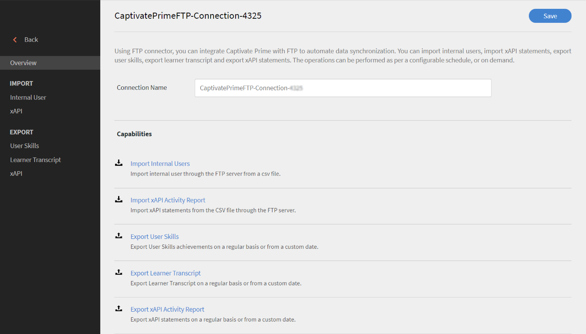
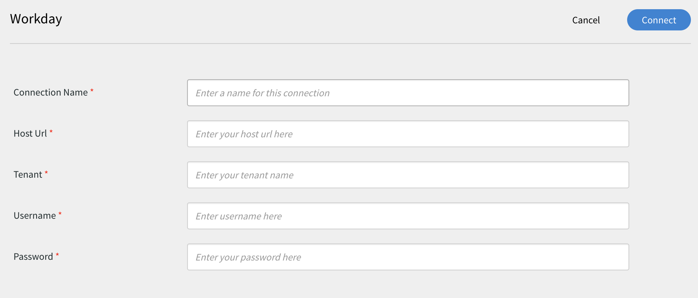
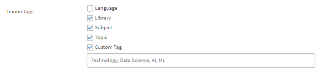

# Connettori Learning Manager

Le aziende usano altre applicazioni e altri sistemi che devono essere integrati con Learning Manager. I connettori sono utilità di supporto all’implementazione di integrazioni basate sui dati, come l’importazione di dati in Learning Manager da sistemi esterni.  Esegue anche l’esportazione di dati in sistemi esterni da Learning Manager.

Learning Manager fornisce connettori Salesforce e FTP. Tramite il connettore Salesforce, gli Amministratori di integrazione di un’organizzazione possono integrare l’applicazione Salesforce con Learning Manager. Come integratore, puoi utilizzare il connettore FTP per importare automaticamente un set di utenti nell’applicazione aziendale.

Learning Manager offre inoltre connettori Lynda, getAbstract e Harvard Management System. Questi connettori consentono agli allievi di accedere e seguire i corsi messi a disposizione da Lynda.com, getAbstract e Harvard ManageMentor.

Continua a leggere per scoprire come configurare e utilizzare ciascuno di questi connettori in Learning Manager.

<!--
>[!NOTE]
>
>**Update:** December 2020 update of Learning Manager
>
>For **FTP**, **Box**, and **Custom FTP** connectors, while exporting Learner Transcript or xAPI, you can also export the data as a **zip** file, for:
>
>* Learner Transcripts
>* xAPI
-->

>[!NOTE]
>
>Con la versione di novembre 2022 di Adobe Learning Manager, Zoom ha dichiarato obsoleta l&#39;autenticazione [JWT a giugno 2023](https://marketplace.zoom.us/docs/guides/auth/jwt/). Di conseguenza, il connettore Zoom con JWT continuerà a funzionare alla suddetta data, ma suggeriamo agli utenti di creare un’app OAuth Server-to-Server per sostituire la funzionalità nel proprio account. Per impostazione predefinita, tutte le nuove connessioni dispongono dell’autenticazione Zoom OAuth.

## Connettore Salesforce {#sfconnector}

Il connettore Salesforce collega gli account Learning Manager e Salesforce per automatizzare la sincronizzazione dei dati. Il connettore Salesforce offre le seguenti funzionalità:

### Mapping attributi {#map-attributes}

L’Amministratore di integrazione può scegliere le colonne Salesforce e mapparle agli attributi raggruppabili di Learning Manager corrispondenti. Una volta completata, la mappatura viene utilizzata nelle successive importazioni di utenti. Può essere riconfigurata qualora l’Amministratore desiderasse una mappatura diversa per l’importazione degli utenti.

### Importazione automatica degli utenti {#automated-user-import}

Il processo di importazione degli utenti consente all’Amministratore di Learning Manager di recuperare i dettagli dei dipendenti da Salesforce e importarli automaticamente in Learning Manager. Grazie all’automatizzazione, le operazioni di creazione di CSV e caricamento in Learning Manager non richiedono alcun intervento manuale.

### Pianificazione automatica {#auto-schedule}

L’utilizzo della funzione di pianificazione automatica insieme alla funzione di importazione automatica degli utenti può rivelarsi efficace. L’Amministratore Learning Manager può impostare la pianificazione in base alle esigenze dell’organizzazione. Gli utenti nell’applicazione Learning Manager possono essere aggiornati in base alla pianificazione.  La sincronizzazione può essere eseguita su base giornaliera nell’applicazione Learning Manager.

### Filtraggio degli utenti {#filtering-user}

L’Amministratore Learning Manager può applicare filtri agli utenti prima di importarli. Ad esempio, può scegliere di importare tutti gli utenti della gerarchia sotto uno o più Manager specifici.

### Configurazione del connettore Salesforce {#configuresalesforceconnector}

Scopri il processo da seguire per integrare Salesforce con Learning Manager

#### Prerequisiti {#prerequisites}

Assicurati di avere a portata di mano l’URL dell’organizzazione Salesforce. Ad esempio, se il nome della tua organizzazione è **myorg**, l’URL di Salesforce potrebbe essere `https://myorg.salesforce.com`. È l’unica informazione richiesta per connettere l’account Salesforce a Learning Manager.

Accertati inoltre di disporre delle credenziali appropriate per effettuare l’accesso all’account.

#### Creazione di una connessione {#createaconnection}

1. Nella home page di Learning Manager, passa il mouse sulla scheda/sull’anteprima di Salesforce. Viene visualizzato un menu. Fai clic sulla voce **[!UICONTROL Connetti]** nel menu.

   

   *Opzione di connessione*

1. Viene visualizzata una finestra di dialogo che richiede di inserire l’URL dell’organizzazione. Dopo aver fornito l&#39;URL, fai clic su **[!UICONTROL Connetti]**.
1. Una volta effettuata la connessione, viene visualizzata la pagina di panoramica.

### Mapping attributi {#mapattributes}

Una volta stabilita la connessione, è possibile mappare le colonne di Salesforce agli attributi corrispondenti di Learning Manager. Questo passaggio è obbligatorio.

1. Le colonne di Learning Manager sono visualizzate nella parte sinistra della pagina di mappatura, quelle di Salesforce nella parte destra. Seleziona un nome appropriato per la colonna, mappato al nome della colonna di Learning Manager.

   
   *Mapping attributi*

   >[!NOTE]
   >
   >I dati della colonna di Learning Manager mostrati sul lato sinistro vengono recuperati dai campi attivi. Il campo **manager** deve essere mappato a un campo di tipo indirizzo e-mail. Prima di poter utilizzare il connettore è necessario mappare tutte le colonne.

1. Dopo aver completato il mapping, fai clic su **[!UICONTROL Salva]**.
1. Il connettore è ora pronto per l’uso. L’account è stato configurato e viene visualizzato come origine dati nell’app Amministratore. L’Amministratore può pianificare l’importazione o la sincronizzazione su richiesta.

## Utilizzo del connettore Salesforce {#usingsalesforceconnector}

Il connettore Salesforce si collega a Salesforce.com per recuperare gli utenti in base alla configurazione e aggiungerli a Learning Manager.

### Importazione degli utenti dai contatti Salesforce {#import-salesforce-contacts}

Learning Manager migliora il connettore Salesforce per recuperare i contatti e gli utenti Salesforce e importarli automaticamente in Learning Manager.

Nella pagina Connettore Salesforce, immetti l’URL Salesforce e completa l’autenticazione. Dopo aver eseguito l&#39;autenticazione, puoi procedere con l&#39;importazione di utenti o contatti. Se scegli l’opzione Contatti, specifica il sottoinsieme di contatti da importare.

Scegli le colonne di Salesforce e associale agli attributi raggruppabili di Learning Manager corrispondenti. Una volta completata, la mappatura viene utilizzata nelle successive importazioni di utenti.

1. Accedi a Salesforce.
1. Nella pagina di connessione, fai clic su **[!UICONTROL Importa utenti interni]**.

   
   *Importazione di utenti interni*

1. Nella pagina **Importa utenti** è disponibile una nuova opzione, Contatti. Fare clic sul pulsante di scelta **Contatti** per visualizzare le opzioni seguenti.

   
   *Mappatura degli attributi del contatto*

1. Se fai clic su **[!UICONTROL Sì]**, puoi eseguire le seguenti operazioni:

   * **Scegli la colonna Contatti:** Seleziona il campo da importare in Learning Manager.
   * **Specificare i valori:** Scegliere i valori che rappresentano il campo selezionato.

   
   *Specificare i valori*

   * Associa le colonne Salesforce a quelle di Learning Manager.
   * Per iniziare l&#39;importazione, fai clic su **[!UICONTROL Salva]**.

1. Se fai clic su **[!UICONTROL No. Importa tutti i contatti]**. È possibile mappare direttamente i campi senza filtrare i contatti. Qui puoi importare tutti i contatti da Salesforce.
1. Per iniziare l&#39;importazione, fai clic su **[!UICONTROL Salva]**.

## Esportazione dei record della formazione {#export-learning-records}

Learning Manager offre la possibilità di esportare in Salesforce i record della formazione, ad esempio trascrizioni, report dell’utente e report sulle abilità. È possibile determinare se i dati esportati devono essere collegati alla tabella &quot;Utente&quot; o alla tabella &quot;Contatti&quot; in Salesforce.

*Esportazione dei record della formazione*

### Oggetti personalizzati in Salesforce {#custom-objects-in-salesforce}

Prima di esportare i record della formazione da Learning Manager, è necessario creare oggetti personalizzati in Salesforce. Gli oggetti personalizzati sono oggetti creati dall&#39;utente per memorizzare informazioni specifiche dell&#39;azienda o del settore. Per ulteriori informazioni, consulta [Oggetti personalizzati di Salesforce](https://trailhead.salesforce.com/en/content/learn/modules/data_modeling/objects_intro).

Di seguito viene descritto come creare gli oggetti:

1. Scaricare e installare i pacchetti per creare gli oggetti personalizzati.

   * [Pacchetto 1](https://login.salesforce.com/packaging/installPackage.apexp?p0=04tDb000000LSlL)
   * [Pacchetto 2](https://login.salesforce.com/packaging/installPackage.apexp?p0=04tDb000000FtK9)
   * [Pacchetto 3](https://login.salesforce.com/packaging/installPackage.apexp?p0=04tDb000000FtKE)

1. Rinomina gli oggetti personalizzati in Salesforce.
1. Seleziona gli eventi e fai clic su **[!UICONTROL Salva]**.

>[!NOTE]
>
>Assicurati che sia stato concesso l&#39;accesso come amministratore di sistema a tutti i campi attivi aggiunti dopo l&#39;installazione del pacchetto.

**Collega eventi con:** Scegliere la sezione da esportare (Utente o Referente). Se scegli Oggetto referente, gli utenti presenti in Learning Manager ma non in Salesforce verranno creati in Salesforce.

*Opzione Collega eventi*

>[!NOTE]
>
>È possibile creare più collegamenti in un account. Una singola connessione può servire fino a tre oggetti personalizzati in Salesforce. Se desideri creare più connessioni per lo stesso account Salesforce, devi installare i tre pacchetti. Sono supportati fino a tre pacchetti.
>
>Per tutte le connessioni che si desidera creare, è necessario installare i relativi pacchetti.

>[!NOTE]
>
>Nella pagina Stato esecuzione di Salesforce, il numero di record elaborati può essere controllato solo da Salesforce. Learning Manager mostra lo stato come completato anche in caso di esportazione parziale o di errore in tutti i record elaborati.

## Installazione del pacchetto Salesforce {#install-salesforce-package}

Learning Manager offre un pacchetto dell’app Salesforce. Una volta installato e configurato in SFDC, gli addetti alle vendite possono svolgere le proprie attività di formazione all’interno del portale SFDC. Questa app consente agli utenti di SFDC di esplorare nuovi corsi di formazione, visualizzare i consigli e consultarli direttamente all’interno del portale SFDC. Gli utenti ricevono anche gli annunci inviati dagli Amministratori sotto forma di masthead direttamente nell’app all’interno del portale SFDC.

### Configurazione nell’app Learning Manager {#setup-in-learning-manager-app}

1. Accedi al tuo account Amministratore Learning Manager come Amministratore dell’integrazione.
1. Fai clic su **[!UICONTROL Applicazioni]** > **[!UICONTROL App in primo piano]**.
1. Fai clic su **[!UICONTROL Salesforce]**.
1. Nella pagina dell’app Salesforce, annota l’ID dell’applicazione (noto anche come ID client) e il segreto client indicato nella descrizione.
1. Fai clic su **[!UICONTROL Approva]** per approvare l&#39;app correttamente.
1. Fai clic su **[!UICONTROL Risorse sviluppatore]** > **[!UICONTROL Token di accesso per test e sviluppo]**.
1. Nella sezione Ottieni codice OAuth, l’ID client e l’ambito devono essere impostati su - admin:read,admin:write. Fai clic su **[!UICONTROL Invia]**.
1. In Richiedi Token di Aggiornamento, immetti l’ID client e il segreto client. Fai clic su **[!UICONTROL Invia]** e annota il token di aggiornamento.

### Creazione dell’account nell’app Salesforce {#create-account-in-salesforce-app}

1. Crea un account nella pagina di registrazione di Salesforce. È necessario creare un account Salesforce nella versione per sviluppatori o enterprise.  [URL di iscrizione sviluppatore](https://developer.salesforce.com/signup). Per registrarti a Salesforce, assicurati di utilizzare l’ID e-mail che hai utilizzato per Learning Manager.
1. Verifica il tuo account tramite l’e-mail di verifica.
1. Crea una password e accedi a Salesforce.
1. Annota l’URL di Salesforce dopo l’accesso (ad esempio, site.lightning.force.com)

### Installazione del pacchetto Learning Manager {#install-learning-manager-package}

Se desideri installare il pacchetto, devi innanzitutto eliminare il pacchetto esistente in Salesforce. Prima della disinstallazione, attiva le impostazioni, come illustrato di seguito. L’attivazione è obbligatoria, altrimenti non sarà possibile installare il pacchetto.

>[!NOTE]
>
>L’app Adobe Learning Manager è supportata solo nella visualizzazione Salesforce Lightning.

1. Avvia [URL del pacchetto Learning Manager](https://login.salesforce.com/packaging/installPackage.apexp?p0=04t1k0000008WOQ).
1. Nella pagina **Accesso**, fare clic su **[!UICONTROL Usa dominio personalizzato]**.
1. Immetti l&#39;URL del pacchetto e fai clic su **[!UICONTROL Continua]**. Nella pagina di installazione deve essere selezionata l’opzione Installa solo per gli amministratori. Non cambiare questa opzione.
1. Fai clic su **[!UICONTROL Installa]**. Una volta installato il pacchetto, fai clic su **[!UICONTROL Fine]**. Si apre la pagina Pacchetti installati in cui puoi visualizzare il pacchetto Adobe Learning Manager installato.
1. Vai all’App Launcher (accanto a Configurazione) e cerca Adobe Learning Manager.
1. Per configurare l&#39;app, fai clic su **[!UICONTROL Configura]**.
1. Fai clic su **[!UICONTROL Nuovo]** e aggiungi i seguenti dettagli:

   * **Configurazione:** immetti il nome che preferisci.
   * **ID client**: immetti il valore ottenuto nella prima sezione.
   * **Segreto client:** Immettere il valore ottenuto nella prima sezione.
   * **Token di aggiornamento:** Immettere il valore ottenuto nella prima sezione.
   * **LearningManagerBaseURL:** URL del sito in cui è ospitato Learning Manager.

### Aggiunta delle impostazioni del sito remoto {#add-remote-site-settings}

1. Nell&#39;angolo superiore destro della pagina, fai clic su **[!UICONTROL Configurazione]**.
1. In **[!UICONTROL Ricerca rapida]**, cercare Impostazioni sito remoto.
1. Fai clic su **[!UICONTROL Nuovo sito remoto]**.
1. Immetti i seguenti dettagli:

   * **Nome del sito remoto:** immetti il nome che preferisci.
   * **URL del sito remoto:** l’URL del sito in cui è ospitato Learning Manager.

1. Avvia Learning Manager.

### Abilitare le notifiche per l’app Learning Manager {#enable-notifications-for-learning-manager-app}

1. Nell&#39;angolo superiore destro, fai clic su **[!UICONTROL Configurazione]**.
1. Cerca le notifiche personalizzate.
1. Fai clic su **[!UICONTROL Nuovo]**.
1. Immetti i seguenti dettagli:

   1. **Nome notifica personalizzata:** LearningManagerNotification
   1. **Nome API:** LearningManagerNotification

1. Seleziona entrambi i canali **Desktop** e **Mobile** come canali supportati.

1. Fai clic su **[!UICONTROL Salva]**.
1. Per abilitare le notifiche push per i dispositivi mobili, esegui le operazioni descritte di seguito:

   1. Installa l’app mobile Salesforce sul tuo cellulare.
   1. Accedi all’app utilizzando le tue credenziali.
   1. Passa a **Configurazione** > **Impostazioni di invio delle notifiche**.
   1. Aggiungi Salesforce per iOS e Android.

### Disinstallazione di Learning Manager da Salesforce

1. Nell’app Salesforce, passa a Pacchetti installati.
1. Fai clic su **[!UICONTROL Disinstalla]**.

## Configurazione di Learning Manager per gli utenti Salesforce {#configure-learning-manager-for-salesforce-users}

L’app Learning Manager è disponibile anche per gli utenti presenti in qualsiasi account Salesforce. L’amministratore Salesforce può aggiungere utenti in base ai profili. I profili Salesforce sono simili a quelli di Learning Manager. Ad esempio, Amministratore, Amministratore dell’integrazione, Istruttore e così via. L’amministratore Salesforce può inoltre creare un profilo personalizzato.

Come amministratore Salesforce, puoi assegnare i profili agli utenti oppure creare un profilo personalizzato.

Durante l’installazione del pacchetto, puoi assegnare il profilo Salesforce agli Allievi.

Dopo aver installato il pacchetto, è necessario configurare il profilo.

Fai clic su **[!UICONTROL Configura]** > **[!UICONTROL Nuovo]**, quindi aggiungi quanto segue:

* Nome configurazione
* ID client
* Segreto client
* LearningManagerBaseURL
* Disattivazione del reindirizzamento

>[!NOTE]
>
>È necessario abilitare l’app Learning Manager per tutti gli Allievi, affinché questi possano visualizzarla.

Il passo successivo consiste nel fornire l’autorizzazione per accedere all’app Learning Manager.

*Impostare le autorizzazioni per accedere all’app Learning Manager*

Seleziona gli utenti e assegna le autorizzazioni di conseguenza. Gli Allievi ora possono accedere all’app Learning Manager.

Adesso, seleziona un profilo, ad esempio Profilo standard di un utente, quindi fai clic sul profilo. Fai clic su **[!UICONTROL Modifica]** e nella sezione **Impostazioni app personalizzate** abilita la casella di controllo **Adobe Learning Manager**. In questo modo l’utente può accedere all’app.

Nella sezione **Impostazioni schede personalizzate**, nell’elenco a discesa **Home Allievo** seleziona l’opzione **Predefinito su**.

È necessario rendere l’app visibile a tutti i profili.

Fai clic su **[!UICONTROL Salva]** e gli Allievi appartenenti a tutti i profili accederanno all’app Learning Manager.

### Modifiche relative al percorso di apprendimento {#learning-path-changes}

#### Connessioni esistenti {#existing-connections}

Se l’opzione Percorso di apprendimento è disattivata nell’account dell’Amministratore, nel report non verranno aggiunte righe e colonne.

Se l’opzione Percorso di apprendimento è abilitata nell’account dell’Amministratore, la colonna &quot;Tipo&quot; verrà compilata con Percorso di apprendimento nel caso in cui gli Allievi vi siano iscritti.

>[!NOTE]
>
>Se il flag è attivato e si utilizza una connessione esistente, alcuni record potrebbero non essere visualizzati.

#### Nuove connessioni {#new-connections}

Se l’opzione Percorso di apprendimento è disattivata nell’account dell’Amministratore, il report dei corsi di formazione sarà composto dalle seguenti colonne, ma non conterrà dati.

* **Percorso incorporato:** mostra il nome del programma di apprendimento.
* **ID percorso incorporato:** mostra gli ID del programma di apprendimento.
* **ID corso incorporato:** mostra gli ID dei corsi che si trovano all’interno di un percorso di apprendimento.

Anche per le nuove connessioni negli account in cui è attivato il percorso di apprendimento verranno visualizzate le tre nuove colonne e verranno inviati tutti i dati.

Inoltre, il report conterrà il tipo di colonna &quot;Percorso di apprendimento (livello superiore)&quot; per tutti gli Allievi iscritti a un percorso di apprendimento.

Nella colonna Tipo, il programma di apprendimento verrà rinominato Percorso di apprendimento. Per le connessioni esistenti, non è prevista alcuna modifica.

## Connettore FTP Learning Manager {#ftpconnector}

Usando il connettore FTP, puoi integrare Learning Manager con sistemi esterni arbitrari per l’automazione della sincronizzazione dei dati. I sistemi esterni dovrebbero esportare i dati in formato CSV e inserirli nella cartella appropriata dell’account FTP di Learning Manager. Il connettore FTP offre le funzioni indicate di seguito.

Puoi anche utilizzare il connettore Box per la migrazione dei dati, l’importazione degli utenti e l’esportazione dei dati. Per ulteriori informazioni, consulta Connettore Box.

### Importazione di dati {#data-import}

Il processo di importazione degli utenti consente all’Amministratore Learning Manager di recuperare i dettagli dei dipendenti dal servizio FTP di Learning Manager e importarli automaticamente in Learning Manager. Utilizzando questa funzione, è possibile integrare più sistemi inserendo il file CSV generato da tali sistemi nelle apposite cartelle degli account FTP. Learning Manager preleva i file CSV, li unisce e importa i dati in base alla pianificazione. Per ulteriori informazioni, fare riferimento alla funzionalità Pianificazione.

**Mapping attributi**

L’Amministratore di integrazione può scegliere le colonne di CSV e mapparle agli attributi raggruppabili di Learning Manager. Questa mappatura richiede tempo. Una volta completata, la mappatura viene utilizzata nelle successive importazioni di utenti. Può essere riconfigurata qualora l’Amministratore desiderasse una mappatura diversa per l’importazione degli utenti.

#### Esportazione di dati {#export-data}

La funzione di esportazione dei dati consente di esportare le abilità degli utenti e le trascrizioni degli allievi in un percorso FTP per l’integrazione con qualsiasi sistema di terze parti.

#### Pianificazione {#scheduling}

Gli Amministratori possono impostare le attività di pianificazione in base alle esigenze dell’organizzazione e gli utenti nell’applicazione Learning Manager vengono aggiornati in base alla pianificazione. Allo stesso modo, l’Amministratore dell’integrazione può pianificare l’esportazione delle abilità in modo tempestivo per consentirne l’integrazione con un sistema esterno. La sincronizzazione può essere eseguita giornalmente nell’applicazione Learning Manager.

### Configurazione del connettore FTP Learning Manager {#configure-captivate-prime-ftp-connector}

Scopri il processo da seguire per integrare il connettore FTP con Learning Manager.

#### Creazione di una connessione {#Create-a-connection-1}

1. Nella home page di Learning Manager, passa il mouse sulla scheda/sull’anteprima FTP. Viene visualizzato un menu. Seleziona la voce Connetti nel menu.

   

   *Opzione di connessione*

Per connettersi a qualsiasi server FTP utilizzando il client FTP, sono necessarie le seguenti informazioni:

* **Dominio FTP**: indirizzo del server FTP a cui si desidera connettersi. Ad esempio, ftp.example.com
* **Porta**: la porta FTP predefinita è 21, ma alcuni server potrebbero utilizzare porte diverse per motivi di sicurezza. Per Adobe Learning Manager - Porta 22
* **Nome utente FTP**: il nome utente necessario per accedere al server FTP.
* **Password FTP**: la password associata al nome utente.

**FileZilla (Windows, macOS e Linux)**

**Passaggio 1: scaricare e installare FileZilla**

Se non hai ancora installato FileZilla, scaricalo dal sito Web ufficiale: [Scarica](https://filezilla-project.org/) e installalo nel computer.

**Passaggio 2: apri FileZilla**

Dopo l’installazione, avvia FileZilla sul computer.

**Passaggio 3: raccolta delle informazioni sul server FTP**

**Passaggio 4: immettere le informazioni sul server FTP in FileZilla**

Nel menu superiore, seleziona **[!UICONTROL File]**, quindi seleziona **[!UICONTROL Gestione siti]** (o utilizza la scelta rapida Ctrl+S).

**Passaggio 5: Aggiungi nuovo sito FTP**

In Gestione siti, selezionare **Nuovo sito** e digitare un nome, ad esempio Server FTP personale.

**Passaggio 6: immettere i dettagli FTP**

Digitare le informazioni seguenti:

* **Host**: digitate l&#39;indirizzo del server FTP.
* **Porta**: se il server utilizza una porta con più di 21 porte, immettere il numero di porta corretto.
* **Protocollo**: scegliere **[!UICONTROL SFTP - Protocollo di trasferimento file SSH]**.
* **Tipo Di Accesso**: Selezionare **[!UICONTROL Normale]**.
* **Utente**: digita il nome utente FTP.
* **Password**: digitate la password FTP.

**Passaggio 7: connessione al server FTP**

Selezionare il pulsante **[!UICONTROL Connetti]** in Gestione siti. FileZilla si connetterà al server FTP se tutte le informazioni sono corrette.

**Passaggio 8: spostarsi e trasferire i file**

Una volta effettuata la connessione, i file remoti verranno visualizzati sul lato destro e i file locali sul lato sinistro. Potete spostarvi tra le directory e trasferire i file trascinandoli tra i pannelli.

>[!CAUTION]
>
>Quando trasferite i file, evitate di modificare i file importanti sul server.

<!--1. A dialog appears prompting you to enter the email id. Provide the email id of the person responsible for managing the Learning Manager FTP account for the organization. Click **[!UICONTROL Connect]** after providing the email id. 
1. Learning Manager sends you an email prompting the user to reset the password before accessing the FTP for the first time. The user must reset the password and use it for accessing the Learning Manager FTP account.

   >[!NOTE]
   >
   >Only one Learning Manager FTP account can be created for a given Learning Manager account.

   In the overview page, you can specify the Connection Name for your integration. Choose what action you want to take  from  the following options:

   * Import Internal Users  
   * Import xAPI
   * Export User Skills - Configure a Schedule  
   * Export User Skills - OnDemand  
   * Export Learner Transcripts - Configure a Schedule
   * Export Learner Transcripts - OnDemand

   
   *Export options*-->

### Importa {#import}

+++Utente interno

L’opzione di importazione di utenti interni ti consente di importare gli utenti da un file CSV in Learning Manager su richiesta o tramite pianificazione.

+++

+++Mapping attributi

Una volta stabilita la connessione, è possibile mappare le colonne dei file CSV presenti nella cartella FTP agli attributi corrispondenti di Learning Manager. Questo passaggio è obbligatorio.

1. Nella pagina Mapping attributi, le colonne previste di Learning Manager sono visualizzate a sinistra, i nomi delle colonne CSV destra. Inizialmente, sul lato destro viene visualizzata una casella di selezione vuota. Importa un qualsiasi modello CSV facendo clic su **Scegli file**.
1. Il passaggio precedente consente di compilare l’elenco a discesa di selezione sulla destra con tutti i nomi delle colonne CSV. Seleziona un nome appropriato per la colonna, mappato al nome della colonna di Learning Manager.

   >[!NOTE]
   >
   >Il campo Manager deve essere mappato a un campo di tipo indirizzo e-mail. Prima di poter utilizzare il connettore è necessario mappare tutte le colonne.

1. Seleziona **[!UICONTROL Salva]** dopo aver completato il mapping.

   Il connettore è ora pronto per l’uso. L’account configurato viene visualizzato come origine dati nell’app Amministratore per consentire all’Amministratore di pianificare l’importazione o per la sincronizzazione su richiesta.

+++

+++Uso del connettore FTP Learning Manager

1. I file CSV provenienti da sistemi esterni devono essere posizionati nel seguente percorso:

   `code $OPERATION$/$OBJECT_TYPE$/$SUB_OBJECT_TYPE$/data.csv`

   >[!NOTE]
   >
   >Nella versione di luglio 2016, è consentita solo l’importazione degli utenti. Pertanto, per utilizzare il connettore FTP è necessario assicurarsi che i file CSV si trovino nella seguente cartella:

   `code Home/import/user/internal/*.csv`

1. Il connettore FTP prende tutte le righe dai file CSV. È importante che la riga corrispondente a un utente in un file CSV non appaia in nessun altro file CSV.
1. Tutti i file CSV devono contenere le colonne specificate nella mappatura.
1. Tutti i file CSV richiesti devono essere presenti nella cartella prima dell’inizio del processo.

>[!NOTE]
>
>Durante l’importazione degli utenti in Learning Manager, l’Amministratore deve sapere anche in che modo gli utenti vengono gestiti in Learning Manager. Per ulteriori informazioni, fai riferimento alla [Guida alla gestione utenti](migration-manual.md#usermanagement).

+++

+++Importa xAPI

Le opzioni di importazione xAPI consentono di pianificare l’importazione di istruzioni xAPI da servizi di terze parti a Learning Manager su richiesta.

+++

+++Configurazioni richieste per l’importazione di xAPI

1. Nella pagina di configurazione, seleziona una configurazione esistente disponibile nell’elenco di configurazioni per importare le istruzioni xAPI dal file CSV. Fare clic sul collegamento Modifica o **Aggiungi nuova configurazione** per accedere alla pagina di configurazione delle origini di importazione.

   **Configurazione**

   * Nella pagina Configurazione importazione-Origini, compila i campi Nome e Nome file di origine. Il nome del file di origine deve corrispondere al nome del file fornito nel percorso FTP della cartella.
   * Fai clic su **[!UICONTROL Salva]** per salvare le modifiche.

   
   *Configura*

   **Filtro**

   * Nel riquadro a sinistra, fai clic su **[!UICONTROL Filtro]**.
   * Nella pagina Configurazione importazione-Filtro, compila i campi Nome e Condizioni per filtrare i record. Fai clic su **[!UICONTROL Aggiungi nuovo filtro]** per aggiungere un altro filtro. È possibile salvare o eliminare un filtro facendo clic sull’opzione **Salva** o **Elimina** nella colonna Azioni.

   
   *Filtro*

   **Mappatura**

   * Nel riquadro a sinistra, fai clic su **[!UICONTROL Mappatura]**.
   * Nella parte sinistra della pagina Importa istruzioni xAPI-Configurazione-Mappatura, sono visualizzati i nomi dei percorsi JSON xAPI che devono essere mappati ai nomi delle colonne CSV.
   * Per impostazione predefinita, i tre nomi dei percorsi JSON che devono essere mappati ai nomi delle colonne CSV sono **actor.mbox**, **verb.id** e **object.id**. È possibile aggiungere altri campi da mappare facendo clic su **Aggiungi nuova mappatura**.

   * Seleziona il tipo di nome colonna che stai mappando al nome del percorso JSON (che si tratti di una stringa, di un numero, di un valore booleano o del tipo di data).
   * Una volta completata la mappatura, fai clic su Salva. L’importazione di xAPI può ora essere eseguita in base a una pianificazione o su richiesta.

   
   *Mappatura*

1. Nel riquadro a sinistra, fai clic su **[!UICONTROL Configura pianificazione]**. Fai clic su **[!UICONTROL Abilita pianificazione]** per pianificare l’importazione di istruzioni xAPI.

   Inserisci l’ora e la data di inizio e specifica la frequenza della pianificazione di importazione xAPI in giorni. Ad esempio, pianificando l’importazione xAPI in modo che venga eseguita ogni 3 giorni.

   
   *Importazione istruzioni xAPI - Configura pianificazione*

1. Nel riquadro a sinistra, fai clic su **[!UICONTROL Esecuzione su richiesta]**.

   
   *Importazione istruzioni xAPI - Su richiesta*

1. Nel riquadro a sinistra, fai clic su **[!UICONTROL Stato esecuzione]** per visualizzare il riepilogo di tutte le esecuzioni per questo connettore, in ordine cronologico. È possibile visualizzare la data di inizio e la durata dell’importazione xAPI, il tipo di importazione (su richiesta o pianificata) e lo stato dell’importazione (se l’importazione xAPI è in corso, è completata o non è riuscita).

   
   *Importazione istruzioni xAPI - Stato esecuzione*

+++

<!--### Export

+++Skills

There are two options to export User skill reports.

**[!UICONTROL User Skills - On Demand]**: You can specify the  start date and export the report using the option. The report is extracted from the date entered until present.

*On demand export option*

**[!UICONTROL User Skills - Configure]**: This option let's you schedule the extraction of the report. Select the Enable Schedule check box and specify the start date and time. You can also specify the interval at which you want the report to be generated and sent.

*Configure export of report*

+++

To open the Export folder where the exported files are placed, open the link to FTP Folder provided in the User Skills page as shown below.

*FTP folder to view files*

The auto-exported files are present in the location **Home/export/&#42;FTP_location&#42;**

The auto-exported files are available with the title, **skill_achievements_&#42;date from&#42;_to_&#42;date to&#42;.csv**

*Exported .csv file*

+++Learner Transcript

**Configure**: This option  let's  you schedule the extraction of the report. Select the Enable Schedule check box and specify the start date and time. You can also specify the interval at which you want the report to be generated and sent.

+++

To open the Export folder where the exported files are placed in your FTP location, open the link to FTP Folder provided on the Learner Transcript page as shown below

The auto-exported files are present in the location **Home/export/&#42;FTP_location&#42;**

The auto-exported files are available with the title, **learner_transcript_&#42;date from&#42;_to_&#42;date to&#42;.csv**-->

### Supporto per campi CSV manuali {#support-for-manual-csv-fields}

Durante l’importazione di dati utente tramite FTP, un Amministratore deve mappare tutti i campi attivi presenti nel sistema sul campo corrispondente nel csv.

Questo è obbligatorio per tutti i campi csv. attivi. Per i campi attivi manuali, l’Amministratore dell’integrazione può selezionare l’opzione **DontImportFromSource**.

Selezionando questa opzione, i valori dei campi attivi manuali non vengono riempiti mediante l’importazione di csv. I valori forniti dall’Allievo restano intatti.

>[!NOTE]
>
>Durante il mapping, se l&#39;opzione **DontImportFromSource** è selezionata per il campo attivo csv, questo campo verrà eliminato dal sistema.

*Connettore FTP per campi attivi*

## Connettore Lynda {#lynda-connector}

Il connettore Lynda è utilizzato dai clienti enterprise di Lynda.com che desiderano far seguire i corsi Lynda ai loro allievi da Learning Manager. È possibile configurare il connettore per recuperare periodicamente corsi da Lynda.com con la tua chiave API. Quando un corso viene creato in Learning Manager, gli utenti possono ricercarlo e seguirlo. Sarà quindi possibile seguire i progressi dell’Allievo in Learning Manager.

### Configurazione del connettore Lynda {#configure-the-lynda-connector}

1. Nel dashboard di amministrazione integrato, fai clic su Lynda.

   Viene visualizzato il riquadro con tre opzioni: Guida introduttiva, Connetti e Gestione connessioni.

1. Se devi configurare il connettore Lynda per la prima volta, fai clic su Connetti.

   <!--Configure the Exavault FTP account before you configure this connector.-->

1. Nella pagina di connessione, specifica un nome per il connettore. Inserisci appkey e chiave privata per la connessione.

   >[!NOTE]
   >
   >Chiedi al tuo fornitore l’appkey e la chiave privata.

1. Fai clic su Salva.

   La configurazione viene salvata e viene aggiunta la connessione Lynda per l’account. Ora puoi fare clic su Gestione connessioni dalla home page e modificare la configurazione in qualsiasi momento.

1. Se disponi già di una connessione configurata, fai clic su Gestione connessioni per visualizzare tutte le connessioni.

   >[!NOTE]
   >
   >Prima di configurare il connettore è necessario abilitare la funzione di migrazione per l’account.

1. Fai clic sulla connessione da modificare.
1. Nel riquadro a sinistra, fai clic su **[!UICONTROL Configura]**. Effettua una delle seguenti operazioni:

   * Visualizza o modifica i dettagli del tuo account e la pianificazione della sincronizzazione da questa finestra. Seleziona la casella di controllo Abilita connessione se desideri abilitare questo account.
   * Fai clic su Modifica e modifica le tue credenziali. Per annullare gli aggiornamenti a questo campo, fai clic su Ripristina.
   * Fai clic su Abilita pianificazione per pianificare la sincronizzazione. Inserisci l’ora e la data di inizio e specifica la frequenza della pianificazione di sincronizzazione in giorni. Ad esempio, puoi abilitare la sincronizzazione ogni tre giorni.

   Fai clic su **[!UICONTROL Salva]** per salvare le modifiche.

   

   *Configurazione del connettore Lynda per Learning Manager*

1. Nel riquadro a sinistra, fai clic su Esecuzione su richiesta. Questa opzione consente di importare i feed degli utenti e altri dati rilevanti da Lynda. Immetti la data di inizio per l’esecuzione su richiesta e fai clic su Esegui per eseguire la sincronizzazione. Vengono importati tutti i dati dalla data di inizio fino a oggi.

   * È possibile fare clic su Disabilita accesso a Learning Manager durante un’esecuzione in cui l’applicazione presenta un periodo di inattività durante la sincronizzazione.
   * Se fai clic su Abilita accesso a Learning Manager durante l’esecuzione, non si verificano interruzioni del servizio durante la sincronizzazione.

   

   *Esecuzione su richiesta per il connettore Lynda*

1. È anche possibile fare clic su Stato esecuzione nel riquadro sinistro in qualsiasi momento per visualizzare il riepilogo di tutte le esecuzioni per questo connettore, in ordine cronologico. Puoi visualizzare la data di inizio e la durata della sincronizzazione, il tipo di sincronizzazione (se si tratta di una sincronizzazione su richiesta) e lo stato della sincronizzazione (se la sincronizzazione è in corso o è completa).

   >[!NOTE]
   >
   >Quando elimini e ricrei una connessione, le precedenti esecuzioni del connettore vengono visualizzate nuovamente. È possibile visualizzare tutte le esecuzioni effettuate prima di eliminare la connessione.

   Solo la sincronizzazione più recente può essere eseguita di nuovo.

   

   *Visualizzare il riepilogo di tutte le esecuzioni fare clic su Stato esecuzione*

## Connettore getAbstract {#getabstractconnector}

Il connettore getAbstract viene utilizzato dai clienti enterprise di getAbstract.com, che desiderano che i loro Allievi utilizzino i riepiloghi di getAbstract. È possibile configurare il connettore in modo da ricavare periodicamente dei dati di utilizzo, in base ai quali i record di completamento dello studente vengono creati all’interno di Learning Manager. Continua a leggere per scoprire come configurare il connettore in Learning Manager.

### Configurazione del connettore getAbstract {#configure-the-get-abstract-connector}

1. Nel dashboard di amministrazione integrato, fai clic su getAbstract.

   Nel riquadro sono disponibili tre opzioni: Guida introduttiva, Connetti e Gestione connessioni.

1. Se devi configurare il connettore getAbstract per la prima volta, fai clic su Connetti.

   <!--Configure the Exavault FTP account before you configure this connector.

   Ensure that you share this FTP credentials with your content provider to access the feeds.-->

1. Immetti un nome per la connessione nel campo Nome connessione.

   Immetti le chiavi appropriate nei campi id client e chiave privata client. Chiedi al tuo fornitore le chiavi appropriate per questo connettore.

   Le chiavi sono necessarie per ottenere i metadati relativi ai corsi seguiti dal client.

1. Se disponi già di una connessione configurata, nella home page fai clic su getAbstract > Gestione connessioni per visualizzare e modificare la configurazione esistente.

   >[!NOTE]
   >
   >Prima di configurare il connettore è necessario abilitare la funzione di migrazione per l’account.

1. Fai clic sulla connessione di cui desideri visualizzare o modificare la configurazione.

   

   *Configurazione del connettore getAbstract per Learning Manager*

1. Nel riquadro a sinistra, fai clic su Configura. Effettua una delle seguenti operazioni:

   * Visualizza o modifica i dettagli del tuo account e la pianificazione della sincronizzazione da questa finestra. Seleziona la casella di controllo Abilita connessione se desideri abilitare questo account.
   * Fai clic su Modifica e modifica le tue credenziali. Per annullare gli aggiornamenti a questo campo, fai clic su Ripristina.
   * Fai clic su Abilita pianificazione per pianificare la sincronizzazione. Inserisci l’ora e la data di inizio e specifica la frequenza della pianificazione di sincronizzazione in giorni. Ad esempio, puoi abilitare la sincronizzazione ogni tre giorni.

1. Fai clic su **[!UICONTROL Salva]**.

   La configurazione viene salvata e viene aggiunta la connessione getAbstract per l’account.

1. Nel riquadro a sinistra, fai clic su Esecuzione su richiesta. Questa opzione consente di importare i feed degli utenti e altri dati rilevanti da getAbstract. Immetti la data di inizio per l’esecuzione su richiesta e fai clic su Esegui per eseguire la sincronizzazione. Vengono importati tutti i dati dalla data di inizio fino a oggi.

   * È possibile fare clic su Disabilita accesso a Learning Manager durante un’esecuzione in cui l’applicazione presenta un periodo di inattività durante la sincronizzazione.
   * Se fai clic su Abilita accesso a Learning Manager durante l’esecuzione, non si verificano interruzioni del servizio durante la sincronizzazione.

1. È anche possibile fare clic su Stato esecuzione nel riquadro sinistro in qualsiasi momento per visualizzare il riepilogo di tutte le esecuzioni per questo connettore, in ordine cronologico. Puoi visualizzare la data di inizio e la durata della sincronizzazione, il tipo di sincronizzazione (se si tratta di una sincronizzazione su richiesta) e lo stato della sincronizzazione (se la sincronizzazione è in corso o è completa).

   >[!NOTE]
   >
   >Quando elimini e ricrei una connessione, le precedenti esecuzioni del connettore vengono visualizzate nuovamente. È possibile visualizzare tutte le esecuzioni effettuate prima di eliminare la connessione.

   Solo la sincronizzazione più recente può essere eseguita di nuovo.

   Per consentire la corretta esecuzione di qualsiasi tipo di sincronizzazione, assicurati che nella cartella FTP getAbstract sia presente il feed dell’utente per le date specificate nella sincronizzazione.

   Consulta il foglio di calcolo Excel riportato di seguito, che è un file di esempio di un feed utente di getAbstract. Il nome del file deve rispettare il formato: **report_export_yyyy_MM_dd_HHmmss.xlsx** o **report_export_yyyy_MM_dd.xlsx**.
   [foglio Excel di esempio del feed utente getAbstract](assets/report-export-20170401175342.xlsx)

## Connettore Harvard ManageMentor {#hmmconnector}

Il connettore Harvard ManageMentor viene utilizzato dai clienti enterprise di Harvard ManageMentor che desiderano che i loro Allievi utilizzino i corsi Harvard ManageMentor. Il connettore consente di creare corsi all’interno di Learning Manager e può essere configurato in modo da recuperare periodicamente dati sull’avanzamento dell’Allievo. Per configurare il connettore, segui la seguente procedura:

### Configurazione del connettore Harvard ManagerMentor {#configure-the-harvard-managermentor-connector}

1. Nel dashboard di amministrazione integrato, fai clic su Harvard ManageMentor.

   Nel riquadro sono disponibili tre opzioni: Guida introduttiva, Connetti e Gestione connessioni.

1. Se devi configurare il connettore Harvard ManageMentor per la prima volta, fai clic su Connetti.

   <!--Configure the Exavault FTP account before you configure this connector.

   Ensure that you share this FTP credentials with your content provider to access the feeds.-->

1. Immetti un nome per la connessione nel campo Nome connessione. Fai clic su Connetti per salvare la connessione.
1. Se disponi già di una connessione configurata, nella home page fai clic su Harvard ManageMentor > Gestione connessioni. Fai clic sulla connessione di cui desideri modificare la connessione esistente.

   >[!NOTE]
   >
   >Prima di configurare il connettore è necessario abilitare la funzione di migrazione per l’account.

   

   *Configurazione del connettore HarvardManage Mentor per Learning Manager*

1. Nel riquadro a sinistra, fai clic su Configura. Effettua una delle seguenti operazioni:

   * Visualizza o modifica i dettagli del tuo account e la pianificazione della sincronizzazione da questa finestra. Seleziona la casella di controllo Abilita connessione se desideri abilitare questo account.
   * Fai clic su Abilita pianificazione per pianificare la sincronizzazione. Inserisci l’ora e la data di inizio e specifica la frequenza della pianificazione di sincronizzazione in giorni. Ad esempio, puoi abilitare la sincronizzazione ogni tre giorni.

1. Nel riquadro a sinistra, fai clic su Esecuzione su richiesta. Questa opzione consente di importare i feed degli utenti e altri dati rilevanti da Harvard ManageMentor. Immetti la data di inizio per l’esecuzione su richiesta e fai clic su Esegui per eseguire la sincronizzazione. Per questa connessione vengono importati tutti i dati dalla data di inizio fino a oggi.

   * È possibile fare clic su Disabilita accesso a Learning Manager durante un’esecuzione in cui l’applicazione presenta un periodo di inattività durante la sincronizzazione.
   * Se fai clic su Abilita accesso a Learning Manager durante l’esecuzione, non si verificano interruzioni del servizio durante la sincronizzazione.

   Per automatizzare la sincronizzazione in modo che venga eseguita a intervalli di alcuni giorni, specifica il numero di giorni nel campo Ripeti n. giorni. La sincronizzazione assicura l’aggiornamento dell’account con la versione più recente dei resoconti e dei riepiloghi di Harvard ManageMentor.

1. È anche possibile fare clic su Stato esecuzione nel riquadro sinistro in qualsiasi momento per visualizzare il riepilogo di tutte le esecuzioni per questo connettore, in ordine cronologico. Puoi visualizzare la data di inizio e la durata della sincronizzazione, il tipo di sincronizzazione (se si tratta di una sincronizzazione su richiesta) e lo stato della sincronizzazione (se la sincronizzazione è in corso o è completa).

   >[!NOTE]
   >
   >Quando elimini e ricrei una connessione, le precedenti esecuzioni del connettore vengono visualizzate nuovamente. È possibile visualizzare tutte le esecuzioni effettuate prima di eliminare la connessione.

   Solo la sincronizzazione più recente può essere eseguita di nuovo.

   Affinché la sincronizzazione abbia esito positivo, assicurati che almeno uno dei seguenti file sia presente nella cartella FTP di Harvard ManageMentor:

   hmm12_metadata.csv: questo file fornisce i metadati del corso per il connettore Harvard ManageMentor. Attieniti alla convenzione di denominazione quando carichi il file.

   client_hmm12_20150125.csv: feed utente per il connettore Harvard ManageMentor. Segue la convenzione di denominazione dei file **client_hmm12_yyyyMMdd.csv.**

   Consulta i due file di esempio feed utente e feed del corso per questo connettore:

   * [File dei metadati del corso per il connettore Harvard ManageMentor](assets/hmm12-metadata.csv)
   * [Feed utente per il connettore Harvard ManageMentor](assets/client-hmm12-20170304.csv)

## Connettore Workday {#workdayconnector}

Utilizzando il connettore Workday, è possibile integrare Learning Manager con il tenant Workday per automatizzare la sincronizzazione dei dati.

### Importa {#import-1}

#### Mapping attributi {#map-attributes-1}

L’Amministratore di integrazione può scegliere le colonne Workday e mapparle agli attributi raggruppabili di Learning Manager corrispondenti. Una volta completata, la mappatura viene utilizzata nelle successive importazioni di utenti. Può essere riconfigurata qualora l’Amministratore desiderasse una mappatura diversa per l’importazione degli utenti.

#### Importazione automatica degli utenti {#automated-user-import-1}

Il processo di importazione degli utenti consente all’Amministratore Learning Manager di recuperare i dettagli dei dipendenti da Workday e importarli automaticamente in Learning Manager.

#### Filtraggio degli utenti {#filtering-users}

L’Amministratore Learning Manager può applicare filtri agli utenti prima di importarli. Ad esempio, può scegliere di importare tutti gli utenti della gerarchia sotto uno o più Manager specifici.

### Esporta {#export}

La funzione di esportazione delle abilità degli utenti consente di esportare automaticamente le abilità degli utenti in workday.

>[!NOTE]
>
>Non è possibile esportare le abilità di più account Learning Manager contemporaneamente utilizzando lo stesso account Workday.

#### Punti da ricordare {#points-to-note}

* Assicurati che UUID, indirizzo e-mail e nome del dipendente siano univoci per più integrazioni Workday. Valori non corretti determineranno un errore di connessione.
* Una volta compilato tramite Workday su, il campo UUID non può essere eliminato da alcun client rivolto all’amministratore LMS. Se desideri modificare questo valore, contatta il team di onboarding o supporto di Adobe Learning Manager.
* L’opzione Rimozione utente potrebbe anche non funzionare, poiché l’opzione Rimozione utente supporta solo 50 utenti da rimuovere per esecuzione. Esercita estrema cautela durante il caricamento degli utenti tramite gli UUID.

### Pianificazione {#Scheduling-1}

L’Amministratore può impostare le attività di pianificazione secondo i requisiti dell’organizzazione e gli utenti nell’applicazione Learning Manager vengono aggiornati in base alla pianificazione. Allo stesso modo, l’Amministratore di integrazione può pianificare l’esportazione delle abilità in modo tempestivo per consentire l’integrazione con un sistema esterno.  La sincronizzazione può essere eseguita su base giornaliera nell’applicazione Learning Manager.

### Configurazione del connettore Workday {#configure-workday-connector}

>[!PREREQUISITES]
>
>Richiedere all&#39;amministratore Workday dell&#39;organizzazione di creare un utente del sistema di integrazione (ISU) con le autorizzazioni definite nel documento ISU_Permissions. Scarica una copia dal collegamento riportato di seguito.

[Scarica una copia della protezione dell&#39;utente del sistema di integrazione (ISU).](assets/isu-permissions-v1.pdf) Scopri il processo da seguire per integrare il connettore Workday con Learning Manager.

1. Nella home page di Learning Manager, passa il mouse sul riquadro Workday. Viene visualizzato un menu. Fai clic sulla voce **[!UICONTROL Connetti]** nel menu.

   

   *Riquadro di Workday*

1. Viene visualizzata una finestra di dialogo che richiede di inserire le credenziali per la nuova connessione. Prima di effettuare la connessione, compila i seguenti campi.

   * Nome connessione: assegna un nome alla connessione in base alle tue preferenze.
   * URL dell’host: l’Amministratore di integrazione può ottenere i dettagli relativi all’URL dell’host dall’Amministratore Workday corrispondente.
   * Tenant: il tenant è interno all’azienda. L’Amministratore Workday fornisce i dettagli del tenant.
   * Nome utente e password: l’amministratore di Workday crea un utente di sistema integrato (ISU) con i privilegi di sicurezza richiesti e lo condivide con l’amministratore di integrazione.

>[!NOTE]
>
>   Learning Manager utilizza la versione 40.1 dell’API Workday.

*Configurazione del connettore Workday*

1. Fai clic su Connetti dopo avere inserito le informazioni in tutti i campi pertinenti.

   >[!NOTE]
   >
   >Puoi anche sincronizzare più connessioni Workday con il tuo account Learning Manager.

Nella pagina di panoramica, è possibile specificare il nome della connessione per l’integrazione. Scegli l’azione da eseguire tra le seguenti opzioni:

* Importazione di utenti interni
* Esporta abilità utente - Configura una pianificazione
* Esporta abilità utente - Su richiesta

*Panoramica di Workday*

### Importa {#import-5}

#### Mapping attributi {#map-attributes-4}

È possibile utilizzare il connettore Workday per integrare Learning Manager e Workday e automatizzare la sincronizzazione dei dati. Puoi importare tutti gli utenti attivi di Workday in Learning Manager. Gli utenti possono essere importati da varie origini dati, tra cui FTP e Salesforce.

Prima di importare gli utenti, è necessario mappare gli attributi utente di Learning Manager e Workday. Nella pagina di panoramica, utilizza l’opzione Utenti interni in Importa per fornire il mapping degli attributi.

Inserisci le credenziali di Adobe Learning Manager nella colonna Adobe Learning Manager. Utilizza i menu a discesa per selezionare le credenziali corrette per le colonne in Workday.

>[!NOTE]
>
>Attualmente, Learning Manager supporta l’importazione di 69 attributi utente da Workday. Aggiungi altri attributi usando i campi attivi in Learning Manager.

*Mappa attributi*

Selezionare la casella di controllo **Escludi lavoratori temporanei** per impedire che vengano importati i lavoratori temporanei a disposizione di un manager.

Workday presenta quattro livelli di gerarchia, mentre Learning Manager ne ha due. I quattro livelli in Workday sono categoria profilo abilità, profilo abilità, categoria voce abilità e voce abilità. Il nome della tua abilità e il livello di Learning Manager sono mappati insieme in Workday nella voce abilità.

>[!NOTE]
>
>Puoi aggiungere altri attributi Workday. Contatta il CSAM per aggiungere gli attributi.

+++Elenco degli attributi Workday supportati

gg:User_ID
gg:Worker_ID
manager
wd:Personal_Data.wd:Name_Data.wd:Preferred_Name_Data.wd:Name_Detail_Data.@wd:Formatted_Name
wd:Personal_Data.wd:Name_Data.wd:Legal_Name_Data.wd:Name_Detail_Data.@wd:Formatted_Name
wd:Personal_Data.wd:Name_Data.wd:Legal_Name_Data.wd:Name_Detail_Data.wd:Prefix_Data.wd:Title_Descriptor
wd:Personal_Data.wd:Name_Data.wd:Preferred_Name_Data.wd:Name_Detail_Data.wd:Prefix_Data.wd:Title_Descriptor
wd:Personal_Data.wd:Name_Data.wd:Preferred_Name_Data.wd:Name_Detail_Data.wd:First_Name
wd:Personal_Data.wd:Name_Data.wd:Preferred_Name_Data.wd:Name_Detail_Data.wd:Last_Name
wd:Personal_Data.wd:Name_Data.wd:Legal_Name_Data.wd:Name_Detail_Data.wd:First_Name
wd:Personal_Data.wd:Name_Data.wd:Legal_Name_Data.wd:Name_Detail_Data.wd:Last_Name
wd:Personal_Data.wd:Contact_Data.wd:Address_Data.0.@wd:Formatted_Address
wd:Personal_Data.wd:Contact_Data.wd:Address_Data.0.wd:Postal_Code
wd:Personal_Data.wd:Contact_Data.wd:Email_Address_Data.0.wd:Email_Address
wd:Personal_Data.wd:Contact_Data.wd:Address_Data.0.wd:Country_Region_Descriptor
wd:Personal_Data.wd:Contact_Data.wd:Phone_Data.0.@wd:Formatted_Phone
wd:Personal_Data.wd:Contact_Data.wd:Phone_Data.0.wd:Country_ISO_Code
wd:Personal_Data.wd:Contact_Data.wd:Phone_Data.0.wd:International_Phone_Code
wd:Personal_Data.wd:Contact_Data.wd:Phone_Data.0.wd:Phone_Number
wd:Personal_Data.wd:Primary_Nationality_Reference.wd:ID.1.$
wd:Personal_Data.wd:Gender_Reference.wd:ID.1.$
wd:Personal_Data.wd:Identification_Data.wd:National_ID.0.wd:National_ID_Data.wd:ID
wd:Personal_Data.wd:Identification_Data.wd:Custom_ID.0.wd:Custom_ID_Data.wd:ID
wd:User_Account_Data.wd:Default_Display_Language_Reference.wd:ID.1.$
wd:Role_Data.wd:Organization_Role_Data.wd:Organization_Role.0.wd:Organization_Role_Reference.wd:ID.1.$
wd:Employment_Data.wd:Worker_Job_Data.0.wd:Position_Data.wd:Position_Title
wd:Employment_Data.wd:Worker_Job_Data.0.wd:Position_Data.wd:Business_Title
wd:Employment_Data.wd:Worker_Job_Data.0.wd:Position_Data.wd:Business_Site_Summary_Data.wd:Name
wd:Employment_Data.wd:Worker_Job_Data.0.wd:Position_Data.wd:Business_Site_Summary_Data.wd:Address_Data.@wd:Formatted_Address
wd:Employment_Data.wd:Worker_Job_Data.0.wd:Position_Data.wd:Job_Classification_Summary_Data.0.wd:Job_Classification_Reference.wd:ID.1.$
wd:Employment_Data.wd:Worker_Job_Data.0.wd:Position_Data.wd:Job_Classification_Summary_Data.0.wd:Job_Group_Reference.wd:ID.1.$
wd:Employment_Data.wd:Worker_Job_Data.0.wd:Position_Data.wd:Work_Space__Reference.wd:ID.1.$
wd:Employment_Data.wd:Worker_Job_Data.0.wd:Position_Data.wd:Job_Profile_Summary_Data.wd:Job_Family_Reference.0.wd:ID.1.$
wd:Employment_Data.wd:Worker_Job_Data.0.wd:Position_Data.wd:Job_Profile_Summary_Data.wd:Job_Profile_Name
wd:Employment_Data.wd:Worker_Job_Data.0.wd:Position_Data.wd:Job_Profile_Summary_Data.wd:Job_Profile_Reference.wd:ID.1.$
wd:Employment_Data.wd:Worker_Job_Data.0.wd:Position_Data.wd:Business_Site_Summary_Data.wd:Address_Data.0.wd:Country_Reference.wd:ID.2.$
wd:Employment_Data.wd:Worker_Job_Data.0.wd:Position_Data.wd:Worker_Type_Reference.wd:ID.1.$
wd:Employment_Data.wd:Worker_Job_Data.0.wd:Position_Data.wd:Business_Site_Summary_Data.wd:Address_Data.0.@wd:Formatted_Address
wd:Employment_Data.wd:Worker_Job_Data.0.wd:Position_Data.wd:Job_Profile_Summary_Data.wd:Management_Level_Reference.wd:ID.1.$
wd:Employment_Data.wd:Worker_Status_Data.wd:Active
wd:Employment_Data.wd:Worker_Status_Data.wd:Active_Status_Date
wd:Employment_Data.wd:Worker_Status_Data.wd:Hire_Date
wd:Employment_Data.wd:Worker_Status_Data.wd:Original_Hire_Date
wd:Employment_Data.wd:Worker_Status_Data.wd:Retired
wd:Employment_Data.wd:Worker_Status_Data.wd:Retirement_Date
wd:Employment_Data.wd:Worker_Status_Data.wd:Terminated
wd:Employment_Data.wd:Worker_Status_Data.wd:Termination_Date
wd:Employment_Data.wd:Worker_Status_Data.wd:Termination_Last_Day_of_Work
wd:Organization_Data.wd:Worker_Organization_Data.0.wd:Organization_Data.wd:Organization_Code
wd:Organization_Data.wd:Worker_Organization_Data.0.wd:Organization_Data.wd:Organization_Name
wd:Organization_Data.wd:Worker_Organization_Data.0.wd:Organization_Data.wd:Organization_Type_Reference.wd:ID.1.$
wd:Organization_Data.wd:Worker_Organization_Data.0.wd:Organization_Data.wd:Organization_Subtype_Reference.wd:ID.1.$
wd:Qualification_Data.wd:Education.0.wd:School_Name
wd:Qualification_Data.wd:External_Job_History.0.wd:Job_History_Data.wd:Job_Title
wd:Qualification_Data.wd:External_Job_History.0.wd:Job_History_Data.wd:Company
wd:Management_Chain_Data.wd:Worker_Supervisory_Management_Chain_Data.wd:Management_Chain_Data.0.wd:Manager.Employee_ID
E-mail lavoro principale
gg:Organization_Type_Reference_Cost_Center_ID
gg:Organization_Type_Reference_Cost_Center_Name
gg:Organization_Type_Reference_Company
gg:Organization_Subtype_Reference_Department
gg:Organization_Subtype_Reference_Division
gg:Universal_ID
wd:Employment_Data.wd:Worker_Job_Data.0.wd:Position_Data.wd:Business_Site_Summary_Data.wd:Address_Data.0.wd:Country_Region_Descriptor
wd:Employment_Data.wd:Worker_Job_Data.0.wd:Position_Data.wd:Business_Site_Summary_Data.wd:Address_Data.0.wd:Country_Region_Reference.wd:ID.2.$
wd:Personal_Data.wd:Contact_Data.wd:Address_Data.0.wd:Municipality

+++

### Esporta {#export-1}

Puoi esportare tutte le abilità utilizzate da un utente da Learning Manager in Workday. Vengono esportate solo tutte le abilità utente attive e Learning Manager non esporta le abilità ritirate. Puoi anche connettere più Learning Manager\
account allo stesso connettore Workday. Se i nomi delle abilità sono gli stessi in due account Learning Manager, vengono mappati alla stessa abilità in Workday. Prima di aggiornare l’abilità in Workday, nel caso in cui due account Learning Manager utilizzino lo stesso account Workday, è consigliabile aggiornare i nomi delle abilità in tutti gli account Learning Manager.

+++Abilità utente - Configura

Questa opzione consente di pianificare l’estrazione del report. Assicurati che la casella di controllo Esporta abilità utente usando questa connessione sia attiva. Seleziona la casella di controllo Abilita pianificazione e specifica la data e l’ora di inizio. Puoi anche specificare l’intervallo desiderato per la generazione e l’invio del report. Seleziona la casella di controllo Abilita pianificazione e inserisci Data di inizio, Ora e Ripeti dopo “n” numero di giorni. Una volta completata l’operazione, fai clic su Salva.

*Configurare il report sulle abilità degli utenti*

+++

+++Abilità utente - Su richiesta

È possibile specificare la data di inizio ed esportare il report utilizzando questa opzione. Il report viene estratto a partire dalla data inserita fino a oggi. Immetti la data da cui desideri iniziare a generare il report e fai clic su Esegui.

*Report sulle abilità degli utenti su richiesta*

+++

+++Abilità utente - Stato esecuzione

Qui puoi visualizzare il riepilogo di tutte le attività e ottenere il report sullo stato. È possibile scaricare i report degli errori facendo clic sul collegamento al report degli errori.

*Report di esecuzione abilità utente*

+++

## Connettore miniOrange {#mini-orange-connector}

Utilizzando il connettore miniOrange, è possibile integrare Learning Manager con il tenant miniOrange per automatizzare la sincronizzazione dei dati.

### Importa {#import-6}

#### Mapping attributi {#map-attributes-5}

L’Amministratore di integrazione può scegliere gli attributi miniOrange e mapparli agli attributi raggruppabili di Learning Manager corrispondenti. Una volta completata, la mappatura viene utilizzata nelle successive importazioni di utenti. Può essere riconfigurata qualora l’Amministratore desiderasse una mappatura diversa per l’importazione degli utenti.

#### Importazione automatica degli utenti {#automated-user-import-3}

Il processo di importazione degli utenti consente all’Amministratore Learning Manager di recuperare i dettagli dei dipendenti da miniOrange e importarli automaticamente in Learning Manager.

#### Filtraggio degli utenti {#filtering-users-3}

L’Amministratore Learning Manager può applicare filtri agli utenti prima di importarli. Ad esempio, può scegliere di importare tutti gli utenti della gerarchia sotto uno o più Manager specifici.

Per configurare   miniOrange   contatta il team CSM di Learning Manager.

### Configurazione del connettore miniOrange {#configure-mini-orange-connector}

1. Nella home page di Learning Manager, passa il mouse sopra la scheda/l’anteprima miniOrange. Viene visualizzato un menu. Fai clic sull&#39;opzione **[!UICONTROL Connetti]** nel menu.

   

   *riquadro connettore miniOrange*

1. Fai clic su **[!UICONTROL Connetti]** per stabilire una nuova connessione. Viene visualizzata la pagina del connettore miniOrange. Inserisci i dettagli dell’account che desideri mappare.

   

   *Creare una connessione*

1. Per importare l’utente miniOrange direttamente come utente interno Learning Manager, utilizza l’opzione **[!UICONTROL Importa utenti interni]**.

   

   *Importazione di utenti interni*

1. Nella pagina di mappatura, a sinistra   sono visualizzate le colonne di Learning Manager, mentre a destra   sono visualizzate le colonne miniOrange. Seleziona un nome appropriato per la colonna, mappato al nome della colonna di Learning Manager.

   

   *Mapping attributi*

1. Per visualizzare e modificare l’origine dati, fai clic, come Amministratore, su **[!UICONTROL Impostazioni > Origine dati]**.

   La fonte miniOrange stabilita sarebbe elencata. Per modificare il filtro, fai clic su **[!UICONTROL Modifica]**.

   

   *Visualizzare e modificare un&#39;origine dati*

1. Riceverai una notifica al completamento dell’importazione. Per visualizzare o modificare il registro di importazione, fai clic su **[!UICONTROL Utenti > Registro importazione.]**

<!-- #### Delete a connection {#deleteaconnection}

To delete an established  miniOrange  connection, follow these steps. -->

## Connettore zoom {#zoom-connector}

È possibile integrare Learning Manager con i connettori Zoom e utilizzarli per tenere corsi.  Il connettore consente di organizzare riunioni/lezioni in videoconferenza con gli Allievi.

Per configurare e utilizzare il connettore, attieniti alla seguente procedura.

1. Nella home page di Learning Manager, passa il mouse sulla miniatura dello Zoom. Viene visualizzato un menu. Fai clic sull&#39;opzione **[!UICONTROL Connetti]** dal menu.

   <!-- 

   *Zoom connector tile* -->

1. Viene visualizzata la pagina del connettore Zoom. Immetti i dettagli del tuo account nei rispettivi campi per integrare e sincronizzare il feed utente. Per i dettagli, rivolgiti all’Amministratore dell’account del connettore.

   <!-- 
   *Connect to BlueJeans/ Zoom* -->

   >[!NOTE]
   >
   >Come studente, mentre abiliti il connettore, utilizza lo stesso id e-mail utilizzato per l’account Learning Manager per abilitare i feed utente in Learning Manager.

1. Una volta stabilita la connessione, come Autore crea un corso VC con Zoom come sistema di conferenza.

   <!-- 
   
   *Create a VC course* -->

1. Amministratori, manager e allievi possono iscrivere gli allievi al corso creato. Al momento dell’iscrizione, l’Allievo riceve un’e-mail. L’Allievo può accedere al proprio account Learning Manager per visualizzare i dettagli del programma e seguire il corso.
1. Al termine del corso, il rapporto sul completamento viene inviato a Learning Manager. L’Amministratore può visualizzare il report sul completamento per controllare la partecipazione e il punteggio degli Allievi.

   
   *Report su presenze e punteggi*

### Creare un’app OAuth da server a server per lo zoom {#create-a-zoom-server-to-server-oauth-app}

Quando crei un’app OAuth Zoom Server-to-Server da utilizzare in Adobe Learning Manager, devi aggiungere gli ambiti richiesti da Adobe Learning Manager durante la creazione della connessione.

Adobe Learning Manager richiede gli ambiti sottostanti e gli ambiti devono essere selezionati nell’app OAuth.

* Visualizza tutte le riunioni utente `/meeting:read:admin`
* Visualizza e gestisci tutte le riunioni utente `/meeting:write:admin`
* Visualizza dati report `/report:read:admin`
* Visualizza tutte le informazioni utente `/user:read:admin`
* Visualizza le informazioni degli utenti e gestisci gli utenti `/user:write:admin`
* Aggiungi un iscritto alla riunione `/meeting:write:registrant:admin`
* Elenca tutti gli iscritti alla riunione `/meeting:read:list_registrants:admin`
* Visualizza e gestisce le riunioni utente dell&#39;account secondario `/meeting:write:meeting:master`
* Visualizza dati report `/report:read:list_meeting_participants:admin`

## Connettore Box {#box_connector}

Usando il connettore Box, è possibile integrare Learning Manager con sistemi esterni arbitrari per l’automazione della sincronizzazione dei dati. I sistemi esterni dovrebbero esportare i dati in formato CSV e inserirli nella cartella appropriata dell’account Box di Learning Manager. Il connettore Box offre le seguenti funzionalità:

Puoi anche utilizzare il connettore FTP per la migrazione dei dati, l’importazione degli utenti e l’esportazione dei dati. Per ulteriori informazioni, consulta [Connettore FTP Learning Manager.](connectors.md#main-pars_header_1427405935)

### Importazione di dati {#data-import-1}

Il processo di importazione degli utenti consente all’Amministratore Learning Manager di recuperare i dettagli dei dipendenti dal servizio Box di Learning Manager e importarli automaticamente in Learning Manager. Utilizzando questa funzione, è possibile integrare più sistemi inserendo il file CSV generato da tali sistemi nelle apposite cartelle degli account Box. Learning Manager preleva i file CSV, li unisce e importa i dati in base alla pianificazione Fai riferimento alla funzione di pianificazione per ulteriori informazioni.

**Mapping attributi**

L’Amministratore di integrazione può scegliere le colonne di CSV e mapparle agli attributi raggruppabili di Learning Manager. Questa mappatura è una tantum. Una volta completata, la mappatura viene utilizzata nelle successive importazioni di utenti. Può essere riconfigurata qualora l’Amministratore desiderasse una mappatura diversa per l’importazione degli utenti.

## Esportazione dati {#data-export}

La funzione di esportazione dei dati consente di esportare le abilità degli utenti e le trascrizioni degli allievi in un percorso Box per l’integrazione con qualsiasi sistema di terze parti.

## Report di pianificazione {#schedule-reports}

L’Amministratore può impostare le attività di pianificazione secondo i requisiti dell’organizzazione e gli utenti nell’applicazione Learning Manager vengono aggiornati in base alla pianificazione. Allo stesso modo, l’Amministratore di integrazione può pianificare l’esportazione delle abilità in modo tempestivo per consentire l’integrazione con un sistema esterno.  La sincronizzazione può essere eseguita su base giornaliera nell’applicazione Learning Manager.

## Configurazione del connettore Box {#boxconnector}

Scopri il processo da seguire per integrare il connettore Box con Learning Manager.

1. Nella home page di Learning Manager, passa il mouse sopra la scheda/l’anteprima di Box. Viene visualizzato un menu. Fai clic sulla voce Connetti nel menu.

   

   *Connetti a Box*

1. Viene visualizzata una finestra di dialogo che richiede di inserire l’id e-mail. Fornisci l’ID e-mail del responsabile della gestione dell’account Box Learning Manager per l’organizzazione. Specifica l’ID e-mail e fai clic su Connetti.
1. Learning Manager invia all’utente un’e-mail con la richiesta di reimpostare la password prima di accedere a Box per la prima volta. L’utente deve reimpostare la password e utilizzarla per accedere all’account Box Learning Manager.

   >[!NOTE]
   >
   >È possibile creare un solo account Box Learning Manager per un determinato account Learning Manager.

   Nella pagina di panoramica, è possibile specificare il nome della connessione per l’integrazione. Scegli l’azione da eseguire tra le seguenti opzioni:

   * Importazione di utenti interni
   * Importa report di attività xAPI
   * Esporta abilità utente - Configura una pianificazione
   * Esporta abilità utente - Su richiesta
   * Esporta trascrizione Allievo - Configura una pianificazione
   * Esporta trascrizione Allievo - Su richiesta

## Importa {#import-7}

+++Utente interno

L’opzione di importazione utente interno consente di pianificare automaticamente la generazione del report relativo all’importazione dell’utente. I report generati vengono inviati come file .CSV.

+++

+++Mapping attributi

Una volta stabilita la connessione, puoi mappare le colonne dei file CSV che si trovano nella cartella Box agli attributi corrispondenti di Learning Manager. Questo passaggio è obbligatorio.

1. Nella pagina Mappa attributi, a sinistra   sono visualizzate le colonne previste di Learning Manager, mentre sul lato destro   sono visualizzati i nomi delle colonne CSV. Inizialmente, sul lato destro viene visualizzata una casella di selezione vuota. Importa un qualsiasi modello CSV facendo clic su Scegli file.
1. Il passaggio precedente consente di compilare l’elenco a discesa di selezione sulla destra con tutti i nomi delle colonne CSV. Seleziona un nome appropriato per la colonna, mappato al nome della colonna di Learning Manager.

   *Il campo Manager deve essere mappato a un campo di tipo indirizzo e-mail. Prima di poter utilizzare il connettore è necessario mappare tutte le colonne.*

1. Una volta completata la mappatura, fai clic su Salva.

   Il connettore è ora pronto per l’uso. L’account configurato viene visualizzato come origine dati nell’app Amministratore per consentire all’Amministratore di pianificare l’importazione o per la sincronizzazione su richiesta.

+++

+++Report di attività xAPI

L’opzione Report di attività xAPI consente di generare l’importazione di istruzioni xAPI dai servizi di terze parti. I file vengono salvati come file .CSV e poi convertiti in istruzioni xAPI durante l’importazione in Learning Manager.

+++

+++Configurazioni richieste per l’importazione di xAPI

1. Nella pagina di configurazione, seleziona una configurazione esistente disponibile nell’elenco di configurazioni per importare le istruzioni xAPI dal file CSV. Fai clic su modifica o sul collegamento A **aggiungi nuova configurazione** per accedere alla pagina di importazione del file di origine della configurazione delle istruzioni xAPI.

   

   *Modifica o aggiunta di una nuova configurazione*

   **Configurazione**

   * Nella pagina Configurazione importazione-Origini, compila i campi Nome e Nome file di origine. Il nome del file di origine deve corrispondere al nome del file fornito nel percorso FTP della cartella.
   * Fai clic su **[!UICONTROL Salva]** per salvare le modifiche.

   

   *Configura*

   **Filtro**

   * Nel riquadro a sinistra, fai clic su Filtro
   * Nella pagina Configurazione importazione-Filtro, compila il campo Nome e condizioni per filtrare i record. Fai clic su Aggiungi nuovo filtro per aggiungere un altro filtro. È possibile salvare o eliminare un filtro facendo clic sull’opzione Salva o Elimina nella colonna Azioni.

   

   *Filtro*

   **Mappatura**

   * Nel riquadro a sinistra, fai clic su Mappatura.
   * Nella parte sinistra della pagina Configurazione importazione-Mappatura, sono visualizzati i nomi dei percorsi JSON xAPI che devono essere mappati ai nomi delle colonne CSV.
   * Per impostazione predefinita, i tre nomi dei percorsi JSON che devono essere mappati ai nomi delle colonne CSV sono **actor.mbox**, **verb.id** e **object.id**. È possibile aggiungere altri campi da mappare facendo clic su Aggiungi nuova mappatura.
   * Seleziona il tipo di nome colonna che stai mappando al nome del percorso JSON (che si tratti di una stringa, di un numero, di un valore booleano o del tipo di data).
   * Una volta completata la mappatura, fai clic su Salva. L’importazione di xAPI può ora essere eseguita in base a una pianificazione o su richiesta.

   
   *Mappatura*

1. Nel riquadro a sinistra, fai clic su **[!UICONTROL Configura pianificazione]**. Fai clic su Abilita pianificazione per pianificare l’importazione di istruzioni xAPI. Inserisci l’ora e la data di inizio e specifica la frequenza della pianificazione di importazione xAPI in giorni. Ad esempio, pianificando l’importazione xAPI in modo che venga eseguita ogni 3 giorni.

   
   *Importazione istruzioni xAPI - Configura pianificazione*

1. Nel riquadro a sinistra, fai clic su **[!UICONTROL Esecuzione su richiesta]**.

   
   *Importazione istruzioni xAPI - Su richiesta*

1. Nel riquadro a sinistra, fai clic su **[!UICONTROL Stato esecuzione]** per visualizzare il riepilogo di tutte le esecuzioni per questo connettore, in ordine cronologico. È possibile visualizzare la data di inizio e la durata dell’importazione xAPI, il tipo di importazione (su richiesta o pianificata) e lo stato dell’importazione (se l’importazione xAPI è in corso, è completata o non è riuscita).

   
   *Importazione istruzioni xAPI - Stato esecuzione*

+++

+++Utilizzo del connettore Box Learning Manager

1. I file CSV provenienti da sistemi esterni devono essere posizionati nel seguente percorso:

   `code $OPERATION$/$OBJECT_TYPE$/$SUB_OBJECT_TYPE$/data.csv`

   >[!NOTE]
   >
   >Nella versione di luglio 2016, è consentita solo l’importazione degli utenti. Pertanto, per utilizzare il connettore Box, è necessario assicurarsi che i file CSV si trovino nella seguente cartella:

   `code Home/import/user/internal/*.csv`

1. Il connettore Box prende tutte le righe dai file CSV. È importante che la riga corrispondente a un utente in un file CSV non appaia in nessun altro file CSV.
1. Tutti i file CSV devono contenere le colonne specificate nella mappatura.
1. Tutti i file CSV richiesti devono essere presenti nella cartella prima dell’inizio del processo.

Durante l’importazione degli utenti in Learning Manager, l’Amministratore deve sapere anche in che modo gli utenti vengono gestiti in Learning Manager. Per ulteriori informazioni, fai riferimento alla [Guida alla gestione utenti](migration-manual.md#usermanagement).

+++

## Esporta {#export-2}

+++Abilità

Sono disponibili due opzioni per esportare i report sulle abilità degli utenti.

Abilità utente - Su richiesta: questa opzione consente di specificare la data di inizio ed esportare il report. Il report viene estratto a partire dalla data inserita fino a oggi

**[!UICONTROL Abilità utente - Configura]**: questa opzione consente di pianificare l’estrazione del report. Seleziona la casella di controllo Abilita pianificazione e specifica la data e l’ora di inizio. Puoi anche specificare l’intervallo desiderato per la generazione e l’invio del report.

+++

Per aprire la cartella di esportazione in cui si trovano i file esportati nel percorso di Box, apri il collegamento alla cartella di Box fornito nella pagina delle abilità utente, come mostrato di seguito.

I file esportati automaticamente si trovano nel percorso **Home/export/&#42;Box_location&#42;**

I file esportati automaticamente presentano il titolo **skill_achievements_&#42;date from &#42;_to_&#42;date to&#42;.csv**

>[!NOTE]
>
>Il cliente gestisce le autorizzazioni di accesso e il contenuto nella cartella Box condivisa dal team Learning Manager.  Inoltre, il contenuto della cartella verrebbe fisicamente archiviato nell&#39;area di Francoforte.

### Supporto per campi CSV manuali {#support-for-manual-csv-fields-1}

Durante l’importazione dei dati utente tramite Box, un Amministratore deve mappare tutti i campi attivi presenti nel sistema sul campo corrispondente nel csv.

Questo è obbligatorio per tutti i campi csv. attivi. Per i campi attivi manuali, l’Amministratore dell’integrazione può selezionare l’opzione **DontImportFromSource**.

Selezionando questa opzione, i valori dei campi attivi manuali non vengono riempiti mediante l’importazione di csv. I valori forniti dall’Allievo restano intatti.

>[!NOTE]
>
>Durante il mapping, se l&#39;opzione **DontImportFromSource** è selezionata per il campo attivo csv, questo campo verrà eliminato dal sistema.

*Connettore Box per campi attivi*

>[!NOTE]
>
>Tutti i file CSV elaborati verranno eliminati per qualsiasi connettore o migrazione che utilizza FTP/Box come origine dati.
>
>Il file CSV per i connettori di contenuto, ad esempio LinkedIn, verrà eliminato dopo sette giorni, mentre il file CSV per gli utenti di importazione verrà eliminato immediatamente.

## Connettore LinkedIn Learning {#linkedinlearningconnector}

Il connettore LinkedIn Learning è utilizzato dai clienti enterprise di LinkedIn.com che desiderano far seguire i corsi ai loro allievi da Learning Manager. È possibile configurare il connettore per recuperare periodicamente corsi con la tua chiave API. Quando un corso viene creato in Learning Manager, gli utenti possono ricercarlo e seguirlo. Sarà quindi possibile seguire i progressi dell’Allievo in Learning Manager.

>[!NOTE]
>
>Otterrai gli ID di apprendimento univoci per tutti i corsi importati da LinkedIn Learning Connector in Adobe Learning Manager.

>[!NOTE]
>
>Il tempo di apprendimento impiegato per i corsi di LinkedIn Learning viene comunicato dalla piattaforma LinkedIn content/LinkedIn alla piattaforma di apprendimento Learning Manager. Se LinkedIn Learning non invia il tempo di apprendimento impiegato, non sarà possibile registrarlo sulla nostra piattaforma di apprendimento. In tal caso, il tempo di apprendimento impiegato visualizzato da Learning Manager risulterà pari a zero.

### Configurazione delle impostazioni nel portale di Linkedln Learning {#configure-settings-in-linkedln-learning-portal}

1. Accedi al sistema LMS di Linkedln Learning come Amministratore.
1. Fai clic su **[!UICONTROL amministratore]** nella parte superiore del pannello di navigazione.
1. Fai clic sulla scheda **[!UICONTROL Impostazioni]** nella finestra successiva.
1. Seleziona **[!UICONTROL Integrazione riproduzione]** dal pannello di navigazione sinistro e fai clic sulla scheda **Integrazione**.
1. Fare clic su **[!UICONTROL Impostazioni di avvio contenuto LMS]** per espandere le impostazioni.
1. Aggiungi i tre nomi host riportati di seguito: **learningmanager.adobe.com**, **learningmanagerlrs.adobe.com**, **cpcontents.adobe.com**
1. Seleziona **[!UICONTROL Abilita integrazione AICC]**.

   

   *Configurazione di LinkedIn Learning*

### Configurazione del connettore LinkedIn Learning {#configure-linkedin-learning-connector}

1. Nel dashboard dell’Amministratore di integrazione, fai clic su [!UICONTROL LinkedIn Learning]. Vengono visualizzate le opzioni Guida introduttiva, Connetti e Gestione connessioni.
1. Se devi configurare il connettore LinkedIn Learning per la prima volta, fai clic su [!UICONTROL Connetti].

   <!--Configure the Exavault FTP account before you configure this connector.

   
   *Configure connection*-->

1. Nella pagina di connessione, specifica un nome per il connettore. Inserisci appkey e chiave privata per la connessione.

   >[!NOTE]
   >
   >L’amministratore aziendale può generare una nuova applicazione dal portale di amministrazione di LinkedIn Learning per ottenere Appkey e chiave privata.

1. Fai clic su **[!UICONTROL Salva]**.

   La configurazione viene salvata e viene aggiunta la connessione LinkedIn Learning per l’account. Ora puoi fare clic su **[!UICONTROL Gestione connessioni]** dalla home page e modificare la configurazione in qualsiasi momento.

1. Se disponi già di una connessione configurata, fai clic su **[!UICONTROL Gestione connessioni]** per visualizzare tutte le connessioni.

   >[!NOTE]
   >
   >Prima di configurare il connettore è necessario abilitare la funzione di migrazione per l’account.

1. Fai clic sulla connessione da modificare.
1. Nel riquadro a sinistra, fai clic su Configura. Effettua una delle seguenti operazioni:

   * Visualizza o modifica i dettagli del tuo account e la pianificazione della sincronizzazione da questa finestra. Selezionare la casella di controllo **[!UICONTROL Abilita connessione]** se si desidera abilitare questo account.
   * Fai clic su **[!UICONTROL Modifica]** e modifica le tue credenziali. Per annullare gli aggiornamenti a questo campo, fai clic su Ripristina.
   * Fai clic su **[!UICONTROL Abilita pianificazione]** per pianificare la sincronizzazione. Inserisci l’ora e la data di inizio e specifica la frequenza della pianificazione di sincronizzazione in giorni. Ad esempio, puoi abilitare la sincronizzazione ogni tre giorni.

   Fai clic su **[!UICONTROL Salva]** per salvare le modifiche.

1. Nel riquadro a sinistra, fai clic su **[!UICONTROL Esecuzione su richiesta]**. Questa opzione consente di importare i feed degli utenti e altri dati rilevanti da LinkedIn. Immetti la data di inizio per l’esecuzione su richiesta e fai clic su Esegui per eseguire la sincronizzazione. Vengono importati tutti i dati dalla data di inizio fino a oggi.

   * Puoi fare clic su **[!UICONTROL Disabilita accesso]** a Learning Manager durante l’esecuzione in cui l’applicazione presenta un periodo di inattività durante la sincronizzazione.
   * Se fai clic su **[!UICONTROL Abilita accesso]** a Learning Manager durante l’esecuzione, non si verificano interruzioni del servizio durante la sincronizzazione.

   

   *Esecuzione su richiesta del report*

1. È anche possibile fare clic su Stato esecuzione nel riquadro sinistro in qualsiasi momento per visualizzare il riepilogo di tutte le esecuzioni per questo connettore, in ordine cronologico. Puoi visualizzare la data di inizio e la durata della sincronizzazione, il tipo di sincronizzazione (se si tratta di una sincronizzazione su richiesta) e lo stato della sincronizzazione (se la sincronizzazione è in corso o è completa).

   

   *Stato esecuzione report*

   >[!NOTE]
   >
   >Quando elimini e ricrei una connessione, le precedenti esecuzioni del connettore vengono visualizzate nuovamente. È possibile visualizzare tutte le esecuzioni effettuate prima di eliminare la connessione.

   Solo la sincronizzazione più recente può essere eseguita di nuovo.

### Filtrare i contenuti di LinkedIn Learning {#filter-linkedin}

Esistono filtri nei connettori di LinkedIn che consentono di separare i contenuti in base alle librerie di LinkedIn Learning. Inoltre, puoi filtrare i contenuti in base alla lingua e alla libreria e importare solo i corsi nelle lingue richieste. Una volta importato, il contenuto viene separato in più cataloghi in base alla configurazione di importazione.

I filtri sono i seguenti:

**Filtra il corso usando:** consente di filtrare un sottoinsieme di corsi da LinkedIn in Learning Manager.

* **In base alla lingua**

*Filtra per lingua*

* **In base alla libreria di LinkedIn Learning**

*Filtra per catalogo*

**Importa i corsi in**

*Importare i corsi di formazione nei cataloghi*

**Importa tag**

**Tag personalizzato** è un tipo di tag che puoi usare per aggiungere tag personalizzati ai corsi di LinkedIn Learning. Puoi aggiungere tutti i tag che desideri, separati da virgole.

*Aggiungi tag personalizzati*

Il contenuto viene salvato solo dopo la migrazione. I contenuti verranno salvati nei rispettivi cataloghi.

## Connettore Power BI {#powerbiconnector}

>[!NOTE]
>
>Learning Manager supporta l’integrazione solo con la licenza commerciale di Microsoft Power BI. Non si integra con Microsoft Power BI nel cloud standard.

È possibile utilizzare l’integrazione con questo connettore per sfruttare gli account Power BI esistenti per analizzare e visualizzare i dati di apprendimento da Learning Manager all’interno di Power BI. Durante la configurazione, l’Amministratore dell’integrazione può configurare il proprio spazio di lavoro di Power BI affinché sia popolato in modo incrementale con due serie di dati live: trascrizione dell’Allievo e report sulle abilità dell’utente. È quindi possibile utilizzare tutte le funzionalità e il potenziale di Power BI per sviluppare e distribuire dashboard personalizzati come desiderato nelle proprie organizzazioni.

### Configurazione del connettore {#configuring-the-connector}

Per configurare il connettore, nella pagina **[!UICONTROL Connettori]**, passa il mouse sopra il riquadro **[!UICONTROL Power BI]** e fai clic su **[!UICONTROL Connetti]**. Si apre la pagina Power BI. Per stabilire una connessione, specifica id client dell’app, segreto del client dell’app, nome del tenant e id dell’area di lavoro (opzionale). Per ottenere le credenziali, attieniti alla seguente procedura.

*Configurare il connettore Power BI*

1. Avvia <https://app.powerbi.com/embedsetup>.
1. Fai clic su **[!UICONTROL Incorpora per la tua organizzazione]** e accedi al tuo account Microsoft.
1. Immetti il nome dell’app.
1. Nella sezione Tipo di app, seleziona l’opzione App Web lato server.
1. Nella sezione **[!UICONTROL URL di reindirizzamento]**, selezionare l&#39;opzione **Utilizza un URL personalizzato** (scegliere questa opzione se si conosce l&#39;URL dell&#39;applicazione di destinazione). Immetti il seguente URL:

   `https://learningmanager.adobe.com/ctr/app/azure/_callback` (aggiorna il dominio in base all&#39;ambiente)

1. Nel campo URL personale, immetti il seguente URL: `https://learningmanager.adobe.com/`
1. Nella sezione delle autorizzazioni, selezionare **Leggi tutti i set di dati** e **Leggi e scrivi tutti i set di dati**.

   Acquisizione del tenant: contatta l’Amministratore di Power BI per fornire il nome del tenant.

   Acquisizione dell’Id dell’area di lavoro: la creazione dell’area di lavoro è consentita solo agli utenti di Power BI Pro. È possibile creare un’area di lavoro in Power BI e ottenere l’Id dall’URL.

1. Fai clic su **[!UICONTROL Registra app]** e memorizza l&#39;ID client e il segreto client.

>[!NOTE]
>
>Se desideri autorizzare nuovamente la connessione, devi creare un&#39;altra app Power e specificare l&#39;URL di reindirizzamento rinominato.

Puoi esportare le trascrizioni degli Allievi, le abilità degli utenti e il report di attività xAPI usando lo stesso metodo. Seleziona le trascrizioni degli allievi/le abilità degli utenti nel pannello di sinistra. Si apre la pagina di esportazione.

Seleziona la casella di controllo che consente di **[!UICONTROL abilitare l’esportazione di abilità utente/trascrizioni allievi usando questa connessione]**. Salva le modifiche.

**Configura pianificazione**: se desideri pianificare l’estrazione del report. Selezionare la casella di controllo **[!UICONTROL Abilita pianificazione]** e specificare la data e l&#39;ora di inizio. Puoi anche specificare l’intervallo desiderato per la generazione e l’invio del report.

*Esportazione configurata per pianificare il report*

**Esportazione su richiesta:** È possibile specificare la data di inizio ed esportare il report utilizzando l&#39;opzione . Il report viene estratto a partire dalla data inserita fino a oggi.

*Esportazione su richiesta*

I dati esportati possono essere visualizzati effettuando l’accesso all’account Power BI. I dati esportati sono elencati nell’opzione set di dati.

### Esportazione dei report di attività xAPI in Learning Manager {#export-xapi-activity-reports-in-captivate-prime}

Nella pagina delle funzionalità PowerBI-xAPI, fai clic su **[!UICONTROL Esporta report di attività xAPI]**.

*PowerBI - Esporta report di attività xAPI*

Nel riquadro a sinistra, seleziona **Configurazione** e procedi come indicato di seguito:

* Compila il campo percorso JSON corrispondente al nome della colonna e al tipo di stringa.
* Per aggiungere ulteriori percorsi JSON, fai clic su **[!UICONTROL Aggiungi]**.
* È possibile modificare le voci nei campi percorso JSON facendo clic su **[!UICONTROL Modifica]**.
* Fai clic su **[!UICONTROL Salva]** per salvare le modifiche.

**Configura pianificazione**

Nel riquadro a sinistra, fai clic su **[!UICONTROL Configura pianificazione]** e procedi come indicato di seguito:

* Fai clic su Abilita esportazione di istruzioni xAPI utilizzando questa connessione.
* Seleziona la casella di controllo **[!UICONTROL Abilita pianificazione]** e specifica la data e l’ora di inizio. Puoi anche specificare l’intervallo di giorni desiderato per la ripetizione e l’invio dell’esportazione.
* Fai clic sul pulsante **[!UICONTROL Salva]** per salvare le impostazioni di pianificazione della configurazione.

*Configurazione pianificazione esportazione xAPI*

**Su richiesta**

Nel riquadro a sinistra, fai clic su **[!UICONTROL Su richiesta]** e specifica la data di inizio nella pagina Esporta istruzioni xAPI-Su richiesta.

*Esportazione xAPI su richiesta*

Tutti i dati esportati verranno inseriti in un set di dati creato da Adobe nel tuo account Power BI.

L’esportazione xAPI in Power BI non riesce se alcune delle istruzioni xAPI in LRS non hanno un percorso JSON configurato per l’esportazione. Per le istruzioni xAPI in cui il percorso json non è disponibile, il valore della costante N/D deve essere aggiunto e visualizzato in Power BI.

**Stato di esecuzione**

Seleziona **Stato esecuzione** per visualizzare il riepilogo di tutte le attività in ordine cronologico. Il segnale di avvertimento indica guasti durante l’esecuzione. Puoi scaricare i report degli errori come **CSV** facendo clic sul collegamento al report degli errori.

*Stato esecuzione esportazione xAPI*

### Report unificati {#unified-reports}

Learning Manager offre un modo per creare l’esportazione con una combinazione di report, come Dati utente, Trascrizione Allievo, Gamification, Feedback e altri report, sotto forma di un unico set di dati da Power BI.

Questo consente agli utenti di Power BI di unire i dati di più report per creare analisi e visualizzazioni di forte impatto in Power BI.

*Report di Power BI unificati*

**Esportazione su richiesta**

Specifica la data di inizio e di fine ed esporta il report utilizzando questa opzione. Il report viene estratto per l’intervallo di date specificato.

*Esportazione su richiesta*

**Esportazione pianificata**

Se desideri pianificare l’estrazione del report, seleziona la casella di controllo **Abilita pianificazione** e specifica la data e l’ora di inizio. Puoi anche specificare l’intervallo desiderato per la generazione e l’invio del report.

*Configura pianificazione*

Puoi inoltre esportare i report sulla formazione in Power BI.

Puoi esportare i report sulla formazione in Power BI come parte della funzione Report unificati.

Il report sulla formazione presenta due campi aggiuntivi:

* Numero di utenti che hanno condiviso commenti su un corso
* Valutazione a stelle media per un corso

### Filtrare lo stato delle Trascrizioni Allievi {#lt-status}

Nella sezione Report unificati di una connessione Power BI, è presente un’opzione che consente di esportare le Trascrizioni Allievi in base allo stato degli oggetti di apprendimento.

* **Seleziona tutto:** consente di esportare tutti i record o le attività a livello di modulo nell’intervallo di date specificato.
* **Completati:** consente di esportare tutti i record che risultano completati nell’intervallo di date.
* **In corso:** Esportare tutti i record con lo stato In corso.
* **Non avviati:** consente di escludere i record iscritti nel determinato intervallo di date, ma non avviati durante la generazione del report.

* **Annullati:** consente di includere tutti i record annullati nell’intervallo di date.

*Filtrare lo stato delle trascrizioni di apprendimento*

Puoi esportare l’elenco necessario e quindi utilizzare Power BI per analizzare il report in un secondo momento.

### Download dei modelli di Power BI {#template}

Learning Manager fornisce anche dei modelli di Power BI già pronti. Questi modelli forniscono una migliore capacità di analisi agli amministratori degli account Adobe Learning Manager.

Puoi scaricare i modelli, esportare i report pertinenti e creare report facilmente utilizzando questi modelli disponibili.

*Scarica modelli di Power BI*

Ciò consente agli utenti di scaricare questi modelli e di utilizzarli nell’applicazione Power BI, di personalizzarli ulteriormente e di rendere i report più accattivanti.

[**Scarica i modelli**](https://documentcloud.adobe.com/link/track?uri=urn:aaid:scds:US:842bb6a2-cd7d-4c3d-b968-da38bc1cc18a)

<!--<table> 
 <tbody>
  <tr> 
   <td></td> 
   <td>
 
 
<a disablelinktracking="false" href="https://documentcloud.adobe.com/link/track?uri=urn:aaid:scds:US:842bb6a2-cd7d-4c3d-b968-da38bc1cc18a"><strong><em>Download the templates</em></strong></a>
</td> 
  </tr> 
 </tbody>
</table>-->

Puoi anche scaricare manualmente i modelli dal collegamento riportato sopra. Utilizza i modelli e personalizza i report.

### Esportare il report della formazione {#export-training-report}

I report di formazione possono essere esportati in Power BI come parte della funzione Report unificati.

Il report sulla formazione contiene i seguenti campi aggiuntivi:

* Numero di utenti che hanno condiviso commenti su un corso
* Valutazione a stelle media per un corso

*Esportazione del report del corso di formazione*

### Modifiche relative al percorso di apprendimento {#learning-path-related-changes}

#### Amministratore: Trascrizioni Allievi e Report unificato {#learning-transcripts-and-unified-reports}

**Connessioni esistenti**

Se l’opzione Percorso di apprendimento è disattivata nell’account dell’Amministratore, nei report non verranno aggiunte righe e colonne.

Se l’opzione Percorso di apprendimento è abilitata nell’account dell’Amministratore, il report conterrà la colonna &quot;Percorso di apprendimento (livello superiore)&quot; per tutti gli Allievi iscritti a un percorso di apprendimento.

**Nuove connessioni**

Se l’opzione Percorso di apprendimento è disattivata nell’account dell’Amministratore, il report dei corsi di formazione sarà composto dalle seguenti colonne:

* Percorso incorporato: mostra il nome del programma di apprendimento.
* ID percorso incorporato: mostra gli ID del programma di apprendimento.
* ID corso incorporato: mostra gli ID dei corsi che si trovano all’interno di un percorso di apprendimento.

Inoltre, il report conterrà il tipo di colonna “Percorso di apprendimento (livello superiore)” per tutti gli Allievi iscritti a un percorso di apprendimento.

Nella colonna Tipo, il programma di apprendimento verrà rinominato Percorso di apprendimento. Per le connessioni esistenti, non è prevista alcuna modifica. Tuttavia, per le nuove connessioni, le modifiche verranno applicate dopo 30 giorni.

#### Report dei corsi di formazione: report unificato {#training-report}

**Connessioni esistenti**

Se l’opzione Percorso di apprendimento è disattivata nell’account dell’Amministratore, nei report non verranno aggiunte righe e colonne.

Se l’opzione Percorso di apprendimento è abilitata nell’account dell’Amministratore, il report conterrà la colonna &quot;Tipo&quot;. La colonna contiene il nuovo valore &quot;Percorso di apprendimento (livello superiore), dove applicabile&quot;.

**Nuove connessioni**

Se l’opzione Percorso di apprendimento è disattivata nell’account dell’Amministratore, il report dei corsi di formazione sarà composto dalle seguenti colonne:

* **Percorso incorporato:** mostra il nome del programma di apprendimento.
* **ID percorso incorporato:** mostra gli ID del programma di apprendimento.
* **ID corso incorporato:** mostra gli ID dei corsi che si trovano all’interno di un percorso di apprendimento.

Inoltre, il report conterrà il tipo di colonna “Percorso di apprendimento (livello superiore)” per tutti gli Allievi iscritti a un percorso di apprendimento.

Nella colonna Tipo, il programma di apprendimento verrà rinominato Percorso di apprendimento. Per le connessioni esistenti, non è prevista alcuna modifica. Tuttavia, per le nuove connessioni, le modifiche verranno applicate dopo 30 giorni.

## FTP personalizzato {#custom-ftp}

**Prerequisiti**

>[!NOTE]
>
>Per configurare l’FTP personalizzato, contatta il CSM. Il CSM fornirà i dettagli necessari per l’impostazione dell’FTP.
>
>L’impostazione dell’FTP implica un lead time e richiede il supporto IT per consentire l’elenco di IP e porte, nonché per creare determinate cartelle con autorizzazioni specifiche sul server FTP.

Learning Manager offre la possibilità di collegarsi alla propria posizione FTP personalizzata.

L’FTP supporterà:

### Importazione di dati {#data-import-2}

Il processo di importazione degli utenti consente all’Amministratore Learning Manager di recuperare i dettagli dei dipendenti dal servizio FTP di Learning Manager e importarli automaticamente in Learning Manager. Utilizzando questa funzione, è possibile integrare più sistemi inserendo il file CSV generato da tali sistemi nelle apposite cartelle degli account FTP. Learning Manager preleva i file CSV, li unisce e importa i dati in base alla pianificazione Fai riferimento alla funzione di pianificazione per ulteriori informazioni.

**Mapping attributi**

L’Amministratore di integrazione può scegliere le colonne di CSV e mapparle agli attributi raggruppabili di Learning Manager. L’operazione di mappatura viene eseguita una sola volta. Una volta completata, la mappatura viene utilizzata nelle successive importazioni di utenti. Può essere riconfigurata qualora l’Amministratore desiderasse una mappatura diversa per l’importazione degli utenti.

### Esportazione dati {#data-export-3}

La funzione di esportazione dei dati consente di esportare le abilità degli utenti e le trascrizioni degli allievi in una posizione FTP per l’integrazione con qualsiasi sistema di terzi.

### Report di pianificazione {#schedule-reports-2}

L’Amministratore può impostare le attività di pianificazione secondo i requisiti dell’organizzazione e gli utenti nell’applicazione Learning Manager vengono aggiornati in base alla pianificazione. Allo stesso modo, l’Amministratore di integrazione può pianificare l’esportazione delle abilità in modo tempestivo per consentire l’integrazione con un sistema esterno.  La sincronizzazione può essere eseguita su base giornaliera nell’applicazione Learning Manager.

Per configurare il tuo FTP, accedi come Amministratore dell’integrazione e fai clic su **[!UICONTROL FTP personalizzato]** > **[!UICONTROL Connetti]**.

Esistono due tipi di autenticazione:

*Opzioni di autenticazione FTP personalizzato*

* **Base:** nell&#39;autenticazione di base è necessario fornire solo l&#39;URL del dominio FTP, il nome utente e la password. Dopo aver fornito i dettagli, fai clic su Connetti.
* **Certificazione:** Se l&#39;FTP del cliente supporta l&#39;autenticazione tramite certificato, è possibile scegliere questa opzione. Dopo aver fatto clic su Genera chiave SSH, la chiave SSH viene scaricata nel computer locale. Quando apri il file, la chiave ha l’aspetto seguente:

*Chiave pubblica SSH*

È necessario inserire questa chiave pubblica nel server FTP prima di aggiungere i dettagli riportati di seguito. Una volta impostata la chiave ottenuta come chiave pubblica dell’FTP, fornisci l’URL del dominio FTP e il nome utente e fai clic sul pulsante **Connetti** per configurare la connessione.

Al termine della configurazione della connessione, nel percorso FTP vengono create automaticamente le cartelle per l’importazione e l’esportazione. Dopo questa operazione, la funzionalità di importazione/esportazione viene fornita dall’FTP personalizzato.

>[!NOTE]
>
>Un connettore FTP personalizzato può essere configurato solo con i server SFTP.

## Connettore ADFS {#adfsconnector}

Prerequisiti per stabilire una connessione ADFS:

* Accedi al portale di Azure utilizzando questo URL: [https://portal.azure.com/](https://portal.azure.com/) prima di registrare l&#39;app.
* Apri Azure Active Directory.

## Procedura di registrazione dell’applicazione {#steps-to-register-your-application}

* Fai clic su Azure Active Directory. Fai clic su **[!UICONTROL Aggiungi]** > **[!UICONTROL Registrazione app]**.

  <!---->
  <!-- *Add app registration*-->

* Inserisci il nome dell’applicazione.

  <!---->
  <!--*Enter the name of the application*-->

  Fai clic su **[!UICONTROL Registra]**.

* Nel riquadro a destra, seleziona **[!UICONTROL Certificati e segreti]**.

  <!---->

  <!--*Select Certificates and Secrets*-->

* Aggiungi un segreto client.

  <!---->

  <!--*Add a client secret*-->

* Aggiungi una descrizione al segreto e impostane la scadenza a 24 mesi.

  <!-- -->

  <!--*Add description*-->

* Copia il valore e il segreto, ad esempio, nel blocco note.

  <!-- -->

  <!--*Copy value and secret key*-->

* Seleziona **Autorizzazioni API**.

  <!---->

  <!-- *Left pane containing API Permissions*-->

* Seleziona **Aggiungi autorizzazioni** e abilita l’opzione **Concedi consenso Amministratore**.

  

  *Aggiungi autorizzazioni*

* Seleziona **Microsoft Graph**.

  <!---->

  <!--*Select Microsoft Graph*-->

* Seleziona **Autorizzazioni applicazione**.

  

  *Selezionare le autorizzazioni dell&#39;applicazione*

* Cerca *directory* e seleziona **Lettura dei dati della directory**.

  

  *Selezionare Lettura dati directory*

* Inserisci *utente* come termine di ricerca.

  

  *Immettere il termine di ricerca*

* Seleziona **Lettura completa dei profili di tutti gli utenti**.

  

  *Selezionare Lettura completa dei profili di tutti gli utenti*

* Seleziona **Aggiungi autorizzazioni**.

  <!---->

  <!-- *Select Add Permissions*-->

### Pagina Configurazione ADFS {#adfs-configuration-page}

1. Nella pagina di configurazione ADFS in Adobe Learning Manager, inserisci l’ID client e il segreto client ottenuti in precedenza.

   Fai clic su **[!UICONTROL Connetti]**.

1. Accedi a **portal.azure.com**. I valori verranno compilati nei campi ID tenant e Dominio principale.

### Importa {#import-8}

#### Mapping attributi {#map-attributes-6}

L’Amministratore di integrazione può scegliere gli attributi ADFS e mapparli agli attributi raggruppabili di Learning Manager corrispondenti. Una volta completata, la mappatura viene utilizzata nelle successive importazioni di utenti. Può essere riconfigurata se l’Amministratore desidera una mappatura diversa per l’importazione degli utenti.

#### Importazione automatica degli utenti {#automated-user-import-4}

Il processo di importazione degli utenti consente all’Amministratore Learning Manager di recuperare i dettagli dei dipendenti da ADFS e importarli automaticamente in Learning Manager.

#### Filtraggio degli utenti {#filtering-users-4}

L’Amministratore Learning Manager può applicare filtri agli utenti prima di importarli. Ad esempio, può scegliere di importare tutti gli utenti della gerarchia sotto uno o più Manager specifici.

Per configurare il connettore ADFS , contatta il team CSM di Learning Manager.

## Configurazione del connettore ADFS {#configure-adfs-connector}

1. Nella home page di Learning Manager, passa il mouse sopra la scheda/l’anteprima ADFS. Viene visualizzato un menu. Fai clic sull’opzione Connetti nel menu.

   

   *Anteprima ADFS*

1. Fai clic su Connetti per stabilire una nuova connessione. Viene visualizzata la pagina del connettore ADFS. Inserisci i dettagli dell’account che desideri mappare.

   

   *Stabilire la connessione*

1. Per importare l’utente ADFS direttamente come utente interno Learning Manager, utilizza l’opzione Importa utenti interni.

   

   *Importa utente in Learning Manager*

1. Nella pagina di mappatura, a sinistra   sono visualizzate le colonne di Learning Manager, mentre a destra   sono visualizzate le colonne di ADFS. Seleziona un nome appropriato per la colonna, mappato al nome della colonna di Learning Manager.

   

   *Mapping attributi*

1. Per visualizzare e modificare l&#39;origine dati, fare clic come amministratore su **[!UICONTROL Impostazioni]** > **[!UICONTROL Origine dati]**.

   L&#39;origine ADFS stabilita verrà elencata. Per modificare il filtro, fai clic su **[!UICONTROL Modifica]**.

   
   *Impostazione origine dati*

1. Riceverai una notifica al completamento dell’importazione. Per visualizzare o modificare il registro di importazione, fai clic su **[!UICONTROL Utenti]** > **[!UICONTROL Registro importazione]**.

### Eliminare una connessione {#delete-a-connection-1}

Per eliminare una connessione miniOrange stabilita, attieniti alla seguente procedura.

## Adobe Connect {#connect}

1. In Adobe Connect, fai clic sull’icona dei tre punti sulla scheda e scegli **Connetti**.
1. Fai clic sul collegamento **Configura ora** nella sezione Configurazione di Adobe Connect.
1. Fornisci il nome di dominio Adobe Connect della tua azienda e le credenziali di accesso.

   URL di Adobe Connect di esempio: ***mycompany.adobeconnect.com***

   È necessario fornire l’Id e-mail dell’Amministratore dell’account Adobe Connect.

   >[!NOTE]
   >
   >In Learning Manager sono supportati solo gli account Adobe Connect ospitati (hosted). Esempio: “.adobeconnect.com”.

1. Fare clic su **[!UICONTROL Integra]**.

   Dopo l’autenticazione dell’ID e-mail, Learning Manager visualizza il messaggio quando Connect è integrato correttamente. Puoi iniziare a visualizzare i corsi in aula virtuale utilizzando Adobe Connect.

   **Una volta che l’Amministratore dell’account di Connect ha autenticato l’ID e-mail dell’utente, la richiesta viene inoltrata per ottenere l’approvazione del team di back-end Adobe Connect. In genere sono necessari uno o due giorni per l’approvazione e la configurazione dell’integrazione.**

   >[!NOTE]
   >
   >L’Amministratore dell’account Adobe Connect deve accettare i termini e condizioni d’uso di Adobe Connect. In caso di mancata accettazione, l’autenticazione di accesso potrebbe non riuscire. Dopo averlo creato, accedi all’account Adobe Connect una volta. Al primo accesso, viene visualizzata una pagina di termini e condizioni.

### Aggiunta di informazioni alla sessione aula virtuale {#add-virtual-classroom-session-information}

Se l’Autore di un corso in aula virtuale non ha fornito le informazioni sulla sessione, l’Amministratore può includere dettagli sulla sessione.

Nell’accesso come Amministratore, fai clic sul nome del corso aula virtuale. Fai clic su Istanze nel riquadro a sinistra, quindi su Dettagli della sessione.  Fai clic sull’icona Modifica nell’angolo destro della pagina Dettagli sessione per aggiungere le informazioni sulla sessione.

Con l’integrazione di Adobe Learning Manager e Adobe Connect per la creazione di moduli o sessioni aula virtuale, il tuo account Connect dovrebbe supportare le sale riunioni con un numero di sale e utenti simultanei adeguato alle tue esigenze. Queste sale riunioni vengono utilizzate per ospitare i moduli aula virtuale di Learning Manager. Una nuova sala riunioni Connect viene creata in modo dinamico da Learning Manager per ciascun modulo o sessione aula virtuale all’interno di Learning Manager.

>[!NOTE]
>
>È necessario acquistare Adobe Connect e Adobe Learning Manager separatamente.

### Sala riunioni permanente di Adobe Connect {#persistent}

In Adobe Connect, i clienti utilizzano le sale riunioni esistenti che hanno già creato in Connect. Tutte le sale riunioni di Connect sono permanenti e i modelli delle sale riunioni vengono accuratamente impostati per offrire un’esperienza unificata per ogni sala permanente.

Puoi creare una sessione aula virtuale utilizzando una delle sale già create in Adobe Connect.

Learning Manager consente agli Allievi di accedere alla sala Connect per la sessione virtuale utilizzando un metodo di autenticazione.

*Autenticazione Adobe Connect*

Quando si crea un modulo aula virtuale utilizzando Adobe Connect, è possibile selezionare una sala permanente. Se si seleziona **No** viene creata una sala riunioni dinamica, come in precedenza.

*Selezione sala permanente*

Una volta completato un corso da parte di un Allievo tramite Adobe Connect, la registrazione della sessione e il codice di accesso verranno visualizzati nell’app per Allievi.

*Connessione della registrazione*

### Importazione dei punteggi dei quiz da Adobe Connect {#quiz-adobe-connect}

Importa i dati dei quiz Connect in Learning Manager e integrali con il flusso di lavoro di creazione dei report esistente in modo che gli utenti di Learning Manager possano ottenere i dati dei quiz, le risposte degli utenti e i punteggi dalle sessioni di Adobe Connect all’interno del report, proprio come è possibile per i moduli a ritmo personalizzato che includono quiz.

Nella sezione Connect, se un Allievo segue un corso con quiz o eventuali interazioni che supporta la creazione di report per i quiz, tutte le interazioni degli allievi vengono monitorate in aggiunta al completamento. Deve trattarsi di un corso VC di Connect.

Ecco un breve flusso di lavoro del processo.

**Adobe Connect - Ospitante**

* L’ospitante in Connect crea un corso e carica i contenuti che includono quiz e sono interattivi.
* L’ospitante crea un corso **Classe virtuale** e salva il corso VC. L’ospitante può collegare il corso creato alla VC oppure può usare l’opzione **Condividi corso** nell’app Connect durante la sessione per condividere il corso.

**Learning Manager - Autore**

* L’Autore crea un corso in Learning Manager con il tipo di modulo **Classe virtuale.**
* Dall’elenco a discesa **Sistema di conferenza**, scegli Connect come fornitore VC.
* Scegli il corso Riunioni permanenti e seleziona la Classe virtuale (VC) creata dall’ospitante in Connect. Scegli l’Istruttore. Salva e pubblica il corso.

**Learning Manager - Allievo**

* Dopo la pubblicazione del corso, l’Allievo si iscrive al corso.
* L’Allievo viene reindirizzato alla sessione Connect VC in cui è autorizzato ad accedere alla sessione VC dall’ospitante di Connect.

**Adobe Connect - Ospitante**

* All’interno della sessione VC, l’ospitante di Connect condivide il quiz condiviso in precedenza.

**Adobe Connect - Allievo**

* L’Allievo effettua il quiz e, una volta completato, chiude la sessione.

**Learning Manager - Allievo**

* L’Allievo chiude la sessione, che si sincronizza automaticamente.

**Learning Manager - Amministratore**

* Una volta scaduta la sessione, il flusso di lavoro di importazione del quiz viene attivato dopo la durata programmata.
* Attendi fino all’attivazione del programma e al completamento dell’elaborazione. Per verificare lo stato dell’elaborazione come Amministratore dell’integrazione, puoi visualizzare lo **Stato di esecuzione** all’interno del connettore Adobe Connect. Al termine dell&#39;esecuzione, lo stato diventerà **Completato**.

* L’Amministratore sceglie quindi il corso Learning Manager creato in precedenza. Ecco cosa vede l’Amministratore:

   * **Frequenza e punteggi**: mostra il punteggio del quiz finale e lo stato della frequenza.
   * **Punteggio quiz L2**

      * **Per utente** - Visualizza il punteggio del quiz finale con **Punti** e **Percentuale**.
      * **Per domanda**: mostra le informazioni sul quiz come un grafico.

## Connettore Marketo Engage {#marketo}

Learning Manager si integra con Marketi Engage, un software di automazione per il marketing che consente di eseguire campagne di marketing.

Il connettore di Marketo Engage è progettato per aggiungere (o aggiornare) lead nel database di Marketo Engage, quando viene aggiunto un nuovo utente all’account Learning Manager. Inoltre, associa i comportamenti di apprendimento dell’utente in Learning Manager (iscrizione a un corso, completamento di un corso, assegnazione di un’abilità e realizzazione di un obiettivo) come oggetti personalizzati ai lead corrispondenti nel Marketo Engage. Ciò consente a un commerciante di utilizzare queste informazioni per targetizzare gruppi di destinatari in base ai loro comportamenti di apprendimento acquisiti da Learning Manager e utilizzare le funzionalità di Marketo Engage come gli elenchi intelligenti.

Come Amministratore di integrazione, puoi integrare Learning Manager con un’istanza di Marketo Engage per automatizzare la sincronizzazione dei dati. Puoi esportare gli utenti interni, le iscrizioni ai corsi e gli eventi di completamento delle abilità. Le operazioni possono essere eseguite seguendo un programma e possono essere configurate, su richiesta.

Per integrare Learning Manager con il tuo account Marketo Marketo, quest’ultimo deve essere in grado di creare schemi in base alle API.

Dall’app Marketo, puoi scaricare questi tre report:

* Report utente
* Trascrizione Allievo
* Report Abilità utente

Quando crei una connessione di Marketo Engage, devi fornire i seguenti dettagli:

* Nome della connessione
* ID client
* Segreto del client
* Dominio Marketo Engage

*Immettere le credenziali per Marketo*

>[!NOTE]
>
>Puoi ottenere Id e segreto del client dall’app Marketo Engage. Nell&#39;app Marketo, puoi ottenere ID e segreto del client dalla sezione **LaunchPoint** e il dominio di Marketo dalla sezione **WebServices**.

Nella sezione **Report unificati** della connessione Marketo Engage nell’app Learning Manager, puoi creare campagne in base a quanto segue:

* Un nuovo utente viene aggiunto a Learning Manager
* Un nuovo utente si è iscritto a un corso
* Un nuovo utente ha completato un corso
* Un Allievo si è iscritto a un’abilità
* Un Allievo ha realizzato un’abilità

Come per qualunque altro connettore, puoi programmare ed esportare i dati su richiesta.

### Mappatura colonne nel Marketo Engage {#column-mapping-in-marketo-engage}

In Marketo, sono presenti due tipi di database:

* Database di lead
* Database di oggetti personalizzati

La mappatura delle colonne viene utilizzata per creare il database dei lead. I lead sono utenti esportati dal report utente.

I campi del Report utente sono elencati sotto la colonna Adobe Learning Manager. I campi sotto la colonna Marketo sono ciò che fornisce Marketo. Utilizzando entrambe le colonne, puoi mappare qualsiasi campo in Learning Manager a quello di Marketo. Da una colonna Learning Manager, puoi unire una colonna correlata da Marketo. Dopo aver unito le colonne, viene creato un database di lead.

Puoi quindi visualizzare tutti gli utenti esportati in Marketo.

Nella sezione **Oggetti personalizzati Marketo** nell’app Marketo, puoi notare che i tre report (Trascrizione Allievo, Abilità utente e Report utente) sono presenti. Ciascuno di questi report è preceduto dalla stringa **&quot;cp_&quot;**. Ogni nuovo utente che viene esportato in Marketo è considerato come lead.

### Eventi

Esporta i dati dagli eventi di Learning Manager in un’istanza di Marketo Engage. Seleziona gli eventi da esportare nel database di Marketo Engage su richiesta o seguendo un programma.

* Aggiunta di nuovi utenti
* Aggiornamento dei metadati utente
* Aggiornamento dell’attività dell’utente
* Iscrizione alla formazione
* Iscrizione autonoma
* Completamento delle abilità

<!--## BlueJeans Events {#bj-events}

BlueJeans Events connector connects Learning Manager and BlueJeans systems to automate data synchronization. Using this connector, you can:

* **Set up virtual sessions using BlueJeans Events:** Configure a new event in BlueJeans and setup a VC session in Learning Manager by selecting the appropriate BlueJeans event. Date and time details are picked automatically from the BlueJeans events.
* **Automated User Completion Syncing:** An Automated user completion syncing process allows the Learning Manager Administrator to fetch completion records for BlueJeans events automatically.

This new connector requires a separate set of credentials to configure the connector. The credentials of the existing BlueJeans Meetings connector will not work for BlueJeans Events connector.

 
*Credentials for BlueJeans Event Connector*

### Workflow {#workflow}

1. The BlueJeans Event moderator creates an event from within BlueJeans.
1. The author creates BlueJeans event course using the BlueJeans event url, which is created in future dates.
1. Since BlueJeans events have a similar title for multiple events, the author must append the event attendee url to the room name, so that he/she can choose the appropriate event.

   The format to enter event url: ***event name--event attendee url***

   For Dynamic rooms, the behavior is similar to that of Adobe Connect.

   
   *BlueJeans Events configuration*

1. Once the author enters the BlueJeans event url, the date and time will be auto populated.
1. Add an instructor to the event. The instructor will now have elevated privileges as a Presenter in a BlueJeans event.

Administrators, managers, and learners can enroll learners to the created course. Upon enrollment, the learner receives an email. The learner can sign in to their Learning Manager account to view the program details and take the course.

When the course is complete, the completion report gets triggered after a scheduled duration. The administrator can see the completion report to check the attendance and score of the learners.

If the BlueJeans Event moderator enables the recording during the session, after session ends, the recording is available in the learner app.

*BlueJeans Events configuration*

When you enable the check-box **Fetch Events created by the other users**, you can then add the list of BlueJeans event creators in the **Additional Event Creators** field. In the Author app, only events created by these users are searchable via the type-ahead field.

If the **Additional Event Creators** field is left blank, all events created in BlueJeans will be available for searching in the Author App.

The Author, in the Author app, then selects an event from the list of available events. In addition, the Author can add instructors to the event. These instructors in Learning Manager would become the presenters within BlueJeans events.

>[!NOTE]
>
>All users must belong to the same enterprise in BlueJeans Events App.

>[!NOTE]
>
>We've added a caching mechanism that improves the overall user experience. It is applicable when you select additional event creators. In this mode, the events are fetched the first time when an author searches for an event. The cache persists for 30 mins so that authors know how long they must wait to fetch the new events.-->

## Connettore Microsoft Teams {#microsoft-teams-connector}

Microsoft® Teams® è una piattaforma di collaborazione persistente basata su chat che supporta la condivisione di documenti, riunioni online e altre funzioni utili per le comunicazioni aziendali.

Adobe Learning Manager utilizza un connettore per aula virtuale che può essere utilizzato per integrare le riunioni di Microsoft Teams con Learning Manager.

Il connettore Microsoft Teams collega i sistemi Learning Manager e Microsoft Teams per consentire la sincronizzazione automatica dei dati. L’elenco riportato di seguito descrive le funzioni del connettore Microsoft Teams:

**Configurare sessioni virtuali utilizzando Microsoft Teams**

Questo connettore consente di integrare l’account Adobe Learning Manager con l’account Microsoft Teams. Una volta integrato, il connettore consente a un Autore in Learning Manager di utilizzare Microsoft Teams come fornitore di servizi tecnologici per i moduli aula virtuale creati in Learning Manager.

**Consenti ai Microsoft Teams di autenticare gli Allievi quando entrano in un’aula virtuale**

L’organizzatore della riunione può configurare la sala d’attesa in modo da limitare l’ingresso alla riunione e controllare le altre opzioni della riunione disponibili su Microsoft Teams.

**Utilizzare la sincronizzazione automatizzata di completamento degli utenti**

Il processo di sincronizzazione automatizzato di completamento degli utenti consente a un Amministratore Learning Manager di recuperare automaticamente i record di completamento e l’URL della registrazione della riunione su Teams.

Per ulteriori informazioni, consulta [**Installazione del connettore Microsoft Teams in Adobe Learning Manager**](install-microsoft-teams-connector.md).

## Connettore di accesso ai dati di formazione {#training-data-access}

>[!IMPORTANT]
>
>Questa funzionalità specifica è disponibile solo se Adobe Learning Manager viene venduto come componente aggiuntivo di Adobe Experience Manager. I dati del corso non saranno aggiornati entro 24 ore.

>[!NOTE]
>
>La sezione evidenzia come funziona l&#39;infrastruttura, ma per creare un&#39;esperienza headless o basata su AEM senza accesso, contattaci. Suggeriremo il giusto approccio alla base del vostro caso d&#39;uso. Questa funzionalità non è attualmente disponibile come self-service.

Il connettore **[!UICONTROL Accesso ai dati di formazione]** consente di creare un&#39;esperienza headless. Questa esperienza può essere autonoma o personalizzata, basata su AEM Sites. Consente di recuperare e visualizzare le informazioni sul corso di formazione per gli Allievi e consente la ricerca e il filtraggio. Una volta abilitato il connettore dati, sarà disponibile un insieme di API pubbliche per creare l’interfaccia, in cui le informazioni sul corso/percorso di apprendimento verranno visualizzate agli Allievi.

### Configurazione del connettore {#configure-training-data-connector}

Utilizza il connettore **[!UICONTROL Accesso ai dati di formazione]** per integrare il tuo account Adobe Learning Manager con i sistemi di archiviazione e ricerca dei dati. Ciò consente all’interfaccia basata su AEM Sites di ottenere dati di formazione, visualizzare pagine Web e offrire migliori opzioni di ricerca per gli Allievi.

Esporta i metadati del corso di formazione da Adobe Learning Manager ai servizi di abilitazione al recupero e alla ricerca dei dati utilizzando le API. Inoltre, puoi creare una pianificazione per automatizzare queste esportazioni.

Per configurare il connettore di accesso ai dati di formazione, effettua le seguenti operazioni:

1. Nell’app Amministratore dell’integrazione, seleziona **[!UICONTROL Accesso ai dati di formazione]** > **[!UICONTROL Guida introduttiva]**.
1. Seleziona **[!UICONTROL Avanti]** nella pagina **[!UICONTROL Guida introduttiva]**.
1. Digita il nome della connessione e i domini consentiti.

   
Digita nome connessione e nome dominio

1. Selezionare il **[!UICONTROL tipo di interfaccia]** dalle opzioni seguenti:

   * **[!UICONTROL Learning Manager nativo]**: questa è l’offerta standard, disponibile solo per l’interfaccia nativa.
   * **[!UICONTROL interfacce headless]**: questa è l&#39;offerta premium che espone le API per creare un&#39;esperienza senza accesso.

   
Tipi di interfaccia

1. Seleziona **[!UICONTROL Connetti]**. L’URL di base e l’URL CDN verranno generati automaticamente.
Puoi utilizzare questi URL per recuperare i dati utilizzando le API.

   >[!NOTE]
   >
   >I clienti che utilizzano l’offerta premium riceveranno un URL diverso da quelli che utilizzano l’offerta standard.

1. Seleziona **[!UICONTROL Esporta metadati di formazione]** nella pagina del connettore.
1. Seleziona **[!UICONTROL Abilita esportazione metadati corso]** utilizzando questa connessione per esportare i dati del corso di formazione.
1. Una volta abilitata la connessione, le immagini di tutti i corsi, i percorsi di apprendimento e i certificati vengono migrate nel CDN.
1. Esporta i metadati di corsi, percorsi di apprendimento e certificati nel servizio di ricerca e recupero.
1. Puoi pianificare l’esportazione dei metadati selezionando l’opzione Abilita pianificazione. La pianificazione si verificherà automaticamente ogni 3 ore per il piano premium.
1. Per un report on-demand, vai a **[!UICONTROL Su richiesta]**, seleziona la **[!UICONTROL Data di inizio]**, quindi **[!UICONTROL fai clic]** su Esegui.
È possibile controllare lo stato dell&#39;esecuzione del report nella pagina **[!UICONTROL Stato esecuzione]**.

### Crea il sito Web in AEM {#create-website-in-aem}

**Prerequisito:** Installare il pacchetto AEM dal [**repository GitHub**](https://github.com/adobe/adobe-learning-manager-reference-site/releases/tag/1.0.0).

1. Utilizza gli URL di base e recupero, l’ID client, il segreto client e il token di aggiornamento amministratore, quindi crea una configurazione in AEM.
1. Crea il sito Web utilizzando i componenti AEM.
1. Pubblica il sito Web.

Per ulteriori informazioni, consulta questo [**documento**](../../adobe-learning-manager-integration-aem.md).

### Allievi {#learners}

Nel sito Web pubblicato viene visualizzato un elenco di tutti i corsi, i certificati e i percorsi di apprendimento migrati che vengono recuperati dal servizio di ricerca per gli Allievi non registrati.

Quando un Allievo fa clic su Corso, Certificato o Percorso di apprendimento, viene avviata la pagina Panoramica. Nella pagina, al momento dell’iscrizione, l’Allievo deve prima effettuare l’accesso e poi seguire il corso.

### Esperienza senza accesso {#non-logged-in-experience}

L’esperienza senza accesso consente di creare un’esperienza in tempo reale per gli utenti che non hanno effettuato l’accesso. Ad esempio, un&#39;esperienza senza accesso funge da pagina di destinazione per campagne di marketing per incoraggiare l&#39;iscrizione.

L&#39;esperienza senza accesso in Adobe Learning Manager può essere configurata utilizzando il connettore **[!UICONTROL Accesso ai dati di formazione]**. Il connettore offre le seguenti offerte:

* Offerta standard
* Offerta premium

**Offerta standard**

L’offerta standard prevede la creazione della versione nativa di Adobe Learning Manager. Gli utenti possono creare un’esperienza headless solo dimostrativa, senza accesso. L’esperienza headless dimostrativa non è scalabile e non deve essere utilizzata in un ambiente di produzione.

**Offerta premium**

L&#39;offerta premium consente agli utenti di creare un&#39;interfaccia headless configurata dal connettore **[!UICONTROL Accesso ai dati di formazione]**. Per scenari di apprendimento misto, ottieni anche limiti di posti in tempo reale, posti occupati, limiti della lista d’attesa e conteggi delle liste d’attesa. I clienti possono utilizzare queste API per creare funzionalità di ricerca e filtro e un riepilogo completo del corso per gli Allievi non connessi.

I clienti possono acquistare un piano premium per creare questa esperienza altamente scalabile senza accesso.

>[!NOTE]
>
>Per acquistare il piano premium, contatta il team di supporto o il CSM.

Dopo che un utente ha acquistato un piano, il team CSM attiverà il piano premium per tale utente. Tramite il connettore Accesso ai dati di formazione, gli utenti possono configurare un’esperienza senza accesso con le funzioni menzionate in precedenza.

## Connettore Adobe Commerce {#adobe-commerce-connector}

>[!NOTE]
>
>Questa funzionalità specifica è disponibile solo se Adobe Learning Manager viene venduto come componente aggiuntivo di Adobe Experience Manager.

>[!NOTE]
>
>Questo connettore può essere abilitato anche per gli account di prova.

Adobe Learning Manager ora offre l’integrazione con Adobe Commerce, una piattaforma per la creazione di esperienze di e-commerce per i clienti B2B e B2C.

Adobe Commerce è una soluzione di abilitazione all’e-commerce estensibile e scalabile che consente di creare esperienze di e-commerce multicanale per clienti B2B e B2C su un’unica piattaforma. Utilizza il connettore Adobe Commerce per collegare il tuo account Adobe Learning Manager ad Adobe Commerce e realizzare funzionalità di e-commerce sulla piattaforma di apprendimento.

Abilita questo connettore e utilizza le funzioni di Adobe Commerce per fornire le offerte di apprendimento come corsi di formazione a pagamento. Tieni presente che è necessario acquistare Adobe Commerce separatamente prima di poterlo integrare con Adobe Learning Manager utilizzando questo connettore.

Il connettore si integra con Adobe Commerce inviando i dati di formazione alla piattaforma di e-commerce, il che consente agli Allievi di effettuare un pagamento e acquistare un corso di formazione.

Oltre ad avviare un acquisto, il connettore ne raccoglie anche i dettagli da Adobe Commerce, utilizzato da Adobe Learning Manager per convalidare l’acquisto e sbloccare l’accesso al corso di formazione.

**Prerequisiti**

1. Abilita [RabbitMq](https://devdocs.magento.com/cloud/project/services-rabbit.html) o qualsiasi altro broker di messaggi.
1. Abilita [CRON](https://devdocs.magento.com/cloud/env/variables-deploy.html#cron_consumers_runner).
1. Per i passaggi 1 e 2, modifica i seguenti file:

   1. .magento.app.yaml
   1. .magento/services.yaml
   1. .magento.env.yaml

1. Sostituisci il limite di opzioni tramite un modulo personalizzato. Si tratta di un passaggio facoltativo, ma altamente consigliato per set di dati di grandi dimensioni.
1. Abilita tutte le API asincrone della pagina. Poiché potrebbero esserci molti dati, l’esportazione avviene in modo asincrono: Le API di Adobe Commerce vengono chiamate quando viene inviato il payload della richiesta. La richiesta invia i messaggi a una coda in cui è presente un consumatore, che elabora i messaggi e crea prodotti sul lato commerciale. Adobe Commerce non fornisce questa elaborazione asincrona per impostazione predefinita. Per questo motivo è necessario abilitare questa opzione.
1. Aggiungi un collegamento per tornare ad ALM nella pagina di completamento del pagamento. Tale URL di ritorno deve essere configurato in Adobe Commerce. URL da utilizzare per il collegamento. - `https://learningmanager.adobe.com/app/learner#/postPayment`
1. Cambiare l&#39;indicizzazione da &quot;Al salvataggio&quot; a &quot;Pianificato&quot;.  Per ulteriori informazioni, consulta [KB](https://support.magento.com/hc/en-us/articles/360040227191).
1. Applica le seguenti patch. Per ulteriori informazioni, vedere [Applica patch](https://devdocs.magento.com/cloud/project/project-patch.html).
1. Configura Fastly.  Fastly è necessaria per l&#39;infrastruttura cloud di Adobe Commerce ed è utilizzata negli ambienti di produzione e gestione temporanea. Per ulteriori informazioni, consulta [Configurazione di Fastly](https://devdocs.magento.com/cloud/cdn/configure-fastly.html).

### Configurazione del connettore {#configure-connector}

In qualità di Amministratore di integrazione, nel connettore Adobe Commerce, fai clic su **[!UICONTROL Connetti]**.

Nella pagina di configurazione, inserisci i seguenti dettagli. Tali dettagli, ovvero le chiavi di autorizzazione, sono disponibili in Adobe Commerce. Una volta creata un’integrazione in Adobe Commerce, le credenziali saranno disponibili lì.

*Configurazione del connettore Adobe Commerce*

Una volta attivata la connessione al connettore Adobe Commerce, l’Autore può stabilire il prezzo per un corso, un percorso di apprendimento o un certificato.

Dopo la pubblicazione del corso, del percorso di apprendimento o del certificato, un Allievo può acquistare i corsi nell’app per gli Allievi.

* **Learning Manager nativo:** l’Allievo può acquistare un corso, un piano di apprendimento o un certificato da Learning Manager. Ciò è possibile solo se l’autore ha aggiunto un prezzo.
* **Personalizzazione tramite AEM Sites:** l’Allievo può acquistare un corso da un sito AEM.

### Flusso di lavoro {#workflow}

L’Amministratore Adobe Commerce configura Learning Manager come integrazione.

L’Autore contrassegna i corsi, i percorsi di apprendimento o i certificati come premium e assegna i prezzi. Questa opzione è disponibile solo se l’e-commerce è abilitato per l’account. Per ulteriori informazioni, consulta [Creazione di corsi](../../authors/feature-summary/courses.md).

Il corso o il percorso di apprendimento non sarà disponibile per l’acquisto fino a quando i dati non saranno sincronizzati in Adobe Commerce.

### Esportazione dei corsi in Adobe Commerce {#export-commerce}

Dopo che un Autore ha impostato i prezzi per vari corsi, percorsi di apprendimento o certificazioni, l’Amministratore di integrazione esporta corsi, percorsi di apprendimento o certificazioni in Adobe Commerce.

>[!NOTE]
>
>Nella versione di marzo 2024 di Adobe Learning Manager è stato introdotto il supporto per [Adobe Commerce 2.4.6](https://experienceleague.adobe.com/docs/commerce-operations/release/notes/adobe-commerce/2-4-6.html?lang=it).

1. Fai clic su **[!UICONTROL Esporta metadati di formazione]** > **[!UICONTROL Su richiesta]**.

1. Seleziona le date.

1. Fai clic su **[!UICONTROL Esegui]**. Al termine dell’esecuzione, tutti i corsi o percorsi di apprendimento a pagamento verranno spostati in Adobe Commerce. L’Allievo può quindi acquistare il corso da Learning Manager.

### Learning Manager nativo con Adobe Commerce {#learning-manager-with-commerce}

#### Allievo {#learner}

In qualità di Allievo, per acquistare un corso, un certificato o un percorso di apprendimento, devi essere registrato.

Per acquistare il corso, fai clic su Acquista ora. Verrai reindirizzato ad Adobe Commerce per completare l’acquisto. Una volta effettuato il pagamento, viene visualizzato un messaggio che richiede di tornare a Learning Manager e iniziare il corso. Per completare l’acquisto, devi anche accedere separatamente ad Adobe Commerce.

Quando acquisti un corso, un certificato o un percorso di apprendimento da ALM nativo o AEM, ricevi e-mail da ALM e da Adobe Commerce.

Inoltre, puoi attivare/disattivare le e-mail anche da Adobe Commerce.

### Siti AEM con Adobe Commerce {#aem-sites-with-adobe-commerce}

Quando l’opzione “Personalizzazione tramite AEM Sites” è attivata, in quanto Allievo puoi acquistare i corsi da un sito AEM personalizzato.

Il sito AEM conterrà tutti i metadati di Learning Manager per consentire la ricerca tramite Adobe Commerce. In caso di mancata registrazione, i corsi vengono recuperati da Adobe Commerce.

È possibile effettuare l’accesso con e senza registrazione. Gli utenti non registrati possono cercare e sfogliare il catalogo dei corsi, il piano di apprendimento e i certificati. Tuttavia, se desideri acquistare un corso, devi accedere al sito AEM.

Come con Learning Manager nativo, dopo aver effettuato l’accesso, puoi aggiungere un corso al carrello e quindi visualizzare l’anteprima o acquistare il corso.

### Configurazione del connettore Adobe Commerce {#setup-commerce-connector}

#### Prerequisiti {#pre-requisites}

L’Amministratore abilita la casella di controllo **Abilita i prezzi per i corsi di formazione** in **Impostazioni > Generali** nell’app Amministratore. Se l’opzione è abilitata, gli Autori possono specificare i prezzi per i corsi di formazione. Quando aggiungi una connessione ad Adobe Commerce, questa casella di controllo viene selezionata e applicata automaticamente.

Adobe Learning Manager supporta l’e-commerce per acquistare e vendere corsi di formazione. Qui gli utenti possono vendere corsi di formazione per promuovere l’upselling e il cross selling dei loro prodotti.

Grazie all’integrazione di Adobe Commerce, Adobe Learning Manager supporta l’acquisto e la vendita di corsi di formazione per offrire un’esperienza cliente più completa negli scenari di formazione dei partner.

Ecco gli obiettivi principali di questa integrazione:

* Gli utenti possono generare profitti vendendo corsi su Adobe Learning Manager o su un&#39;interfaccia di apprendimento headless.
* Abilita l’integrazione di Adobe Commerce nella piattaforma per vendere i corsi utilizzando l’app nativa di Learning Manager e l’AEM.
* Possibilità per i clienti di Learning Manager di offrire un apprendimento formale sotto forma di corsi a pagamento.
* Possibilità per gli Allievi di visualizzare in anteprima i corsi prima di decidere se procedere o meno all’acquisto.

#### Adobe Learning Manager nativo {#native-learning-manager}

**Amministratore di integrazione**

1. Nella pagina Amministratore di integrazione, aggiungi il connettore Adobe Commerce. Ottieni le autenticazioni dall’applicazione creata in Adobe Commerce.
1. Una volta abilitato Adobe Commerce, l’e-commerce è abilitato in Adobe Learning Manager. I dati da Learning Manager ad Adobe Commerce vengono sincronizzati in base a una pianificazione. Questi includono l’intero corso di formazione (a pagamento) e i metadati (utenti, abilità, nome dell’Autore, prezzo, ecc.).

>[!NOTE]
>
>Adobe Learning Manager e Adobe Commerce hanno diversi accessi.

### AEM {#aem}

In questa modalità, un Allievo segue il corso su un sito basato su AEM, realizzato con modelli e componenti basati su AEM.

Nel sito AEM, l’Allievo ha il supporto per il carrello, il pulsante Aggiungi al carrello, l’eliminazione dei corsi dal carrello e così via.

Se l’utente non è registrato, può comunque cercare i cataloghi dei corsi e visualizzare i dettagli del corso, ma non può acquistare un corso. In qualità di Allievo, per acquistare un corso, devi essere registrato.

Dopo che l’Allievo ha acquistato il corso, viene reindirizzato alla pagina della panoramica del corso nello stato Iscritto, da cui può seguire il corso acquistato.

#### Headless - Accesso non effettuato {#headless-non-logged-in}

Un Allievo può:

* Cercare qualsiasi corso di formazione dalla barra di ricerca.
* Filtrare i corsi in base al prezzo.

Un Allievo non può:

* Acquistare un corso dalla pagina Panoramica.
* Visualizzare in anteprima i contenuti a pagamento.

#### Headless - Accesso effettuato {#headless-logged-in}

Un Allievo può:

* Esplorare, visualizzare, cercare e filtrare i corsi di formazione gratuiti o a pagamento.

* Aggiungere un corso al carrello e quindi effettuare il checkout per l’acquisto.
* Aggiungere, aggiornare o eliminare i corsi di formazione presenti nel carrello.
* Pagare contemporaneamente più corsi di formazione.
* Visualizzare in anteprima un corso a pagamento nel lettore.
* Vedere i messaggi in caso di errore di pagamento.

* Dopo aver acquistato il corso, consultare la fattura inviata come allegato tramite e-mail.

#### Sincronizzazione su richiesta {#on-demand-sync}

La sincronizzazione tra Learning Manager e Adobe Commerce avviene due volte al giorno. Dopo che l’Amministratore ha abilitato un account per l’e-commerce, l’opzione **Abilita l’esportazione dei metadati di formazione utilizzando questa connessione**, quando attivata, memorizza le immagini del corso, del percorso di apprendimento e dei certificati in un CDN pubblico.

Se i dati rimangono non sincronizzati, le informazioni sui prezzi non vengono visualizzate per un Allievo.

Per Learning Manager nativo, se l’e-commerce è abilitato e la sincronizzazione tra Learning Manager e Adobe Commerce è completata, gli Allievi possono visualizzare o cercare corsi di formazione gratuiti o a pagamento.

Per l&#39;AEM non è disponibile un pulsante Acquista ora, ma solo un pulsante **Aggiungi al carrello**. Questo pulsante rimane disabilitato anche se la sincronizzazione non viene eseguita.

#### Domande frequenti {#faqs}

+++Quali corsi non possono essere acquistati?

Un Allievo non può acquistare corsi quali certificazioni ricorrenti, corsi per i contenuti del marketplace, corsi acquisiti, corsi di formazione da parte di connettori, risorse formative e corsi approvati/nominati dal Manager.
+++

+++Sono state apportate modifiche ai report Trascrizione Allievo e Formazione?

Questi report mostrano il prezzo e la data di acquisto per tutti i corsi di formazione acquistati nell’account.
+++

+++Un Allievo può iscriversi a un corso di formazione gratuito?

Sì, un Allievo può iscriversi a corsi di formazione gratuiti. Il corso di formazione gratuito mostra il pulsante Anteprima e Iscrizione nella pagina Panoramica del corso di formazione.
+++
