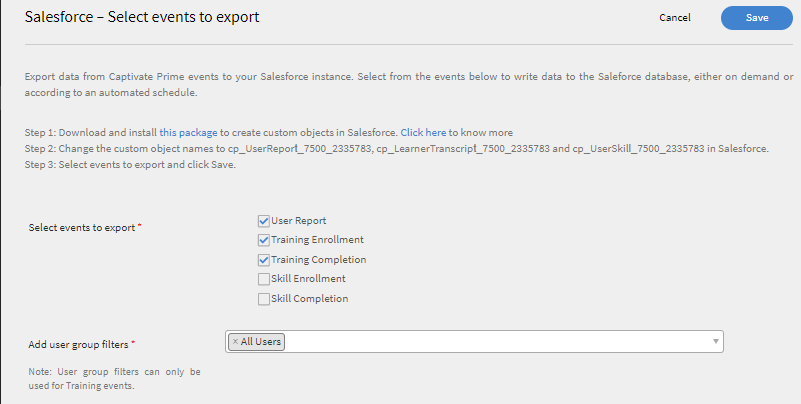
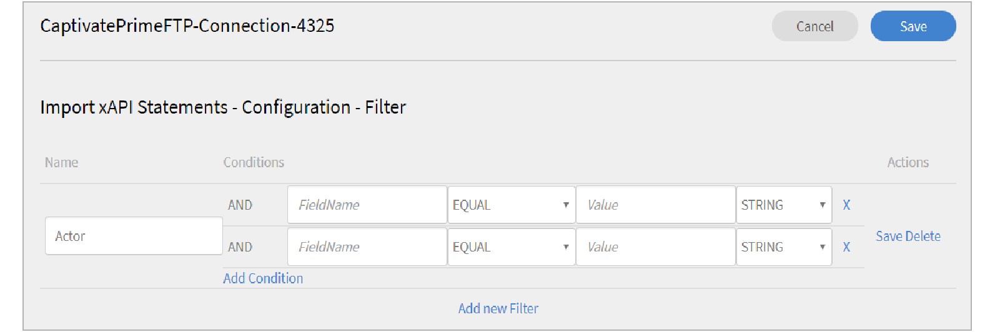
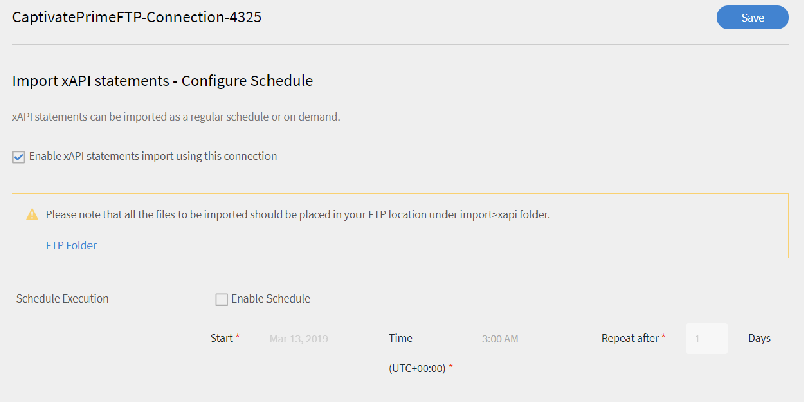
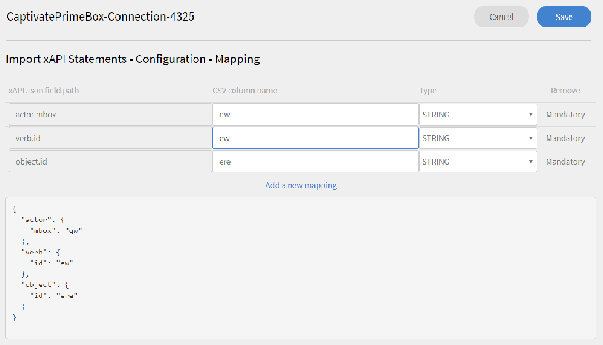
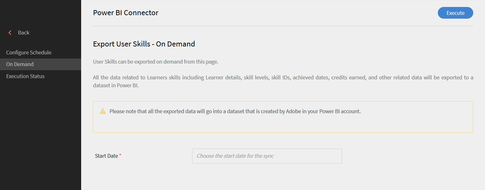
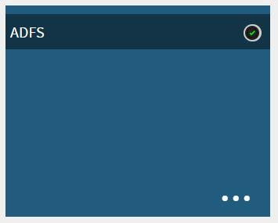
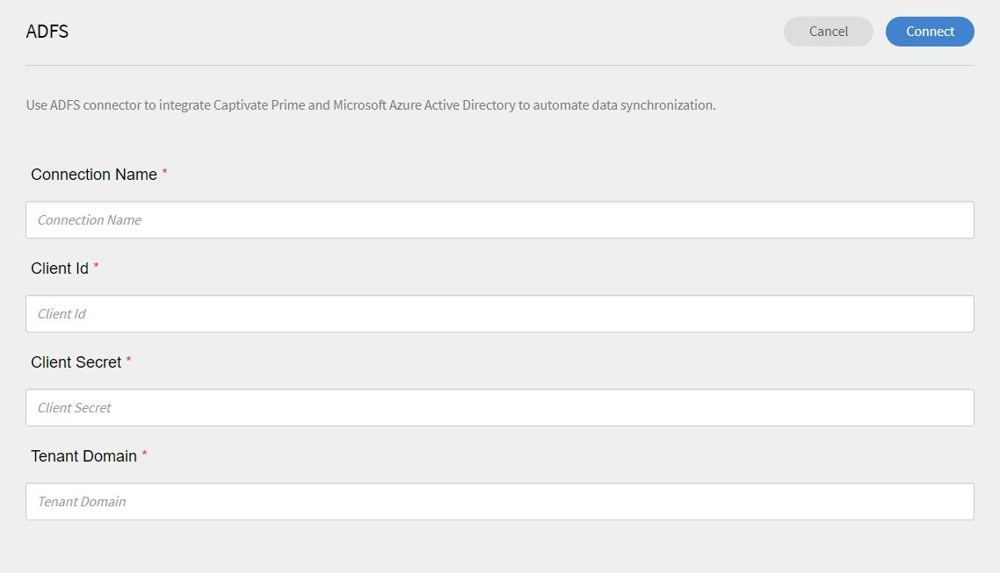

# Connettori Learning Manager

Le aziende usano altre applicazioni e altri sistemi che devono essere integrati con Learning Manager. I connettori sono utilità di supporto all’implementazione di integrazioni basate sui dati, come l’importazione di dati in Learning Manager da sistemi esterni.  Esegue anche l’esportazione di dati in sistemi esterni da Learning Manager.

Learning Manager fornisce connettori Salesforce e FTP. Tramite il connettore Salesforce, gli Amministratori di integrazione di un’organizzazione possono integrare l’applicazione Salesforce con Learning Manager. In qualità di integratore, puoi anche utilizzare il connettore FTP per importare automaticamente un set di utenti nell’applicazione aziendale.

Learning Manager offre inoltre connettori Lynda, getAbstract e Harvard Management System. Questi connettori consentono agli Allievi di accedere e seguire i corsi di Lynda.com, getAbstract e Harvard ManageMentor.

Continua a leggere per scoprire come configurare e utilizzare ciascuno di questi connettori in Learning Manager.

<!--
>[!NOTE]
>
>**Update:** December 2020 update of Learning Manager
>
>For **FTP**, **Box**, and **Custom FTP** connectors, while exporting Learner Transcript or xAPI, you can also export the data as a **zip** file, for:
>
>* Learner Transcripts
>* xAPI
-->

>[!NOTE]
>
>Con la versione di novembre 2022 di Adobe Learning Manager, Zoom è stato dichiarato obsoleto [Autenticazione JWT entro giugno 2023](https://marketplace.zoom.us/docs/guides/auth/jwt/). Di conseguenza, il connettore Zoom con JWT continuerà a funzionare fino alla data indicata, ma consigliamo agli utenti di creare un’app OAuth Server-to-Server per sostituire la funzionalità nel proprio account. Per impostazione predefinita, tutte le nuove connessioni dispongono dell’autenticazione Zoom OAuth.

## Connettore Salesforce {#sfconnector}

Il connettore Salesforce collega gli account Learning Manager e Salesforce per automatizzare la sincronizzazione dei dati. Il connettore Salesforce offre le seguenti funzionalità:

### Associare gli attributi

L’Amministratore di integrazione può scegliere le colonne Salesforce e mapparle agli attributi raggruppabili di Learning Manager corrispondenti. Una volta completata, la mappatura viene utilizzata nelle successive importazioni di utenti. Può essere riconfigurata se l’Amministratore desidera una mappatura diversa per l’importazione degli utenti.

### Importazione automatica degli utenti

Il processo di importazione degli utenti consente all’Amministratore Learning Manager di recuperare i dettagli dei dipendenti da Salesforce e importarli automaticamente in Learning Manager. Grazie all’automazione, le operazioni di creazione di CSV e caricamento in Learning Manager non richiedono alcun intervento manuale.

### Pianificazione automatica

L&#39;utilizzo della funzione di pianificazione automatica insieme alla funzione di importazione automatica degli utenti può essere efficace. L’Amministratore Learning Manager può configurare la pianificazione in base alle esigenze dell’organizzazione. Gli utenti nell’applicazione Learning Manager possono essere aggiornati in base alla pianificazione. La sincronizzazione può essere eseguita su base giornaliera nell’applicazione Learning Manager.

### Filtraggio degli utenti

L’Amministratore Learning Manager può applicare filtri agli utenti prima di importarli. Ad esempio, l’Amministratore Learning Manager può scegliere di importare tutti gli utenti della gerarchia sotto uno o più Manager specifici.

### Configurazione del connettore Salesforce {#configuresalesforceconnector}

Scopri il processo da seguire per integrare Salesforce con Learning Manager

#### Prerequisiti {#prerequisites}

Assicurati di avere a disposizione l’URL dell’organizzazione Salesforce. Ad esempio, se il nome della tua organizzazione è **myorg**, l’URL di Salesforce potrebbe essere `https://myorg.salesforce.com`. È l’unico input richiesto per connettere l’account Salesforce a Learning Manager.

Assicurati inoltre di disporre delle credenziali appropriate per accedere all’account.

#### Creare una connessione {#createaconnection}

1. Nella home page di Learning Manager, passa il mouse sopra la scheda/l’anteprima di Salesforce. Viene visualizzato un menu. Fai clic **[!UICONTROL Connetti]** nel menu.

   

   *Opzione di connessione*

1. Viene visualizzata una finestra di dialogo che richiede di inserire l&#39;URL dell&#39;organizzazione. Fai clic **[!UICONTROL Connetti]** dopo aver fornito l’URL.
1. Al termine della connessione, viene visualizzata la pagina di panoramica.

### Associare gli attributi {#mapattributes}

Una volta stabilita la connessione, è possibile mappare le colonne di Salesforce agli attributi corrispondenti di Learning Manager. Questo passaggio è obbligatorio.

1. Le colonne di Learning Manager sono visualizzate nella parte sinistra della pagina di mappatura, quelle di Salesforce nella parte destra. Seleziona un nome appropriato per la colonna, mappato al nome della colonna di Learning Manager.

   
   *Associare gli attributi*

   >[!NOTE]
   >
   >I dati della colonna di Learning Manager mostrati sul lato sinistro vengono recuperati dai campi attivi. La **manager** deve essere mappato a un campo di tipo indirizzo e-mail. La mappatura di tutte le colonne è obbligatoria prima di poter utilizzare il connettore.

1. Fai clic **[!UICONTROL Salva]** dopo aver completato la mappatura.
1. Il connettore è ora pronto per l’uso. L’account è stato configurato e viene visualizzato come origine dati nell’app Amministratore. L’amministratore può pianificare l’importazione o la sincronizzazione su richiesta.

## Utilizzo del connettore Salesforce {#usingsalesforceconnector}

Il connettore Salesforce si connette a Salesforce.com per recuperare gli utenti in base alla configurazione e aggiungerli a Learning Manager.

### Importare gli utenti dai contatti Salesforce {#import-salesforce-contacts}

Learning Manager migliora il connettore Salesforce per recuperare i contatti e gli utenti Salesforce e importarli automaticamente in Learning Manager.

Nella pagina Connettore Salesforce, immetti l’URL Salesforce e completa l’autenticazione. Dopo aver eseguito l&#39;autenticazione, puoi procedere con l&#39;importazione di utenti o contatti. Se scegli l’opzione Contatti, specifica il sottoinsieme di contatti da importare.

Scegli le colonne di Salesforce e associale agli attributi raggruppabili di Learning Manager corrispondenti. Una volta completata, la mappatura viene utilizzata nelle successive importazioni di utenti.

1. Accedi a Salesforce.
1. Nella pagina di connessione fare clic su **[!UICONTROL Importazione di utenti interni]**.

   
   *Importazione di utenti interni*

1. Nella **Importa utenti** pagina, è disponibile una nuova opzione, Contatti. Fai clic sul pulsante di scelta. **Contatti** e verranno visualizzate le seguenti opzioni.

   
   *Mappare gli attributi del contatto*

1. Se si fa clic su **[!UICONTROL Sì]**, puoi effettuare le seguenti operazioni:

   * **Scegliere la colonna Contatti:** Seleziona il campo da importare in Learning Manager.
   * **Specificare i valori:** Scegli i valori che rappresentano il campo selezionato.

   
   *Specificare i valori*

   * Associa le colonne Salesforce a quelle di Learning Manager.
   * Per iniziare l’importazione, fai clic su **[!UICONTROL Salva]**.

1. Se si fa clic su **[!UICONTROL No. Importa tutti i contatti]**, è possibile mappare direttamente i campi senza filtrare i contatti. Qui puoi importare tutti i contatti da Salesforce.
1. Per iniziare l’importazione, fai clic su **[!UICONTROL Salva]**.

## Esportazione dei record della formazione

Learning Manager offre la possibilità di esportare in Salesforce i record della formazione, ad esempio trascrizioni, report dell’utente e report sulle abilità. È possibile determinare se i dati esportati devono essere collegati alla tabella &quot;Utente&quot; o alla tabella &quot;Contatti&quot; in Salesforce.

*Esportazione dei record della formazione*

### Oggetti personalizzati in Salesforce

Prima di esportare i record della formazione da Learning Manager, è necessario creare oggetti personalizzati in Salesforce. Gli oggetti personalizzati sono oggetti creati dall&#39;utente per memorizzare informazioni specifiche dell&#39;azienda o del settore. Per ulteriori informazioni, consulta [Oggetti personalizzati di Salesforce](https://trailhead.salesforce.com/en/content/learn/modules/data_modeling/objects_intro).

Ecco come creerai gli oggetti:

1. Scarica e installa i pacchetti per creare gli oggetti personalizzati.

   * [Pacchetto 1](https://test.salesforce.com/packaging/installPackage.apexp?p0=04t1k0000008WPJ)
   * [Pacchetto 2](https://test.salesforce.com/packaging/installPackage.apexp?p0=04t1k0000008WPT)
   * [Pacchetto 3](https://test.salesforce.com/packaging/installPackage.apexp?p0=04t1k0000008WPi)

1. Rinomina gli oggetti personalizzati in Salesforce.
1. Seleziona gli eventi e fai clic su **[!UICONTROL Salva]**.

**Collega eventi con:** Scegli la sezione da esportare (Utente o Referente). Se scegli Oggetto referente, gli utenti presenti in Learning Manager ma non in Salesforce verranno creati in Salesforce.

*Opzione Collega eventi*

>[!NOTE]
>
>È possibile creare più connessioni in un account. Una singola connessione può servire fino a tre oggetti personalizzati in Salesforce. Se desideri creare più connessioni per lo stesso account Salesforce, devi installare i tre pacchetti. Forniamo supporto fino a tre pacchetti.
>
>Per tutte le connessioni che si desidera creare, è necessario installare tutti i pacchetti.

>[!NOTE]
>
>Nella pagina Stato esecuzione di Salesforce, il numero di record elaborati può essere controllato solo da Salesforce. Learning Manager mostra lo stato come completato anche in caso di esportazione parziale o di errore in tutti i record elaborati.

## Installazione del pacchetto Salesforce

Learning Manager offre un pacchetto dell’app Salesforce. Una volta installato e configurato in SFDC, gli addetti alle vendite possono svolgere le proprie attività di formazione all’interno del portale SFDC. Questa app consente agli utenti di SFDC di esplorare nuovi corsi di formazione, visualizzare i consigli e seguirli direttamente all’interno del portale SFDC. Gli utenti ricevono anche gli annunci inviati dagli Amministratori sotto forma di masthead direttamente nell’app all’interno del portale SFDC.

### Configurazione nell’app Learning Manager

1. Accedi al tuo account Amministratore Learning Manager come Amministratore dell’integrazione.
1. Fai clic **[!UICONTROL Applicazioni]** > **[!UICONTROL App in primo piano]**.
1. Fai clic **[!UICONTROL Salesforce]**.
1. Nella pagina dell’app Salesforce, annota l’ID dell’applicazione (noto anche come ID client) e il segreto client indicato nella descrizione.
1. Fai clic **[!UICONTROL Approva]** e l&#39;app deve essere approvata correttamente.
1. Fai clic **[!UICONTROL Risorse per sviluppatori]** > **[!UICONTROL Token di accesso per test e sviluppo]**.
1. Nella sezione Ottieni codice OAuth, l’ID client e l’ambito devono essere impostati su - admin:read,admin:write. Fai clic **[!UICONTROL Invia]**.
1. In Ottieni token di aggiornamento, immetti l’ID client e il segreto client. Fai clic **[!UICONTROL Invia]** e annota il token di aggiornamento.

### Creare un account nell’app Salesforce

1. Crea un account nella pagina di iscrizione a Salesforce. È necessario creare un account Salesforce nella versione per sviluppatori o enterprise.  [URL di iscrizione sviluppatore](https://developer.salesforce.com/signup). Per registrarti a Salesforce, assicurati di utilizzare l’ID e-mail che hai utilizzato per Learning Manager.
1. Verifica il tuo account tramite l&#39;e-mail di verifica.
1. Crea una password e accedi a Salesforce.
1. Annota l’URL di Salesforce dopo l’accesso (ad esempio, site.lightning.force.com)

### Installazione del pacchetto Learning Manager

Per installare il pacchetto, devi prima eliminare il pacchetto esistente in Salesforce. Prima della disinstallazione, è necessario abilitare le impostazioni, come illustrato di seguito. L’applicazione di queste impostazioni è obbligatoria, altrimenti non sarà possibile installare il pacchetto.

>[!NOTE]
>
>L’app di Adobe Learning Manager è supportata solo nella visualizzazione Salesforce Lightning.

1. Avvia il [URL del pacchetto Learning Manager](https://login.salesforce.com/packaging/installPackage.apexp?p0=04t1k0000008WOQ).
1. Nella **Accesso** pagina, fare clic su **[!UICONTROL Usa dominio personalizzato]**.
1. Immetti l’URL del pacchetto e fai clic su **[!UICONTROL Continua]**. Nella pagina di installazione deve essere selezionata l’opzione Installa solo per gli amministratori. Non modificare questa opzione.
1. Fai clic **[!UICONTROL Installa]**. Una volta installato il pacchetto, fai clic su **[!UICONTROL Fine]**. Si apre la pagina Pacchetti installati in cui puoi visualizzare l’Adobe Pacchetti installati di Learning Manager.
1. Vai al Modulo di avvio app (accanto a Configurazione) e cerca l’Adobe Learning Manager.
1. Per configurare l’app, fai clic su **[!UICONTROL Configura]**.
1. Fai clic **[!UICONTROL Nuovo]** e aggiungi i seguenti dettagli:

   * **Configurazione:** Immetti il nome che preferisci.
   * **ID client**: immettere il valore ottenuto nella prima sezione.
   * **Segreto client:** Immetti il valore ottenuto nella prima sezione.
   * **Token di aggiornamento:** Immetti il valore ottenuto nella prima sezione.
   * **LearningManagerBaseURL:** URL del sito in cui è ospitato Learning Manager.

### Aggiungi impostazioni sito remoto

1. Nell’angolo superiore destro della pagina, fai clic su **[!UICONTROL Configurazione]**.
1. Ingresso **[!UICONTROL Ricerca rapida]**, cerca Impostazioni sito remoto.
1. Fai clic **[!UICONTROL Nuovo sito remoto]**.
1. Immetti i dettagli:

   * **Nome sito remoto:** Immetti il nome che preferisci.
   * **URL sito remoto:** URL del sito in cui è ospitato Learning Manager.

1. Avvia Learning Manager.

### Abilitare le notifiche per l’app Learning Manager

1. Nell’angolo in alto a destra, fai clic su **[!UICONTROL Configurazione]**.
1. Cerca notifiche personalizzate.
1. Fai clic **[!UICONTROL Nuovo]**.
1. Immetti i seguenti dettagli:

   1. **Nome notifica personalizzata:** LearningManagerNotification
   1. **Nome API:** LearningManagerNotification

1. Seleziona entrambi **Desktop** e **Dispositivi mobili** come canali supportati.

1. Fai clic **[!UICONTROL Salva]**.
1. Per abilitare le notifiche push per i dispositivi mobili, segui i passaggi riportati di seguito:

   1. Installa l’app mobile Salesforce sul tuo cellulare.
   1. Accedi all’app utilizzando le tue credenziali.
   1. Vai a **Configurazione** > **Impostazioni di recapito delle notifiche**.
   1. Aggiungi Salesforce per iOS e Android.

### Disinstallazione di Learning Manager da Salesforce

1. Nell’app Salesforce, passa a Pacchetti installati.
1. Fai clic **[!UICONTROL Disinstalla]**.

## Configurazione di Learning Manager per gli utenti Salesforce

L’app Learning Manager è disponibile anche per gli utenti presenti in qualsiasi account Salesforce. L’amministratore Salesforce può aggiungere utenti in base ai profili. I profili Salesforce sono simili a quelli di Learning Manager. Ad esempio, Amministratore, Amministratore dell’integrazione, Istruttore e così via. L’amministratore Salesforce può anche creare un profilo personalizzato.

In qualità di amministratore Salesforce, puoi assegnare i profili agli utenti o creare un profilo personalizzato.

Durante l’installazione del pacchetto, puoi assegnare il profilo Salesforce agli Allievi.

Dopo aver installato il pacchetto, è necessario configurare il profilo.

Fai clic **[!UICONTROL Configura]** > **[!UICONTROL Nuovo]**, quindi aggiungi quanto segue:

* Nome configurazione
* ID client
* SegretoClient
* LearningManagerBaseURL
* Disabilita reindirizzamento

>[!NOTE]
>
>È necessario abilitare l’app Learning Manager per tutti gli Allievi, affinché questi possano visualizzarla.

Il passaggio successivo consiste nel fornire l’autorizzazione per accedere all’app Learning Manager.

*Configurazione delle autorizzazioni per accedere all’app Learning Manager*

Seleziona gli utenti e assegna le autorizzazioni di conseguenza. Gli Allievi ora possono accedere all’app Learning Manager.

Ora seleziona un profilo, ad esempio Profilo standard di un utente, quindi fai clic sul profilo. Fai clic **[!UICONTROL Modifica]** e nel **Impostazioni app personalizzate** , attiva la casella di controllo **Adobe di Learning Manager**. In questo modo l’utente può accedere all’app.

Nella **Impostazioni scheda personalizzata** nella sezione **Home page Allievo** seleziona l’opzione **Attivato predefinito**.

Devi rendere l&#39;app visibile a tutti i profili.

Fai clic **[!UICONTROL Salva]** e gli allievi appartenenti a tutti i profili accederanno all’app Learning Manager.

### Modifiche relative al percorso di apprendimento

#### Connessioni esistenti

Se l’opzione Percorso di apprendimento è disattivata nell’account dell’Amministratore, nel report non verranno aggiunte righe e colonne.

Se l’opzione Percorso di apprendimento è abilitata nell’account dell’Amministratore, la colonna &quot;Tipo&quot; verrà compilata con Percorso di apprendimento nel caso in cui gli Allievi vi siano iscritti.

>[!NOTE]
>
>Se il flag è attivato e si utilizza una connessione esistente, alcuni record potrebbero non essere visualizzati.

#### Nuove connessioni

Se l’opzione Percorso di apprendimento è disattivata nell’account dell’Amministratore, il report dei corsi di formazione sarà composto dalle seguenti colonne, ma non conterrà dati.

* **Percorso incorporato:** Visualizza il nome del programma di apprendimento
* **ID percorso incorporato:** Visualizza gli ID del programma di apprendimento.
* **ID corso incorporato:** Visualizza gli ID dei corsi che si trovano all’interno di un percorso di apprendimento.

Inoltre, per le nuove connessioni negli account in cui è abilitato il percorso di apprendimento, verranno visualizzate le tre nuove colonne e verranno inviati tutti i dati.

Inoltre, il report conterrà il tipo di colonna &quot;Percorso di apprendimento (livello superiore)&quot; per tutti gli Allievi iscritti a un percorso di apprendimento.

Nella colonna Tipo, il programma di apprendimento verrà rinominato Percorso di apprendimento. Per le connessioni esistenti, non verrà apportata alcuna modifica.

## Connettore FTP Learning Manager {#ftpconnector}

Utilizzando il connettore FTP, è possibile integrare Learning Manager con sistemi esterni arbitrari per l’automazione della sincronizzazione dei dati. I sistemi esterni dovrebbero esportare i dati in formato CSV e inserirli nella cartella appropriata dell’account FTP di Learning Manager. Il connettore FTP offre le funzioni indicate di seguito.

Puoi anche utilizzare il connettore Box per la migrazione dei dati, l’importazione degli utenti e l’esportazione dei dati. Per ulteriori informazioni, consulta Connettore Box.

### Importazione dati {#dataimport}

Il processo di importazione degli utenti consente all’Amministratore Learning Manager di recuperare i dettagli dei dipendenti dal servizio FTP di Learning Manager e importarli automaticamente in Learning Manager. Utilizzando questa funzione, è possibile integrare più sistemi inserendo il file CSV generato da tali sistemi nelle apposite cartelle degli account FTP. Learning Manager preleva i file CSV, li unisce e importa i dati in base alla pianificazione. Per ulteriori informazioni, fai riferimento alla funzionalità Pianificazione.

**Associare gli attributi**

L’Amministratore di integrazione può scegliere le colonne di CSV e mapparle agli attributi raggruppabili di Learning Manager. Questa mappatura è una tantum. Una volta completata, la mappatura viene utilizzata nelle successive importazioni di utenti. La mappatura può essere riconfigurata se l’Amministratore desidera una mappatura diversa per l’importazione degli utenti.

#### Esporta dati {#exportdata}

La funzione di esportazione dei dati consente di esportare le abilità degli utenti e le trascrizioni degli allievi in un percorso FTP per l’integrazione con qualsiasi sistema di terze parti.

#### Pianificazione {#scheduling}

L’Amministratore può impostare le attività di pianificazione in base alle esigenze dell’organizzazione e gli utenti nell’applicazione Learning Manager vengono aggiornati in base alla pianificazione. Allo stesso modo, l’Amministratore dell’integrazione può pianificare l’esportazione delle abilità in modo tempestivo per consentirne l’integrazione con un sistema esterno. La sincronizzazione può essere eseguita su base giornaliera nell’applicazione Learning Manager.

### Configurazione del connettore FTP Learning Manager {#configurecaptivateprimeftpconnector}

Scopri il processo da seguire per integrare il connettore FTP con Learning Manager.

#### Creare una connessione {#Createaconnection-1}

1. Nella home page di Learning Manager, passa il mouse sopra la scheda/l’anteprima FTP. Viene visualizzato un menu. Fai clic **[!UICONTROL Connetti]** nel menu.

   

   *Opzione di connessione*

1. Viene visualizzata una finestra di dialogo che richiede di inserire l’ID e-mail. Fornisci l’ID e-mail del responsabile della gestione dell’account FTP Learning Manager per l’organizzazione. Fai clic **[!UICONTROL Connetti]** dopo aver fornito l’id e-mail.
1. Learning Manager invia all’utente un’e-mail con la richiesta di reimpostare la password prima di accedere all’FTP per la prima volta. L’utente deve reimpostare la password e utilizzarla per accedere all’account FTP Learning Manager.

   >[!NOTE]
   >
   >È possibile creare un solo account FTP Learning Manager per un determinato account Learning Manager.

   Nella pagina di panoramica, è possibile specificare il nome della connessione per l’integrazione. Scegli l’azione da eseguire tra le seguenti opzioni:

   * Importazione di utenti interni
   * Importa xAPI
   * Esporta abilità utente - Configura una pianificazione
   * Esporta abilità utente - Su richiesta
   * Esporta trascrizioni Allievi - Configura una pianificazione
   * Esporta trascrizioni Allievi - Su richiesta

   
   *Opzioni di esportazione*

### Importa

+++Utente interno

L’opzione di importazione di utenti interni ti consente di importare gli utenti da un file CSV in Learning Manager su richiesta o tramite pianificazione.

+++

+++Mappa attributi

Una volta stabilita la connessione, puoi mappare le colonne dei file CSV. Viene inserito nella cartella FTP agli attributi corrispondenti di Learning Manager. Questo passaggio è obbligatorio.

1. Nella pagina Mapping attributi, le colonne previste di Learning Manager sono visualizzate a sinistra, i nomi delle colonne CSV destra. Inizialmente, sul lato destro viene visualizzata una casella di selezione vuota. Importa un qualsiasi modello CSV facendo clic su **Scegli file**.
1. Il passaggio precedente consente di compilare l’elenco a discesa di selezione sul lato destro con tutti i nomi delle colonne CSV. Seleziona un nome appropriato per la colonna, mappato al nome della colonna di Learning Manager.

   >[!NOTE]
   >
   >Il campo Manager deve essere mappato a un campo di tipo indirizzo e-mail. La mappatura di tutte le colonne è obbligatoria prima di poter utilizzare il connettore.

1. Fai clic **[!UICONTROL Salva]** dopo aver completato la mappatura.

   Il connettore è ora pronto per l’uso. L’account configurato viene visualizzato come origine dati nell’app Amministratore per consentire all’Amministratore di pianificare l’importazione o per la sincronizzazione su richiesta.

+++

+++Utilizzo del connettore FTP Learning Manager

1. I file CSV provenienti da sistemi esterni devono essere posizionati nel seguente percorso:

   `code $OPERATION$/$OBJECT_TYPE$/$SUB_OBJECT_TYPE$/data.csv`

   >[!NOTE]
   >
   >Nella versione di luglio 2016, è consentita solo l’importazione degli utenti. Pertanto, per utilizzare il connettore FTP è necessario assicurarsi che i file CSV si trovino nella seguente cartella:

   `code Home/import/user/internal/*.csv`

1. Il connettore FTP prende tutte le righe dai file CSV. È importante che la riga corrispondente a un utente in un file CSV non venga visualizzata in nessun altro file CSV.
1. Tutti i file CSV devono contenere le colonne specificate nella mappatura.
1. Tutti i file CSV richiesti devono essere presenti nella cartella prima dell’inizio del processo.

>[!NOTE]
>
>Durante l’importazione degli utenti in Learning Manager, l’Amministratore deve sapere anche come vengono gestiti gli utenti in Learning Manager. Fare riferimento a [Guida alla gestione degli utenti](migration-manual.md#usermanagement) per ulteriori informazioni.

+++

+++Importa xAPI

Le opzioni di importazione xAPI consentono di pianificare l’importazione di istruzioni xAPI da servizi di terze parti a Learning Manager su richiesta.

+++

+++Configurazioni necessarie per importare xAPI

1. Nella pagina di configurazione, seleziona una configurazione esistente disponibile nell’elenco di configurazioni per importare le istruzioni xAPI dal file CSV. Fai clic su Modifica o **aggiungi una nuova configurazione** per accedere alla pagina di configurazione delle origini di importazione.

   **Configurazione**

   * Nella pagina Configura importazione-Origini, compila i due campi Nome e Nome file di origine. Il nome del file di origine deve corrispondere al nome del file specificato nel percorso della cartella FTP.
   * Fai clic **[!UICONTROL Salva]** per salvare le modifiche.

   
   *Configura*

   **Filtro**

   * Nel riquadro a sinistra, fai clic su **[!UICONTROL Filtro]**.
   * Nella pagina Configurazione importazione-Filtro, compila i campi Nome e Condizioni per filtrare i record. Fai clic **[!UICONTROL Aggiungi nuovo filtro]** per aggiungere un altro filtro. È possibile salvare o eliminare un filtro facendo clic su **Salva** oppure **Elimina** nella colonna Azioni.

   
   *Filtro*

   **Mappatura**

   * Nel riquadro a sinistra, fai clic su **[!UICONTROL Mappatura]**.
   * Nella parte sinistra della pagina Importa istruzioni xAPI-Configurazione-Mappatura, sono visualizzati i nomi dei percorsi JSON xAPI che devono essere mappati ai nomi delle colonne CSV.
   * Per impostazione predefinita, i tre nomi dei percorsi JSON da mappare ai nomi delle colonne CSV sono **actor.mbox**, **verb.id** e **object.id**. È possibile aggiungere altri campi da mappare facendo clic su **Aggiungi una nuova mappatura**.

   * Seleziona il tipo di nome della colonna a cui stai eseguendo la mappatura con il nome del percorso JSON (che si tratti di una stringa, di un numero, di un valore booleano o del tipo di data).
   * Una volta completata la mappatura, fai clic su Salva. L’importazione xAPI può ora essere eseguita in base a una pianificazione o su richiesta.

   
   *Mappatura*

1. Nel riquadro a sinistra, fai clic su **[!UICONTROL Configura pianificazione]**. Fai clic **[!UICONTROL Abilita pianificazione]** per pianificare l’importazione di istruzioni xAPI.

   Puoi immettere l’ora e la data di inizio, quindi immettere la frequenza della pianificazione dell’importazione xAPI in giorni. Ad esempio, abilitando l’importazione xAPI ogni 3 giorni.

   
   *Importazione istruzioni xAPI - Configura pianificazione*

1. Nel riquadro a sinistra, fai clic su **[!UICONTROL Esecuzione su richiesta]**.

   
   *Importazione istruzioni xAPI - Su richiesta*

1. Nel riquadro a sinistra, fai clic su **[!UICONTROL Stato esecuzione]** per visualizzare il riepilogo di tutte le esecuzioni per questo connettore, in ordine cronologico. Puoi visualizzare la data di inizio e la durata dell’importazione xAPI, il tipo di importazione (su richiesta o pianificata) e lo stato dell’importazione (se l’importazione xAPI è in corso, è completata o non è riuscita).

   
   *Importazione istruzioni xAPI - Stato esecuzione*

+++

### Esporta

+++Abilità

Sono disponibili due opzioni per esportare i report sulle abilità degli utenti.

**[!UICONTROL Abilità utente - Su richiesta]**: questa opzione consente di specificare la data di inizio ed esportare il report. Il report viene estratto a partire dalla data inserita fino a oggi.

*Opzione di esportazione su richiesta*

**[!UICONTROL Abilità utente - Configura]**: questa opzione consente di pianificare l&#39;estrazione del report. Seleziona la casella di controllo Abilita pianificazione e specifica la data e l’ora di inizio. Puoi anche specificare l’intervallo desiderato per la generazione e l’invio del report.

*Configurare l’esportazione del report*

+++

Per aprire la cartella di esportazione in cui si trovano i file esportati, apri il collegamento alla cartella FTP fornito nella pagina delle abilità utente, come mostrato di seguito.

*Cartella FTP per visualizzare i file*

I file esportati automaticamente sono presenti nel percorso **Home/export/&#42;FTP_location&#42;**

I file esportati automaticamente presentano il titolo, **skill_achievements_&#42;data di inizio &#42;_a_&#42;data - a&#42;.csv**

*File CSV esportato*

+++Trascrizione Allievo

**Configura**: questa opzione consente di pianificare l&#39;estrazione del report. Seleziona la casella di controllo Abilita pianificazione e specifica la data e l’ora di inizio. Puoi anche specificare l’intervallo desiderato per la generazione e l’invio del report.

+++

Per aprire la cartella di esportazione in cui si trovano i file esportati nella posizione FTP, apri il collegamento alla cartella FTP fornito nella pagina Trascrizione Allievo, come mostrato di seguito

I file esportati automaticamente sono presenti nel percorso **Home/export/&#42;FTP_location&#42;**

I file esportati automaticamente presentano il titolo, **learner_transcript_&#42;data di inizio &#42;_a_&#42;data - a&#42;.csv**

### Supporto per campi CSV manuali {#supportformanualcsvfields}

Durante l’importazione dei dati utente tramite FTP, un amministratore deve mappare tutti i campi attivi presenti nel sistema sul campo corrispondente nel csv.

Questo è obbligatorio per tutti i campi csv attivi. Per i campi attivi manuali, l’Amministratore dell’integrazione può selezionare l’opzione **DontImportFromSource**.

Selezionando questa opzione, i valori dei campi attivi manuali non vengono compilati mediante l’importazione di file CSV. I valori forniti dall’Allievo restano intatti.

>[!NOTE]
>
>Durante la mappatura, se l’opzione **DontImportFromSource** selezionato per il campo attivo csv, questo campo verrà eliminato dal sistema.

*Connettore FTP per campi attivi*

## Connettore Lynda {#lyndaconnector}

Il connettore Lynda viene utilizzato dai clienti enterprise di Lynda.com che desiderano far seguire i corsi Lynda ai loro allievi da Learning Manager. È possibile configurare il connettore per recuperare periodicamente corsi da Lynda.com con la tua chiave API. Una volta creato un corso in Learning Manager, gli utenti possono cercarlo e seguirlo. Sarà quindi possibile seguire i progressi dell’Allievo in Learning Manager.

### Configurazione del connettore Lynda {#configurethelyndaconnector}

1. Nel dashboard di amministrazione integrato, fai clic su Lynda.

   Viene visualizzato il riquadro con tre opzioni: Guida introduttiva, Connetti e Gestione connessioni.

1. Se devi configurare il connettore Lynda per la prima volta, fai clic su Connetti.

   <!--Configure the Exavault FTP account before you configure this connector.-->

1. Nella pagina di connessione, specifica un nome per il connettore. Immetti appkey e chiave privata per la connessione.

   >[!NOTE]
   >
   >Contatta il tuo fornitore per ottenere appkey e chiave privata.

1. Fai clic su Salva.

   La configurazione viene salvata e viene aggiunta la connessione Lynda per l’account. Ora puoi fare clic su Gestione connessioni dalla home page e modificare la configurazione in qualsiasi momento.

1. Se disponi già di una connessione configurata, fai clic su Gestione connessioni per visualizzare tutte le connessioni.

   >[!NOTE]
   >
   >Prima di configurare il connettore, è necessario abilitare la funzione di migrazione per l’account.

1. Fai clic sulla connessione da modificare.
1. Nel riquadro a sinistra, fai clic su **[!UICONTROL Configura]**. Effettuate una delle seguenti operazioni:

   * Visualizza o modifica i dettagli del tuo account e la pianificazione della sincronizzazione da questa finestra. Seleziona la casella di controllo Abilita connessione se desideri abilitare questo account.
   * Fai clic su Modifica e modifica le tue credenziali. Per annullare gli aggiornamenti a questo campo, fai clic su Ripristina.
   * Fai clic su Abilita pianificazione per pianificare la sincronizzazione. È possibile immettere l&#39;ora e la data di inizio, quindi immettere la frequenza della pianificazione della sincronizzazione in giorni. Ad esempio, abilitando la sincronizzazione ogni tre giorni.

   Fai clic **[!UICONTROL Salva]** per salvare le modifiche.

   

   *Configurazione del connettore Lynda per Learning Manager*

1. Nel riquadro a sinistra, fai clic su Esecuzione su richiesta. Questa opzione consente di importare i feed degli utenti e altri dati rilevanti da Lynda. Immetti la data di inizio per l’esecuzione su richiesta e fai clic su Esegui per eseguire la sincronizzazione. Vengono importati tutti i dati dalla data di inizio fino a oggi.

   * È possibile fare clic su Disabilita accesso a Learning Manager durante l’esecuzione in cui l’applicazione presenta un periodo di inattività durante la sincronizzazione.
   * Se fai clic su Abilita accesso a Learning Manager durante l’esecuzione, non si verificano interruzioni del servizio durante la sincronizzazione.

   

   *Esecuzione su richiesta per il connettore Lynda*

1. Puoi anche fare clic su Stato esecuzione dal riquadro sinistro in qualsiasi momento per visualizzare il riepilogo di tutte le esecuzioni per questo connettore, in ordine cronologico. È possibile visualizzare la data di inizio e la durata della sincronizzazione, il tipo di sincronizzazione (se si tratta di una sincronizzazione su richiesta) e lo stato della sincronizzazione (se la sincronizzazione è in corso o è completa).

   >[!NOTE]
   >
   >Quando elimini e ricrei una connessione, le esecuzioni precedenti per il connettore vengono visualizzate di nuovo. È possibile visualizzare tutte le esecuzioni prima di eliminare la connessione.

   È possibile eseguire una nuova esecuzione solo per la sincronizzazione più recente.

   

   *Visualizzare il riepilogo di tutte le esecuzioni fare clic su Stato esecuzione*

## Connettore getAbstract {#getabstractconnector}

Il connettore getAbstract viene utilizzato dai clienti enterprise di getAbstract.com, che desiderano che i loro Allievi utilizzino i riepiloghi di getAbstract. È possibile configurare il connettore in modo da recuperare periodicamente dati di utilizzo, in base ai quali i record di completamento dello studente vengono creati all’interno di Learning Manager. Continua a leggere per scoprire come configurare il connettore in Learning Manager.

### Configurazione del connettore getAbstract {#configurethegetabstractconnector}

1. Nel dashboard di amministrazione integrato, fai clic su getAbstract.

   Nel riquadro sono disponibili tre opzioni: Guida introduttiva, Connetti e Gestione connessioni.

1. Se devi configurare il connettore getAbstract per la prima volta, fai clic su Connetti.

   <!--Configure the Exavault FTP account before you configure this connector.

   Ensure that you share this FTP credentials with your content provider to access the feeds.-->

1. Immetti un nome per la connessione nel campo Nome connessione.

   Immetti le chiavi appropriate nei campi ID client e Segreto client. Contatta il tuo fornitore per ottenere le chiavi appropriate per questo connettore.

   Le chiavi sono necessarie per ottenere i metadati del corso per i corsi utilizzati dal client.

1. Se disponi già di una connessione configurata, nella home page fai clic su getAbstract > Gestione connessioni per visualizzare e modificare la configurazione esistente.

   >[!NOTE]
   >
   >Prima di configurare il connettore, è necessario abilitare la funzione di migrazione per l’account.

1. Fare clic sulla connessione di cui si desidera visualizzare o modificare la configurazione.

   

   *Configurazione del connettore getAbstract per Learning Manager*

1. Nel riquadro a sinistra, fai clic su Configura. Effettuate una delle seguenti operazioni:

   * Visualizza o modifica i dettagli del tuo account e la pianificazione della sincronizzazione da questa finestra. Seleziona la casella di controllo Abilita connessione se desideri abilitare questo account.
   * Fai clic su Modifica e modifica le tue credenziali. Per annullare gli aggiornamenti a questo campo, fai clic su Ripristina.
   * Fai clic su Abilita pianificazione per pianificare la sincronizzazione. È possibile immettere l&#39;ora e la data di inizio, quindi immettere la frequenza della pianificazione della sincronizzazione in giorni. Ad esempio, abilitando la sincronizzazione ogni tre giorni.

1. Fai clic **[!UICONTROL Salva]**.

   La configurazione viene salvata e viene aggiunta la connessione getAbstract per l’account.

1. Nel riquadro a sinistra, fai clic su Esecuzione su richiesta. Questa opzione consente di importare i feed degli utenti e altri dati rilevanti da getAbstract. Immetti la data di inizio per l’esecuzione su richiesta e fai clic su Esegui per eseguire la sincronizzazione. Vengono importati tutti i dati dalla data di inizio fino a oggi.

   * È possibile fare clic su Disabilita accesso a Learning Manager durante l’esecuzione in cui l’applicazione presenta un periodo di inattività durante la sincronizzazione.
   * Se fai clic su Abilita accesso a Learning Manager durante l’esecuzione, non si verificano interruzioni del servizio durante la sincronizzazione.

1. Puoi anche fare clic su Stato esecuzione dal riquadro sinistro in qualsiasi momento per visualizzare il riepilogo di tutte le esecuzioni per questo connettore, in ordine cronologico. È possibile visualizzare la data di inizio e la durata della sincronizzazione, il tipo di sincronizzazione (se si tratta di una sincronizzazione su richiesta) e lo stato della sincronizzazione (se la sincronizzazione è in corso o è completa).

   >[!NOTE]
   >
   >Quando elimini e ricrei una connessione, le esecuzioni precedenti per il connettore vengono visualizzate di nuovo. È possibile visualizzare tutte le esecuzioni prima di eliminare la connessione.

   È possibile eseguire una nuova esecuzione solo per la sincronizzazione più recente.

   Affinché la sincronizzazione funzioni correttamente, assicurati che il feed utente sia presente nella cartella FTP getAbstract per le date specificate nella sincronizzazione.

   Consulta il foglio di calcolo Excel riportato di seguito, che è un file di esempio di feed utente di getAbstract. Il nome del file deve seguire il formato: **report_export_yyyy_MM_dd_HHmmss.xlsx** oppure **report_export_yyyy_MM_dd.xlsx**.
   [Foglio Excel di esempio del feed utente di getAbstract](assets/report-export-20170401175342.xlsx)

## Connettore Harvard ManageMentor {#hmmconnector}

Il connettore Harvard ManageMentor viene utilizzato dai clienti enterprise di Harvard ManageMentor che desiderano far seguire i corsi Harvard ManageMentor ai loro allievi. Il connettore consente di creare corsi all’interno di Learning Manager e può essere configurato in modo da recuperare periodicamente dati sull’avanzamento dell’Allievo. Per configurare il connettore, attenersi alla procedura descritta di seguito.

### Configurazione del connettore Harvard ManagerMentor {#configuretheharvardmanagermentorconnector}

1. Nel dashboard di amministrazione integrato, fai clic su Harvard ManageMentor.

   Nel riquadro sono disponibili tre opzioni: Guida introduttiva, Connetti e Gestione connessioni.

1. Se devi configurare il connettore Harvard ManageMentor per la prima volta, fai clic su Connetti.

   <!--Configure the Exavault FTP account before you configure this connector.

   Ensure that you share this FTP credentials with your content provider to access the feeds.-->

1. Nel campo Nome connessione immettere un nome per la connessione. Fare clic su Connetti per salvare la connessione.
1. Se disponi già di una connessione configurata, nella home page fai clic su Harvard ManageMentor > Gestione connessioni. Fai clic sulla connessione di cui desideri modificare la configurazione esistente.

   >[!NOTE]
   >
   >Prima di configurare il connettore, è necessario abilitare la funzione di migrazione per l’account.

   

   *Configurazione del connettore HarvardManage Mentor per Learning Manager*

1. Nel riquadro a sinistra, fai clic su Configura. Effettuate una delle seguenti operazioni:

   * Visualizza o modifica i dettagli del tuo account e la pianificazione della sincronizzazione da questa finestra. Seleziona la casella di controllo Abilita connessione se desideri abilitare questo account.
   * Fai clic su Abilita pianificazione per pianificare la sincronizzazione. È possibile immettere l&#39;ora e la data di inizio, quindi immettere la frequenza della pianificazione della sincronizzazione in giorni. Ad esempio, abilitando la sincronizzazione ogni tre giorni.

1. Nel riquadro a sinistra, fai clic su Esecuzione su richiesta. Questa opzione consente di importare i feed degli utenti e altri dati rilevanti da Harvard ManageMentor. Immetti la data di inizio per l’esecuzione su richiesta e fai clic su Esegui per eseguire la sincronizzazione. Per questa connessione vengono importati tutti i dati dalla data di inizio fino a oggi.

   * È possibile fare clic su Disabilita accesso a Learning Manager durante l’esecuzione in cui l’applicazione presenta un periodo di inattività durante la sincronizzazione.
   * Se fai clic su Abilita accesso a Learning Manager durante l’esecuzione, non si verificano interruzioni del servizio durante la sincronizzazione.

   Se desideri automatizzare la sincronizzazione a intervalli di alcuni giorni, specifica il numero di giorni nel campo Ripeti n. di giorni. La sincronizzazione garantisce che il tuo account sia aggiornato con la versione più recente dei resoconti e dei riepiloghi di Harvard ManageMentor.

1. Puoi anche fare clic su Stato esecuzione dal riquadro sinistro in qualsiasi momento per visualizzare il riepilogo di tutte le esecuzioni per questo connettore, in ordine cronologico. È possibile visualizzare la data di inizio e la durata della sincronizzazione, il tipo di sincronizzazione (se si tratta di una sincronizzazione su richiesta) e lo stato della sincronizzazione (se la sincronizzazione è in corso o è completa).

   >[!NOTE]
   >
   >Quando elimini e ricrei una connessione, le esecuzioni precedenti per il connettore vengono visualizzate di nuovo. È possibile visualizzare tutte le esecuzioni prima di eliminare la connessione.

   È possibile eseguire una nuova esecuzione solo per la sincronizzazione più recente.

   Affinché la sincronizzazione abbia esito positivo, assicurati che almeno uno dei seguenti file sia presente nella cartella FTP di Harvard ManageMentor:

   hmm12_metadata.xlsx: questo file fornisce i metadati del corso per il connettore Harvard ManageMentor. Assicurati di seguire la convenzione di denominazione quando carichi il file.

   client_hmm12_20150125.xlsx: feed utente per il connettore Harvard ManageMentor. Segue la convenzione di denominazione dei file **client_hmm12_yyyyMMdd.xlsx.**

   Consulta i due file di esempio feed utente e feed corso per questo connettore:

   * [File dei metadati del corso per il connettore Harvard ManageMentor](assets/hmm12-metadata.xlsx)
   * [Feed utente per il connettore Harvard ManageMentor](assets/client-hmm12-20170304.xlsx)

## Connettore Workday {#workdayconnector}

Utilizzando il connettore Workday, è possibile integrare Learning Manager con il tenant Workday per automatizzare la sincronizzazione dei dati.

### Importa

#### Associare gli attributi

L’Amministratore di integrazione può scegliere le colonne Workday e mapparle agli attributi raggruppabili di Learning Manager corrispondenti. Una volta completata, la mappatura viene utilizzata nelle successive importazioni di utenti. Può essere riconfigurata se l’Amministratore desidera una mappatura diversa per l’importazione degli utenti.

#### Importazione automatica degli utenti

Il processo di importazione degli utenti consente all’Amministratore Learning Manager di recuperare i dettagli dei dipendenti da Workday e importarli automaticamente in Learning Manager.

#### Filtraggio degli utenti

L’Amministratore Learning Manager può applicare filtri agli utenti prima di importarli. Ad esempio, l’Amministratore Learning Manager può scegliere di importare tutti gli utenti della gerarchia sotto uno o più Manager specifici.

### Esporta

La funzione di esportazione delle abilità degli utenti consente di esportare automaticamente le abilità degli utenti in Workday.

>[!NOTE]
>
>Le abilità di più account Learning Manager non possono essere esportate contemporaneamente utilizzando lo stesso account Workday.

### Pianificazione {#Scheduling-1}

L’Amministratore può impostare le attività di pianificazione in base alle esigenze dell’organizzazione e gli utenti nell’applicazione Learning Manager vengono aggiornati in base alla pianificazione. Allo stesso modo, l’Amministratore dell’integrazione può pianificare l’esportazione delle abilità in modo tempestivo per consentirne l’integrazione con un sistema esterno. La sincronizzazione può essere eseguita su base giornaliera nell’applicazione Learning Manager.

### Configurazione del connettore Workday {#configureworkdayconnector}

>[!PREREQUISITES]
>
>Richiedere all&#39;amministratore Workday dell&#39;organizzazione di creare un utente del sistema di integrazione (ISU) con le autorizzazioni definite nel documento ISU_Permissions. Scarica una copia dal collegamento riportato di seguito.

[Scarica una copia della sicurezza dell’utente del sistema di integrazione (ISU).](assets/isu-permissions-v1.pdf) Scopri il processo da seguire per integrare il connettore Workday con Learning Manager.

1. Nella home page di Learning Manager, passa il mouse sul riquadro Workday. Viene visualizzato un menu. Fai clic **[!UICONTROL Connetti]** nel menu.

   

   *Riquadro di Workday*

1. Viene visualizzata una finestra di dialogo che richiede di immettere le credenziali per la nuova connessione. Prima di effettuare la connessione, immettere i seguenti campi.

   * Nome connessione: fornisci un nome di connessione in base alle tue preferenze.
   * URL host: l’Amministratore di integrazione può ottenere i dettagli dell’URL host dall’Amministratore Workday corrispondente.
   * Tenant: il tenant è interno all’azienda. L’amministratore Workday fornisce i dettagli del tenant.
   * Nome utente e password: l’amministratore di Workday crea un utente di sistema integrato (ISU) con i privilegi di sicurezza richiesti e lo condivide con l’amministratore di integrazione.

>[!NOTE]
>
>   Learning Manager utilizza la versione 28.1 dell’API Workday.

*Configurazione del connettore Workday*

1. Dopo aver inserito le informazioni in tutti i campi pertinenti, fai clic su Connetti.

   >[!NOTE]
   >
   >Puoi anche sincronizzare più connessioni Workday con il tuo account Learning Manager.

Nella pagina di panoramica, è possibile specificare il nome della connessione per l’integrazione. Scegli l’azione da eseguire tra le seguenti opzioni:

* Importazione di utenti interni
* Esporta abilità utente - Configura una pianificazione
* Esporta abilità utente - Su richiesta

*Panoramica di Workday*

### Importa

#### Mapping attributi {#MapAttributes-1}

È possibile utilizzare il connettore Workday per integrare Learning Manager e Workday per automatizzare la sincronizzazione dei dati. Puoi importare tutti gli utenti attivi da Workday a Learning Manager. Gli utenti possono essere importati da varie origini dati, tra cui FTP e Salesforce.

Prima di importare gli utenti, è necessario mappare gli attributi utente di Learning Manager e Workday. Nella pagina Panoramica, utilizza l’opzione Utenti interni in Importa per fornire gli attributi della mappa.

Immetti l’Adobe di credenziali Learning Manager nella colonna Adobe di Learning Manager. Utilizza i menu a discesa per selezionare le credenziali corrette per le colonne in Workday.

>[!NOTE]
>
>Attualmente, Learning Manager supporta l’importazione di 44 attributi utente da Workday. Aggiungi altri attributi utilizzando i campi attivi in Learning Manager.

*Associare gli attributi*

Selezionare il **Escludi lavoratori temporanei** per impedire l&#39;importazione dei lavoratori temporanei a disposizione di un manager.

Workday presenta quattro livelli di gerarchia, mentre Learning Manager ne ha due. I quattro livelli in Workday sono categoria profilo abilità, profilo abilità, categoria voce abilità e voce abilità. Il nome della tua abilità e il livello di Learning Manager sono mappati insieme in Workday nella voce abilità.

>[!NOTE]
>
>Potete aggiungere altri attributi di Workday. Contatta il tuo CSAM per aggiungere gli attributi.

+++Elenco degli attributi Workday supportati

wd:ID_utente\
wd:ID_lavoratore\
wd:Dati_personali.wd:Nome_Dati.wd:Nome_preferito_Dati.wd:Nome_Dettagli_Dati.@wd:Nome_Formattato\
wd:Personal_Data.wd:Name_Data.wd:Legal_Name_Data.wd:Name_Detail_Data.@wd:Nome_Formattato\
wd:Dati_personali.wd:Nome_Dati.wd:Nome_legale_Dati.wd:Nome_Dettagli_Dati.wd:Dati_prefisso.wd:Descrittore_titolo\
wd:Dati_personali.wd:Nome_Dati.wd:Nome_preferito_Dati.wd:Nome_Dettagli_Dati.wd:Dati_prefisso.wd:Descrittore_titolo\
wd:Dati_personali.wd:Nome_Dati.wd:Nome_preferito_Dati.wd:Nome_Dettagli_Dati.wd:Nome_Nome\
wd:Dati_personali.wd:Nome_Dati.wd:Nome_preferito_Dati.wd:Nome_Dettagli_Dati.wd:Cognome\
wd:Personal_Data.wd:Name_Data.wd:Legal_Name_Data.wd:Name_Detail_Data.wd:First_Name\
wd:Personal_Data.wd:Name_Data.wd:Legal_Name_Data.wd:Name_Detail_Data.wd:Last_Name\
wd:Dati_personali.wd:Dati_contatto.wd:Indirizzo_Dati.0.@wd:Indirizzo_Formattato\
wd:Personal_Data.wd:Contact_Data.wd:Address_Data.0.wd:Postal_Code\
wd:Personal_Data.wd:Contact_Data.wd:Address_Data.0.wd:Country_Region_Descriptor\
wd:Dati_personali.wd:Dati_contatto.wd:Dati_telefono.0.@wd:Formatted_Phone\
wd:Personal_Data.wd:Contact_Data.wd:Phone_Data.0.wd:Country_ISO_Code\
wd:Personal_Data.wd:Contact_Data.wd:Phone_Data.0.wd:International_Phone_Code\
wd:Dati_personali.wd:Dati_contatto.wd:Dati_telefono.0.wd:Numero_telefono\
wd:Personal_Data.wd:Primary_Nationality_Reference.wd:ID.1.$\
wd:Personal_Data.wd:Gender_Reference.wd:ID.1.$\
wd:Personal_Data.wd:Identification_Data.wd:National_ID.0.wd:National_ID_Data.wd:ID\
wd:Personal_Data.wd:Identification_Data.wd:Custom_ID.0.wd:Custom_ID_Data.wd:ID\
wd:Account_Utente_Dati.wd:Default_Display_Language_Reference.wd:ID.1.$\
wd:Role_Data.wd:Organization_Role_Data.wd:Organization_Role.0.wd:Organization_Role_Reference.wd:ID.1.$\
wd:Employment_Data.wd:Worker_Job_Data.0.wd:Position_Data.wd:Position_Title\
wd:Employment_Data.wd:Worker_Job_Data.0.wd:Position_Data.wd:Business_Title\
wd:Employment_Data.wd:Worker_Job_Data.0.wd:Position_Data.wd:Business_Site_Summary_Data.wd:Name\
wd:Employment_Data.wd:Worker_Job_Data.0.wd:Position_Data.wd:Business_Site_Summary_Data.wd:Address_Data.@wd:Indirizzo_Formattato\
wd:Employment_Data.wd:Worker_Job_Data.0.wd:Position_Data.wd:Job_Classification_Summary_Data.0.wd:Job_Classification_Reference.wd:ID.1.$\
wd:Employment_Data.wd:Worker_Job_Data.0.wd:Position_Data.wd:Job_Classification_Summary_Data.0.wd:Job_Group_Reference.wd:ID.1.$\
wd:Employment_Data.wd:Worker_Job_Data.0.wd:Position_Data.wd:Work_Space__Reference.wd:ID.1.$\
wd:Employment_Data.wd:Worker_Status_Data.wd:Active\
wd:Employment_Data.wd:Worker_Status_Data.wd:Active_Status_Date\
wd:Employment_Data.wd:Worker_Status_Data.wd:Hire_Date\
wd:Employment_Data.wd:Worker_Status_Data.wd:Original_Hire_Date\
wd:Employment_Data.wd:Worker_Status_Data.wd:Ritirato\
wd:Employment_Data.wd:Worker_Status_Data.wd:Retirement_Date\
wd:Employment_Data.wd:Worker_Status_Data.wd:Terminated\
wd:Employment_Data.wd:Worker_Status_Data.wd:Termination_Date\
wd:Employment_Data.wd:Worker_Status_Data.wd:Termination_Last_Day_of_Work\
wd:Organization_Data.wd:Worker_Organization_Data.0.wd:Organization_Data.wd:Organization_Code\
wd:Organization_Data.wd:Worker_Organization_Data.0.wd:Organization_Data.wd:Organization_Name\
wd:Organization_Data.wd:Worker_Organization_Data.0.wd:Organization_Data.wd:Organization_Type_Reference.wd:ID.1.$\
wd:Organization_Data.wd:Worker_Organization_Data.0.wd:Organization_Data.wd:Organization_Subtype_Reference.wd:ID.1.$\
wd:Qualification_Data.wd:Education.0.wd:School_Name\
wd:Qualification_Data.wd:External_Job_History.0.wd:Job_History_Data.wd:Job_Title\
wd:Qualification_Data.wd:External_Job_History.0.wd:Job_History_Data.wd:Company\
wd:Management_Chain_Data.wd:Worker_Supervisory_Management_Chain_Data.wd:Management_Chain_Data.0.wd:Manager.Employee_ID

+++

### Esporta

Puoi esportare tutte le abilità utilizzate da un utente da Learning Manager in Workday. Vengono esportate solo tutte le abilità utente attive e Learning Manager non esporta le abilità ritirate. Puoi anche connettere più Learning Manager\
account allo stesso connettore Workday. Se i nomi delle abilità sono gli stessi in due account Learning Manager, vengono mappati alla stessa abilità in Workday. Prima di aggiornare l’abilità in Workday, nel caso in cui due account Learning Manager utilizzino lo stesso account Workday, è consigliabile aggiornare i nomi delle abilità in tutti gli account Learning Manager.

+++Abilità utente - Configura

Questa opzione consente di pianificare l’estrazione del report. Assicurati che la casella di controllo Abilita esportazione delle abilità degli utenti utilizzando questa connessione sia abilitata. Seleziona la casella di controllo Abilita pianificazione e specifica la data e l’ora di inizio. Puoi anche specificare l’intervallo desiderato per la generazione e l’invio del report. Seleziona la casella di controllo Abilita pianificazione e inserisci Data di inizio, Ora e Ripeti dopo &quot;n&quot; numero di giorni. Al termine, fai clic su Salva.

*Configurare il report sulle abilità degli utenti*

+++

+++Abilità utente - Su richiesta

Questa opzione consente di specificare la data di inizio ed esportare il report. Il report viene estratto a partire dalla data inserita fino a oggi. Immetti la data a partire dalla quale desideri iniziare a generare il report e fai clic su Esegui.

*Report sulle abilità degli utenti su richiesta*

+++

+++Abilità utente - Stato di esecuzione

Qui puoi visualizzare il riepilogo di tutte le attività e ottenere il report sullo stato. Puoi scaricare i report degli errori facendo clic sul collegamento al report degli errori.

*Report di esecuzione abilità utente*

+++

## connettore miniOrange {#miniorangeconnector}

Utilizzando il connettore miniOrange, è possibile integrare Learning Manager con il tenant miniOrange per automatizzare la sincronizzazione dei dati.

### Importa

#### Associare gli attributi

L’Amministratore di integrazione può scegliere gli attributi miniOrange e mapparli agli attributi raggruppabili di Learning Manager corrispondenti. Una volta completata, la mappatura viene utilizzata nelle successive importazioni di utenti. Può essere riconfigurata se l’Amministratore desidera una mappatura diversa per l’importazione degli utenti.

#### Importazione automatica degli utenti

Il processo di importazione degli utenti consente all’Amministratore Learning Manager di recuperare i dettagli dei dipendenti da miniOrange e importarli automaticamente in Learning Manager.

#### Filtraggio degli utenti

L’Amministratore Learning Manager può applicare filtri agli utenti prima di importarli. Ad esempio, l’Amministratore Learning Manager può scegliere di importare tutti gli utenti della gerarchia sotto uno o più Manager specifici.

Per configurare il connettore miniOrange, contatta il team CSM di Learning Manager.

### Configurazione del connettore miniOrange {#configureminiorangeconnector}

1. Nella home page di Learning Manager, passa il mouse sopra la scheda/l’anteprima miniOrange. Viene visualizzato un menu. Fai clic  **[!UICONTROL Connetti]** nel menu.

   

   *Piastrella connettore miniOrange*

1. Fai clic **[!UICONTROL Connetti]** per stabilire una nuova connessione. Viene visualizzata la pagina del connettore miniOrange. Immetti i dettagli dell&#39;account che desideri mappare.

   

   *Creare una connessione*

1. Se desideri importare l’utente miniOrange direttamente come utente interno Learning Manager, utilizza il **[!UICONTROL Importazione di utenti interni]** opzione.

   

   *Importazione di utenti interni*

1. Le colonne di Learning Manager sono visualizzate nella parte sinistra della pagina di mappatura, quelle di MiniOrnage nella parte destra. Seleziona un nome appropriato per la colonna, mappato al nome della colonna di Learning Manager.

   

   *Associare gli attributi*

1. Per visualizzare e modificare l’origine dati, fai clic su **[!UICONTROL Impostazioni > Origine dati]**.

   La fonte miniOrange stabilita sarebbe elencata. Per modificare il filtro, fare clic su **[!UICONTROL Modifica]**.

   

   *Visualizzare e modificare un&#39;origine dati*

1. Riceverai una notifica al completamento dell’importazione. Per visualizzare o modificare il registro di importazione, fare clic su **[!UICONTROL Utenti > Registro importazione.]**

#### Eliminare una connessione {#deleteaconnection}

Per eliminare una connessione miniOrange stabilita, attieniti alla seguente procedura.

## Connettori per videoconferenze (BlueJeans Meetings e Zoom) {#bluejeansconnector}

Ora puoi integrare Learning Manager con i connettori BlueJeans e Zoom e usarli per tenere corsi.  Il connettore consente di organizzare riunioni/lezioni in videoconferenza con gli Allievi.

Per configurare e utilizzare il connettore, attieniti alla seguente procedura.

1. Nella home page di Learning Manager, passa il mouse sulla miniatura BlueJeans/Zoom. Viene visualizzato un menu. Fai clic  **[!UICONTROL Connetti]** dal menu.

   

   *Sezione connettore zoom*

1. Si apre la pagina del connettore BlueJeans/Zoom. Immetti i dettagli del tuo account nei rispettivi campi per integrare e sincronizzare il feed utente. Puoi ottenere i dettagli dall’amministratore dell’account del connettore.

   
   *Connessione a BlueJeans/Zoom*

   >[!NOTE]
   >
   >Come Allievo, mentre abiliti il connettore, utilizza lo stesso ID e-mail utilizzato per l’account Learning Manager per abilitare i feed utente in Learning Manager.

1. Una volta stabilita la connessione, come Autore, crea un corso VC con BlueJeans/Zoom come sistema di conferenza.

   

   *Creazione di un corso VC*

1. Amministratori, manager e allievi possono iscrivere gli allievi al corso creato. Al momento dell’iscrizione, l’Allievo riceve un’e-mail. L’Allievo può accedere al proprio account Learning Manager per visualizzare i dettagli del programma e seguire il corso.
1. Al termine del corso, il rapporto sul completamento viene inviato a Learning Manager. L’Amministratore può visualizzare il report sul completamento per controllare la partecipazione e il punteggio degli Allievi.

   
   *Report su presenza e punteggio*

### Creare un’app OAuth da server a server per lo zoom

Quando crei un’app OAuth Zoom Server-to-Server da utilizzare in Adobe Learning Manager, devi aggiungere gli ambiti richiesti da Adobe Learning Manager durante la creazione della connessione.

Adobe Learning Manager richiede gli ambiti seguenti e gli ambiti devono essere selezionati nell’app OAuth.

* Visualizza tutte le riunioni/riunioni degli utenti:read:amministratore
* Visualizza e gestisci tutte le riunioni/riunioni degli utenti:write:amministratore
* Visualizza dati report /report:read:amministratore
* Visualizza tutte le informazioni utente /utente:read:amministratore
* Visualizzare le informazioni degli utenti e gestire utenti /utente:write:amministratore

## Connettore Box {#boxconnector}

Utilizzando il connettore Box, è possibile integrare Learning Manager con sistemi esterni arbitrari per l’automazione della sincronizzazione dei dati. I sistemi esterni dovrebbero esportare i dati in formato CSV e inserirli nella cartella appropriata dell’account Box di Learning Manager. Il connettore Box offre le seguenti funzionalità:

Puoi anche utilizzare il connettore FTP per la migrazione dei dati, l’importazione degli utenti e l’esportazione dei dati. Per ulteriori informazioni, [Connettore FTP Learning Manager.](connectors.md#main-pars_header_1427405935)

### Importazione dati {#DataImport-1}

Il processo di importazione degli utenti consente all’Amministratore Learning Manager di recuperare i dettagli dei dipendenti dal servizio Box di Learning Manager e importarli automaticamente in Learning Manager. Utilizzando questa funzione, puoi integrare più sistemi inserendo il file CSV generato da tali sistemi nelle cartelle appropriate degli account Box. Learning Manager preleva i file CSV, li unisce e importa i dati in base alla pianificazione. Per ulteriori informazioni, fai riferimento alla funzionalità Pianificazione.

**Associare gli attributi**

L’Amministratore di integrazione può scegliere le colonne di CSV e mapparle agli attributi raggruppabili di Learning Manager. Questa mappatura è una tantum. Una volta completata, la mappatura viene utilizzata nelle successive importazioni di utenti. La mappatura può essere riconfigurata se l’Amministratore desidera una mappatura diversa per l’importazione degli utenti.

## Esportazione dati {#dataexport}

La funzione di esportazione dei dati consente di esportare le abilità degli utenti e le trascrizioni degli allievi in un percorso Box per l’integrazione con qualsiasi sistema di terze parti.

## Report di pianificazione {#schedulereports}

L’Amministratore può impostare le attività di pianificazione in base alle esigenze dell’organizzazione e gli utenti nell’applicazione Learning Manager vengono aggiornati in base alla pianificazione. Allo stesso modo, l’Amministratore dell’integrazione può pianificare l’esportazione delle abilità in modo tempestivo per consentirne l’integrazione con un sistema esterno. La sincronizzazione può essere eseguita su base giornaliera nell’applicazione Learning Manager.

## Configurazione del connettore Box {#configureboxconnector}

Scopri il processo da seguire per integrare il connettore Box con Learning Manager.

1. Nella home page di Learning Manager, passa il mouse sopra la scheda/l’anteprima di Box. Viene visualizzato un menu. Fai clic sulla voce Connetti nel menu.

   

   *Connetti a Box*

1. Viene visualizzata una finestra di dialogo che richiede di inserire l’ID e-mail. Fornisci l’ID e-mail del responsabile della gestione dell’account Box Learning Manager per l’organizzazione. Specifica l’ID e-mail e fai clic su Connetti.
1. Learning Manager invia all’utente un’e-mail con la richiesta di reimpostare la password prima di accedere a Box per la prima volta. L’utente deve reimpostare la password e utilizzarla per accedere all’account Box Learning Manager.

   >[!NOTE]
   >
   >È possibile creare un solo account Box Learning Manager per un determinato account Learning Manager.

   Nella pagina di panoramica, è possibile specificare il nome della connessione per l’integrazione. Scegli l’azione da eseguire tra le seguenti opzioni:

   * Importazione di utenti interni
   * Importa report di attività xAPI
   * Esporta abilità utente - Configura una pianificazione
   * Esporta abilità utente - Su richiesta
   * Esporta trascrizione Allievo - Configura una pianificazione
   * Esporta trascrizione Allievo - Su richiesta

## Importa

+++Utente interno

L’opzione di importazione di utenti interni consente di pianificare automaticamente la generazione del report sull’importazione degli utenti. I report generati vengono inviati come file .CSV.

+++

+++Mappa attributi

Una volta stabilita la connessione, puoi mappare le colonne dei file CSV che si trovano nella cartella Box agli attributi corrispondenti di Learning Manager. Questo passaggio è obbligatorio.

1. Nella pagina Mapping attributi, le colonne previste di Learning Manager sono visualizzate a sinistra, i nomi delle colonne CSV destra. Inizialmente, sul lato destro viene visualizzata una casella di selezione vuota. Importa un qualsiasi modello CSV facendo clic su Scegli file.
1. Il passaggio precedente consente di compilare l’elenco a discesa di selezione sul lato destro con tutti i nomi delle colonne CSV. Seleziona un nome appropriato per la colonna, mappato al nome della colonna di Learning Manager.

   *Il campo Manager deve essere mappato a un campo di tipo indirizzo e-mail. La mappatura di tutte le colonne è obbligatoria prima di poter utilizzare il connettore.*

1. Una volta completata la mappatura, fai clic su Salva.

   Il connettore è ora pronto per l’uso. L’account configurato viene visualizzato come origine dati nell’app Amministratore per consentire all’Amministratore di pianificare l’importazione o per la sincronizzazione su richiesta.

+++

Report di attività +++xAPI

L’opzione Report di attività xAPI consente di generare l’importazione di istruzioni xAPI dai servizi di terze parti. I file vengono salvati come file .CSV e quindi convertiti in istruzioni xAPI durante l’importazione in Learning Manager.

+++

+++Configurazioni necessarie per importare xAPI

1. Nella pagina di configurazione, seleziona una configurazione esistente disponibile nell’elenco di configurazioni per importare le istruzioni xAPI dal file CSV. Fai clic su modifica o su A **Aggiungi nuova configurazione** collegamento per accedere alla pagina Importa file di origine della configurazione delle istruzioni xAPI.

   

   *Modifica o aggiungi una nuova configurazione*

   **Configurazione**

   * Nella pagina Configura importazione-Origini, compila i due campi Nome e Nome file di origine. Il nome del file di origine deve corrispondere al nome del file specificato nel percorso della cartella FTP.
   * Fai clic **[!UICONTROL Salva]** per salvare le modifiche.

   

   *Configura*

   **Filtro**

   * Nel riquadro a sinistra, fai clic su Filtro.
   * Nella pagina Configurazione importazione-Filtro, compila il campo Nome e condizioni per filtrare i record. Fai clic su Aggiungi nuovo filtro per aggiungere un altro filtro. È possibile salvare o eliminare un filtro facendo clic sull’opzione Salva o Elimina nella colonna Azioni.

   

   *Filtro*

   **Mappatura**

   * Nel riquadro a sinistra, fai clic su Mappatura.
   * Nella parte sinistra della pagina Configura importazione-Mappatura, sono visualizzati i nomi dei percorsi JSON xAPI che devono essere mappati ai nomi delle colonne CSV.
   * Per impostazione predefinita, i tre nomi dei percorsi JSON da mappare ai nomi delle colonne CSV sono **actor.mbox**, **verb.id** e **object.id**. È possibile aggiungere altri campi da mappare facendo clic su Aggiungi nuova mappatura.
   * Seleziona il tipo di nome della colonna a cui stai eseguendo la mappatura con il nome del percorso JSON (che si tratti di una stringa, di un numero, di un valore booleano o del tipo di data).
   * Una volta completata la mappatura, fai clic su Salva. L’importazione xAPI può ora essere eseguita in base a una pianificazione o su richiesta.

   
   *Mappatura*

1. Nel riquadro a sinistra, fai clic su **[!UICONTROL Configura pianificazione]**. Fai clic su Abilita pianificazione per pianificare l’importazione di istruzioni xAPI. Puoi immettere l’ora e la data di inizio, quindi immettere la frequenza della pianificazione dell’importazione xAPI in giorni. Ad esempio, abilitando l’importazione xAPI ogni 3 giorni.

   
   *Importazione istruzioni xAPI - Configura pianificazione*

1. Nel riquadro a sinistra, fai clic su **[!UICONTROL Esecuzione su richiesta]**.

   
   *Importazione istruzioni xAPI - Su richiesta*

1. Nel riquadro a sinistra, fai clic su **[!UICONTROL Stato esecuzione]** per visualizzare il riepilogo di tutte le esecuzioni per questo connettore, in ordine cronologico. Puoi visualizzare la data di inizio e la durata dell’importazione xAPI, il tipo di importazione (su richiesta o pianificata) e lo stato dell’importazione (se l’importazione xAPI è in corso, è completata o non è riuscita).

   
   *Importazione istruzioni xAPI - Stato esecuzione*

+++

+++Utilizzo del connettore Box Learning Manager

1. I file CSV provenienti da sistemi esterni devono essere posizionati nel seguente percorso:

   `code $OPERATION$/$OBJECT_TYPE$/$SUB_OBJECT_TYPE$/data.csv`

   >[!NOTE]
   >
   >Nella versione di luglio 2016, è consentita solo l’importazione degli utenti. Pertanto, per utilizzare il connettore Box, è necessario assicurarsi che i file CSV si trovino nella seguente cartella:

   `code Home/import/user/internal/*.csv`

1. Il connettore Box prende tutte le righe dai file CSV. È importante che la riga corrispondente a un utente in un file CSV non venga visualizzata in nessun altro file CSV.
1. Tutti i file CSV devono contenere le colonne specificate nella mappatura.
1. Tutti i file CSV richiesti devono essere presenti nella cartella prima dell’inizio del processo.

Durante l’importazione degli utenti in Learning Manager, l’Amministratore deve sapere anche come vengono gestiti gli utenti in Learning Manager. Fare riferimento a [Guida alla gestione degli utenti](migration-manual.md#usermanagement) per ulteriori informazioni.

+++

## Esporta

+++Abilità

Sono disponibili due opzioni per esportare i report sulle abilità degli utenti.

Abilità utente - Su richiesta: questa opzione consente di specificare la data di inizio ed esportare il report. Il report viene estratto a partire dalla data inserita fino a oggi

**[!UICONTROL Abilità utente - Configura]**: questa opzione consente di pianificare l&#39;estrazione del report. Seleziona la casella di controllo Abilita pianificazione e specifica la data e l’ora di inizio. Puoi anche specificare l’intervallo desiderato per la generazione e l’invio del report.

+++

Per aprire la cartella di esportazione in cui si trovano i file esportati nel percorso di Box, apri il collegamento alla cartella di Box fornito nella pagina delle abilità utente, come mostrato di seguito.

I file esportati automaticamente sono presenti nel percorso **Home/export/&#42;Box_location&#42;**

I file esportati automaticamente presentano il titolo, **skill_achievements_&#42;data di inizio &#42;_a_&#42;data - a&#42;.csv**

>[!NOTE]
>
>Il cliente gestisce le autorizzazioni di accesso e il contenuto nella cartella Box condivisa dal team Learning Manager.  Inoltre, il contenuto della cartella verrebbe fisicamente archiviato nell&#39;area di Francoforte.

### Supporto per campi CSV manuali {#Supportformanualcsvfields-1}

Durante l’importazione dei dati utente tramite Box, un amministratore deve mappare tutti i campi attivi presenti nel sistema sul campo corrispondente nel csv.

Questo è obbligatorio per tutti i campi csv attivi. Per i campi attivi manuali, l’Amministratore dell’integrazione può selezionare l’opzione **DontImportFromSource**.

Selezionando questa opzione, i valori dei campi attivi manuali non vengono compilati mediante l’importazione di file CSV. I valori forniti dall’Allievo restano intatti.

>[!NOTE]
>
>Durante la mappatura, se l’opzione **DontImportFromSource** selezionato per il campo attivo csv, questo campo verrà eliminato dal sistema.

*Connettore Box per campi attivi*

>[!NOTE]
>
>Tutti i file CSV elaborati verranno eliminati per qualsiasi connettore o migrazione che utilizza FTP/Box come origine dati.
>
>Il file CSV per i connettori di contenuto, ad esempio LinkedIn, verrà eliminato dopo sette giorni, mentre il file CSV per gli utenti di importazione verrà eliminato immediatamente.

## Connettore linkedIn Learning {#linkedinlearningconnector}

Il connettore LinkedIn Learning è utilizzato dai clienti enterprise di LinkedIn.com che desiderano far seguire i corsi ai loro allievi da Learning Manager. Il connettore può essere configurato per recuperare periodicamente corsi con la tua chiave API. Una volta creato un corso in Learning Manager, gli utenti possono cercarlo e seguirlo. Sarà quindi possibile seguire i progressi dell’Allievo in Learning Manager.

>[!NOTE]
>
>Il tempo di apprendimento impiegato per i corsi di LinkedIn Learning viene comunicato dalla piattaforma LinkedIn content/LinkedIn alla piattaforma di apprendimento Learning Manager. Se LinkedIn Learning non invia il tempo di apprendimento impiegato, non potrà essere registrato dalla nostra piattaforma di apprendimento. In tal caso, il tempo di apprendimento impiegato visualizzato da Learning Manager risulterà pari a zero.

### Configurazione delle impostazioni nel portale di LinkedIn Learning {#configuresettingsinlinkedlnlearningportal}

1. Accedi al sistema LMS di Linkedln Learning come amministratore.
1. Fai clic **[!UICONTROL amministratore]** dal pannello di navigazione superiore.
1. Fai clic **[!UICONTROL impostazioni]** dalla finestra successiva.
1. Seleziona **[!UICONTROL Integrazione della riproduzione]** dal pannello di navigazione sinistro e fai clic sul pulsante **Integrazione** scheda.
1. Fai clic **[!UICONTROL Impostazioni di avvio del contenuto LMS]** per espanderne le impostazioni.
1. Aggiungere i tre nomi host riportati di seguito. **learningmanager.adobe.com**, **learningmanagerlrs.adobe.com**, **cpcontents.adobe.com**
1. Seleziona **[!UICONTROL Abilita integrazione AICC]**.

   

   *Configurazione di linkedIn Learning*

### Configurazione del connettore LinkedIn Learning {#configurelinkedinlearningconnector}

1. Nel dashboard Amministratore dell’integrazione, fai clic su [!UICONTROL LinkedIn Learning]. Vengono visualizzate le opzioni Guida introduttiva, Connetti e Gestisci connessioni.
1. Se devi configurare il connettore LinkedIn Learning per la prima volta, fai clic su [!UICONTROL Connetti].

   <!--Configure the Exavault FTP account before you configure this connector.

   
   *Configure connection*-->

1. Nella pagina di connessione, specifica un nome per il connettore. Immetti appkey e chiave privata per la connessione.

   >[!NOTE]
   >
   >L’amministratore aziendale può generare una nuova applicazione dal portale di amministrazione di LinkedIn Learning per ottenere Appkey e chiave privata.

1. Fai clic **[!UICONTROL Salva]**.

   La configurazione viene salvata e viene aggiunta la connessione LinkedIn Learning per l’account. Ora puoi fare clic su **[!UICONTROL Gestione connessioni]** dalla home page e modificare la configurazione in qualsiasi momento.

1. Se la connessione è già stata stabilita, fare clic su **[!UICONTROL Gestione connessioni]** visualizza tutte le connessioni.

   >[!NOTE]
   >
   >Prima di configurare il connettore, è necessario abilitare la funzione di migrazione per l’account.

1. Fai clic sulla connessione da modificare.
1. Nel riquadro a sinistra, fai clic su Configura. Effettuate una delle seguenti operazioni:

   * Visualizza o modifica i dettagli del tuo account e la pianificazione della sincronizzazione da questa finestra. Selezionare il **[!UICONTROL Abilita connessione]** casella di controllo se si desidera attivare questo account.
   * Fai clic **[!UICONTROL Modifica]** e modificare le credenziali. Per annullare gli aggiornamenti a questo campo, fai clic su Ripristina.
   * Fai clic **[!UICONTROL Abilita pianificazione]** per pianificare la sincronizzazione. È possibile immettere l&#39;ora e la data di inizio, quindi immettere la frequenza della pianificazione della sincronizzazione in giorni. Ad esempio, abilitando la sincronizzazione ogni tre giorni.

   Fai clic **[!UICONTROL Salva]** per salvare le modifiche.

1. Nel riquadro a sinistra, fai clic su **[!UICONTROL Esecuzione su richiesta]**. Questa opzione consente di importare i feed degli utenti e altri dati rilevanti da LinkedIn. Immetti la data di inizio per l’esecuzione su richiesta e fai clic su Esegui per eseguire la sincronizzazione. Vengono importati tutti i dati dalla data di inizio fino a oggi.

   * È possibile fare clic su **[!UICONTROL Disabilita accesso]** a Learning Manager durante l’esecuzione in cui l’applicazione presenta un periodo di inattività durante la sincronizzazione.
   * Se si fa clic su **[!UICONTROL Abilita accesso]** Learning Manager durante l’esecuzione, non si verificano interruzioni del servizio durante la sincronizzazione.

   

   *Esecuzione su richiesta del report*

1. Puoi anche fare clic su Stato esecuzione dal riquadro sinistro in qualsiasi momento per visualizzare il riepilogo di tutte le esecuzioni per questo connettore, in ordine cronologico. È possibile visualizzare la data di inizio e la durata della sincronizzazione, il tipo di sincronizzazione (se si tratta di una sincronizzazione su richiesta) e lo stato della sincronizzazione (se la sincronizzazione è in corso o è completa).

   

   *Stato esecuzione report*

   >[!NOTE]
   >
   >Quando elimini e ricrei una connessione, le esecuzioni precedenti per il connettore vengono visualizzate di nuovo. È possibile visualizzare tutte le esecuzioni prima di eliminare la connessione.

   È possibile eseguire una nuova esecuzione solo per la sincronizzazione più recente.

### Filtra i contenuti di LinkedIn Learning {#filter-linkedin}

Esistono filtri nei connettori LinkedIn per separare i contenuti in base a LinkedIn Learning Libraries. Inoltre, puoi anche filtrare i contenuti in base alla lingua e alla libreria e importare solo i corsi nelle lingue richieste. Una volta importato, il contenuto viene separato in più cataloghi in base alla configurazione di importazione.

I filtri sono i seguenti:

**Filtra il corso di formazione utilizzando:** Filtra un sottoinsieme di corsi da LinkedIn a Learning Manager.

* **In base alla lingua**

*Filtra per lingua*

* **In base alla libreria da LinkedIn Learning**

*Filtra per catalogo*

**Importa i corsi in**

*Importazione dei corsi di formazione nei cataloghi*

**Importare i tag**

Tipo di tag **Tag personalizzato** che puoi utilizzare per aggiungere tag personalizzati ai corsi di LinkedIn Learning. Puoi aggiungere tutti i tag che desideri, separati da virgole.

*Aggiungere tag personalizzati*

Il contenuto viene salvato solo dopo la migrazione. I contenuti verranno salvati nei rispettivi cataloghi.

## Connettore Power BI {#powerbiconnector}

>[!NOTE]
>
>Learning Manager supporta l’integrazione solo con la licenza commerciale di Microsoft Power BI. Non si integra con Microsoft Power BI su cloud Government.

È possibile utilizzare l’integrazione con questo connettore per sfruttare gli account Power BI esistenti per analizzare e visualizzare i dati di apprendimento da Learning Manager all’interno di Power BI. Durante la configurazione, l’Amministratore di integrazione può impostare l’area di lavoro di Power BI affinché sia popolata in modo incrementale con due set di dati live: trascrizione Allievo e report sulle abilità degli utenti. È quindi possibile utilizzare tutte le funzionalità e la potenza di Power BI per sviluppare, distribuire e distribuire dashboard personalizzati come desiderato nelle proprie organizzazioni.

### Configurazione del connettore {#configuringtheconnector}

Per configurare il connettore, nel **[!UICONTROL Connettori]** pagina, passa il **[!UICONTROL Power BI]** affiancare e fare clic **[!UICONTROL Connetti]**. Viene visualizzata la pagina di Power BI. Per stabilire una connessione, fornisci l’ID client dell’app, il segreto del client dell’app, il nome del tenant e l’ID dell’area di lavoro (facoltativo). Per ottenere queste credenziali, attieniti alla seguente procedura.

*Configurare il connettore Power BI*

1. Launch <https://app.powerbi.com/embedsetup>.
1. Fai clic **[!UICONTROL Incorpora per la tua organizzazione]** e accedi al tuo account Microsoft.
1. Immetti il nome dell’app.
1. Nella sezione Tipo di app, seleziona l’opzione App Web lato server.
1. Nella **[!UICONTROL URL di reindirizzamento]** , seleziona l’opzione **Usa un URL personalizzato** (Scegli questa opzione se conosci l’URL dell’applicazione di destinazione). Immetti il seguente URL:

   `https://learningmanager.adobe.com/ctr/app/azure/_callback` (aggiorna il dominio in base all’ambiente)

1. Nel campo URL personale, immetti il seguente URL: `https://learningmanager.adobe.com/`
1. Nella sezione delle autorizzazioni, seleziona **Leggi tutti i set di dati** e **Leggi e scrivi tutti i set di dati**.

   Acquisizione del tenant: contatta l’amministratore di Power BI per fornire il nome del tenant.

   Ottenere l’ID dell’area di lavoro: la creazione dell’area di lavoro è possibile solo per gli utenti di Power BI Pro. Puoi creare un’area di lavoro nel Power BI e ottenere l’ID dall’URL.

1. Fai clic **[!UICONTROL Registra app]** e memorizza l’ID client e il segreto client.

>[!NOTE]
>
>Se desideri autorizzare nuovamente la connessione, devi creare un&#39;altra app Power e specificare l&#39;URL di reindirizzamento rinominato.

Puoi esportare le trascrizioni degli Allievi, le abilità degli utenti e il report di attività xAPI utilizzando lo stesso metodo. Scegli Trascrizioni allievi/Abilità utente nel pannello a sinistra. Viene visualizzata la pagina Esporta.

Abilita **[!UICONTROL Casella di controllo Abilita esportazione abilità utente/trascrizione Allievo utilizzando questa connessione]**. Salva le modifiche.

**Configurazione dell’esportazione**: se si desidera pianificare l&#39;estrazione del report. Selezionare il **[!UICONTROL Abilita pianificazione]** e specificare la data e l&#39;ora di inizio. Puoi anche specificare l’intervallo desiderato per la generazione e l’invio del report.

*Esporta Configura per pianificare il report*

**Esportazione su richiesta:** Puoi specificare la data di inizio ed esportare il report utilizzando l’opzione . Il report viene estratto a partire dalla data inserita fino a oggi.

*Esportazione su richiesta*

I dati esportati possono essere visualizzati accedendo al tuo account Power BI. I dati esportati sono elencati nell’opzione set di dati.

### Esportazione dei report di attività xAPI in Learning Manager {#exportxapiactivityreportsincaptivateprime}

Nella pagina delle funzionalità PowerBI-xAPI, fai clic su **[!UICONTROL Esportazione del report di attività xAPI]**.

*PowerBI - Esporta report di attività xAPI*

Nel riquadro a sinistra, seleziona **Configurazione** e segui i passaggi riportati di seguito:

* Compila il campo percorso JSON corrispondente al nome della colonna e al tipo di stringa.
* Per aggiungere altri percorsi JSON, fai clic su **[!UICONTROL Aggiungi]**.
* Puoi modificare le voci nei campi percorso JSON facendo clic su **[!UICONTROL Modifica]**.
* Fai clic **[!UICONTROL Salva]** per salvare le modifiche.

**Configura pianificazione**

Nel riquadro a sinistra, fai clic su **[!UICONTROL Configura pianificazione]** ed effettua le seguenti operazioni:

* Fai clic su Abilita esportazione di istruzioni xAPI utilizzando questa connessione.
* Fare clic sul pulsante **[!UICONTROL Abilita pianificazione]** e specificare la data e l&#39;ora di inizio. Puoi anche specificare l’intervallo di giorni desiderato per la ripetizione e l’invio dell’esportazione.
* Fare clic sul pulsante **[!UICONTROL Salva]** per salvare le impostazioni di pianificazione della configurazione.

*Configura pianificazione esportazione xAPI*

**Su richiesta**

Nel riquadro a sinistra, fai clic su **[!UICONTROL Su richiesta]** e specificare la data di inizio nella pagina Esporta istruzioni xAPI-Su richiesta.

*Esportazione xAPI su richiesta*

Tutti i dati esportati verranno inseriti in un set di dati creato da Adobe nel tuo account Power BI.

L’esportazione xAPI in Power BI non riesce se alcune delle istruzioni xAPI in LRS non dispongono di un percorso JSON configurato per l’esportazione. Per le istruzioni xAPI in cui il percorso JSON non è disponibile, il valore della costante N/D deve essere aggiunto e visualizzato in Power BI.

**Stato esecuzione**

Seleziona **Stato esecuzione** per visualizzare il riepilogo di tutte le attività in ordine cronologico. Il segnale di avviso indica errori durante l’esecuzione. Puoi scaricare i report degli errori come **CSV** facendo clic sul collegamento segnalazione errori.

*Stato esecuzione esportazione xAPI*

### Report unificati {#unified-reports}

Learning Manager offre un modo per creare l’esportazione con una combinazione di report, come Dati utente, Trascrizione Allievo, Gamification, Feedback e altri report, sotto forma di un unico set di dati da Power BI.

Ciò consente agli utenti Power BI di unire i dati di più report per creare analisi e visualizzazioni di forte impatto in Power BI.

*Report di Power BI unificati*

**Esportazione su richiesta**

Specifica la data di inizio e di fine ed esporta il report utilizzando questa opzione. Il report viene estratto per l’intervallo di date specificato.

*Esportazione su richiesta*

**Esportazione pianificata**

Se desideri pianificare l’estrazione del report. Selezionare il **Abilita pianificazione** e specificare la data e l&#39;ora di inizio. Puoi anche specificare l’intervallo desiderato per la generazione e l’invio del report.

*Configura pianificazione*

Puoi anche esportare i report sulla formazione in Power BI.

I report sulla formazione possono essere esportati in Power BI come parte della funzione Report unificati.

Il report sulla formazione contiene due campi aggiuntivi:

* Numero di utenti che hanno condiviso commenti su un corso
* Valutazione a stelle media per un corso

### Filtrare lo stato delle Trascrizioni Allievi {#lt-status}

Nella sezione Report unificati di una connessione Power BI, è disponibile un’opzione che consente di esportare le trascrizioni degli allievi in base allo stato degli oggetti di apprendimento.

* **Seleziona tutto:** Esporta tutti i record o le attività a livello di modulo nell’intervallo di date specificato.
* **Completato:** Esporta tutti i record completati nell’intervallo di date.
* **In corso:** Esporta tutti i record con lo stato In corso.
* **Non avviato:** Escludi i record iscritti nel determinato intervallo di date, ma non avviati durante la generazione del report.

* **Annullamento iscrizione:** Includi tutti i record annullati nell’intervallo di date.

*Filtrare lo stato delle Trascrizioni Allievi*

Puoi esportare l’elenco richiesto e quindi utilizzare il Power BI per analizzare il report in un secondo momento.

### Scarica modelli di Power BI {#template}

Learning Manager fornisce anche dei modelli di Power BI già pronti. Questi modelli forniscono una migliore capacità di analisi agli Adobi degli Amministratori degli account di Learning Manager.

Puoi scaricare i modelli, esportare i report pertinenti e creare report facilmente utilizzando questi modelli disponibili.

*Scarica modelli di Power BI*

Ciò consente agli utenti di scaricare questi modelli e di utilizzarli nell’applicazione Power BI, di personalizzarli ulteriormente e di rendere i report più accattivanti.

[**Scarica i modelli**](https://documentcloud.adobe.com/link/track?uri=urn:aaid:scds:US:842bb6a2-cd7d-4c3d-b968-da38bc1cc18a)

<!--<table> 
 <tbody>
  <tr> 
   <td></td> 
   <td>
 
 
<a disablelinktracking="false" href="https://documentcloud.adobe.com/link/track?uri=urn:aaid:scds:US:842bb6a2-cd7d-4c3d-b968-da38bc1cc18a"><strong><em>Download the templates</em></strong></a>
</td> 
  </tr> 
 </tbody>
</table>-->

Puoi anche scaricare manualmente i modelli dal collegamento sopra riportato. Utilizza i modelli e personalizza i report di conseguenza.

### Esportazione del report sulla formazione

I report sulla formazione possono essere esportati in Power BI come parte della funzione Report unificati.

Il report sulla formazione contiene i seguenti campi aggiuntivi:

* Numero di utenti che hanno condiviso commenti su un corso
* Valutazione a stelle media per un corso

*Esportazione del report sulla formazione*

### Modifiche relative al percorso di apprendimento

#### Amministratore: Trascrizioni Allievi e Report unificato

**Connessioni esistenti**

Se l’opzione Percorso di apprendimento è disattivata nell’account dell’Amministratore, nei report non verranno aggiunte righe e colonne.

Se l’opzione Percorso di apprendimento è abilitata nell’account dell’Amministratore, il report conterrà la colonna &quot;Percorso di apprendimento (livello superiore)&quot; per tutti gli Allievi iscritti a un percorso di apprendimento.

**Nuove connessioni**

Se l’opzione Percorso di apprendimento è disattivata nell’account dell’Amministratore, il report dei corsi di formazione sarà composto dalle seguenti colonne:

* Percorso incorporato: mostra il nome del programma di apprendimento
* ID percorso incorporato: mostra gli ID del programma di apprendimento.
* ID corso incorporato: mostra gli ID dei corsi che si trovano all’interno di un percorso di apprendimento.

Inoltre, il report conterrà il tipo di colonna &quot;Percorso di apprendimento (livello superiore)&quot; per tutti gli Allievi iscritti a un percorso di apprendimento.

Nella colonna Tipo, il programma di apprendimento verrà rinominato Percorso di apprendimento. Per le connessioni esistenti, non verrà apportata alcuna modifica. Tuttavia, per le nuove connessioni, le modifiche verranno applicate dopo 30 giorni.

#### Report dei corsi di formazione: report unificato

**Connessioni esistenti**

Se l’opzione Percorso di apprendimento è disattivata nell’account dell’Amministratore, nei report non verranno aggiunte righe e colonne.

Se l’opzione Percorso di apprendimento è abilitata nell’account dell’Amministratore, il report conterrà la colonna &quot;Tipo&quot;. La colonna contiene il nuovo valore &quot;Percorso di apprendimento (livello superiore), dove applicabile&quot;.

**Nuove connessioni**

Se l’opzione Percorso di apprendimento è disattivata nell’account dell’Amministratore, il report dei corsi di formazione sarà composto dalle seguenti colonne:

* **Percorso incorporato:** Visualizza il nome del programma di apprendimento
* **ID percorso incorporato:** Visualizza gli ID del programma di apprendimento.
* **ID corso incorporato:** Visualizza gli ID dei corsi che si trovano all’interno di un percorso di apprendimento.

Inoltre, il report conterrà il tipo di colonna &quot;Percorso di apprendimento (livello superiore)&quot; per tutti gli Allievi iscritti a un percorso di apprendimento.

Nella colonna Tipo, il programma di apprendimento verrà rinominato Percorso di apprendimento. Per le connessioni esistenti, non verrà apportata alcuna modifica. Tuttavia, per le nuove connessioni, le modifiche verranno applicate dopo 30 giorni.

## FTP personalizzato {#custom-ftp}

**Prerequisiti**

>[!NOTE]
>
>Per configurare l’FTP personalizzato, contatta il CSM. Il CSM fornirà i dettagli necessari per la configurazione dell’FTP.
>
>L’impostazione dell’FTP implica un lead time e richiede il supporto IT per consentire l’elenco di IP e porte, nonché per creare determinate cartelle con autorizzazioni specifiche sul server FTP.

Learning Manager offre la possibilità di connettersi alla propria posizione FTP personalizzata.

L’FTP supporterà quanto segue:

### Importazione dati

Il processo di importazione degli utenti consente all’Amministratore Learning Manager di recuperare i dettagli dei dipendenti dal servizio FTP di Learning Manager e importarli automaticamente in Learning Manager. Utilizzando questa funzione, è possibile integrare più sistemi inserendo il file CSV generato da tali sistemi nelle apposite cartelle degli account FTP. Learning Manager preleva i file CSV, li unisce e importa i dati in base alla pianificazione. Per ulteriori informazioni, fai riferimento alla funzionalità Pianificazione.

**Associare gli attributi**

L’Amministratore di integrazione può scegliere le colonne di CSV e mapparle agli attributi raggruppabili di Learning Manager. Questa mappatura è una tantum. Una volta completata, la mappatura viene utilizzata nelle successive importazioni di utenti. La mappatura può essere riconfigurata se l’Amministratore desidera una mappatura diversa per l’importazione degli utenti.

### Esportazione dati

La funzione di esportazione dei dati consente di esportare le abilità degli utenti e le trascrizioni degli allievi in un percorso FTP per l’integrazione con qualsiasi sistema di terze parti.

### Report di pianificazione

L’Amministratore può impostare le attività di pianificazione in base alle esigenze dell’organizzazione e gli utenti nell’applicazione Learning Manager vengono aggiornati in base alla pianificazione. Allo stesso modo, l’Amministratore dell’integrazione può pianificare l’esportazione delle abilità in modo tempestivo per consentirne l’integrazione con un sistema esterno. La sincronizzazione può essere eseguita su base giornaliera nell’applicazione Learning Manager.

Per configurare il tuo FTP, accedi come Amministratore dell’integrazione e fai clic su **[!UICONTROL FTP personalizzato]** > **[!UICONTROL Connetti]**.

Esistono due tipi di autenticazione:

*Opzioni di autenticazione FTP personalizzato*

* **Base:** Nell’autenticazione di base è necessario fornire solo l’URL del dominio FTP, il nome utente e la password. Dopo aver fornito i dettagli, fai clic su Connetti.
* **Certificazione:** Se l’FTP del cliente supporta l’autenticazione tramite certificato, si può scegliere questa opzione. Dopo aver fatto clic su Genera chiave SSH, la chiave SSH viene scaricata nel computer locale. Quando apri il file, la chiave ha l’aspetto seguente:

*Chiave pubblica SSH*

È necessario inserire questa chiave pubblica nel server FTP prima di aggiungere i dettagli riportati di seguito. Una volta impostata la chiave ottenuta come chiave pubblica dell’FTP, fornisci l’URL del dominio FTP e il nome utente e fai clic su **Connetti** per impostare la connessione.

Al termine della configurazione della connessione, nel percorso FTP vengono create automaticamente le cartelle per l’importazione e l’esportazione. Dopo questa operazione, la funzionalità di importazione/esportazione viene fornita dall’FTP personalizzato.

>[!NOTE]
>
>Un connettore FTP personalizzato può essere configurato solo con i server SFTP.

## Connettore ADFS {#adfsconnector}

Prerequisiti per stabilire una connessione ADFS:

* Accedi al portale Azure utilizzando questo URL:  [https://portal.azure.com/](https://portal.azure.com/) prima di registrare l’app.
* Apri Azure Active Directory.

## Procedura per registrare l’applicazione {#stepstoregisteryourapplication}

1. Fai clic su Azure Active Directory. Fai clic **[!UICONTROL Aggiungi]** > **[!UICONTROL Registrazione dell’app]**.

   
   *Aggiungere la registrazione dell’app*

1. Immetti il nome dell’applicazione.

   
   *Immetti il nome dell’applicazione*

   Fai clic **[!UICONTROL Registrati]**.

1. Nel riquadro a destra, seleziona **[!UICONTROL Certificati e segreti]**.

   

   *Seleziona certificati e segreti*

1. Aggiungi un segreto client.

   

   *Aggiungi segreto client*

1. Aggiungi una descrizione al segreto e impostane la scadenza a 24 mesi.

   

   *Aggiungi descrizione*

1. Copia il valore e il segreto, ad esempio, nel blocco note.

   

   *Copia valore e chiave privata*

1. Seleziona **Autorizzazioni API**.

   

   *Riquadro sinistro contenente le autorizzazioni API*

1. Seleziona **Aggiungi autorizzazioni**. Inoltre, attiva l’opzione: **Concedi consenso amministratore**.

   

   *Aggiungi autorizzazioni*

1. Seleziona **Microsoft Graph**.

   

   *Seleziona Microsoft Graph*

1. Seleziona **Autorizzazioni applicazione**.

   

   *Seleziona le autorizzazioni dell’applicazione*

1. Cerca *directory* e seleziona **Lettura dei dati della directory**.

   

   *Seleziona Lettura dati directory*

1. Invio *utente* come termine di ricerca.

   

   *Immetti il termine di ricerca*

1. Seleziona **Lettura completa dei profili di tutti gli utenti**.

   

   *Seleziona Leggi tutti i profili completi degli utenti*

1. Seleziona **Aggiungi autorizzazioni**.

   

   *Seleziona Aggiungi autorizzazioni*

1. Nella pagina di configurazione ADFS in Adobe Learning Manager, immetti l’ID client e il segreto client ottenuti in precedenza.

   Fai clic **[!UICONTROL Connetti]**.

1. Accedi a **portal.azure.com**. I valori verranno compilati nei campi ID tenant e Dominio principale.

### Importa

#### Associare gli attributi

L’Amministratore di integrazione può scegliere gli attributi ADFS e mapparli agli attributi raggruppabili di Learning Manager corrispondenti. Una volta completata, la mappatura viene utilizzata nelle successive importazioni di utenti. Può essere riconfigurata se l’Amministratore desidera una mappatura diversa per l’importazione degli utenti.

#### Importazione automatica degli utenti

Il processo di importazione degli utenti consente all’Amministratore Learning Manager di recuperare i dettagli dei dipendenti da ADFS e importarli automaticamente in Learning Manager.

#### Filtraggio degli utenti

L’Amministratore Learning Manager può applicare filtri agli utenti prima di importarli. Ad esempio, l’Amministratore Learning Manager può scegliere di importare tutti gli utenti della gerarchia sotto uno o più Manager specifici.

Per configurare il connettore ADFS , contatta il team CSM di Learning Manager.

## Configurazione del connettore ADFS {#configureadfsconnector}

1. Nella home page di Learning Manager, passa il mouse sopra la scheda/l’anteprima ADFS. Viene visualizzato un menu. Fai clic sull’opzione Connetti nel menu.

   

   *Miniatura ADFS*

1. Fai clic su Connetti per stabilire una nuova connessione. Viene visualizzata la pagina del connettore ADFS. Immetti i dettagli dell&#39;account che desideri mappare.

   

   *Stabilire la connessione*

1. Per importare l’utente ADFS direttamente come utente interno Learning Manager, utilizza l’opzione Importa utenti interni.

   

   *Importazione dell’utente in Learning Manager*

1. Le colonne di Learning Manager sono visualizzate nella parte sinistra della pagina di mappatura, quelle di ADFS nella parte destra. Seleziona un nome appropriato per la colonna, mappato al nome della colonna di Learning Manager.

   

   *Associare gli attributi*

1. Per visualizzare e modificare l’origine dati, fai clic su **[!UICONTROL Impostazioni]** > **[!UICONTROL Origine dati]**.

   L&#39;origine ADFS stabilita verrà elencata. Per modificare il filtro, fare clic su **[!UICONTROL Modifica]**.

   
   *Impostazione origine dati*

1. Riceverai una notifica al completamento dell’importazione. Per visualizzare o modificare il registro di importazione, fare clic su **[!UICONTROL Utenti]** > **[!UICONTROL Registro importazione]**.

### Eliminare una connessione {#Deleteaconnection-1}

Per eliminare una connessione miniOrange stabilita, attieniti alla seguente procedura.

## Adobe Connect {#connect}

1. In Adobe Connect, fai clic sui tre punti sulla scheda e scegli **Connetti**.
1. Fare clic sul pulsante **Configura ora** collegamento nella sezione Configurazione di Adobe Connect.
1. Fornisci il nome di dominio Adobe Connect della tua azienda e le credenziali di accesso.

   URL Adobe Connect di esempio: ***mycompany.adobeconnect.com***

   Devi fornire l’ID e-mail dell’Amministratore dell’account di connessione dell’Adobe.

   >[!NOTE]
   >
   >In Learning Manager sono supportati solo gli account di connessione ospitati di Adobe. Esempio: &quot;.adobeconnect.com&quot;.

1. Fai clic **[!UICONTROL Integrazione]**.

   Dopo l’autenticazione dell’ID e-mail, Learning Manager visualizza il messaggio quando Connect è integrato correttamente. Puoi iniziare a visualizzare i corsi in aula virtuale utilizzando Adobe Connect automaticamente.

   **Una volta che l’Amministratore dell’account di Connect ha autenticato l’ID e-mail dell’utente, la richiesta viene inoltrata per ottenere l’approvazione del team di back-end Adobe Connect. In genere sono necessari uno o due giorni per l’approvazione e la configurazione dell’integrazione.**

   >[!NOTE]
   >
   >L’amministratore dell’account Adobe Connect deve accettare i Termini e le Condizioni d’uso di Adobe Connect. In caso contrario, l’autenticazione di accesso potrebbe non riuscire. Dopo aver creato l’account Adobe Connect, accedi all’account una volta. Al primo accesso, viene visualizzata una pagina di termini e condizioni.

### Aggiungere informazioni sulla sessione aula virtuale {#addvirtualclassroomsessioninformation}

Se l’Autore di un corso in aula virtuale non ha fornito le informazioni sulla sessione, l’Amministratore può includere i dettagli della sessione.

Nell’accesso come Amministratore, fai clic sul nome del corso aula virtuale. Fai clic su Istanze nel riquadro a sinistra, quindi su Dettagli della sessione.  Fai clic sull’icona Modifica nell’angolo destro della pagina Dettagli sessione per aggiungere le informazioni sulla sessione.

Con l’integrazione di Adobe Learning Manager e Adobe Connect per la creazione di moduli o sessioni aula virtuale, il tuo account Connect dovrebbe supportare le sale riunioni con un numero di sale e utenti simultanei adeguato alle tue esigenze. Queste sale riunioni vengono utilizzate per ospitare i moduli aula virtuale di Learning Manager. Una nuova sala riunioni Connect viene creata dinamicamente da Learning Manager per ogni modulo o sessione aula virtuale all’interno di Learning Manager.

>[!NOTE]
>
>È necessario acquistare Adobe Connect separatamente, a parte l’Adobe Learning Manager.

### Sala riunioni permanente di Adobe Connect {#persistent}

In Adobe Connect, i clienti utilizzano sale riunioni esistenti che hanno già creato in Connect. Tutte le sale riunioni di Connect sono permanenti e i modelli delle sale riunioni vengono accuratamente impostati in modo da fornire un’esperienza unificata per ogni sala permanente.

Puoi creare una sessione aula virtuale utilizzando una delle sale già create in Adobe Connect.

Learning Manager consente agli Allievi di accedere alla sala Connect per la sessione virtuale utilizzando un metodo di autenticazione.

*Autenticazione Adobe Connect*

Quando crei un modulo aula virtuale utilizzando Adobe Connect, puoi selezionare una sala permanente. Se **No** viene creata una sala riunioni dinamica come prima.

*Selezione sala permanente*

Una volta completato un corso da parte di un Allievo tramite Adobe Connect, dopo poco la registrazione della sessione e il codice di accesso vengono visualizzati nell’app per Allievi.

*Collega registrazione*

### Importazione dei punteggi dei quiz da Adobe Connect {#quiz-adobe-connect}

Importa i dati dei quiz Connect in Learning Manager e integrali con il flusso di lavoro di creazione dei report esistente in modo che gli utenti di Learning Manager possano ottenere i dati dei quiz, le risposte degli utenti e i punteggi dalle sessioni di Adobe Connect all’interno del report, proprio come è possibile per i moduli a ritmo personalizzato che includono quiz.

Nella sezione Connect, se un Allievo segue un corso con quiz o eventuali interazioni che supportano la creazione di report per i quiz, tutte le interazioni degli Allievi vengono monitorate in aggiunta al completamento. Il corso deve essere un corso VC di Connect.

Ecco un breve flusso di lavoro del processo.

**Adobe Connect - Host**

* L’ospitante in Connect crea un corso e carica i contenuti che contengono quiz e sono interattivi.
* L&#39;host crea un **Aula virtuale** e salva il corso VC. L’ospitante può collegare il corso creato alla VC oppure può utilizzare **Condividi corso** dall’app Connect durante la sessione per condividere il corso.

**Learning Manager - Autore**

* L’Autore crea un corso in Learning Manager con il tipo di modulo **Aula virtuale.**
* Dal menu **Sistema di conferenza** seleziona Connect come fornitore VC.
* Scegli il corso Riunione permanente e seleziona l’Aula virtuale creata dall’ospitante in Connect. Scegli l’Istruttore. Salva e pubblica il corso.

**Learning Manager - Allievo**

* Dopo la pubblicazione del corso, l’Allievo si iscrive al corso.
* L’Allievo viene reindirizzato alla sessione Connect VC in cui è autorizzato ad accedere alla sessione VC dall’ospitante di Connect.

**Adobe Connect - Host**

* All’interno della sessione VC, l’ospitante di Connect condivide il quiz condiviso in precedenza.

**Adobe Connect - Allievo**

* L’Allievo fa svolgere il quiz e chiude la sessione una volta completato.

**Learning Manager - Allievo**

* L’Allievo chiude la sessione, che viene sincronizzata automaticamente.

**Learning Manager - Amministratore**

* Una volta scaduta la sessione, il flusso di lavoro di importazione del quiz verrà attivato dopo la durata programmata.
* Attendi fino all’attivazione della pianificazione e al completamento dell’elaborazione. Per verificare lo stato dell’elaborazione come Amministratore dell’integrazione, puoi visualizzare i **Stato esecuzione** nel connettore Adobe Connect per controllare l’avanzamento. Al termine dell’esecuzione, lo stato diventerà **Completato**.

* L’Amministratore sceglie quindi il corso Learning Manager creato in precedenza. L’amministratore riscontra quanto segue:

   * **Presenze e punteggi** - Visualizza il punteggio del quiz finale e lo stato della frequenza.
   * **Punteggio quiz L2**

      * **Per utente** - Visualizza il punteggio del quiz finale visualizzato come **Punti** e **Percento**.
      * **Per domanda** - Visualizza le informazioni sul quiz come un grafico.

## Connettore Marketo Engage {#marketo}

Learning Manager si integra con Marketi Engage, un software di automazione per il marketing che consente di eseguire campagne di marketing.

Il connettore di Marketo Engage è progettato per aggiungere (o aggiornare) lead nel database di Marketo Engage, quando viene aggiunto un nuovo utente all’account Learning Manager. Inoltre, associa i comportamenti di apprendimento dell’utente in Learning Manager (iscrizione a un corso, completamento di un corso, assegnazione di un’abilità e realizzazione di un obiettivo) come oggetti personalizzati ai lead corrispondenti nel Marketo Engage. Ciò consente a un commerciante di utilizzare queste informazioni per targetizzare gruppi di destinatari in base ai loro comportamenti di apprendimento acquisiti da Learning Manager e utilizzare le funzionalità di Marketo Engage come gli elenchi intelligenti.

In qualità di Amministratore di integrazione, puoi integrare Learning Manager con un’istanza di Marketo Engage per automatizzare la sincronizzazione dei dati. Puoi esportare gli utenti interni, le iscrizioni ai corsi e gli eventi di completamento delle abilità. Le operazioni possono essere eseguite in base a un programma e possono essere configurate su richiesta.

Per integrare Learning Manager con il tuo account Marketo Marketo, quest’ultimo deve essere in grado di creare schemi in base alle API.

Dall’app Marketo, puoi scaricare questi tre report:

* Report utente
* Trascrizione Allievo
* Report abilità utente

Quando crei una connessione di Marketo Engage, devi fornire i seguenti dettagli:

* Nome connessione
* ID client
* Segreto client
* Dominio Marketo Engage

*Immettere le credenziali per Marketo*

>[!NOTE]
>
>Puoi ottenere ID e segreto del client dall&#39;app di Marketo Engage. Nell’app Marketo, puoi ottenere ID e segreto del client da **LaunchPoint** e il dominio Marketo dal menu **WebServices** sezione.

Nella **Report unificati** della connessione Marketo Engage nell’app Learning Manager, puoi creare campagne in base a quanto segue:

* Un nuovo utente viene aggiunto a Learning Manager
* Un nuovo utente è iscritto a un corso
* Un nuovo utente ha completato un corso
* Un Allievo è iscritto a un’abilità
* Un Allievo ha acquisito un’abilità

Come per qualsiasi altro connettore, puoi programmare ed esportare i dati su richiesta.

### Mappatura colonne nel Marketo Engage {#columnmappinginmarketoengage}

In Marketo sono disponibili due tipi di database:

* Database lead
* Database di oggetti personalizzati

Il mapping di colonne viene utilizzato per creare il database dei lead. I lead sono utenti esportati dal report utente.

I campi del Report utente sono elencati nell’Adobe di colonna Learning Manager. I campi sotto la colonna Marketo sono ciò che fornisce Marketo. Utilizzando entrambe le colonne, puoi mappare qualsiasi campo in Learning Manager a quello di Marketo. Da una colonna Learning Manager, puoi unire una colonna correlata da Marketo. Dopo aver unito le colonne, viene creato un database dei lead.

Puoi quindi visualizzare tutti gli utenti esportati in Marketo.

Nella **Oggetti personalizzati di Marketo** nell’app Marketo, puoi notare che i tre report (Trascrizione Allievo, Abilità utente e Report utente) sono presenti. Questi report hanno la stringa **&quot;cp_&quot;** anteposte a ciascuna. Ogni nuovo utente che viene esportato in Marketo è considerato come lead.

### Eventi

Esporta i dati dagli eventi di Learning Manager in un’istanza di Marketo Engage. Selezionare gli eventi da esportare nel database di Marketo Engage su richiesta o in base a un programma.

* Aggiunta di nuovi utenti
* Aggiornare i metadati utente
* Aggiorna attività utente
* Iscrizione al corso di formazione
* Iscrizione autonoma
* Completamento delle abilità

## Eventi BlueJeans {#bj-events}

Il connettore BlueJeans Events collega i sistemi Learning Manager e BlueJeans per automatizzare la sincronizzazione dei dati. Utilizzando questo connettore, è possibile:

* **Configurare le sessioni virtuali utilizzando BlueJeans Events:** Configura un nuovo evento in BlueJeans e una sessione VC in Learning Manager selezionando l’evento BlueJeans più appropriato. I dettagli relativi a data e ora vengono selezionati automaticamente dagli eventi BlueJeans.
* **Sincronizzazione automatizzata completamento utente:** Un processo di sincronizzazione automatizzato di completamento degli utenti consente all’Amministratore Learning Manager di recuperare automaticamente i record di completamento per gli eventi BlueJeans.

Questo nuovo connettore richiede un set di credenziali separato per la configurazione del connettore. Le credenziali del connettore BlueJeans Meetings esistente non funzioneranno per il connettore BlueJeans Events.

*Credenziali per il connettore evento BlueJeans*

### Flusso di lavoro {#workflow}

1. Il moderatore dell’evento BlueJeans crea un evento direttamente da BlueJeans.
1. L’autore crea un corso per un evento BlueJeans utilizzando l’URL dell’evento BlueJeans, che viene creato nelle date future.
1. Poiché gli eventi BlueJeans hanno un titolo simile per più eventi, l’autore deve aggiungere l’URL del partecipante all’evento al nome della stanza, in modo da poter scegliere l’evento appropriato.

   Formato per l&#39;inserimento dell&#39;URL dell&#39;evento: ***nome evento—url partecipante all’evento***

   Il comportamento delle stanze dinamiche è simile a quello di Adobe Connect.

   
   *Configurazione eventi BlueJeans*

1. Una volta che l’autore inserisce l’URL dell’evento BlueJeans, data e ora vengono compilate automaticamente.
1. Aggiungi un Istruttore all’evento. L’istruttore disporrà ora di privilegi elevati come Presenter in un evento BlueJeans.

Amministratori, manager e allievi possono iscrivere gli allievi al corso creato. Al momento dell’iscrizione, l’Allievo riceve un’e-mail. L’Allievo può accedere al proprio account Learning Manager per visualizzare i dettagli del programma e seguire il corso.

Al termine del corso, il report sul completamento viene attivato dopo un periodo di tempo programmato. L’Amministratore può visualizzare il report sul completamento per controllare la partecipazione e il punteggio degli Allievi.

Se il moderatore di eventi BlueJeans attiva la registrazione durante la sessione, al termine di quest’ultima la registrazione sarà disponibile nell’app per Allievi.

*Configurazione eventi BlueJeans*

Quando si attiva la casella di controllo **Recupera eventi creati dagli altri utenti**, è quindi possibile aggiungere l’elenco dei creatori di eventi BlueJeans nel **Altri creatori di eventi** campo. Nell’app Autore, solo gli eventi creati da questi utenti possono essere cercati tramite il campo con completamento automatico.

Se il **Altri creatori di eventi** viene lasciato vuoto, tutti gli eventi creati in BlueJeans saranno disponibili per la ricerca nell’app Autore.

Nell’app Autore, l’Autore seleziona quindi un evento dall’elenco di quelli disponibili. Inoltre, l’Autore può aggiungere istruttori all’evento. Questi istruttori presenti in Learning Manager diventerebbero i presentatori degli eventi BlueJeans.

>[!NOTE]
>
>Nell’app BlueJeans Events, tutti gli utenti devono appartenere alla stessa azienda.

>[!NOTE]
>
>Abbiamo aggiunto un meccanismo di caching che migliora l’esperienza utente complessiva. È applicabile quando si selezionano altri creatori di eventi. In questa modalità, gli eventi vengono recuperati la prima volta che un autore cerca un evento. La cache persiste per 30 minuti in modo che gli autori sappiano quanto tempo devono attendere per recuperare i nuovi eventi.

## Connettore Microsoft Teams

Microsoft® Teams® è una piattaforma di collaborazione persistente basata su chat che supporta la condivisione di documenti, riunioni online e altre funzioni utili per le comunicazioni aziendali.

Adobe Learning Manager utilizza un connettore per aula virtuale che può essere utilizzato per integrare le riunioni di Microsoft Teams in Learning Manager.

Il connettore Microsoft Teams collega i sistemi Learning Manager e Microsoft Teams per consentire la sincronizzazione automatica dei dati. L&#39;elenco seguente descrive le funzionalità del connettore Microsoft Teams:

**Configurazione di sessioni virtuali tramite Microsoft Teams**

Questo connettore consente di integrare l’account Adobe Learning Manager con l’account di Microsoft Teams. Una volta integrato, il connettore consente a un Autore in Learning Manager di utilizzare i Microsoft Teams come fornitore di servizi tecnologici per i moduli aula virtuale creati in Learning Manager.

**Consenti ai Microsoft Teams di autenticare gli Allievi quando entrano in un’aula virtuale**

L’organizzatore della riunione può consentire alla sala d’attesa di limitare l’ingresso alla riunione e di controllare le altre opzioni della riunione, in base a quanto previsto dai Microsoft Teams.

**Utilizzare la sincronizzazione automatizzata di completamento degli utenti**

Il processo di sincronizzazione automatizzato di completamento degli utenti consente a un Amministratore Learning Manager di recuperare automaticamente i record di completamento e l’URL della registrazione della riunione su Teams.

Per ulteriori informazioni, consulta  [**Installazione del connettore Microsoft Teams in Adobe Learning Manager**](install-microsoft-teams-connector.md).

## Accesso ai dati di formazione

>[!NOTE]
>
>**Questa funzionalità specifica è disponibile solo se Adobe Learning Manager viene venduto come componente aggiuntivo di Adobe Experience Manager.**

Il connettore Accesso ai dati di formazione consente all’interfaccia utente personalizzata basata su AEM Sites di recuperare ed eseguire il rendering delle informazioni sul corso di formazione per gli Allievi e di eseguire ricerche più semplici e veloci.

Il connettore esporta i metadati del corso di formazione in una soluzione di archiviazione e recupero dati. Puoi quindi configurare l’interfaccia basata su AEM Sites in modo che utilizzi questi due servizi per recuperare i dati di formazione, eseguire il rendering delle pagine Web e fornire agli Allievi funzionalità di ricerca ottimizzate per la formazione.

Ad esempio, un’interfaccia basata su AEM Sites che non ha effettuato l’accesso può utilizzare i metadati esportati per consentire agli Allievi di cercare, sfogliare e accedere alle pagine del corso di formazione che mostrano informazioni sul corso di formazione

Abilita questo connettore per creare ed eseguire il rendering delle pagine Web basate su AEM Sites e distribuire esperienze personalizzate agli Allievi dall’AEM, dove le informazioni del corso vengono recuperate utilizzando un’API pubblica (LMS headless).

### Configurare il connettore

Utilizza il connettore Accesso ai dati di formazione per integrare l’account Adobe Learning Manager con il servizio di recupero e archiviazione dati e con il sistema di abilitazione alla ricerca per consentire all’interfaccia basata su AEM Sites di recuperare i dati di formazione, eseguire il rendering delle pagine Web e fornire agli Allievi funzionalità di ricerca ottimizzate per la formazione.

Esporta i metadati di formazione da Learning Manager di Adobe ai servizi di abilitazione al recupero e alla ricerca dei dati. Puoi anche creare una pianificazione per automatizzare queste esportazioni.

1. Immetti il nome della connessione e un nome di dominio valido.

   

   *Immetti i nomi di connessione e dominio*

1. Fai clic **[!UICONTROL Connetti]**. Vengono generati l’URL di base e l’URL di recupero.

   

   *Generare gli URL*

1. Abilita la connessione.

   

   *Abilita la connessione*

1. Una volta abilitata la connessione, le immagini di tutti i corsi, i percorsi di apprendimento e i certificati vengono migrate nel CDN.
1. Esporta i metadati di corsi, percorsi di apprendimento e certificati nel servizio di ricerca e recupero.

### Creare un sito Web nell’AEM

**Prerequisito:** Installare il pacchetto AEM dal  [**Repository GitHub**](https://github.com/adobe/adobe-learning-manager-reference-site/releases/tag/1.0.0).

1. Utilizza gli URL di base e di recupero, l’ID client, il segreto client e il token di aggiornamento amministratore e crea una configurazione in AEM.
1. Crea il sito Web utilizzando i componenti AEM.
1. Pubblica il sito Web.

Per ulteriori informazioni, consulta questo articolo  [**documento**](../../adobe-learning-manager-integration-aem.md).

### Allievi

Nel sito Web pubblicato viene visualizzato un elenco di tutti i corsi, i certificati e i percorsi di apprendimento migrati che vengono recuperati dal servizio di ricerca per gli Allievi non registrati.

Quando un Allievo fa clic su Corso, Certificato o Percorso di apprendimento, viene avviata la pagina Panoramica. Nella pagina, quando l’Allievo si iscrive, deve prima effettuare l’accesso e quindi seguire il corso.

## Connettore Adobe Commerce

>[!NOTE]
>
>Questa funzionalità specifica è disponibile solo se Adobe Learning Manager viene venduto come componente aggiuntivo di Adobe Experience Manager.

>[!NOTE]
>
>Questo connettore può essere abilitato anche per gli account di prova.

Adobe Learning Manager ora offre l’integrazione con Adobe Commerce, una piattaforma per la creazione di esperienze di e-commerce per i clienti B2B e B2C.

Adobe Commerce è una soluzione di abilitazione all’e-commerce estensibile e scalabile che consente di creare esperienze di e-commerce multicanale per clienti B2B e B2C su un’unica piattaforma. Utilizza il connettore Adobe Commerce per collegare il tuo account Adobe Learning Manager ad Adobe Commerce e realizzare funzionalità di e-commerce sulla piattaforma di apprendimento.

Abilita questo connettore e utilizza le funzionalità di Adobe Commerce per fornire le offerte di apprendimento come corsi di formazione a pagamento. Tieni presente che è necessario acquistare Adobe Commerce separatamente prima di poterlo integrare con Adobe Learning Manager utilizzando questo connettore.

Il connettore si integra con Adobe Commerce inviando i dati di formazione alla piattaforma di e-commerce, il che consente agli Allievi di effettuare un pagamento e acquistare un corso di formazione.

Oltre ad avviare un acquisto, il connettore raccoglie anche i dettagli di acquisto da Adobe Commerce, che viene utilizzato da Adobe Learning Manager per convalidare l’acquisto e sbloccare l’accesso al corso di formazione.

**Prerequisiti**

1. Abilita  [RabbitMq](https://devdocs.magento.com/cloud/project/services-rabbit.html) o qualsiasi altro broker di messaggi.
1. Abilita  [CRON](https://devdocs.magento.com/cloud/env/variables-deploy.html#cron_consumers_runner).
1. Per i passaggi 1 e 2, modifica i seguenti file:

   1. .magento.app.yaml
   1. .magento/services.yaml
   1. .magento.env.yaml

1. Ignora limite opzioni tramite modulo personalizzato. Si tratta di un passaggio facoltativo, ma altamente consigliato per set di dati di grandi dimensioni.
1. Abilita tutte le API asincrone della pagina. Poiché potrebbero esserci molti dati, l’esportazione avviene in modo asincrono. Le API di Adobe Commerce vengono chiamate quando viene inviato il payload della richiesta. La richiesta invia i messaggi a una coda in cui è presente un consumatore, che elabora i messaggi e crea prodotti sul lato commerciale. Per impostazione predefinita, Adobe Commerce non fornisce questa elaborazione asincrona. Per questo motivo è necessario abilitare questa opzione.
1. Aggiungi un collegamento per tornare ad ALM nella pagina di completamento del pagamento. Questo URL di ritorno deve essere configurato in Adobe Commerce. URL da utilizzare per il collegamento. -  `https://learningmanager.adobe.com/app/learner#/postPayment`
1. Cambiare l&#39;indicizzazione da &quot;Al salvataggio&quot; a &quot;Pianificato&quot;.  Per ulteriori informazioni, consulta questo articolo  [KB](https://support.magento.com/hc/en-us/articles/360040227191).
1. Applica le seguenti patch. Per ulteriori informazioni, consulta  [Applicare le patch](https://devdocs.magento.com/cloud/project/project-patch.html).
1. Configura Fastly.  Fastly è necessaria per l&#39;infrastruttura cloud di Adobe Commerce ed è utilizzata negli ambienti di produzione e gestione temporanea. Per ulteriori informazioni, consulta [Configurazione di Fastly](https://devdocs.magento.com/cloud/cdn/configure-fastly.html).

### Configurare il connettore

In qualità di Amministratore di integrazione, nel connettore Adobe Commerce, fai clic su **[!UICONTROL Connetti]**.

Nella pagina di configurazione, immetti i seguenti dettagli. Questi dettagli, ovvero le chiavi di autorizzazione, sono disponibili in Adobe Commerce. Una volta creata un’integrazione in Adobe Commerce, le credenziali saranno disponibili lì.

*Configurazione del connettore Adobe Commerce*

Una volta attivata la connessione al connettore Adobe Commerce, l’Autore può stabilire il prezzo per un corso, un percorso di apprendimento o un certificato.

Dopo la pubblicazione del corso, del percorso di apprendimento o del certificato, un Allievo può acquistare i corsi nell’app per Allievi.

* **Learning Manager nativo:** L’Allievo può acquistare un corso, un piano di apprendimento o un certificato da Learning Manager. Questo è applicabile solo se l’autore ha aggiunto un prezzo.
* **Personalizzazione mediante siti AEM:** L’Allievo può acquistare un corso da un sito AEM.

### Flusso di lavoro

L’Amministratore Adobe Commerce configura Learning Manager come integrazione.

L’Autore contrassegna i corsi, i percorsi di apprendimento o i certificati come premium e assegna i prezzi. Questa opzione è disponibile solo se l’e-commerce è abilitato per l’account. Per ulteriori informazioni, consulta [Creazione di corsi](../../authors/feature-summary/courses.md).

Il corso o il percorso di apprendimento non sarà disponibile per l’acquisto finché i dati non saranno sincronizzati in Adobe Commerce.

### Esportare corsi in Adobe Commerce

Dopo che un Autore ha impostato i prezzi per vari corsi, percorsi di apprendimento o certificazioni, l’Amministratore di integrazione esporta corsi, percorsi di apprendimento o certificazioni in Adobe Commerce.

1. Fai clic **[!UICONTROL Esportazione dei metadati di formazione]** > **[!UICONTROL Su richiesta]**.

1. Seleziona le date.

1. Fai clic **[!UICONTROL Esegui]**. Al termine dell’esecuzione, tutti i corsi o percorsi di apprendimento a pagamento verranno spostati in Adobe Commerce. L’Allievo può quindi acquistare il corso da Learning Manager.

### Learning Manager nativo con Adobe Commerce

#### Allievo

In qualità di Allievo, per acquistare un corso, un certificato o un percorso di apprendimento, devi essere registrato.

Per acquistare il corso, fai clic su Acquista ora. Verrai reindirizzato ad Adobe Commerce per completare l’acquisto. Una volta effettuato il pagamento, viene visualizzato un messaggio che richiede di tornare a Learning Manager e iniziare il corso. Per completare l’acquisto, devi anche accedere separatamente ad Adobe Commerce.

Quando acquisti un corso, un certificato o un percorso di apprendimento da ALM nativo o AEM, ricevi e-mail da ALM e da Adobe Commerce.

Inoltre, puoi attivare/disattivare le e-mail anche da Adobe Commerce.

### Siti AEM con Adobe Commerce

Quando l’opzione &quot;Personalizzato tramite i siti AEM&quot; è abilitata, in qualità di Allievo puoi acquistare corsi da un sito AEM personalizzato.

Il sito AEM conterrà tutti i metadati di Learning Manager per consentire la ricerca tramite Adobe Commerce. In caso di mancata registrazione, i corsi vengono recuperati da Adobe Commerce.

È possibile effettuare l’accesso con e senza registrazione. Gli utenti non registrati possono cercare e sfogliare il catalogo dei corsi, il piano di apprendimento e i certificati. Tuttavia, se desideri acquistare un corso, devi accedere al sito AEM.

Come con Learning Manager nativo, dopo aver effettuato l’accesso, puoi aggiungere un corso al carrello e quindi visualizzare in anteprima o acquistare il corso.

### Configurazione del connettore Adobe Commerce

#### Prerequisito

L’Amministratore abilita la casella di controllo, **Abilita i prezzi per i corsi di formazione**, in **Impostazioni > Generale** nell’app di amministrazione. Se l’opzione è abilitata, gli Autori possono specificare i prezzi per i corsi di formazione. Quando aggiungi una connessione Adobe Commerce, questa casella di controllo viene selezionata e applicata automaticamente.

Adobe Learning Manager supporta l’e-commerce per acquistare e vendere corsi di formazione. Qui gli utenti possono vendere corsi di formazione per promuovere l’upselling e il cross selling dei loro prodotti.

Con l’integrazione di Adobe Commerce, Adobe Learning Manager supporta l’acquisto e la vendita di corsi di formazione per offrire un’esperienza cliente più completa negli scenari di formazione dei partner.

Gli obiettivi principali di tale integrazione sono i seguenti:

* Gli utenti possono generare profitti vendendo corsi su Adobe Learning Manager o su un’interfaccia di apprendimento headless.
* Abilita l’integrazione di Adobe Commerce nella piattaforma per vendere i corsi utilizzando l’app nativa di Learning Manager e l’AEM.
* Possibilità per i clienti di Learning Manager di offrire un apprendimento formale sotto forma di corsi a pagamento.
* Possibilità per gli Allievi di visualizzare in anteprima i corsi prima di decidere se procedere o meno all’acquisto.

#### Adobe nativo di Learning Manager

**Amministratore di integrazione**

1. Nella pagina Amministratore di integrazione, aggiungi il connettore Adobe Commerce. Ottieni le autenticazioni dall’applicazione creata in Adobe Commerce.
1. Una volta abilitato Adobe Commerce, l’e-commerce è abilitato su Adobe Learning Manager. I dati da Learning Manager ad Adobe Commerce vengono sincronizzati in base a una pianificazione. I dati includono tutti i corsi di formazione (a pagamento) insieme ai metadati (utenti, abilità, nome dell’autore, prezzo, ecc.).

>[!NOTE]
>
>Adobe Learning Manager e Adobe Commerce hanno diversi accessi.

### AEM

In questa modalità, un Allievo segue il corso su un sito basato su AEM, creato utilizzando modelli e componenti basati su AEM.

Nel sito AEM, l’Allievo ha il supporto per il carrello, il pulsante Aggiungi al carrello, l’eliminazione dei corsi dal carrello e così via.

Se l’utente non ha effettuato l’accesso, può comunque cercare i cataloghi dei corsi e visualizzare i dettagli del corso, ma non può acquistare un corso. In qualità di Allievo, per acquistare un corso, devi essere registrato.

Dopo che l’Allievo ha acquistato il corso, viene reindirizzato alla pagina della panoramica del corso nello stato Iscritto, da cui può seguire il corso acquistato.

#### Headless - Accesso non effettuato

Un Allievo può:

* Cerca un corso di formazione nella barra di ricerca.
* Filtra i corsi in base al prezzo.

Un Allievo non può:

* Acquistare un corso dalla pagina Panoramica.
* Visualizzare in anteprima i contenuti a pagamento.

#### Headless - Accesso effettuato

Un Allievo può:

* Esplora, visualizza, cerca e filtra i corsi di formazione gratuiti o a pagamento.

* Aggiungi un corso a un carrello e quindi effettua il check-out per l’acquisto.
* Aggiungere, aggiornare o eliminare i corsi di formazione nel carrello.
* Pagare contemporaneamente più corsi di formazione.
* Visualizzare in anteprima un corso a pagamento nel lettore.
* Consulta i messaggi in caso di errore di pagamento.

* Dopo aver acquistato il corso, visualizza la fattura come allegato nell’e-mail.

#### Sincronizzazione su richiesta

La sincronizzazione tra Learning Manager e Adobe Commerce avviene due volte al giorno. Dopo che l’Amministratore ha abilitato un account per l’e-commerce, il **Abilita l’esportazione dei metadati di formazione utilizzando questa connessione** Quando questa opzione è attivata, memorizza le immagini del corso, del percorso di apprendimento e dei certificati in un CDN pubblico.

Se i dati rimangono non sincronizzati, le informazioni sulla determinazione dei prezzi non vengono visualizzate per un Allievo.

Per Learning Manager nativo, se l’e-commerce è abilitato e la sincronizzazione tra Learning Manager e Adobe Commerce è completata, gli Allievi possono visualizzare o cercare corsi di formazione gratuiti o a pagamento.

Per l&#39;AEM, non è disponibile alcun metodo Buy Now, ma solo un **Aggiungi al carrello** pulsante. Questo pulsante rimane disabilitato anche se la sincronizzazione non viene eseguita.

#### Domande frequenti

+++Quali corsi non possono essere acquistati?

Un Allievo non può acquistare corsi quali certificazioni ricorrenti, corsi per i contenuti del marketplace, corsi acquisiti, corsi di formazione da parte di connettori, risorse formative e corsi approvati/nominati dal Manager.
+++

+++Sono state apportate modifiche ai report Trascrizione Allievo e Formazione?

Questi report mostrano il prezzo e la data di acquisto per tutti i corsi di formazione acquistati nell’account.
+++

+++Un Allievo può iscriversi a un corso di formazione gratuito?

Sì, un Allievo può iscriversi a corsi di formazione gratuiti. Il corso di formazione gratuito mostra il pulsante Anteprima e iscrizione nella pagina Panoramica del corso di formazione.
+++
