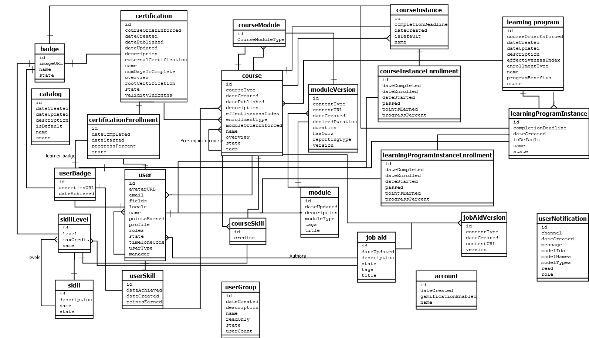
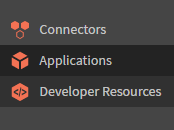

# Manuale per sviluppatori di applicazioni

L’API V1 di Learning Manager è ora obsoleta. Le API V1 smetteranno di funzionare dal 28 febbraio 2021. Si consiglia di utilizzare le API V2 per interagire con Learning Manager.

## Panoramica {#overview}

[Adobe Learning Manager](http://www.adobe.com/in/products/learningmanager.html) è una soluzione di gestione dell’apprendimento self-service ospitata nel cloud e incentrata sugli Allievi. I clienti possono accedere alle risorse di Learning Manager a livello di programmazione utilizzandone l’API per integrarle con altre applicazioni aziendali. Inoltre, l’API può essere utilizzata dai partner di Adobe per migliorare la proposta di valore di Learning Manager, estendendone le funzionalità o integrandola con altri servizi o applicazioni.

### Scenario di utilizzo {#usagescenario}

Grazie all’API di Learning Manager, gli sviluppatori possono creare applicazioni autonome che estendono le funzionalità di Learning Manager o che integrino Learning Manager con i flussi di lavoro di altre applicazioni aziendali. Puoi sviluppare un’applicazione Web, un client desktop o un’app per dispositivi mobili utilizzando qualsiasi tecnologia a tua scelta. In qualità di sviluppatore, puoi accedere ai dati delle applicazioni da Learning Manager. La distribuzione dell’applicazione sviluppata è esterna alla piattaforma Learning Manager e avrai il pieno controllo sul ciclo di vita dello sviluppo del software man mano che l’applicazione si evolve. In genere, le applicazioni vengono sviluppate da un’organizzazione cliente per l’utilizzo con il proprio account di Learning Manager e sono quindi private. Inoltre, i partner di Adobe possono creare delle applicazioni generiche con l’API di Learning Manager, utilizzabili da un’ampia gamma di clienti.

## API di Learning Manager {#apidescription}

L’API di Learning Manager si basa sui principi di REST ed espone gli elementi chiave del modello a oggetti di Learning Manager agli sviluppatori di applicazioni tramite HTTP. Prima di conoscere i dettagli degli endpoint API e dei metodi HTTP, gli sviluppatori possono acquisire dimestichezza con i vari oggetti di Learning Manager, i relativi attributi e le interrelazioni. Una volta compresi i modelli, sarà utile comprendere la struttura delle richieste e delle risposte API e alcuni termini di programmazione comuni utilizzati genericamente nell’API.

Per informazioni dettagliate sui vari metodi ed endpoint API, consulta  [Documentazione delle API di Learning Manager](https://learningmanager.adobe.com/docs/primeapi/v2/).

## Autenticazione API {#apiauthentication}

Quando programmi un’applicazione che effettua chiamate API a Learning Manager, devi registrare l’applicazione utilizzando l’app Amministratore dell’integrazione.

Le API di Learning Manager utilizzano il framework OAuth 2.0 per autenticare e autorizzare le applicazioni client.

**Procedura**

**1. Configurare l’applicazione**

Puoi configurare l’applicazione con ID client e segreto client per utilizzare gli endpoint corretti. Una volta registrata l’applicazione, puoi ottenere clientId e clientSecret. È necessario utilizzare GET URL nel browser in quanto autentica gli utenti di Learning Manager che usano i loro account preconfigurati, ad esempio SSO, Adobe ID e così via.

```
GET https://learningmanager.adobe.com/oauth/o/authorize?client_id=<Enter your clientId>&redirect_uri=<Enter a url to redirect to>&state=<Any String data>&scope=<one or more comma separated scopes>&response_type=CODE.
```

Una volta completata l’autenticazione, il browser reindirizza al redirect_uri indicato nell’URL precedente. Insieme all’URI di reindirizzamento viene aggiunto un **codice** di parametro.

**2. Richiedere un token di aggiornamento dal codice**

`POST https://learningmanager.adobe.com/oauth/token Content-Type: application/x-www-form-urlencoded`

Corpo della richiesta post:

```
client_id: 
<enter your clientid>
 & 
 client_secret: 
 <enter your clientsecret>
  & 
  code: 
  <code from step 1></code>
 </enter>
</enter>
```

**3.** **Ottenere un token di accesso dal token di aggiornamento**

URL per ottenere il token di accesso:

POST [https://learningmanager.adobe.com/oauth/token/refresh](https://learningmanager.adobe.com/oauth/token/refresh) Content-Type: application/x-www-form-urlencoded

Corpo della richiesta post:

```
client_id: 
<enter your clientid>
 & 
 client_secret: 
 <enter your clientsecret>
  & 
  refresh_token: 
  <refresh token>
   
  </refresh>
 </enter>
</enter>
```

**URL per verificare i dettagli del token di accesso**

`GET https://learningmanager.adobe.com/oauth/token/check?access_token=<access_token>`

**Limitazione di utilizzo**

Un token di accesso è valido per sette giorni. Dopo un giorno, devi generare un nuovo token di accesso utilizzando il token di aggiornamento. Se generi un nuovo token di accesso dal token di aggiornamento mentre un token di accesso esistente è ancora valido, verrà restituito il token esistente.

Alcuni dei termini utilizzati più di frequente nell’API di Learning Manager sono spiegati come riferimento qui di seguito.

**Include**

Gli sviluppatori possono accedere a un singolo modello a oggetti dell’API e a più modelli associati a tale modello. Per accedere ai modelli correlati successivi, devi comprendere la relazione di ciascun modello con gli altri. **Include** consente agli sviluppatori di accedere ai modelli dipendenti. È possibile utilizzare il separatore di virgole per accedere a più modelli. Per l&#39;utilizzo di esempio e ulteriori dettagli su **include**, fai riferimento alla sezione del modello API di esempio in questa pagina.

**Richiesta API**

Le richieste API possono essere effettuate tramite una richiesta HTTP. A seconda dell’endpoint e del metodo, lo sviluppatore può scegliere tra vari verbi HTTP come GET, PUT, POST, DELETE, PATCH e così via. Per alcune richieste è possibile passare i parametri di query. Quando si effettua una richiesta per un modello di dati specifico, l’utente può anche richiedere modelli correlati come descritto nelle specifiche delle API in JSON. La struttura di una tipica richiesta API è descritta nell’[utilizzo del modello di esempio](#main-pars_header_1415780624).

**Risposta API**

Quando una richiesta API viene effettuata da un client, si ottiene un documento SON in base alla specifica dell’API in JSON. La risposta contiene anche il codice di stato HTTP che lo sviluppatore può verificare per eseguire i passaggi successivi appropriati nella logica dell&#39;applicazione. La struttura di una tipica risposta API è descritta in  [esempio di utilizzo del modello](#main-pars_header_1415780624).

**Errori**

Quando una richiesta API ha esito negativo, si ottiene una risposta di errore. Il codice di stato HTTP contenuto nella risposta indica la natura dell’errore. I codici di errore sono rappresentati da dei numeri per ogni modello presente nel riferimento API. 200, 204, 400 e 404 sono alcuni degli errori più comuni rappresentati nelle API che indicano problemi di accesso HTTP.

**Fields**

Gli attributi dell’oggetto API e le relative relazioni sono chiamati collettivamente Fields. Per ulteriori informazioni, consulta le [API in JSON.](http://jsonapi.org/format/#document-resource-object-fields) Puoi utilizzare Fields come parametro durante le chiamate API per recuperare uno o più attributi specifici dal modello. In assenza del parametro Fields, la chiamata API recupera tutti gli attributi disponibili dal modello. Ad esempio, nella seguente chiamata API, i campi[abilità]=name recupera solo l’attributo name del modello di abilità.

https://learningmanager.adobe.com/primeapi/v2/users/{userId}/userSkills/{id}?include=skillLevel.skill&amp;fields[skill]=name

**Paginazione**

A volte, una richiesta API genera un lungo elenco di oggetti da presentare nella risposta. In questi casi, l’attributo di paginazione consente allo sviluppatore di recuperare i risultati in modo sequenziale in termini di più pagine, in cui ogni pagina contiene un intervallo di record. Ad esempio, l’attributo di paginazione in Learning Manager ti consente di impostare il numero massimo di record da visualizzare in una pagina. Inoltre, puoi definire il valore dell’intervallo dei record da visualizzare sulla pagina.

**Ordinamento**

L’ordinamento è consentito nei modelli API. In base al modello, scegliere il tipo di ordinamento da applicare ai risultati. L&#39;ordinamento può essere applicato in ordine crescente o decrescente. Ad esempio, se specificate `code sort=name`, quindi l&#39;ordinamento è crescente in base al nome. Se si specifica `code sort=-name`, è un ordinamento decrescente in base al nome. Fare riferimento a [Specifiche API JSON per ulteriori informazioni](http://jsonapi.org/format/#fetching-sorting).

## Descrizione dell’uso delle API {#samplemodel}

Consideriamo uno scenario in cui uno sviluppatore desidera ottenere il nome dell’abilità, il numero massimo di punti assegnati per il livello di abilità e i punti guadagnati dall’Allievo per tale abilità.

Un modello userSkill nelle API di Learning Manager è costituito da id, type, dateAchieved, dateCreated e pointsEarned come attributi predefiniti. Pertanto, quando uno sviluppatore utilizza un metodo GET per acquisire i dettagli del modello userSkill, i dati correnti relativi agli attributi predefiniti vengono visualizzati nell’output di risposta.

Tuttavia, in questo scenario lo sviluppatore vuole ottenere il nome dell’abilità e i punti del livello di abilità per l’utente. L’API di Learning Manager ti consente di accedere a queste informazioni correlate utilizzando i campi delle relazioni e di includere i parametri. I modelli associati a userSkill vengono ottenuti nel tag delle relazioni. Puoi ottenere i dettagli di ciascun modello associato chiamando questi modelli insieme a userSkill. Per ottenere queste informazioni, utilizzare **`code include`** parametro con valori separati da punto (punto) per ciascuno dei modelli associati. Puoi usare la virgola come separatore per richiedere un altro modello come user include=skillLevel.skill,course

**Chiamata API**

`https://learningmanagerqe1.adobe.com/primeapi/v1/users/%7buserId%7d/userSkills/%7bid%7d?include=skillLevel.skill&fields%5bskill%5d=name&fields%5bskillLevel%5d=maxCredits&fields%5buserSkill%5d=pointsEarned`

Ad esempio, userId può essere 746783 e ID userSkills 746783_4426_1.

**Risposta alla chiamata API**

```
\{ 
 "links": {"self": "https://learningmanager.adobe.com/primeapi/v2/users/746783/userSkills/746783_4426_1?include=skillLevel.skill&fields[userSkill]=pointsEarned&fields[skillLevel]=maxCredits&fields[skill]=name"}, 
 "data": { 
 "id": "746783_4426_1", 
 "type": "userSkill", 
 "attributes": {"pointsEarned": 5}, 
 "links": {"self": "https://learningmanager.adobe.com/primeapi/v2/users/746783/userSkills/746783_4426_1"} 
 }, 
 "included": [ 
 { 
 "id": "4426", 
 "type": "skill", 
 "attributes": {"name": "Java"}, 
 "links": {"self": "https://learningmanager.adobe.com/primeapi/v2/skills/4426"} 
 }, 
 { 
 "id": "4426_1", 
 "type": "skillLevel", 
 "attributes": {"maxCredits": 10} 
 } 
 ] 
} 
```

## Modelli di Learning Manager {#models}

L’API di Learning Manager consente agli sviluppatori di accedere agli oggetti di Learning Manager come risorse RESTful. Ogni endpoint API rappresenta una risorsa, in genere un’istanza di oggetto come un Badge o una raccolta di tali oggetti. Gli sviluppatori quindi utilizzano i verbi HTTP quali PUT, GET, POST e DELETE per eseguire le operazioni CRUD su tali oggetti (raccolte).

API +++V1

Nel diagramma seguente sono riportati i vari elementi del modello a oggetti di Learning Manager nell’API V1.



La tabella seguente descrive vari elementi del modello a oggetti V1 di Learning Manager:

<table border="1" cellspacing="0" cellpadding="0">
 <tbody>
  <tr>
   <td>
    <p><strong>N. di serie</strong></p></td>
   <td>
    <p><strong>Oggetto di Learning Manager</strong></p></td>
   <td>
    <p><strong>Descrizione</strong></p></td>
  </tr>
  <tr>
   <td>
    <p>1.      </p></td>
   <td>
    <p>all’interfaccia </p></td>
   <td>
    <p>Utente è il modello chiave di Learning Manager. Gli Utenti sono in genere gli Allievi interni o esterni di un’organizzazione che utilizzano gli oggetti di apprendimento. Tuttavia, possono svolgere altri ruoli, quali Autore e Manager, insieme al ruolo di Allievo. L’ID utente, il tipo e l’e-mail sono alcuni degli attributi incorporati. </p></td>
  </tr>
  <tr>
   <td>
    <p>2.      </p></td>
   <td>
    <p>corso</p></td>
   <td>
    <p>Il corso è uno degli oggetti di apprendimento supportati in Learning Manager, costituito da uno o più moduli. </p></td>
  </tr>
  <tr>
   <td>
    <p>3.      </p></td>
   <td>
    <p>modulo</p></td>
   <td>
    <p>Il modulo è un elemento fondamentale per la creazione di oggetti di apprendimento in Learning Manager. I moduli possono essere di quattro tipi diversi, ad esempio la classe, la classe virtuale, l’attività e il ritmo personalizzato. Utilizza questo modello di modulo per ottenere i dettagli di tutti i moduli di un account. </p></td>
  </tr>
  <tr>
   <td>
    <p>4.      </p></td>
   <td>
    <p>certificazione</p></td>
   <td>
    <p>La certificazione viene assegnata agli studenti in base al completamento dei corsi. Prima di utilizzare le certificazioni, i corsi nell’applicazione sono obbligatori. </p></td>
  </tr>
  <tr>
   <td>
    <p>5.      </p></td>
   <td>
    <p>programmi di apprendimento</p></td>
   <td>
    <p>I programmi di apprendimento sono corsi progettati specificatamente per soddisfare determinate esigenze di apprendimento degli utenti. In genere, i programmi di apprendimento vengono utilizzati per indirizzare verso obiettivi di apprendimento che coinvolgono tutti i singoli corsi. </p></td>
  </tr>
  <tr>
   <td>
    <p>6.      </p></td>
   <td>
    <p>badge</p></td>
   <td>
    <p>Un badge è un token che ottengono gli Allievi quando raggiungono dei traguardi specifici durante un corso. </p></td>
  </tr>
  <tr>
   <td>
    <p>7.      </p></td>
   <td>
    <p>abilità</p></td>
   <td>
    <p>Il modello di abilità è costituito da livelli e crediti. Le abilità possono essere acquisite dagli Allievi dopo il completamento del corso. </p></td>
  </tr>
  <tr>
   <td>
    <p>8.      </p></td>
   <td>
    <p>IscrizioneCertificazione</p></td>
   <td>
    <p>Questo modello fornisce i dettagli dell’iscrizione di un utente a una singola certificazione.</p></td>
  </tr>
  <tr>
   <td>
    <p>9.  </p></td>
   <td>
    <p>IscrizioneCorso</p></td>
   <td>
    <p>Questo modello fornisce i dettagli dell’iscrizione di un utente a un singolo corso. </p></td>
  </tr>
  <tr>
   <td>
    <p>10.  </p></td>
   <td>
    <p>IstanzaCorso</p></td>
   <td>
    <p>A un corso possono essere associate una o più istanze. Puoi ottenere l’istanza del corso </p></td>
  </tr>
  <tr>
   <td>
    <p>11.  </p></td>
   <td>
    <p>AbilitàCorso</p></td>
   <td>
    <p>Un modello AbilitàCorso specifica il progresso di una singola abilità ottenuta completando un corso.</p></td>
  </tr>
  <tr>
   <td>
    <p>12.  </p></td>
   <td>
    <p>ModuloCorso</p></td>
   <td>Un modello ModuloCorso specifica come viene incluso un modulo in un corso. Ad esempio, se il modulo viene utilizzato per la verifica preliminare o per il contenuto.</td>
  </tr>
  <tr>
   <td>
    <p>13.  </p></td>
   <td>IstanzaProgrammaApprendimento</td>
   <td>
    <p>Un programma di apprendimento può essere costituito da più istanze caratterizzate da proprietà simili a quelle di un programma di apprendimento o di istanze personalizzate. </p></td>
  </tr>
  <tr>
   <td>
    <p>14.  </p></td>
   <td>
    <p>risorsa formativa</p></td>
   <td>
    <p>Le risorse formative sono contenuti didattici accessibili agli Allievi senza alcun requisito di completamento o di iscrizione. Puoi recuperare la data aggiornata, lo stato e le informazioni ID insieme ai modelli correlati, ad esempio la versione della risorsa formativa, gli autori e il livello di abilità. </p></td>
  </tr>
  <tr>
   <td>
    <p>15.  </p></td>
   <td>
    <p>VersioneRisorsaFormativa</p></td>
   <td>
    <p>Una risorsa formativa può avere una o più versioni in base al numero di download e di revisioni del contenuto. Questo modello fornisce i dettagli di una singola versione della risorsa formativa. </p></td>
  </tr>
  <tr>
   <td>
    <p>16.  </p></td>
   <td>
    <p>IscrizioneIstanzaProgrammaApprendimento</p></td>
   <td>
    <p>Il programma di apprendimento è costituito da una o più istanze. Gli Allievi possono iscriversi a un’istanza del programma di apprendimento da soli o tramite l’assegnazione dell’Amministratore. Questo modello fornisce i dettagli dell’iscrizione di un utente a una singola istanza del programma di apprendimento. </p></td>
  </tr>
  <tr>
   <td>
    <p>17.  </p></td>
   <td>
    <p>VersioneModulo</p></td>
   <td>
    <p>Un modulo può avere una o più versioni in base ai caricamenti dei contenuti rivisti. Utilizza questo modello per ottenere informazioni specifiche su qualsiasi versione di un singolo modulo. </p></td>
  </tr>
  <tr>
   <td>
    <p>18.  </p></td>
   <td>
    <p>LivelloAbilità</p></td>
   <td>
    <p>Un livello di abilità comprende uno o più corsi da svolgere per acquisire un livello con i relativi crediti associati. </p></td>
  </tr>
  <tr>
   <td>
    <p>19.  </p></td>
   <td>
    <p>BagdeUtente</p></td>
   <td>
    <p>UserBadge mette in relazione un singolo badge con un singolo utente. Contiene dettagli tra cui la data in cui è stato raggiunto, l’UrldiAsserzione e così via. </p></td>
  </tr>
  <tr>
   <td>
    <p>20.  </p></td>
   <td>
    <p>AbilitàUtente</p></td>
   <td>
    <p>L’AbilitàUtente indica quanto di un singolo livello di abilità viene raggiunto da un singolo utente.</p></td>
  </tr>
 </tbody>
</table>

+++

API +++V2

Di seguito sono riportati i vari elementi del diagramma della classe di Learning Manager nell’API V2.


<table>
 <tbody>
  <tr>
   <th><b>Oggetto di Learning Manager</b></th>
   <th><b>Descrizione</b></th>
  </tr>
  <tr>
   <td>account</td>
   <td>Incapsula i dettagli di un cliente Learning Manager.</td>
  </tr>
  <tr>
   <td><code>
     badge
    </code></td>
   <td>Un badge è un token che ottengono gli Allievi quando raggiungono dei traguardi specifici durante un corso. <br></td>
  </tr>
  <tr>
   <td><code>
     catalog
    </code></td>
   <td>Catalogo è una raccolta di oggetti di apprendimento.</td>
  </tr>
  <tr>
   <td><code>
     user
    </code></td>
   <td>Utente è il modello chiave di Learning Manager. Gli Utenti sono in genere gli Allievi interni o esterni di un’organizzazione che utilizzano gli oggetti di apprendimento. Tuttavia, possono svolgere altri ruoli, quali Autore e Manager, insieme al ruolo di Allievo. L’ID utente, il tipo e l’e-mail sono alcuni degli attributi incorporati. </td>
  </tr>
  <tr>
   <td>risorsa</td>
   <td>Viene utilizzato per modellare ogni risorsa di contenuto che un modulo cerca di contenere. Tutte le risorse incapsulate in <code>
     an
    </code> <code>
     loResource
    </code> sono equivalenti in termini di obiettivo di apprendimento, ma differiscono l’uno dall’altro in termini di tipo di erogazione o impostazioni locali dei contenuti.<br></td>
  </tr>
  <tr>
   <td>NotificheUtente</td>
   <td>Questo modello contiene informazioni di notifica relative a un Allievo.<br></td>
  </tr>
  <tr>
   <td>AbilitàUtente</td>
   <td>L’AbilitàUtente indica quanto di un singolo livello di abilità viene raggiunto da un singolo utente.<br></td>
  </tr>
  <tr>
   <td>BagdeUtente</td>
   <td>BadgeUtente fa riferimento a un singolo badge <code>
     with
    </code> un singolo utente. Contiene dettagli come quando è stato raggiunto, <code>
     assertionUrl
    </code> e così via. <br></td>
  </tr>
  <tr>
   <td>abilità</td>
   <td>Il modello di abilità è costituito da livelli e crediti. Le abilità possono essere acquisite dagli Allievi dopo il completamento del corso. <br></td>
  </tr>
  <tr>
   <td>LivelloAbilità</td>
   <td>Un livello di abilità comprende uno o più corsi da svolgere per acquisire un livello con i relativi crediti associati. <br></td>
  </tr>
  <tr>
   <td>OggettoApprendimento</td>
   <td>Un oggetto di apprendimento è un’astrazione per vari tipi di oggetti a cui gli utenti possono iscriversi e da cui possono imparare. Attualmente Learning Manager dispone di quattro tipi di oggetti di apprendimento: Corso, Certificazione, Programma di apprendimento <code>
     and
    </code> Risorsa formativa.<br></td>
  </tr>
  <tr>
   <td>IstanzaOggettoApprendimento<br></td>
   <td>Un’istanza specifica di un oggetto di apprendimento.<br></td>
  </tr>
  <tr>
   <td>RisorsaOggettoApprendimento</td>
   <td>Ciò equivale al concetto di <code>
     module
    </code>. Un corso è composto da uno <code>
     of
    </code> altri moduli. In Learning Manager, un modulo può essere distribuito in una serie di modi equivalenti tra loro. Pertanto, la <code>
     loResource
    </code> racchiude essenzialmente tutte le risorse equivalenti.<br></td>
  </tr>
  <tr>
   <td>loResourceGrade<br></td>
   <td>Contiene il risultato dell’utilizzo di una risorsa specifica da parte dell’utente nel contesto di un oggetto di apprendimento a cui è iscritto. Contiene informazioni quali la durata spesa da <code>
     user
    </code> nella risorsa, percentuale di avanzamento dell'utente, stato di superamento/fallimento e punteggio ottenuto dall'utente in qualsiasi quiz associato.<br></td>
  </tr>
  <tr>
   <td>calendario<br></td>
   <td>Un oggetto calendario è un elenco di <code>
     upcoming classroom
    </code> o corsi in aula virtuale a cui l’utente può iscriversi.<br></td>
  </tr>
  <tr>
   <td>InformazioniFeedbackL1<br></td>
   <td>Il feedback L1 contiene le risposte fornite dall’Allievo alle domande di feedback associate agli oggetti di apprendimento. In genere viene raccolto dopo che l’utente ha completato un oggetto di apprendimento se è configurato per raccogliere tali feedback dagli Allievi.<br></td>
  </tr>
  <tr>
   <td>iscrizione<br></td>
   <td>Questa astrazione include i dettagli relativi alla transazione che rappresenta l’assegnazione di un utente specifico a un’istanza specifica dell’oggetto di apprendimento.<br></td>
  </tr>
 </tbody>
</table>

+++

Elenco degli attributi e delle relazioni degli oggetti.

+++account

**Attributi**
dateCreated\
gamificationEnabled\
ID\
locale\
loginUrl\
logoUrl\
name\
sottodominio\
themeData\
timeZoneCode

**Relazioni**
contentLocales(localizationMetadata)\
gamificationLevels(gamificationLevel)\
fusi orari(fuso orario)\
uiLocales(localizationMetadata)

+++

+++badge

**Attributi**
id\
imageUrl\
name\
stato 

+++

+++catalogo

**Attributi**
dateCreated\
dateUpdated\
descrizione\
ID\
isDefault\
isInternallySearchable\
isListable\
name\
stato 

+++

+++data

**Attributi**
id\
nomi

+++

+++gamification

**Attributi**
colore\
name\
punti

+++

+++learningObject

**Attributi**
authorNames\
dateCreated\
datePublished\
dateUpdated\
effectiveIndex\
enrollmentType\
ID\
imageUrl\
isExternal\
isSubLoOrderEnforced\
loType\
stato \
tag

**Relazioni**
authors(user)\
enrollment(learningObjectInstanceEnrollment)\
instance(learningObjectInstance)\
prerequisiteLOs(learningObject)\
skill(learningObjectSkill)\
subLO(learningObject)\
additionalLO(learningObject)\
risorsesupplementari(risorsa)

+++

+++learningObjectInstance

**Attributi**
completedDeadline\
dateCreated\
enrollmentCount\
ID\
isDefault\
seatLimit\
stato \
validità

**Relazioni**
badge (badge)\
l1FeedbackInfo(feedbackInfo)\
learningObject(learningObject)\
loResources(learningObjectResource)\
localizedMetadata(localizationMetadata)\
subLoInstances(learningObjectInstance)

+++

+++learningObjectInstanceEnrollment

**Attributi**
dateCompleted\
dateEnrolled\
dateStarted\
hasPassed\
ID\
progressPercent\
punteggio\
stato 

**Relazioni**
allievo(utente)\
learnerBadge(userBadge)\
learningObject(learningObject)\
loInstance(learningObjectInstance)\
loResourceGrades(learningObjectResourceGrade)

+++

+++learningObjectResource

**Attributi**
externalReporting\
ID\
loResourceType\
resourceType\
versione

**Relazioni**
learningObject(learningObject)\
loInstance(learningObjectInstance)\
localizedMetadata(localizationMetadata)\
risorse(risorsa)

+++

+++learningObjectResourceGrade

**Attributi**
dateCompleted\
dateStarted\
dateSuccess\
durata\
hasPassed\
ID\
progressPercent\
punteggio

**Relazioni**
loResource(learningObjectResource)

+++

+++learningObjectSkill

**Attributi**
crediti\
ID\
**Relazioni**
learningObject(learningObject)\
skillLevel(skillLevel)

+++

+++consiglio

**Attributi**
id\
motivo

**Relazioni**
learningObject(learningObject)

+++

+++risorsa

**Attributi**
authorDesiredDuration\
completedDeadline\
contentStructureInfoUrl\
contentType\
contentZipSize\
contentZipUrl\
dateCreated\
dateStart\
wishDuration\
downloadUrl\
extraData\
hasQuiz\
hasToc\
ID\
instructorNames\
isDefault\
locale\
posizione\
name\
onlyQuiz\
reportingInfo\
reportingType\
seatLimit

+++

+++skill

**Attributi**
descrizione\
ID\
name\
stato 

**Relazioni**
livelli(skillLevel)

+++

+++skillLevel

**Attributi**
id\
livello\
maxCredits\
name\
**Relazioni**
badge (badge)\
skill(skill)

+++

+++user

**Attributi**
avatarUrl\
biografia\
contentLocale\
e-mail\
campi\
ID\
name\
pointsEarned\
profilo\
ROLE\
stato \
timeZoneCode\
uiLocale

**Relazioni**
account(account)\
manager(utente)

+++

+++userBadge

**Attributi**
assertionUrl\
dateAchieved\
ID\
modelType

**Relazioni**
badge (badge)\
allievo(utente)\
model(learningObject)

+++

+++userCalendar

**Attributi**
corso\
courseType\
dateStart\
iscritto\
ID\
mese\
trimestre

**Relazioni**
containerLO(learningObject)\
course(learningObject)

+++

+++userNotification

**Attributi**
actionTaken\
canale\
dateCreated\
ID\
messaggio\
modelIds\
modelNames\
modelTypes\
leggi\
ROLE

+++

+++userSkill

**Attributi**
dateAchieved\
dateCreated\
ID\
pointsEarned

**Relazioni**
learnerBadge(userBadge)\
learningObject(learningObject)\
skillLevel(skillLevel)\
user(user)

+++

## Processo di sviluppo delle applicazioni {#registration}

## Prerequisiti {#prerequisites}

Come sviluppatore, devi creare un account di prova su Learning Manager per avere un accesso completo a tutti i ruoli all’interno di tale account. Per poter scrivere un’applicazione, uno sviluppatore deve creare alcuni utenti e corsi e portare l’account a uno stato ragionevole in modo che l’applicazione in fase di sviluppo possa avere accesso ad alcuni dati di esempio.

## Creare ID client e segreto client {#createclientidandsecret}

1. Ingresso **Amministratore dell’integrazione** , fare clic su **[!UICONTROL Applicazioni]** nel riquadro sinistro.

   

   *Seleziona applicazioni sull’Amministratore dell’integrazione*

1. Fai clic **[!UICONTROL Registrati]** nell’angolo in alto a destra della pagina per registrare i dettagli dell’applicazione. Viene visualizzata la pagina di registrazione.

   

   *Registra l’applicazione*

   È obbligatorio compilare tutti i campi di questa pagina.

   **Nome dell’applicazione**: inserisci il nome dell’applicazione. Non è obbligatorio utilizzare lo stesso nome di applicazione, ma può essere qualsiasi nome valido.

   **URL**: se conosci l’URL esatto in cui è ospitata l’applicazione, puoi menzionarlo. In caso contrario, puoi indicare l’URL della tua azienda. In questo campo il nome URL valido è obbligatorio.

   **Domini di reindirizzamento**: inserisci il nome di dominio dell’applicazione a cui desideri reindirizzare l’applicazione di Learning Manager dopo l’autenticazione OAuth. Puoi citare più URL qui, ma devi utilizzare URL validi, come `http://google.com`, `http://yahoo.com` e così via.

   **Descrizione:** Immetti una breve descrizione dell’applicazione.

   **Ambiti:** Scegliere una delle quattro opzioni disponibili per definire l&#39;ambito dell&#39;applicazione. In base alla tua scelta, gli endpoint API di Learning Manager saranno accessibili per l’applicazione. Ad esempio, se hai scelto **Accesso in lettura al ruolo Allievo**, tutti gli endpoint API da Allievo di Learning Manager sono accessibili all’applicazione in sola lettura.

   **Solo per questo account?**\
   **Sì** - se scegli Sì, l’applicazione non sarà visibile ad altri amministratori account.\
   **No** - se scegli No, anche altri amministratori account potranno accedere a questa applicazione, ma dovranno usare l’id dell’applicazione. L’ID applicazione viene generato e visualizzato nella modalità di modifica dell’applicazione di Learning Manager.

   Se si sceglie **Accesso in lettura e scrittura del ruolo di amministratore** come ambito durante la registrazione dell’applicazione e scegliere **Accesso in lettura ruolo amministratore** durante la creazione delle API, puoi comunque disporre dell’accesso in scrittura per l’applicazione, poiché l’ambito di registrazione dell’app sostituisce il flusso di lavoro di autorizzazione.

1. Dopo aver compilato i dettagli nella pagina di registrazione, fai clic su **[!UICONTROL Registra]** in alto a destra.

## Sviluppo e test delle applicazioni {#applicationdevelopmentandtesting}

L’API di Learning Manager può essere utilizzata dagli sviluppatori per creare qualsiasi applicazione. Gli sviluppatori devono assicurarsi che i propri account siano composti da alcuni utenti e corsi validi. Possono creare alcuni utenti e corsi fittizi e simulare l’attività nell’account di prova per testare la funzionalità dell’applicazione.

## Distribuzione delle applicazioni {#applicationdeployment}

È consigliabile che l’Amministratore di Learning Manager, o un Amministratore dell’integrazione per l’account di produzione, renda l’applicazione disponibile agli utenti all’interno della propria organizzazione. Una volta testata l’applicazione, informa l’amministratore dell’account di produzione. Idealmente, gli amministratori desiderano generare un nuovo ID client e un segreto client per l’applicazione nell’account di produzione ed eseguire i passaggi necessari per integrarli nell’applicazione in modo sicuro. La procedura effettiva di distribuzione delle applicazioni varia da azienda ad azienda e l’Amministratore Learning Manager della tua organizzazione deve ricevere il supporto del reparto IT/IS per poterla completare.

## Approvazione delle applicazioni esterne {#externalapplicationapproval}

Puoi aggiungere applicazioni esterne facendo clic su **Approva** nell&#39;angolo in alto a destra della **Applicazioni** pagina. Fornisci l’ID dell’applicazione esterna e fai clic su **Salva.**


*Aggiunta e approvazione di un&#39;applicazione esterna*

## Domande frequenti

+++Learning Manager dispone di un e-commerce integrato?

Adobe Learning Manager non dispone di un e-commerce integrato. Tuttavia, sono disponibili API che consentono di creare un sistema LMS headless personalizzato e di implementare le funzionalità di e-commerce.
+++
