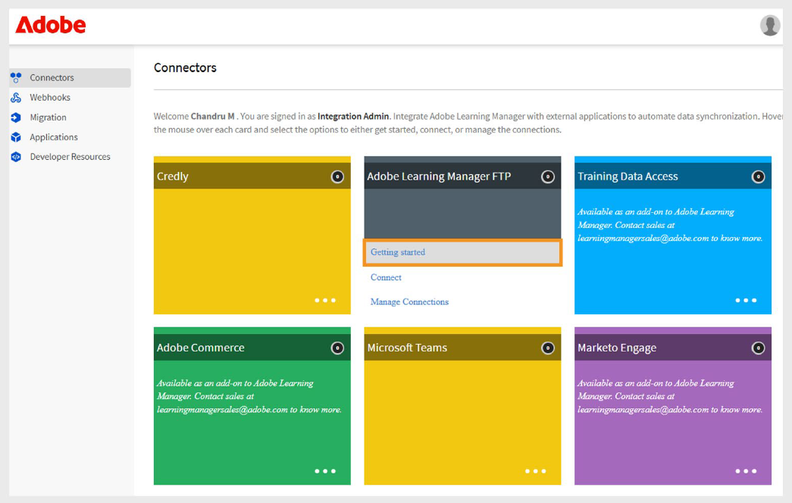
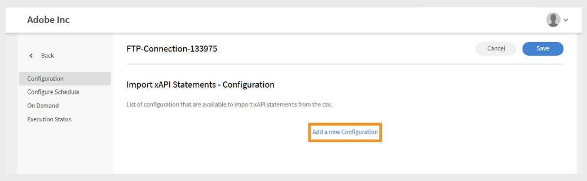

# Connettore FTP in Adobe Learning Manager

## Introduzione

FTP (File Transfer Protocol) è un protocollo di rete standard utilizzato per trasferire file tra un client e un server su Internet o una rete locale. Consente agli utenti di caricare, scaricare e gestire i file su un server remoto. Per i trasferimenti di file protetti, sono comunemente utilizzate varianti come SFTP (SSH File Transfer Protocol) e FTPS (FTP Secure). FTP è ampiamente adottato negli ambienti aziendali per automatizzare lo scambio di dati tra sistemi, come la sincronizzazione dei dati utente o di formazione tra Adobe Learning Manager e piattaforme esterne.

Questo documento fornisce istruzioni dettagliate per gli amministratori di integrazione sulla configurazione e sull’utilizzo del connettore FTP in Adobe Learning Manager. Il connettore FTP consente lo scambio automatizzato di dati tra Learning Manager e sistemi esterni utilizzando protocolli di trasferimento file protetti.

Scoprirai come configurare le connessioni FTP, mappare i campi dati, pianificare le importazioni o le esportazioni automatizzate degli utenti e monitorare l’attività di sincronizzazione. Questa guida supporta un&#39;integrazione fluida e sicura con piattaforme di apprendimento esterne o sistemi HR. Puoi importare utenti interni e istruzioni xAPI ed esportare le abilità degli utenti, le trascrizioni degli Allievi e i dati xAPI.

Gli amministratori di integrazione devono generare file CSV per la migrazione di utenti, dati utente o contenuti di apprendimento e caricarli nelle cartelle designate nell’account FTP di Adobe Learning Manager. Adobe Learning Manager quindi legge, unisce e importa i dati in base a una pianificazione definita.

Eseguire queste operazioni su richiesta o impostando un programma che soddisfi le esigenze dell&#39;organizzazione.

## Vantaggi dell&#39;integrazione FTP

- Riduzione degli sforzi manuali e degli errori umani nella gestione dei dati.
- Integra dati da più origini esterne contemporaneamente.
- Supporta sia le operazioni su richiesta che le operazioni programmate sui dati.
- Consente la mappatura dettagliata dei campi tra diversi formati di sistema.

## Prerequisiti

Prima di configurare il connettore FTP, assicurati che l’ambiente in uso soddisfi i seguenti requisiti:

- Ruolo Amministratore dell’integrazione con autorizzazioni del connettore FTP.
- Connessione Internet stabile con larghezza di banda adeguata per i trasferimenti di file.
- Configurazione del firewall che consente il traffico FTP sulle porte necessarie.
- Accesso alla porta richiesto, a seconda dei requisiti di sicurezza

### Autorizzazione e accesso

Assicurati di disporre di:

- Accesso per generare e gestire le chiavi SSH (se si utilizza l&#39;autenticazione SSH).
- Autorizzazione a creare e aggiornare file CSV nelle cartelle FTP specificate.

## Funzionalità principali

### Importazione ed esportazione di dati con il connettore FTP

Il connettore FTP in Adobe Learning Manager semplifica lo scambio di dati tra sistemi esterni e l&#39;account Adobe Learning Manager. Supporta operazioni di importazione o esportazione pianificate e su richiesta, riducendo le operazioni manuali e garantendo informazioni accurate e aggiornate.

Questo metodo supporta l&#39;integrazione con più sistemi esterni. Se sistemi diversi generano file CSV separati, Adobe Learning Manager unisce i dati e li importa come un unico batch.

### Importare dati in Adobe Learning Manager

_Importazione dati utente_

Carica i file CSV strutturati nelle cartelle FTP designate per importare i dati utente interni. Adobe Learning Manager legge ed elabora questi file in base alla pianificazione configurata per mantenere aggiornate le informazioni utente.

_Integrazione con più origini_

Se utilizzi più sistemi esterni, ogni sistema può generare il proprio file CSV. Adobe Learning Manager unisce i file ed elabora i dati come un unico batch, semplificando la gestione dei record utente da origini diverse.

_Importazione xAPI_

Il connettore supporta anche istruzioni xAPI (Experience API). Importa questi elementi da sistemi di apprendimento di terze parti per monitorare e creare report sulle attività di apprendimento su più piattaforme.

### Esportare dati da Adobe Learning Manager

_Esportazione dati Allievo_

Esporta in una posizione FTP designata i dati utente quali l’avanzamento delle abilità, i completamenti dei corsi e le metriche delle prestazioni. Utilizzare questi dati per relazioni o analisi esterne.

_Trascrizioni allievi_

Genera ed esporta trascrizioni dettagliate con completamenti del corso, certificazioni e percorsi di apprendimento per supportare la verifica della conformità e delle credenziali.

### Mappatura degli attributi

Mappatura delle colonne del file CSV agli attributi utente di Adobe Learning Manager. È possibile riutilizzare e aggiornare la configurazione della mappatura in base alle esigenze, semplificando l&#39;adattamento alle modifiche dei requisiti dei dati.

### Pianificazione e automazione

Pianificare l&#39;esecuzione di operazioni di importazione ed esportazione a intervalli regolari, ad esempio giornaliere, settimanali o personalizzati. In questo modo è possibile garantire aggiornamenti dei dati coerenti senza interventi manuali.

## Configurare il connettore FTP

Configurare il connettore FTP per stabilire una sincronizzazione sicura dei dati tra Adobe Learning Manager e i sistemi esterni.

Per configurare il connettore FTP:

1. Accedi come Amministratore dell’integrazione.
2. Seleziona **FTP Adobe Learning Manager**, quindi seleziona **Guida introduttiva**.

   
   _Interfaccia del connettore FTP Adobe Learning Manager con il pulsante Guida introduttiva_

3. Seleziona **Avanti** per procedere con l’installazione guidata del connettore FTP.

   
   _Nella pagina di configurazione viene visualizzato il pulsante Avanti per procedere con la configurazione del connettore FTP_

### Configurare l’autenticazione

Adobe Learning Manager supporta tre metodi di autenticazione, ciascuno con diversi livelli di sicurezza e requisiti di complessità.

#### Autenticazione base

Questo metodo utilizza le credenziali tradizionali del nome utente e della password per l&#39;accesso FTP. Sebbene sia più semplice da implementare, fornisce una protezione inferiore rispetto alle alternative basate su SSH.

1. Selezionare **Crea autenticazione di base utilizzando una password**.
2. Digitare il nome utente e la password FTP nei campi forniti. Verificare che le credenziali siano state immesse correttamente prima di procedere.

   
   _Modulo di autenticazione FTP con campi per nome utente e password, che mostra l&#39;opzione di autenticazione di base selezionata_

#### Autenticazione con chiave SSH esistente

Utilizza questo metodo se hai già stabilito coppie di chiavi SSH per l&#39;autenticazione sicura.

1. Selezionare **Crea autenticazione utilizzando chiavi SSH esistenti**.
2. Copia e incolla il contenuto della chiave pubblica nel campo di testo fornito. Assicurati che il formato della chiave pubblica sia corretto (in genere inizia con ssh-rsa o ssh-ed25519).

   
   _Interfaccia di autenticazione con chiave SSH con campo di testo per l&#39;input con chiave pubblica_

#### Genera una nuova chiave SSH

Utilizzare questa opzione per creare una nuova coppia di chiavi SSH specifica per questa connessione FTP.

1. Selezionare **Crea autenticazione generando una nuova chiave SSH**.
2. Selezionare **Genera chiave SSH** per creare una nuova coppia di chiavi. Scarica e archivia in modo sicuro la chiave privata generata. La chiave pubblica verrà configurata automaticamente per la connessione FTP.

   
   _Schermata di generazione della chiave SSH con il pulsante Genera chiave SSH e altre opzioni di configurazione_

## Connetti a FTP con FileZilla

FileZilla è uno strumento opzionale per la gestione della connessione FTP. Può essere utilizzato quando è necessario caricare manualmente file, verificare le strutture delle directory o risolvere problemi di connessione al di fuori dei processi automatizzati di Adobe Learning Manager.

### Installazione e configurazione di FileZilla

FileZilla è un client FTP open source gratuito che fornisce un&#39;interfaccia di facile utilizzo per le operazioni di trasferimento dei file.

Per collegare l’FTP a FileZilla:

1. Scarica e installa FileZilla dal [sito Web ufficiale](https://filezilla-project.org/).
2. Apri **FileZilla**.
3. Selezionare **File** e quindi **Gestione siti**.
4. Seleziona **Nuovo sito**.
5. Digita i seguenti dettagli:
   - **Dominio FTP:** Indirizzo del server FTP a cui si desidera connettersi, ad esempio ftp.example.com. Il dominio host è disponibile nella pagina Connettore FTP in Adobe Learning Manager.
   - **Porta:** La porta FTP predefinita è 21. Tuttavia, Adobe Learning Manager utilizza la porta 22 per le connessioni sicure.
   - **Nome utente FTP:** Nome di accesso necessario per accedere al server FTP.
   - **Password FTP:** la password collegata al nome utente FTP.
6. Seleziona **Connetti**.
7. Una volta effettuata la connessione, puoi trasferire i file trascinandoli tra i pannelli locale (a sinistra) e remoto (a destra).

## Utilizzare il connettore FTP in Adobe Learning Manager

### Importazione di utenti interni mediante il connettore FTP

La funzionalità di importazione degli utenti consente la sincronizzazione automatica dei dati dei dipendenti dai sistemi HR e da altre fonti esterne in Adobe Learning Manager.

### Mapping attributi

La mappatura degli attributi crea la connessione tra i dati esterni e la struttura di dati supportata di Adobe Learning Manager, garantendo che i dati vengano inseriti nei campi corretti. Questo passaggio è obbligatorio.

Per mappare gli attributi:

1. Seleziona **Utenti interni** nella pagina **Connettore FTP**.
2. Selezionare **Mappatura colonne**.
3. Nella pagina **Mappa attributi**:
   - Il **lato sinistro** mostra i campi obbligatori in Adobe Learning Manager.
   - Sul **lato destro** sono visualizzati i nomi delle colonne CSV. Inizialmente, questo lato contiene menu a discesa vuoti.
   - Seleziona **Scegli CSV** per caricare un file CSV di esempio. In questo modo viene compilato il menu a discesa di destra con i nomi delle colonne del file CSV. Consulta [questo articolo](https://experienceleague.adobe.com/it/docs/learning-manager/using/integration/migration-manual#csv).
   - Associa ciascun campo Adobe Learning Manager alla colonna CSV corrispondente.

   
   _Interfaccia di mappatura degli attributi che mostra i campi Adobe Learning Manager a sinistra e gli elenchi a discesa delle colonne CSV a destra_

4. Seleziona **Salva** per completare il mapping.

Dopo il salvataggio, l&#39;account configurato viene visualizzato come **origine dati** nell&#39;app Amministratore. Gli amministratori possono quindi pianificare un’importazione o attivare una sincronizzazione manuale.

### Importare istruzioni xAPI

L’importazione di istruzioni xAPI consente il tracciamento dettagliato delle attività di apprendimento tramite l’inserimento di dati di apprendimento esterni in Adobe Learning Manager.

_Configura origine_

La configurazione sorgente xAPI stabilisce la connessione tra i sistemi di apprendimento esterni e il tracciamento delle attività di Adobe Learning Manager.

Per configurare un&#39;origine:

1. Passa alla sezione di configurazione xAPI.
2. Selezionare **Aggiungi nuova configurazione** nell&#39;elenco di configurazione.

   
   _Pagina di gestione della configurazione con il pulsante Aggiungi nuova configurazione ed elenco delle configurazioni esistenti_

3. Digitare **Nome** e **Nome file di origine**:
   - **Nome:** Identificatore descrittivo per questa origine xAPI (ad esempio, Integrazione LMS o Sistema di formazione esterno).
   - **Nome file di origine:** Nome esatto del file che verrà caricato nella cartella FTP (deve corrispondere esattamente, inclusa l&#39;estensione del file).

   
   _Modulo di configurazione che mostra il campo del nome e il campo del nome del file di origine_

4. Seleziona **Salva** per creare la configurazione di base.

_Aggiungi filtri (facoltativo)_

I filtri consentono di importare selettivamente istruzioni xAPI in base a criteri specifici.

Per aggiungere un filtro per l&#39;origine:

1. Seleziona **Filtro** nel riquadro sinistro.
2. Selezionare **Aggiungi nuovo filtro**.

   
   _Pagina di configurazione del filtro con il pulsante Aggiungi nuovo filtro_

3. Configura quanto segue:
   - **Nome:** Nome descrittivo della regola di filtro.
   - **Condizione:** Operatore di confronto (uguale a, contiene, maggiore di e così via).

   
   _Finestra di dialogo per la creazione di filtri che mostra il campo del nome e le condizioni_

4. Selezionare **Aggiungi nuovo filtro** per aggiungere altri filtri.
5. Selezionare **Salva** o **Elimina** in base alle esigenze nella colonna **Azioni**.
6. Dopo aver aggiunto i filtri, seleziona **Salva**.

_Mappatura dei campi_

Per mappare i campi:

1. Seleziona **Mappatura** nel riquadro a sinistra.
2. Nella pagina **Mappatura**, vedrai i percorsi dei campi JSON a sinistra e i nomi delle colonne CSV a destra.

   
   _Aggiungere un mapping per l&#39;origine di importazione_

3. Per impostazione predefinita, mappa i seguenti campi obbligatori:
   - **actor.mbox:** Rappresenta l’indirizzo e-mail dell’Allievo (l’attore che esegue
l&#39;azione). Identifica in modo univoco chi ha svolto l&#39;attività.
   - **verb.id:** identificatore dell’azione eseguita dall’Allievo, ad esempio
completato, tentato o superato. Specifica l’azione dell’Allievo.
   - **object.id:** indica l’oggetto di apprendimento o l’attività con cui l’Allievo ha interagito,
ad esempio un corso, un modulo o un percorso di apprendimento.
4. Selezionare **Aggiungi nuova mappatura** per mappare campi aggiuntivi.
5. Per ogni campo, selezionare il **tipo di dati** appropriato (stringa, numero, booleano o data).
6. Seleziona **Salva** per completare il mapping.

## Pianificare l’importazione

La pianificazione automatizzata garantisce una sincronizzazione dei dati coerente senza interventi manuali,
gestione dei record delle attività di apprendimento correnti.

Per pianificare l&#39;importazione:

1. Selezionare **Configura pianificazione** nel riquadro sinistro.

   
   _Pagina di configurazione della pianificazione che mostra le opzioni di attivazione e i controlli temporali_

2. Seleziona **Abilita importazione istruzioni xAPI utilizzando questa connessione.**
3. Selezionare **Abilita pianificazione** per impostare le importazioni automatiche.
4. Imposta i seguenti parametri:
   - **Data inizio:** Data in cui devono iniziare le importazioni pianificate.
   - **Ora:** ora del giorno per l&#39;esecuzione dell&#39;importazione.
   - **Ripetere dopo:** La frequenza di esecuzione delle importazioni (intervalli giornalieri, settimanali e personalizzati).
5. Seleziona **Salva**.

## Esecuzione su richiesta (opzionale)

L&#39;esecuzione su richiesta fornisce l&#39;importazione immediata dei dati al di fuori delle normali operazioni programmate.

Quando utilizzare le importazioni su richiesta:

- Verifica delle nuove configurazioni prima della pianificazione
- Elaborazione di aggiornamenti di dati urgenti o sensibili al tempo
- Gestione di migrazioni o correzioni di dati unici. Risoluzione dei problemi di importazione

Per importare manualmente istruzioni xAPI:

1. Seleziona **Su richiesta** nel riquadro a sinistra.
2. Selezionare **Esegui**.

   
   _Pagina di esecuzione su richiesta con pulsante Esegui_

## Visualizza stato esecuzione

Il monitoraggio dello stato consente la gestione proattiva delle operazioni di importazione e la rapida identificazione dei problemi.

Per visualizzare lo stato di esecuzione:

1. Selezionare **Stato esecuzione** per visualizzare un elenco di tutte le esecuzioni di importazione.
2. La pagina mostra:

   - **Data inizio:** Quando è iniziata l&#39;operazione di importazione.
   - **Durata:** Tempo totale richiesto per l&#39;elaborazione.
   - **Tipo di importazione:** Indica se l&#39;importazione è stata pianificata o su richiesta.
   - **Stato corrente:** informazioni sullo stato in tempo reale.
      - **In corso:** importazione attualmente in esecuzione
      - **Completato:** Completato con conteggi record
      - **Errore:** errore con informazioni di diagnostica

## Risoluzione dei problemi di importazione non riuscita

La sezione relativa allo stato di esecuzione fornisce un riepilogo completo di tutte le attività di importazione in ordine cronologico, consentendo agli amministratori di monitorare le operazioni e di identificare rapidamente i problemi.

Indicatori di stato:

- **Operazione riuscita:** importazione completata senza errori.
- **Segno di avviso:** indica errori o problemi durante l&#39;esecuzione.
- **Operazione di importazione in corso:** attualmente in esecuzione.
- **In sospeso:** importazione pianificata ma non ancora avviata.

Quando si verificano errori, il sistema visualizza indicatori di avviso accanto alle esecuzioni di importazione non riuscite. Seleziona il collegamento al report degli errori per scaricare report degli errori dettagliati.
