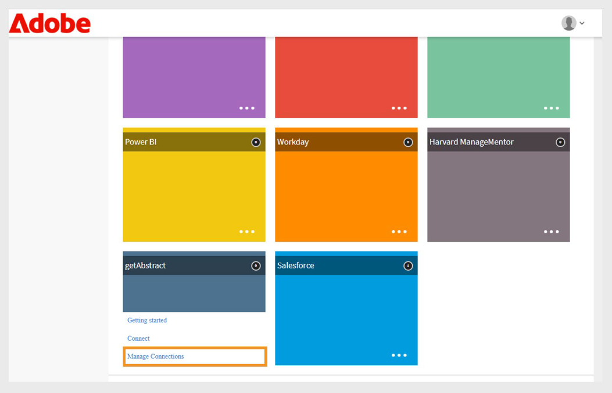

# Connettore getAbstract per Adobe Learning Manager

## Introduzione

Il **connettore getAbstract** è progettato per i clienti enterprise di [getAbstract.com](https://www.getabstract.com/). Consente agli Allievi di scoprire e utilizzare i contenuti getAbstract direttamente tramite Adobe Learning Manager. Il connettore consente inoltre agli amministratori di importare i dati relativi al coinvolgimento degli utenti e di tenere traccia automaticamente dei record di completamento degli Allievi.

Adobe Learning Manager desidera offrire agli Allievi opportunità di apprendimento continuo e autogestito incentrate sulla leadership e sulle competenze relazionali. Anziché sviluppare tutto il contenuto internamente, l’amministratore collega l’account getAbstract dell’organizzazione a Adobe Learning Manager utilizzando il connettore getAbstract.

- Importa automaticamente il contenuto getAbstract in Adobe Learning Manager.
- Tiene traccia dell’utilizzo di corsi e percorsi di apprendimento da parte degli Allievi.

Questo articolo descrive i passaggi necessari per configurare e gestire il connettore getAbstract in Adobe Learning Manager.

## Prerequisiti

- Prima di configurare il connettore, assicurati che la funzione **Migrazione** sia abilitata per il tuo account.
- Ottieni l&#39;**ID client** e il **segreto client** dal rappresentante dell&#39;account getAbstract. Queste credenziali sono necessarie per recuperare i metadati del corso e i dati sull’utilizzo degli utenti.

## Configurazione del connettore getAbstract

Il connettore getAbstract consente agli amministratori di Adobe Learning Manager di migliorare l’esperienza di apprendimento integrando contenuti esclusivi di alta qualità di getAbstract.

Per configurare il connettore getAbstract:

1. Accedi come Amministratore dell’integrazione.
2. Seleziona **getAbstract** nella home page.
3. Selezionare le opzioni seguenti nel riquadro **Connettore**:

   - **Guida introduttiva**: panoramica del connettore.
   - **Connetti**: crea una nuova connessione.
   - **Gestione connessioni**: consente di visualizzare o modificare le connessioni esistenti.

   
   _Il riquadro getAbstract mostra tre opzioni per la configurazione_

## Crea una nuova connessione

Per creare una nuova connessione:

1. Seleziona **Connetti**.

   
   _Selezionare Connetti nel riquadro getAbstract per creare una nuova connessione_

2. Digitare un **nome connessione**.
3. Digitare **ID client** e **Segreto client**.

   
   _Digitare la connessione, l&#39;ID client e il segreto client nella pagina di connessione getAbstract_

4. Seleziona **Salva** per creare la connessione.

## Gestire il connettore getAbstract

Prima di importare i dati, è necessario configurare il connettore e impostare una pianificazione di sincronizzazione. Una volta configurato, il connettore estrae automaticamente i dati di utilizzo, consentendo di monitorare i progressi dell’Allievo e di includere il contenuto getAbstract nei piani di apprendimento e nei report.

### Abilita la connessione

Per attivare la connessione:

1. Seleziona **Gestione connessioni** nel riquadro **getAbstract**.

   
   _Gestire le connessioni per configurare e pianificare l&#39;importazione dei dati_

2. Seleziona la connessione.
3. Seleziona **Configura** nel riquadro di navigazione a sinistra.
4. Seleziona **Abilita connessione**, quindi seleziona **Salva**.

   
   _Abilita la connessione per importare i dati da getAbstract in Adobe Learning Manager_

### Modificare la connessione

Per modificare la connessione:

1. Seleziona **Gestione connessioni** nel riquadro **getAbstract**.
2. Seleziona la connessione.
3. Seleziona **Configura** nel riquadro di navigazione a sinistra.
4. Seleziona **Modifica** per aggiornare **ID client** e **Segreto client**.

   
   _Modificare le credenziali, inclusi ID client e segreto client_

5. Seleziona **Salva**.

### Pianifica sincronizzazione

Per pianificare la sincronizzazione:

1. Seleziona **Gestione connessioni** nel riquadro **getAbstract**.
2. Seleziona la connessione.
3. Seleziona **Configura** nel riquadro di navigazione a sinistra.
4. Seleziona **Abilita pianificazione** nella sezione **Pianifica sincronizzazione**.

   
   _Pianificare l&#39;importazione dei dati da getAbstract a Adobe Learning Manager_

5. Selezionare la data e l&#39;ora di inizio in UTC.
6. Digitare il numero di giorni trascorsi i quali la sincronizzazione deve essere ripetuta.
7. Seleziona **Salva**.

Le impostazioni di sincronizzazione vengono salvate. Il connettore verrà eseguito in base alla pianificazione e i dati verranno importati da getAbstract in Adobe Learning Manager.

## Esegui sincronizzazione su richiesta

L&#39;opzione **Sincronizzazione su richiesta** consente di importare manualmente i dati da getAbstract in Adobe Learning Manager. Ciò è utile quando si desidera aggiornare immediatamente i dati delle attività degli allievi, senza attendere la successiva sincronizzazione pianificata.

Per eseguire l&#39;importazione dei dati su richiesta:

1. Seleziona **Gestione connessioni** nel riquadro **getAbstract**.
2. Seleziona la connessione.
3. Seleziona **Esecuzione su richiesta** dal riquadro a sinistra.
4. Selezionare **Data inizio**.

   
   _Eseguire la richiesta su richiesta per l&#39;importazione immediata dei dati da getAbstract a Adobe Learning Manager_

5. Selezionate una delle seguenti opzioni:

   - **Disattivazione dell&#39;accesso a Adobe Learning Manager durante l&#39;esecuzione**: consigliata se la sincronizzazione può causare tempi di inattività.
   - **Abilita accesso a Adobe Learning Manager durante l&#39;esecuzione**: consigliato per evitare l&#39;interruzione del servizio.
6. Selezionare **Esegui** per importare tutti i dati dalla data di inizio a oggi.

### Visualizzazione della cronologia di esecuzione

La pagina **Stato esecuzione** elenca tutte le esecuzioni della sincronizzazione in ordine. Se un’esecuzione presenta errori, viene visualizzata un’icona di avviso. Puoi controllare il registro degli errori, correggere il file CSV ed eseguire nuovamente la sincronizzazione più recente, se necessario.

Per visualizzare la cronologia di esecuzione:

1. Seleziona **Stato esecuzione** nel riquadro a sinistra.
2. Sono visualizzate le seguenti colonne:
   - **Esegui**
   - **Data inizio**
   - **Durata**
   - **Tipo** (pianificato o su richiesta)
   - **Stato** (In corso o Completato)

   
   _Visualizzare lo stato di esecuzione delle importazioni pianificate e su richiesta_

>[!NOTE]
>
>Se si elimina e si ricrea una connessione, la cronologia delle esecuzioni precedenti sarà comunque visibile. È possibile eseguire nuovamente solo la sincronizzazione più recente.

### Requisiti per la corretta sincronizzazione

Per garantire il corretto funzionamento della sincronizzazione:

- Un file di feed utente valido deve trovarsi nella cartella FTP getAbstract per le date di sincronizzazione specificate.
- Il file deve seguire il formato di denominazione:
   - report_export_yyyy_MM_dd_HHmmss.xlsx oppure
   - report_export_yyyy_MM_dd.xlsx

Scarica un [file di esempio del feed utente getAbstract](https://experienceleague.adobe.com/docs/learning-manager/assets/report-export-20170401175342.xlsx?lang=it) per comprendere il formato.
