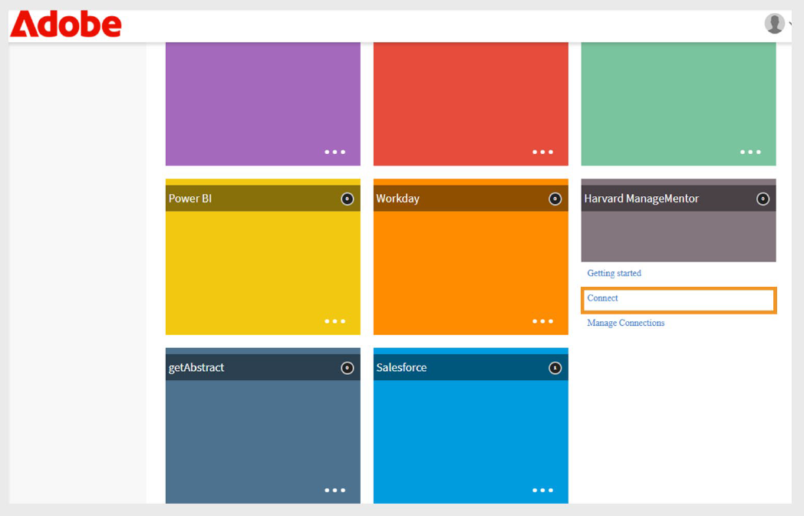
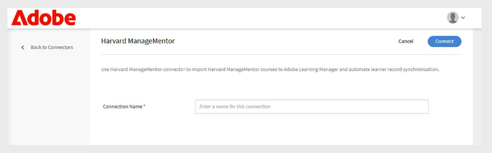

# Connettore Harvard ManageMentor in Adobe Learning Manager

## Introduzione

Il **connettore Harvard ManageMentor** è progettato per i clienti aziendali che utilizzano Harvard ManageMentor. Consente agli Allievi di scoprire e accedere ai corsi Harvard ManageMentor direttamente da Adobe Learning Manager. Una volta effettuata la connessione, il sistema può recuperare periodicamente dati sull’avanzamento dell’Allievo e creare corsi in Adobe Learning Manager in base ai metadati importati.

Questo articolo spiega come configurare e utilizzare il connettore Harvard ManageMentor in Adobe Learning Manager.

Grazie a questa integrazione, gli amministratori dell’integrazione possono collegare l’account Harvard ManageMentor dell’azienda a Adobe Learning Manager per importare automaticamente i corsi e monitorare i progressi degli allievi, senza creare nuovi contenuti di formazione da zero.

## Prerequisiti

Prima di configurare il connettore, assicurati che la funzione **Migrazione** sia abilitata per il tuo account.

## Configurazione del connettore

Utilizza il connettore Harvard ManageMentor per inserire corsi da Harvard ManageMentor in Adobe Learning Manager. Dopo aver collegato l’account, puoi importare i dettagli del corso e tenere traccia dell’avanzamento dell’Allievo.

Per impostare il connettore:

1. Accedi come Amministratore dell’integrazione.
2. Seleziona **Harvard ManageMentor** nella home page.
3. Seleziona una delle seguenti opzioni nel riquadro del connettore:
   - **Guida introduttiva**
   - **Connetti**
   - **Gestione connessioni**

   
   _Il riquadro Harvard ManageMentor mostra tre opzioni per la configurazione_

## Crea una nuova connessione

Per creare una nuova connessione:

1. Seleziona **Connetti** nel riquadro **Harvard ManageMentor**.

   
   _Selezionare Connetti per creare una nuova connessione Harvard ManageMentor_

2. Digitare la connessione nel campo **Nome connessione**.
3. Seleziona **Connetti** per creare la connessione.

   
   _Digitare il nome nel campo Nome connessione_

## Gestire la connessione

Dopo aver configurato il connettore Harvard ManageMentor, puoi gestire la tua connessione in Adobe Learning Manager. Puoi modificare le impostazioni di sincronizzazione ed eseguire le sincronizzazioni manualmente o secondo una pianificazione.

### Abilita la connessione

Per attivare la connessione:

1. Seleziona **Gestione connessioni** nel riquadro **Harvard ManageMentor**.

   
   _Gestire le connessioni per configurare e pianificare l&#39;importazione dei dati_

2. Seleziona la connessione.
3. Seleziona **Configura** dal riquadro di navigazione a sinistra.
4. Seleziona **Abilita connessione**, quindi seleziona **Salva**.

   
   _Abilita il connettore Harvard ManageMentor per importare i dati_

### Pianifica sincronizzazione

Per pianificare la sincronizzazione:

1. Seleziona **Gestione connessioni** nel riquadro **Harvard ManageMentor**.
2. Seleziona la connessione.
3. Seleziona **Configura** dal riquadro di navigazione a sinistra.
4. Seleziona **Abilita pianificazione** nella sezione **Pianifica sincronizzazione**.

   
   _Pianificare l&#39;importazione dei dati da Harvard ManageMentor a Adobe Learning Manager_

5. Selezionare la data e l&#39;ora di inizio in UTC.
6. Digitare il numero di giorni trascorsi i quali la sincronizzazione deve essere ripetuta.
7. Seleziona **Salva**.

Le impostazioni di sincronizzazione vengono salvate. Il connettore verrà eseguito secondo la pianificazione e i dati verranno importati da Harvard ManageMentor in Adobe Learning Manager.

## Esegui sincronizzazione su richiesta

L&#39;opzione **Sincronizzazione su richiesta** consente di importare manualmente i dati da Harvard ManageMentor in Adobe Learning Manager. Ciò è utile quando si desidera aggiornare immediatamente i dati delle attività degli allievi, senza attendere la successiva sincronizzazione pianificata.

Per eseguire l&#39;importazione dei dati su richiesta:

1. Seleziona **Gestione connessioni** nel riquadro **Harvard ManageMentor**.
2. Seleziona la connessione.
3. Seleziona **Esecuzione su richiesta** dal riquadro a sinistra.
4. Selezionare **Data inizio**.

   
   _Esegui la richiesta on-demand per l&#39;importazione immediata dei dati da Harvard ManageMentor a Adobe Learning Manager_

5. Selezionate una delle seguenti opzioni:

   - **Disattivazione dell&#39;accesso a Adobe Learning Manager durante l&#39;esecuzione**: consigliata se la sincronizzazione può causare tempi di inattività.
   - **Abilita accesso a Adobe Learning Manager durante l&#39;esecuzione**: consigliato per evitare l&#39;interruzione del servizio.
6. Selezionare **Esegui** per importare tutti i dati dalla data di inizio a oggi.

### Visualizzazione della cronologia di esecuzione

La pagina Stato esecuzione elenca tutte le esecuzioni della sincronizzazione in ordine. Se un’esecuzione presenta errori, viene visualizzata un’icona di avviso. Se necessario, puoi controllare il registro degli errori, correggere il file CSV ed eseguire nuovamente la sincronizzazione più recente.

Per visualizzare la cronologia di esecuzione:

1. Seleziona **Stato esecuzione** nel riquadro a sinistra.
2. Sono visualizzate le seguenti colonne:
   - **Esegui**
   - **Data inizio**
   - **Durata**
   - **Tipo** (pianificato o su richiesta)
   - **Stato** (In corso o Completato)

   
   _Visualizzare lo stato di esecuzione delle importazioni pianificate e su richiesta_

>[!NOTE]
>
>Se si elimina e si ricrea una connessione, la cronologia delle esecuzioni precedenti sarà comunque visibile. È possibile eseguire nuovamente solo la sincronizzazione più recente.

### Richiedi sincronizzazione

Assicurati che nella cartella FTP Harvard ManageMentor siano presenti i seguenti file:

- **hmm12_metadata.csv** Questo file contiene i metadati del corso. Segui il formato di denominazione file corretto.
- **client_hmm12_yyyyMMdd.csv** Questo file è il feed utente. Il formato della data deve corrispondere a aaaaMMgg.

**File di esempio**

- [File dei metadati del corso per il connettore Harvard ManageMentor](https://experienceleague.adobe.com/docs/learning-manager/assets/hmm12-metadata.csv?lang=en)
- [File feed utente per il connettore Harvard ManageMentor](https://experienceleague.adobe.com/docs/learning-manager/assets/client-hmm12-20170304.csv?lang=en)
