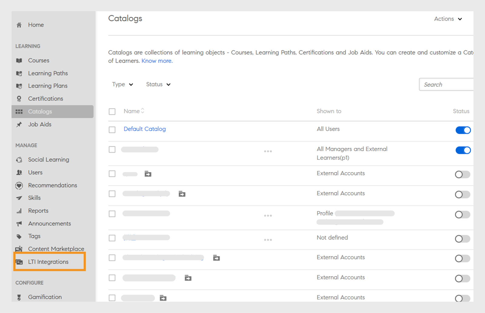
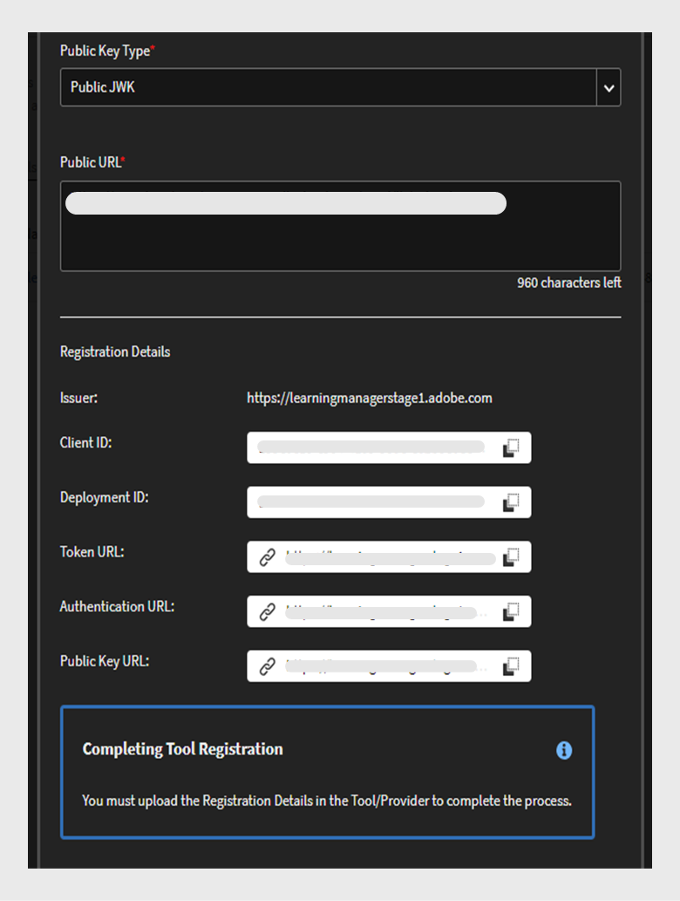

# Integrazione LTI

## Che cos&#39;è l&#39;LTI?

L’interoperabilità degli strumenti di apprendimento (LTI) è uno standard IMS per l’integrazione di applicazioni di apprendimento avanzate all’interno di ambienti didattici. Gli utenti possono accedere a contenuti di apprendimento esterni da fornitori di contenuti esterni direttamente all’interno del proprio LMS senza accedere o passare a un LMS diverso.

## Integrazione LTI con Adobe Learning Manager

Adobe Learning Manager ora supporta la versione 1.3 dell’LTI, che consente di agire sia come fornitore che come utente di strumenti. Questa funzione migliora l’interoperabilità tra Adobe Learning Manager e altri sistemi di gestione dell’apprendimento (LMS).

**LTI come provider di strumenti**: LTI come provider di strumenti consente l&#39;integrazione di sistemi esterni con un LMS. Adobe Learning Manager funge da provider di strumenti LTI, consentendo ad altre piattaforme LMS di accedere agli oggetti di apprendimento dal Adobe Learning Manager direttamente all’interno dell’LMS.

**LTI come utente di strumenti**: LTI come utente di strumenti consente a LMS di integrare strumenti esterni tramite l’interoperabilità degli strumenti di apprendimento (LTI). In questo scenario, LMS è un consumatore di servizi forniti da strumenti esterni. Adobe Learning Manager funge da utente degli strumenti LTI e consente di integrare strumenti di apprendimento di terze parti, consentendo agli Allievi Adobe Learning Manager di utilizzare gli oggetti di apprendimento degli strumenti di terze parti all’interno di Adobe Learning Manager.

## Configurazione del connettore LTI in ALM

Segui questi passaggi per abilitare l&#39;integrazione LTI in Adobe Learning Manager:

1. Accedi come **[!UICONTROL Amministratore dell’integrazione]**.
2. Nella pagina principale, seleziona **[!UICONTROL Applicazioni]** > **[!UICONTROL App in primo piano]**.
3. Seleziona **[!UICONTROL Integrazioni LTI]** nella pagina **[!UICONTROL Applicazioni]**.
4. Seleziona l&#39;opzione **[!UICONTROL Abilita integrazioni LTI]** e seleziona **[!UICONTROL Salva]**.

_Abilita integrazioni LTI_

>[!NOTE]
>
>Una volta attivata, l’opzione Integrazioni LTI non può essere modificata o disabilitata.

In questo modo viene creata la nuova barra laterale Integrazioni LTI nell’account amministratore.

_Intestazione laterale LTI_

Un nuovo ruolo personalizzato, **[!UICONTROL Integrazione LTI]**, è stato aggiunto in **[!UICONTROL Privilegi account]** nella sezione **[!UICONTROL Ruolo personalizzato]**. Gli amministratori possono assegnare questo ruolo agli utenti, consentendo loro di accedere alla sezione **[!UICONTROL Integrazione LTI]**. Gli amministratori devono inoltre concedere autorizzazioni per **[!UICONTROL Cataloghi]** a questi utenti per l’esportazione dei corsi. Questa configurazione fornisce l’accesso completo alle sezioni LTI e Cataloghi per l’esportazione dei corsi.

_Ruolo personalizzato integrazione LTI_

## Adobe Learning Manager come fornitore di strumenti LTI

In qualità di provider LTI, Adobe Learning Manager consente di esportare i corsi dai cataloghi come pacchetti LTI che possono essere condivisi con piattaforme LMS esterne.

### Crea e condividi le credenziali LTI con il flusso di lavoro LMS - Amministratore esterno

Segui questi passaggi per condividere le credenziali LTI con un LMS esterno:

1. Accedi come **[!UICONTROL Amministratore]**.
2. Nella pagina principale, seleziona **[!UICONTROL Integrazione LTI]** > **[!UICONTROL Configurazione strumento LTI]**. In questa pagina sono disponibili le credenziali di configurazione.
3. L’amministratore può condividere queste credenziali con un LMS esterno per la registrazione del sito LTI.

   
   _Credenziali di configurazione strumento LTI_

   * **[!UICONTROL URL token]**: l&#39;URL in cui il servizio LMS richiede un token di accesso per autenticare e autorizzare la comunicazione con lo strumento LTI.
   * **[!UICONTROL URL del collegamento di destinazione]**: URL di destinazione in cui gli utenti vengono reindirizzati all&#39;avvio dello strumento LTI dall&#39;LMS.
   * **[!UICONTROL URL keyset pubblico]**: URL che fornisce le chiavi pubbliche utilizzate per verificare i token di sicurezza per le comunicazioni protette.
   * **[!UICONTROL URL di reindirizzamento]**: l&#39;URL a cui vengono inviati gli utenti dopo aver completato un&#39;azione sullo strumento LTI, in genere reindirizzandoli all&#39;LMS.

### Configurazione LMS esterno

Utilizzando le credenziali condivise dall’amministratore Adobe Learning Manager, l’amministratore LMS esterno registra Adobe Learning Manager e genera le credenziali. Queste credenziali verranno aggiunte a Adobe Learning Manager come passaggio finale per configurare Adobe Learning Manager come fornitore di strumenti. Di seguito sono riportate le credenziali generate dall&#39;LMS esterno:

* **[!UICONTROL ID emittente o piattaforma]**: identificatore univoco per l&#39;LMS o la piattaforma che invia la richiesta di avvio dell&#39;LTI al provider dello strumento.
* **[!UICONTROL ID client]**: identificatore univoco assegnato allo strumento LTI dall&#39;LMS ai fini dell&#39;autorizzazione.
* **[!UICONTROL ID distribuzione]**: identificatore che collega una distribuzione dello strumento LTI specifica all&#39;LMS per la gestione di più istanze.
* **[!UICONTROL URL token]**: endpoint in cui il servizio LMS richiede un token di accesso per autenticare e autorizzare le interazioni con lo strumento LTI.
* **[!UICONTROL URL di autenticazione]**: l&#39;URL a cui l&#39;LMS invia gli utenti per l&#39;autenticazione e l&#39;avvio della connessione LTI.
* **[!UICONTROL URL chiave pubblica]**: l&#39;URL che fornisce la chiave pubblica utilizzata dallo strumento LTI per verificare i token di sicurezza e garantire una comunicazione sicura.

### Aggiungere Adobe Learning Manager come fornitore di strumenti - Flusso di lavoro dell’amministratore

Seguite questi passaggi per aggiungere Adobe Learning Manager come provider di strumenti:

1. Accedi come **[!UICONTROL Amministratore]**.
2. Nella pagina principale, seleziona **[!UICONTROL Integrazioni LTI]** > **[!UICONTROL Piattaforme LTI]**.
3. Selezionare **[!UICONTROL Aggiungi]** e immettere le credenziali condivise dall&#39;LMS esterno.

   
   _Aggiungi una nuova piattaforma LTI_

4. Una volta aggiunti tutti questi valori, seleziona **[!UICONTROL Convalida]** e **[!UICONTROL Aggiungi]**.

### Esportare il pacchetto LTI - Flusso di lavoro dell’amministratore

Gli strumenti LTI consentono di esportare i corsi di formazione dai cataloghi come pacchetto scaricabile di contenuti di apprendimento che può essere condiviso con sistemi LMS (Learning Management Systems) o piattaforme esterne utilizzando lo standard LTI (Learning Tools Interoperability).

Segui questi passaggi per esportare il corso da Adobe Learning Manager:

1. Accedi come **[!UICONTROL Amministratore]**.
2. Nella pagina principale, seleziona **[!UICONTROL Integrazioni LTI]** > **[!UICONTROL Esportazioni pacchetti LTI]**.
3. Seleziona **[!UICONTROL Nuova esportazione pacchetto]**.

   
   _Esporta pacchetto LTI_

4. Selezionate il catalogo richiesto dall’elenco. Puoi visualizzare l’elenco dei corsi disponibili nel catalogo.
5. Seleziona i corsi richiesti e seleziona **[!UICONTROL Esporta come LTI]**.
6. Seleziona il corso per visualizzare il collegamento di avvio.
7. Seleziona l&#39;icona **[!UICONTROL Scarica collegamento]** per scaricare il pacchetto. Il pacchetto è un file zip contenente i file IMSCC esportati correttamente.

Utilizzando questo collegamento di avvio o il file IMSCC, è possibile esportare i corsi Adobe Learning Manager nell’LMS esterno. Gli Allievi possono seguire i corsi Adobe Learning Manager dal proprio LMS.

>[!NOTE]
>
>Se un amministratore modifica un corso o aggiorna i moduli dopo aver creato il collegamento di avvio, il collegamento verrà aggiornato automaticamente. Tuttavia, se un amministratore ritira un corso dopo la creazione del collegamento di avvio, il corso ritirato non verrà avviato nel consumer LTI.

## Adobe Learning Manager come consumatore LTI - Flusso di lavoro dell’amministratore

In qualità di utente LTI, Adobe Learning Manager consente di utilizzare attività, strumenti, contenuti e widget di fornitori LTI esterni.
Per aggiungere Adobe Learning Manager come consumer LTI, sono necessarie le seguenti credenziali dal provider LTI esterno:

* Avvia URL di accesso
* URL collegamento destinazione
* URL di reindirizzamento
* Tipo di chiave pubblica

Segui questi passaggi per aggiungere Adobe Learning Manager come consumer LTI:

1. Accedi come **[!UICONTROL Amministratore]**.
2. Nella pagina principale, seleziona **[!UICONTROL Integrazioni LTI]** > **[!UICONTROL Registrazione strumento LTI]**.
3. Selezionare **[!UICONTROL Aggiungi]** > **[!UICONTROL Nuovo strumento LTI]**.

   >[!NOTE]
   >
   >Puoi importare più strumenti LTI caricando un file .csv.

4. Immetti le credenziali sopra riportate dal provider LTI.

   
   _Aggiungi nuovo strumento LTI_

5. Al termine, seleziona **[!UICONTROL Convalida]** e **[!UICONTROL Aggiungi]**.
6. È possibile visualizzare la seguente schermata:

   
   _Credenziali di registrazione_

7. Condividere queste credenziali con il provider LTI per la registrazione. Una volta completata la registrazione, è possibile ottenere il collegamento di avvio o il file IMSCC dal provider LTI per importare i corsi.

### Creare contenuti LTI - Flusso di lavoro Autore

I provider LTI forniscono un collegamento di avvio o un file IMSCC per aggiungere i propri corsi a Adobe Learning Manager. Segui questi passaggi per aggiungere corsi da un LMS esterno:

1. Accedi come **[!UICONTROL Autore]**.
2. Selezionare **[!UICONTROL Libreria dei contenuti]** > **[!UICONTROL Aggiungi]** > **[!UICONTROL Modulo LTI]**.

   
   _Aggiungi contenuto LTI - Autore_

3. Digitare **[!UICONTROL Nome]** e **[!UICONTROL Descrizione]**.
4. Digitare **[!UICONTROL Launch Link]** e **[!UICONTROL Custom Parameters]** dal provider LTI.
5. Seleziona il [!UICONTROL provider LTI] dal menu a discesa **[!UICONTROL Provider di strumenti]**.
6. Cerca e seleziona **[!UICONTROL Pubblico]** nell&#39;opzione **[!UICONTROL Aggiungi alla cartella]**. In questo modo, i corsi sono disponibili per tutti gli Autori.
7. Seleziona **[!UICONTROL Salva]**.
Una volta creato il contenuto, puoi aggiungerlo durante la creazione del corso.

### Creazione di un corso con contenuto LTI - Flusso di lavoro Autore

Segui questi passaggi per creare un corso con contenuto LTI:

1. Accedi come **[!UICONTROL Autore]**.
2. Nella pagina principale, seleziona **[!UICONTROL Corsi]** > **[!UICONTROL Aggiungi]**.
3. Digita il **[!UICONTROL Nome]** e la **[!UICONTROL Descrizione]** del corso.
4. Nell&#39;opzione **[!UICONTROL Moduli]**, selezionare **[!UICONTROL Aggiungi moduli]** > **[!UICONTROL Modulo a ritmo personalizzato]**.
5. Seleziona i **[!UICONTROL contenuti LTI]** che hai creato e seleziona **[!UICONTROL Salva]**.
6. Immetti i dettagli richiesti, ad esempio **[!UICONTROL Abilità]**, **[!UICONTROL Autori]** e **[!UICONTROL Tipo di iscrizione]**.
7. Al termine, pubblica il corso. Gli Allievi Adobe Learning Manager possono seguire i corsi LTI dal provider LTI esterno.

## Scenari di errore di esportazione LTI

I seguenti tipi di corsi non possono essere esportati come corsi LTI:

* **Corso con modulo attività**: corsi contenenti moduli specifici basati sulle attività.
* **Corso con più tipi di distribuzione**: i corsi con più tipi di distribuzione includono modulo a ritmo personalizzato, modulo virtuale o in aula, modulo di attività e apprendimento misto.
* **Corso con prerequisiti**: corsi che richiedono un completamento preliminare.
* **Corso con più iscrizioni**: corsi contenenti più iscrizioni
* **Corsi con più istanze**: corsi che offrono più istanze di distribuzione.

| Istanza predefinita | Una o più istanze non predefinite | Aspettativa | Messaggi di errore |
|---|---|---|---|
| Attivo | Nessuno | Esporta | Nessuno |
| Attivo | Attivo | Non esportare | Più istanze |
| Attivo | Ritirato | Non esportare | Più istanze |
| Attivo | Eliminato | Esporta | Nessuno |
| Ritirato | Nessuno | Non esportare | Ritira istanza di definizione |
| Ritirato | Attivo | Non esportare | Rimozione di istanze di Def, istanze multiple |
| Ritirato | Ritirato | Non esportare | Rimozione di istanze di Def, istanze multiple |
| Ritirato | Elimina | Non esportare | Ritira istanza di definizione |

* **Corsi con più risposte alle domande**: corsi con MQA abilitato.
* **Corso con cambio di istanza abilitato**: corsi che consentono agli Allievi di passare da un’istanza all’altra.
* **Corso a pagamento**: corsi che richiedono il pagamento per l’iscrizione.
* **Corsi parte di percorso di apprendimento, certificazione o piano di apprendimento**: corsi parte di percorsi di apprendimento o piani.
* **Corsi non di tipo Iscrizione autonoma**: corsi esclusi dall’iscrizione autonoma dell’Allievo.
* **Corsi in aula o in aula virtuale**: corsi in aula o in aula virtuale.
* **Corsi con moduli non obbligatori**: corsi contenenti moduli facoltativi o non obbligatori.

_Stato esportazione_

## Limitazioni LTI

Di seguito sono riportate le limitazioni dell&#39;LTI sia per il consumer LTI che per il provider LTI:

* Possibilità di esportare corsi misti che influiscono sull’esperienza di utilizzo dei corsi da parte degli Allievi.
* Possibilità di esportare corsi a ritmo personalizzato con aula, aula virtuale o moduli di attività, con impatto sull’esperienza del corso degli Allievi.
* Possibilità di esportare corsi condivisi come i corsi LinkedIn Learning e Go1.
* Possibilità di avviare corsi con date di iscrizione passate in ALM, che influiscono sull&#39;accesso ai corsi e sull&#39;esperienza degli Allievi.
* Gli allievi non possono seguire i corsi LTI nell’app mobile iOS ALM, che influisce sull’esperienza di utilizzo dei corsi.
* Gli Allievi non sono in grado di scaricare e accedere ai corsi LTI offline nell’app mobile ALM, poiché questi corsi sono forniti da piattaforme di terze parti.
* Gli amministratori possono visualizzare solo i cataloghi abilitati e non possono visualizzare i cataloghi disabilitati.
* ALM ha limitazioni sulla lunghezza del nome (63 caratteri) e dell’e-mail (64 caratteri), impedendo l’accesso agli Allievi LTI esterni che superano questi limiti.
* I ritardi della sincronizzazione di completamento del corso o della sincronizzazione di livello sono causati dal sistema LTI di terze parti.
* I messaggi di sincronizzazione del corso non venivano visualizzati per gli Allievi Teams che seguivano i corsi LTI tramite l’app o il browser Teams, e questo influiva sulle notifiche degli Allievi.
* I report Dati utente non sono in grado di esportare i dati per gli utenti registrati tramite LTI.
* I nomi dei provider di strumenti non vengono riconosciuti automaticamente quando gli autori aggiungono collegamenti di avvio nel consumer di strumenti e richiedono la selezione manuale.
* I caricamenti in serie degli strumenti tramite CSV richiedono la codifica UTF-8 per i caratteri accentati per evitare errori di importazione.
* Gli amministratori dell’account LTI non possono condividere corsi, percorsi di apprendimento o certificazioni che includono moduli LTI.
* Impossibile risincronizzare i livelli quando gli utenti riaprono il lettore per i corsi ALM completati, che influiscono sugli aggiornamenti dei punteggi degli Allievi e richiedono un riavvio manuale.
* ALM consente solo agli utenti attivi e di prova di utilizzare i corsi LTI.
* La sincronizzazione dei livelli attivata in Moodle impedisce l’avvio del lettore ALM, che influisce sull’accesso e sull’esperienza dei corsi degli Allievi.
* Il campo attivo LTI è a valore singolo e non supporta più valori.
* I motivi dell’errore non sono disponibili quando un’esportazione non riesce durante la migrazione di corsi senza contenuto principale.
* I livelli del corso LTI esterno non vengono visualizzati nella Trascrizione Allievo e i punteggi non sono visibili nella pagina del quiz L2, influendo sul tracciamento delle prestazioni degli Allievi.

## Casi di errore di avvio LTI

Di seguito sono riportati i corsi che il lettore LTI esterno non può avviare a causa delle recenti modifiche apportate in ALM dopo la creazione dei collegamenti di avvio:

* Corsi in cui l’istanza viene ritirata.
* Corsi ritirati e non registrati in ALM.
* Corsi con iscrizioni ad ALM ma ritirati.
* Corsi eliminati in ALM.
* Corsi per i quali è stato raggiunto il limite di iscrizioni.

## Best practice

Si consiglia di creare un catalogo con i corsi che supportano l’LTI per evitare errori di esportazione e facilitare l’esportazione dei corsi.

Il catalogo LTI mostra lo stato di esportazione corretto
