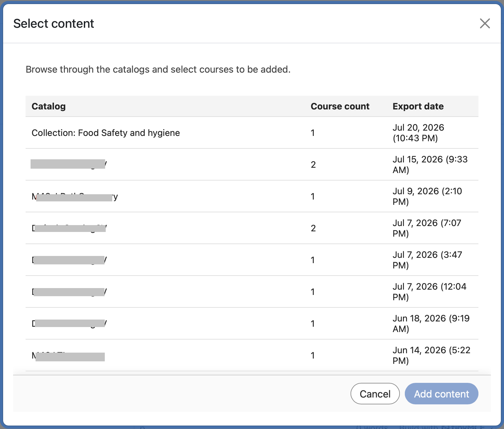
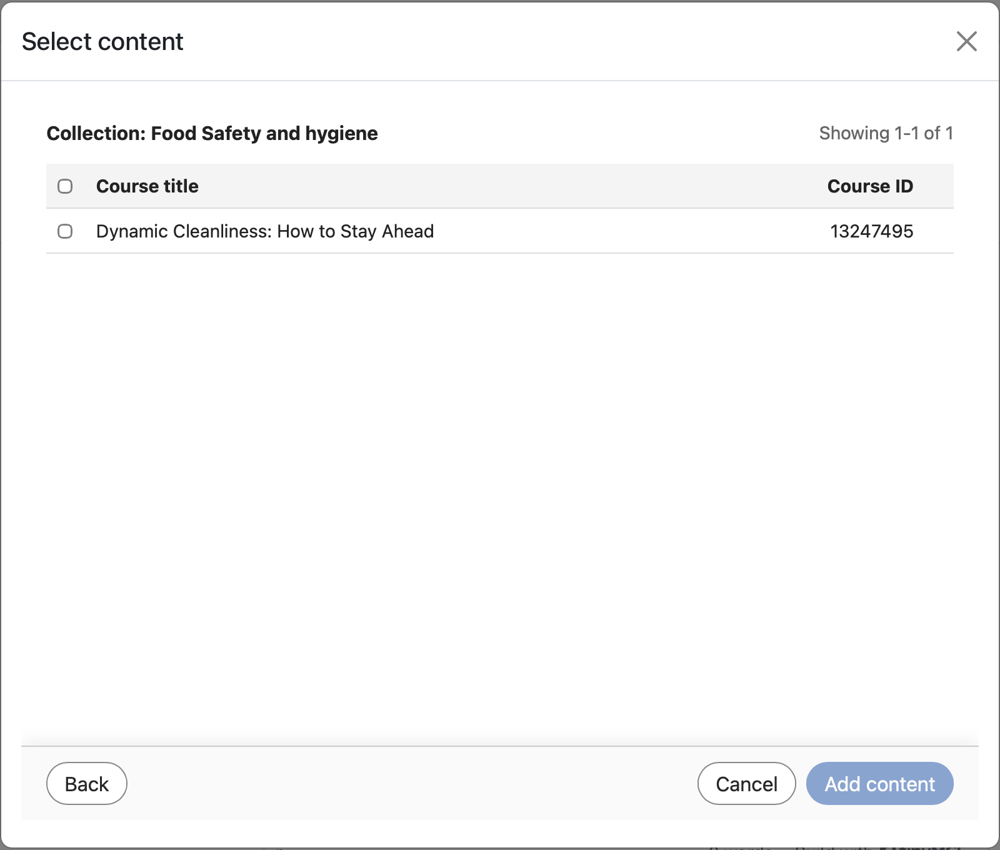

# Collegamento avanzato LTI in Adobe Learning Manager

## Panoramica

**La seguente sezione è destinata agli amministratori**

Il Deep Linking LTI è una funzionalità di vantaggio LTI che consente agli istruttori o agli autori di corsi di sfogliare, selezionare e incorporare elementi di apprendimento specifici da Adobe Learning Manager (ALM) direttamente in un corso esterno per utenti/piattaforma LTI (come Canvas o Moodle).

I collegamenti diretti LTI semplificano il processo di aggiunta di corsi a una piattaforma di apprendimento come Moodle. Nel flusso di lavoro corrente, un autore deve copiare manualmente l’URL del corso, incluso il parametro Esporta UUID, quindi incollare i dettagli richiesti nell’LMS durante la configurazione del collegamento del corso. Questo passaggio deve essere ripetuto per ogni corso e per ogni posizionamento. Ad esempio, se lo stesso corso deve essere aggiunto in 10 posizioni diverse, l’autore deve ripetere il processo di copia e incolla 10 volte. Questo approccio manuale aumenta gli sforzi e introduce un rischio più elevato di errori di configurazione.

Il collegamento profondo rimuove questo sovraccarico consentendo all’LMS di gestire la selezione del corso durante la configurazione e fornisce l’URL di avvio appropriato per la selezione dei contenuti.

In questo modello:

* Gli istruttori e gli autori del sistema LMS esterno offrono un&#39;esperienza di selezione approfondita dedicata per sfogliare ALM.
* Il sistema restituisce un oggetto deep-link da ALM all’LMS esterno in modo che l’elemento selezionato possa essere incorporato nel flusso di lavoro di creazione del corso.
* Gli studenti utilizzano contenuti profondamente collegati nel loro LMS primario, che lancia senza problemi il materiale ospitato in ALM.

## Descrizione del problema

ALM supporta attualmente l&#39;integrazione LTI 1.3, ma senza un flusso di lavoro completo di collegamento profondo, istruttori e autori non dispongono di un modo strutturato per:

* Avvia un’esperienza di selezione approfondita dedicata da un modale.
* Sfoglia solo gli oggetti di apprendimento che devono essere esposti per una determinata piattaforma.
* Seleziona un oggetto di apprendimento specifico dalla piattaforma.
* ALM restituisce l’oggetto di apprendimento alla piattaforma in modo che possa essere incorporato direttamente in un corso.

Senza questa funzionalità:

* La selezione del contenuto è manuale o frammentata
* Tutti i contenuti dell’account possono essere esposti involontariamente, a meno che non vengano esplicitamente filtrati
* Le integrazioni dei provider di strumenti sono più difficili da rendere operative
* Gli autori del corso non possono incorporare contenuti LTI esterni con un flusso di lavoro coerente e gestito

## Obiettivi

Gli obiettivi principali di questa funzione sono:

1. Abilitare il collegamento profondo LTI nel provider di strumenti LTI
   * Supporto per l&#39;avvio di deep-link da ALM a un provider di strumenti LTI.
2. Fornire un flusso di lavoro di selezione dei contenuti regolamentati
   * Durante la selezione del collegamento profondo, esponi solo i cataloghi e i contenuti approvati e pertinenti.
3. Consenti a istruttori e autori di selezionare gli oggetti di apprendimento
   * Fornisci un’interfaccia utente ricercabile e filtrabile per la selezione di oggetti di apprendimento idonei.
4. Restituire una risposta deep-link valida ad ALM
   * Reindirizza l’utente alla piattaforma utilizzando il parametro deep_link_return_url con il payload deep-link richiesto.
5. Supporto dell’esposizione del catalogo specifica per la piattaforma
   * Consenti agli amministratori di controllare i cataloghi esposti alla piattaforma LTI.

## Persone e loro ruoli

Il flusso di lavoro di collegamento profondo LTI coinvolge i seguenti utenti:

| Persona | Descrizione |
|---|---|
| Istruttore o autore | Crea o gestisce i corsi e avvia il flusso di selezione del collegamento profondo per incorporare i contenuti esterni. |
| Amministratore dell’integrazione | Registra e gestisce gli strumenti LTI e abilita e configura il comportamento di collegamento avanzato. |
| Allievo | Avvia e utilizza i contenuti aggiunti tramite il flusso di lavoro deep-link. |

*Ogni persona viene mappata a un passaggio distinto nel flusso di lavoro di collegamento profondo, dalla configurazione all&#39;utilizzo.*

## Requisiti relativi a dati e parametri

Il collegamento profondo scambia i seguenti parametri tra ALM e la piattaforma LTI:

| Parametro | Scopo |
|---|---|
| `deep_link_return_url` | Endpoint restituito utilizzato per inviare nuovamente l&#39;oggetto del collegamento profondo selezionato ad ALM |
| `accepted_types` | Definisce i tipi di risorse accettati dalla piattaforma |
| `accept_multiple` | Indica se è consentita la selezione di più risorse; configurabile per strumento |
| `auto_create` | Indica che la piattaforma può creare automaticamente la voce della risorsa collegata |

*Questi parametri controllano il contenuto esposto e il modo in cui le selezioni vengono restituite ad ALM.*

## Creare un collegamento profondo

### Prerequisiti

1. Dovresti aver effettuato l’accesso come Amministratore dell’integrazione.
2. Durante la configurazione dell’integrazione LTI, seleziona la casella di controllo Supporta il collegamento profondo.
3. Specifica l’URL nel campo per portare l’utente o l’autore alla selezione.
4. Seleziona Salva modifiche.

   Lo stesso URL di avvio viene riutilizzato per semplificare la configurazione e l’utilizzo.

   Il comportamento è determinato dal tipo di messaggio LTI. Quando il tipo di messaggio è `content_consumption`, l’utente viene indirizzato al lettore del corso. Quando il tipo di messaggio è `content_selection`, l’utente viene indirizzato attraverso il flusso di collegamento profondo, in cui l’autore può selezionare direttamente il contenuto desiderato senza copiare manualmente gli identificatori specifici del corso.

   Dopo aver salvato le modifiche, seleziona la scheda **Seleziona contenuto**. La scheda **Seleziona contenuto** diventa attiva solo dopo aver selezionato questa casella di controllo.

**La seguente sezione è destinata agli autori.**

In qualità di autore, puoi selezionare i contenuti dalla finestra **Seleziona contenuto**. Nella finestra **Seleziona contenuto** sono visualizzati **Catalogo**, **Numero corsi** e **Data esportazione**.

1. Passa allo strumento di integrazione esterno.

   

2. Seleziona un **catalogo** e seleziona i corsi che desideri collegare in modo approfondito selezionando le caselle di controllo accanto a ciascun corso. Se aggiungi più corsi, viene visualizzata una finestra a comparsa di conferma.

   

   

3. Selezionare **Aggiungi contenuto**. Selezionando **Aggiungi contenuto**, tutti i campi verranno compilati automaticamente. Puoi visualizzare l’UUID di esportazione nel campo Parametri personalizzati. Se hai selezionato più corsi nel passaggio precedente, viene visualizzato un messaggio di conferma.

   

4. A questo punto, è possibile selezionare **Annulla** e tornare alla scheda **Seleziona contenuto** se si desidera selezionare altri corsi o apportare modifiche oppure selezionare **Salva e torna** al corso oppure selezionare **Salva e visualizza**. I collegamenti diretti vengono aggiunti alle destinazioni.

   
