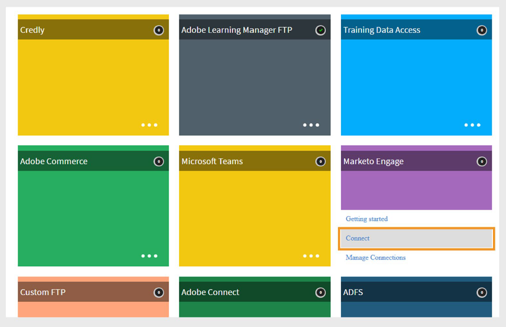

# Connettore Marketo Engage in Adobe Learning Manager

## Introduzione

Il connettore di Marketo Engage consente a Adobe Learning Manager di integrarsi perfettamente con Marketi Engage, una piattaforma di automazione per il marketing. Questa integrazione consente agli addetti al marketing di tenere traccia dei dati relativi al comportamento degli Allievi provenienti da Adobe Learning Manager e di agire su di essi sincronizzandoli con il database di Marketo.

Il connettore di Marketo Engage consente la sincronizzazione diretta dei dati tra i due sistemi e consente agli addetti al marketing di utilizzare i dati delle attività di apprendimento per creare campagne di marketing mirate.

Il connettore Marketi Engage consente di:

- Aggiungi o aggiorna automaticamente i lead nel database di Marketo Engage quando gli utenti vengono aggiunti a Adobe Learning Manager.
- Sincronizza i comportamenti di apprendimento degli utenti come iscrizioni a corsi, completamenti, assegnazioni di abilità e completamenti di abilità come oggetti personalizzati in Marketo.
- Crea campagne dinamiche in Marketo utilizzando questi dati, sfruttando funzionalità come **elenchi intelligenti**.

Questa integrazione consente ai professionisti del marketing di rivolgersi al pubblico in base al percorso di apprendimento all’interno di Adobe Learning Manager.

## Funzioni principali

- Creazione e aggiornamento automatizzati di lead in base agli utenti Adobe Learning Manager.
- Esporta l’attività di apprendimento (iscrizioni, completamenti, obiettivi di abilità) come oggetti personalizzati in Marketo.
- Pianifica o attiva le esportazioni su richiesta.
- Supporto per report unificati, tra cui:
   - Report utente
   - Trascrizione Allievo
   - Report abilità utente

## Prerequisiti

Prima di procedere con l’integrazione, assicurati che l’account Marketo supporti la creazione di schemi tramite le API.

Per creare la connessione sono necessari i seguenti dettagli:

- **Nome connessione**
- **ID client**
- **Segreto client**
- **Dominio Marketo Engage**

>[!NOTE]
>
>È possibile ottenere l&#39;ID client e il segreto client dall&#39;app di Marketo Engage in **LaunchPoint** e il dominio dalla sezione **Servizi Web**.

## Configurazione del connettore

Per impostare il connettore di Marketo Engage:

1. Accedi a Adobe Learning Manager come amministratore di integrazione.
2. Passa il mouse sul riquadro **Marketo Engage** e seleziona **Connetti**.

   
   _Selezionare Connetti per configurare il connettore di Marketo Engage_

3. Digitare le credenziali richieste

   - Nome connessione
   - ID client
   - Segreto del client
   - Dominio Marketo Engage

   
   _Digitare i dettagli necessari per il connettore di Marketo Engage_

4. Seleziona **Connetti** per stabilire la connessione.

## Eventi e trigger campagna

Puoi attivare le esportazioni di dati nel Marketo Engage in base ai seguenti eventi:

- Un nuovo utente viene aggiunto a Adobe Learning Manager.
- Un utente è iscritto a un corso.
- Un utente completa un corso.
- Un utente è iscritto a un’abilità.
- Un utente completa un’abilità.

Questi eventi possono essere esportati **su richiesta** o **su base pianificata**.

## Mappatura colonne

Marketo utilizza due database:

- **Database lead** - per i record utente (lead)
- **Database di oggetti personalizzati** - per record di attività ed eventi personalizzati

Per mappare i campi tra Adobe Learning Manager e Marketo:

1. I campi **Report utente** di Adobe Learning Manager vengono visualizzati in una colonna.
2. I **campi Marketo** corrispondenti sono elencati nella colonna adiacente.
3. Associa i campi appropriati da Learning Manager a Marketo per creare e aggiornare i lead.
4. Dopo la mappatura, tutti gli utenti esportati vengono visualizzati come lead nel database dei lead di Marketo.

I report esportati nella sezione **Oggetti personalizzati Marketo** presentano il prefisso &quot;cp_&quot;.

## Eventi di esportazione supportati

Puoi esportare i seguenti eventi relativi agli utenti nella tua istanza di Marketo Engage:

- Nuovo utente aggiunto
- Metadati utente aggiornati
- Attività utente aggiornata
- Iscrizione alla formazione
- Iscrizione autonoma
- Completamento delle abilità

Queste esportazioni aiutano a stimolare il coinvolgimento e personalizzare le campagne di sensibilizzazione utilizzando i dati delle attività di apprendimento.
