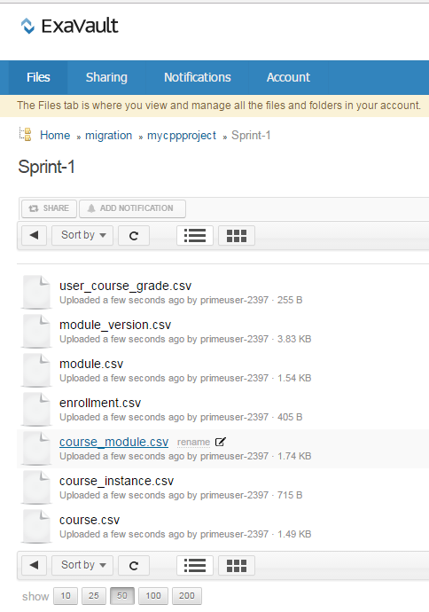

# Manuale di migrazione

Manuale di riferimento per gli Amministratori di integrazione che desiderano eseguire la migrazione di un LMS esistente all’LMS di Learning Manager

## Panoramica {#overview}

<table>
 <tbody>
  <tr>
   <td></td>
   <td>
    
<a href="https://business.adobe.com/products/learning-manager/adobe-learning-manager.html">Adobe Learning Manager</a> è una soluzione di gestione dell’apprendimento self-service ospitata nel cloud e incentrata sugli Allievi. L’Adobe consente alle aziende con i sistemi di gestione dell’apprendimento (LMS) esistenti di migrare i dati e i contenuti di formazione dell’organizzazione all’applicazione LMS di Learning Manager. 
</td>
  </tr>
 </tbody>
</table>

### Scenario di utilizzo {#usagescenario}

In generale, le aziende di grandi dimensioni dispongono di un proprio LMS interno o di un sistema di gestione dell’apprendimento legacy fornito da un qualsiasi rivenditore. LMS è costituito dai contenuti di formazione aziendale e dai dati di formazione. Quando un’azienda acquista Learning Manager, potrebbe essere utile spostare i contenuti e i dati LMS esistenti in Learning Manager per sfruttare i vantaggi di un LMS moderno e intuitivo senza perdere i dati legacy dell’organizzazione.

Learning Manager fornisce le specifiche e gli strumenti necessari in modo che l’Amministratore di integrazione dell’organizzazione sia in grado di configurare ed eseguire le attività di migrazione.

A partire da oggi, gli Amministratori di un’organizzazione possono accedere alla funzionalità di migrazione in Learning Manager contattando il team di supporto di Adobe. Per abilitare la funzionalità di migrazione nel tuo account, puoi rivolgerti al team di supporto di Adobe Learning Manager.

## Processo di migrazione {#apidescription}

In questa sezione vengono illustrati i prerequisiti per la migrazione, le fasi principali del processo di migrazione, gli sprint di migrazione, le specifiche, i passaggi relativi alla migrazione di dati e contenuti:

### Prerequisiti {#prerequisites}

Il team di Adobe Learning Manager prevede che gli Amministratori di integrazione dell’organizzazione effettuino le seguenti operazioni prima di intraprendere il processo di migrazione:

* L’Amministratore di integrazione estrae dati e contenuti dall’LMS in uso e trasforma i dati nei formati di file definiti da Learning Manager.
* Learning Manager non supporta l’importazione di utenti nell’ambito del processo di migrazione e prevede che l’importazione di utenti venga eseguita dall’organizzazione mediante connettori. Adobe Systems prevede che i connettori vengano configurati prima del processo di migrazione. Fare riferimento a [Guida ai connettori di Learning Manager](connectors.md) per ulteriori informazioni.

Learning Manager consiglia agli Amministratori di provare a eseguire il processo di migrazione in un account di prova prima di migrare dati e contenuti all’ambiente di produzione di Learning Manager.

### Passaggi chiave del processo di migrazione {#keystepsofmigrationprocess}

I passaggi principali coinvolti nella migrazione di contenuti e dati da un LMS esistente a Learning Manager sono i seguenti:

1. Il partner o l’Amministratore di integrazione valuta i dati e i contenuti LMS esistenti di cui deve essere eseguita la migrazione.
1. L’Amministratore di integrazione valuta gli strumenti e le specifiche forniti da Learning Manager per l’inserimento di dati e contenuti.
1. L’Amministratore di integrazione scrive il codice o esporta manualmente dati e contenuti di formazione dall’LMS precedente sulla base delle funzionalità fornite dall’LMS precedente.
1. Una volta che i dati e i contenuti di formazione sono disponibili, l’Amministratore di integrazione analizza e mappa dati e contenuti in modo che siano in linea con le specifiche di migrazione di Learning Manager.
1. L’Amministratore di integrazione utilizza gli strumenti forniti da Learning Manager per eseguire la migrazione nel seguente ordine:

   1. Trasferimento degli Allievi a Learning Manager
   1. Trasferimento dei contenuti di formazione in Learning Manager e
   1. Infine, trasferimento dei dati di formazione a Learning Manager.

L’organizzazione può iniziare a utilizzare l’LMS di Learning Manager insieme ai contenuti legacy.

### Area di validità degli oggetti di migrazione {#scopeofmigrationobjects}

Puoi migrare i contenuti solo per i seguenti oggetti di apprendimento:

* Modulo
* Distintivi
* Corso
* Versione modulo
* Istanza del corso
* Modulo del corso
* Abilità
* Livello di abilità
* Corso abilità
* Certificazione
* Corso per la certificazione
* Commit certificazione
* Programma di apprendimento
* Corso del programma di apprendimento
* Istanza del programma di apprendimento
* Istanza del corso del programma di apprendimento
* Risorsa formativa
* Versione risorsa formativa
* Corso risorsa formativa
* Abilità risorsa formativa
* Iscrizione
* Iscrizione certificazione
* Iscrizione programma di apprendimento
* Iscrizione risorsa formativa
* Valutazioni dei corsi degli utenti

### Concetti chiave della migrazione {#keyconceptsofmigration}

Di seguito sono illustrati brevemente alcuni dei concetti chiave del processo di migrazione di Learning Manager, per un riferimento rapido:

**Progetto di migrazione**

In Learning Manager, un progetto di migrazione è costituito da uno o più sprint. Puoi avviare anche più progetti di migrazione per il tuo account. Il processo di migrazione in Learning Manager inizia con la creazione di un progetto di migrazione.

**Sprint**

Nel processo di migrazione di Learning Manager, uno sprint definisce un insieme di elementi di migrazione che si desidera migrare dall’LMS esistente. Un elemento di migrazione può essere un modulo del corso, il record di un Allievo o un insieme di corsi. In uno sprint possono essere presenti anche più elementi dati di apprendimento. È possibile eseguire processi di migrazione in ciascuno sprint.

**Esecuzioni script**

Esecuzione script è il processo di avvio di un processo di migrazione sprint. È possibile interrompere l’esecuzione dello sprint in qualsiasi momento.

**Riesecuzioni script**

È possibile rieseguire uno sprint di migrazione in seguito al completamento dello stesso in qualsiasi momento. Questa situazione di riesecuzione di uno sprint si verifica quando si desidera aggiungere i dati a una voce sprint ed eseguirne nuovamente la migrazione all’applicazione o correggere gli errori nei CSV.

**Specifica CSV**

Learning Manager offre un set di [specifiche CSV standard](migration-manual.md#main-pars_header_140933605). È consigliabile prendere visione delle specifiche CSV prima di avviare il processo di migrazione. L’Amministratore di integrazione dell’organizzazione può analizzare i formati di dati esistenti e mapparli per farli coincidere con gli elementi del modello CSV forniti da Learning Manager.

**Tag progetto di migrazione**

Adobe Systems consiglia di utilizzare una serie di parole chiave come tag per identificare facilmente i progetti di migrazione all’interno dell’applicazione Learning Manager. Questi tag consentono di identificare i progetti all’interno dell’applicazione Learning Manager in qualsiasi momento.

**Modulo senza contenuto**

Learning Manager consente di caricare un modulo senza contenuto. Adobe Systems lo considera come modulo senza contenuto in Learning Manager. Per eseguire la migrazione di alcuni dati legacy dall’LMS esistente senza la necessità di alcun contenuto, è possibile caricare il file module_version.csv senza riferimento URL.

## Specifiche CSV e CSV di esempio {#csv}

Di seguito sono riportate le specifiche CSV aggiornate che puoi utilizzare per mappare i dati di migrazione LMS esistenti. Fai clic su csv-specifications e sample-csvs per scaricare i file zip. Il file csv-specific.zip scaricato contiene sette fogli Excel. I file Excel contengono specifiche accompagnate da descrizioni che illustrano come compilare i file .csv. I file .csv corrispondenti devono contenere i dati per ciascun campo nel formato prestabilito, come spiegato in questi file .xlsx.

<table border="1" cellspacing="0" cellpadding="0" width="100%">
 <tbody>
  <tr>
   <th>
    
<b>Sl.no</b>
</th>
   <th>
    
<b>Nome file</b>
</th>
   <th>
    
<b>Descrizione dei contenuti</b>
</th>
   <th>
    
Note
</th>
  </tr>
  <tr>
   <td>
    
1
</td>
   <td>
    
module.xlsx
</td>
   <td>
    
Metadati per module.csv
</td>
   <td> </td>
  </tr>
  <tr>
   <td>
    
2
</td>
   <td>
    
badge.xlsx
</td>
   <td>
    
Metadati per badge.xlsx
</td>
   <td> </td>
  </tr>
  <tr>
   <td>
    
3
</td>
   <td>
    
course.xlsx
</td>
   <td>
    
Metadati per course.csv
</td>
   <td>
    
Indica il nome di un Autore per un determinato corso poiché a volte i nomi di più Autori non vengono visualizzati correttamente nell’applicazione in seguito alla migrazione. 
</td>
  </tr>
  <tr>
   <td>
    
4
</td>
   <td>
    
module_version.xlsx 
</td>
   <td>
    
Metadati per module_version.csv
</td>
   <td>
    
Assicurati di specificare il percorso URL della cartella dell’account Box in cui hai caricato il contenuto. 
</td>
  </tr>
  <tr>
   <td>
    
5
</td>
   <td>
    
course_instance.xlsx
</td>
   <td>
    
metadati per course_instance.csv; 
</td>
   <td> </td>
  </tr>
  <tr>
   <td>
    
6
</td>
   <td>
    
session.xlsx
</td>
   <td>
    
Metadati per session.csv
</td>
   <td>
    
Assicurati che ogni voce nel documento session.csv sia associata ad almeno un modulo Classe/Classe virtuale
</td>
  </tr>
  <tr>
   <td>
    
7
</td>
   <td>
    
course_module.xlsx
</td>
   <td>
    
Metadati per course_module.csv
</td>
   <td> </td>
  </tr>
  <tr>
   <td>
    
8
</td>
   <td>
    
skill.xlsx
</td>
   <td>
    
Metadati per skill.csv
</td>
   <td> </td>
  </tr>
  <tr>
   <td>
    
9
</td>
   <td>
    
skill_level.xlsx
</td>
   <td>
    
Metadati per skill_level.csv
</td>
   <td> </td>
  </tr>
  <tr>
   <td>
    
10
</td>
   <td>
    
skill_course.xlsx
</td>
   <td>
    
metadati per skill_course.csv
</td>
   <td> </td>
  </tr>
  <tr>
   <td>
    
11
</td>
   <td>
    
certification.xlsx
</td>
   <td>
    
Metadati per Certification.csv
</td>
   <td> </td>
  </tr>
  <tr>
   <td>
    
12
</td>
   <td>
    
certification_course.xlsx
</td>
   <td>
    
Metadati per certification_course.csv
</td>
   <td> </td>
  </tr>
  <tr>
   <td>
    
13
</td>
   <td>
    
certification_commit.xlsx
</td>
   <td>
    
Metadati per certification_commit.csv
</td>
   <td> </td>
  </tr>
  <tr>
   <td>
    
14
</td>
   <td>
    
learning_program.xlsx
</td>
   <td>
    
Metadati per learning_program.csv
</td>
   <td> </td>
  </tr>
  <tr>
   <td>
    
15
</td>
   <td>
    
learning_program_course.xls 
</td>
   <td>
    
Metadati per learning_program_course.csv 
</td>
   <td> </td>
  </tr>
  <tr>
   <td>
    
16
</td>
   <td>
    
learning_program_instance.xlsx 
</td>
   <td>
    
Metadati per learning_program_instance.csv
</td>
   <td> </td>
  </tr>
  <tr>
   <td>
    
17
</td>
   <td>
    
learning_program_instance_course_instance.xlsx 
</td>
   <td>
    
Metadati per learning_program_instance_course_instance.csv
</td>
   <td> </td>
  </tr>
  <tr>
   <td>
    
18
</td>
   <td>
    
job_aid.xlsx
</td>
   <td>
    
Metadati per job_aid.csv
</td>
   <td>
    
Ogni file job_aid migrato richiede la disponibilità di una o più versioni di job_aid.
</td>
  </tr>
  <tr>
   <td>
    
19
</td>
   <td>
    
Job_aid_version.xlsx
</td>
   <td>
    
Metadati per job_aid_version.csv
</td>
   <td> </td>
  </tr>
  <tr>
   <td>
    
20
</td>
   <td>
    
job_aid_course.xlsx
</td>
   <td>
    
metadati per job_aid_course.csv
</td>
   <td> </td>
  </tr>
  <tr>
   <td>
    
21
</td>
   <td>
    
job_aid_skills.xlsx
</td>
   <td>
    
Metadati per job_aid_skills.csv
</td>
   <td> </td>
  </tr>
  <tr>
   <td>
    
22
</td>
   <td>
    
iscrizioni
</td>
   <td>
    
Metadati per enrollments.csv
</td>
   <td> </td>
  </tr>
  <tr>
   <td>
    
23
</td>
   <td>
    
certification_enrollement.xlsx
</td>
   <td>
    
Metadati per certification_enrollement.csv
</td>
   <td> </td>
  </tr>
  <tr>
   <td>
    
24
</td>
   <td>
    
learning_program_enrollment.xlsx
</td>
   <td>
    
Metadati per learning_program_enrollment.csv  
</td>
   <td> </td>
  </tr>
  <tr>
   <td>
    
25
</td>
   <td>
    
job_aid_enrollment.xlsx
</td>
   <td>
    
metadati per job_aid_enrollment.csv
</td>
   <td> </td>
  </tr>
  <tr>
   <td>
    
26
</td>
   <td>
    
user_course_grade.xlsx
</td>
   <td>
    
 
      Metadati per user_course_grade.csv
</td>
   <td>
    
Specifica i dati dei record Allievi richiesti nel file .csv anche se non sono obbligatori. Senza queste informazioni, anche se il file .csv viene elaborato per la migrazione, l’applicazione Learning Manager potrebbe non riflettere alcun dato. il file sample-csvs.zip contiene sette file .csv con convenzione di denominazione simile a quella riportata sopra.
</td>
  </tr>
 </tbody>
</table>

Learning Manager supporta solo i valori di data e ora in formato UTF a 8 e 32 bit. Se citi la data nei file CSV con una data non compresa nell’intervallo consentito, è possibile che si verifichino errori durante la migrazione: 2038-07-17T08:53:21.000Z o 1980-04-17T08:13:25.322Z
[sample-csvs.zip](assets/sample-csvs.zip) [csv_specific.zip](assets/csv-specifications.zip)Durante l’importazione, devi tenere presente le seguenti dipendenze dai file CSV:

* module_version.csv dipende da module.csv
* course_instance.csv dipende da course.csv
* course_module.csv dipende da course.csv, module.csv e module_version.csv
* course_instance.csv dipende da course.csv
* session.csv dipende da course.csv e module.csv
* enrollment.csv dipende da course.csv
* user_course_grade.csv dipende da course.csv e module.csv
* skill_course.csv dipende da course.csv
* skill_level.csv dipende da skill.csv
* learning_program_instance.csv dipende da learning_program e learning_program_course.csv
* learning_program_course.csv dipende da learning_program.csv
* learning_program_enrollment.csv dipende da learning_program e learning_program_instance.csv
* learning_program_instance_course_instance.csv dipende da learning_program.csv, learning_program_instance.csv e course_instance.csv
* certification_course.csv dipende da certification.csv e course.csv
* certification_commit.csv dipende da certification.csv e certification_course.csv
* certification_enrollment.csv dipende da certification.csv, certification_course.csv e certification_enrollment.csv

## Procedura di migrazione {#migrationprocedure}

Prima di iniziare la procedura di migrazione, è importante tenere presente quanto segue:

* Solo un progetto di migrazione può essere attivo in un account in qualsiasi momento. All’interno di un progetto, solo uno sprint può essere attivo in un dato momento.
* Non è possibile annullare un’Esecuzione già in corso nel processo di migrazione. Tuttavia, è possibile utilizzare l’opzione di eliminazione esistente all’interno di ciascuna funzionalità di Learning Manager per annullare qualsiasi migrazione di dati o contenuti.
* Non appena viene avviato, il progetto di migrazione passa allo stato &quot;Migrazione in corso&quot;. Durante la migrazione, nessun altro ruolo diverso dal ruolo di Amministratore di integrazione può accedere a Learning Manager.

### Creazione di account FTP e Box {#creatingftpandboxaccounts}

Pianificare il progetto di migrazione è molto importante. È consigliabile suddividere i progetti in più sprint e identificare chiaramente i dati di cui si desidera effettuare la migrazione in ciascuno sprint. Potrebbe inoltre essere una buona idea eseguire una convalida dopo ogni sprint per essere sicuri di aver eseguito la migrazione dei dati corretti nello sprint in questione, anziché limitarsi a un’unica convalida al termine del progetto. Prima di avviare lo sprint come parte del progetto di migrazione, è necessario caricare i file CSV di dati e contenuti nei server FTP e Box rispettivamente. Se non disponi di account per FTP personalizzato e Box, puoi crearli.

<!--**Create FTP account**-->

<!--Click **[!UICONTROL Request for CSV FTP folder]**. A pop-up dialog appears prompting you to enter your e-mail id. Go through online instructions and create an FTP account. As soon as you create your account, you can view your migration project and sprint project folders in FTP. 

A sample snapshot of project files and folder of FTP is shown below for your reference. -->

<!---->

**Creazione di un account Box**

Crea la cartella di caricamento dei contenuti seguendo un procedimento analogo a quello seguito per la creazione della cartella FTP. Fai clic su Migrazione nel riquadro di sinistra e seleziona Richiedi cartella di caricamento contenuti nella parte inferiore della pagina visualizzata.

Riceverai un’e-mail da Box con il collegamento alla cartella condivisa. Se non disponi di un account Box, fai clic su Iscrizione e creane uno. Le istruzioni di accesso vengono inviate all’ID e-mail dell’Amministratore di integrazione.

**Caricamento di dati (file .csv) in cartelle FTP o Box**

La creazione di un account FTP o Box costituisce un prerequisito ai fini dello sviluppo di un progetto di migrazione. In questa fase puoi creare un progetto di migrazione e uno sprint nell’applicazione Learning Manager.  Fare riferimento a **Procedura di migrazione di dati e contenuti** in questa pagina per creare un progetto di migrazione.

Nell’account FTP o Box, fai clic sul nome della cartella dei progetti e quindi sul nome dello sprint. All’interno della cartella degli sprint, puoi caricare i file di dati .csv di cui desideri eseguire la migrazione. Per caricare, fai clic sul pulsante Carica file in alto nel server FTP o Box e rilascia i file .csv. Di seguito è riportata un’istantanea di esempio dopo il caricamento su FTP come riferimento.

<!---->

Puoi tornare al progetto di migrazione di Learning Manager, fare clic su **[!UICONTROL Aggiorna]** e visualizzare tutti i tipi di dati .csv elencati nello sprint di migrazione.

**Caricamento dei contenuti di formazione nelle cartelle di contenuto**

Carica i contenuti di formazione dell’LMS esistente nel tuo account Box. Se hai già creato lo sprint e il progetto di migrazione, l’account Box popolerà il campo relativo al nome di sprint e progetto di migrazione. Puoi caricare i contenuti nello stesso percorso. Fare riferimento a **Procedura di migrazione di dati e contenuti** in questa pagina per creare un progetto di migrazione.

È possibile trascinare e rilasciare i file di contenuto oppure fare clic su **[!UICONTROL Carica]** e selezionare i file dal desktop. Se le dimensioni del file dei contenuti sono troppo grandi, si potrebbe verificare un ritardo nel caricamento dei file. A seconda delle dimensioni del file, il tempo necessario per caricarli nell’account Box varia.

Di seguito è riportata un’istantanea dell’account Box di esempio dopo il caricamento dei contenuti, come riferimento:

*File nell’account Box*

Una volta caricati i file nel tuo account Box, assicurati di specificare il percorso relativo di questo file di contenuto Box nel file module_version.csv. Indicare il percorso dei contenuti del modulo è un passaggio obbligatorio.

Una volta effettuato l’accesso ai server FTP e Box e caricato il contenuto, i percorsi CSV vengono visualizzati come mostrato nell’istantanea riportata di seguito in Learning Manager.

*Percorsi CSV nell’account Box*

## Procedura di migrazione di dati e contenuti {#dataandcontentmigrationprocedure}

La procedura per migrare i dati e i contenuti dell’LMS aziendale a Learning Manager viene descritta di seguito:

Prendi visione dei prerequisiti del processo di migrazione prima di avviare la migrazione. Fare riferimento a [Specifiche CSV e CSV di esempio](migration-manual.md#main-pars_header_140933605) in questa pagina e preparare i file CSV per la migrazione di dati e contenuti.

1. Accedi all’applicazione Learning Manager come Amministratore di integrazione e fai clic su **[!UICONTROL Migrazione]** nel riquadro sinistro.

   Viene visualizzata la home page dei progetti di migrazione. Se la tua organizzazione ha già creato progetti di migrazione, puoi visualizzare l’elenco di tutti i progetti in questa pagina.

1. Fai clic su **[!UICONTROL Nuovo]** nell’angolo in alto a destra della pagina per creare un progetto di migrazione. In alternativa, è possibile fare clic sul collegamento **[!UICONTROL Creazione di un progetto di migrazione]** nella pagina per creare un progetto di migrazione. Viene visualizzata la pagina Crea un progetto di migrazione.

   Se non hai ancora creato una cartella FTP, ti verrà chiesto di creare una cartella FTP nell’account. Si tratta di un passaggio obbligatorio prima di iniziare a creare un progetto di migrazione.

   
   *Crea cartella FTP*

   Specifica il nome del progetto, il tag del progetto, il catalogo dei corsi e la descrizione del progetto di migrazione. Fai clic su **[!UICONTROL Crea]**.

   Gli elementi dati di migrazione vengono identificati utilizzando il tag del progetto di migrazione. Se non disponi di un catalogo dei corsi specifico, seleziona il catalogo predefinito dal menu a discesa. Tutti i corsi che vengono migrati utilizzando un progetto di migrazione saranno inclusi nel catalogo selezionato in questa fase. Se non viene selezionato nessun catalogo, tutti i corsi migrati faranno parte del catalogo predefinito.

1. La pagina di configurazione degli sprint viene visualizzata come mostrato nell’istantanea riportata di seguito. È necessario creare uno sprint nell’ambito del progetto di migrazione. Scegli un nome per lo sprint e fornisci una breve descrizione. Puoi scegliere Sì se desideri migrare il contenuto come parte di questo sprint. Fai clic **[!UICONTROL Avanti]**.

   
   *Migrazione sprint*

   Seleziona la casella di controllo con il titolo **Gli utenti sono stati aggiunti o modificati dall&#39;ultima esecuzione**, per sincronizzare l’elenco degli utenti con l’applicazione Learning Manager. Se stai effettuando la migrazione di contenuti e dati all’applicazione Learning Manager, questa operazione potrebbe non essere richiesta. Tuttavia, qualora sia trascorso un certo intervallo di tempo tra la precedente migrazione sprint e l’ultima, è consigliabile effettuare la sincronizzazione dell’elenco degli utenti. Questo passaggio consente la sincronizzazione del database Learning Manager con gli utenti dell’LMS.

   La sincronizzazione è consigliata durante la migrazione di enrollment.csv e user_course_grade.csv. Questo passaggio consente la sincronizzazione del database Learning Manager con il database di migrazione e assicura che tutti gli utenti i cui record devono essere migrati nello sprint siano disponibili nel database di migrazione.

1. È possibile avviare la migrazione sprint con i dati e i contenuti caricati. Fai clic **[!UICONTROL Aggiorna]** prima di avviare l’esecuzione dello sprint per sincronizzare le cartelle FTP e dei contenuti con l’applicazione Learning Manager.

   
   *Avvia migrazione sprint*

   Fai clic **[!UICONTROL Inizia]** nell’angolo in alto a destra della pagina. È possibile fare clic su **[!UICONTROL Interrompi]** in qualsiasi momento durante il processo di migrazione sprint, per interrompere la migrazione.

   Lo stato della migrazione viene visualizzato per ciascuno dei contenuti e degli elementi dati dello sprint. Verifica il numero di elementi riusciti e non riusciti nell’ambito dell’esecuzione di uno sprint di migrazione.

   Se stai caricando il contenuto di un modulo, assicurati che il percorso della cartella del contenuto sia specificato in module_version.csv. Se dimentichi questo passaggio, potrebbero verificarsi errori durante la migrazione. Ad esempio, per caricare i contenuti di un modulo di autoformazione, come video, è necessario specificare il relativo percorso URL Box in module_version.csv. Per il contenuto del modulo Attività, è possibile specificare il nome dell’URL.

   Come riferimento, viene di seguito fornita un’istantanea della finestra di dialogo di stato. Come mostrato nell’istantanea, è possibile visualizzare il numero dei record elaborati per ciascun elemento dati di migrazione insieme allo stato degli elementi riusciti e non riusciti. Fai clic su Scarica record degli errori confrontandoli con gli elementi non riusciti per scaricare e visualizzare i registri degli errori. È possibile correggere i problemi in CSV e ricaricare su FTP.

   
   *Visualizza avanzamento sprint*

   Fai clic sull’elenco Sprint nel riquadro di sinistra per visualizzare l’elenco di tutti gli sprint di un progetto di migrazione. Puoi visualizzare un elenco di tutti gli sprint, il numero di esecuzioni per ogni sprint, la data di inizio, la durata e lo stato di completamento, come mostrato nell’istantanea di esempio seguente.

   
   *Visualizza elenco di sprint*

1. Dopo aver caricato i CSV aggiornati più di recente, puoi fare clic su Riesegui nell’angolo in alto a destra della pagina. Riesegui elabora nuovamente tutti gli elementi di dati, ignorando quelli che non presentano modifiche. Una volta che sei soddisfatto della migrazione degli elementi di dati in uno sprint, puoi contrassegnare la migrazione dello sprint come completata facendo clic sull’apposito pulsante nella parte superiore della pagina. Potrai avviare un nuovo sprint con più elementi di dati in un secondo momento. Una volta che uno Sprint è stato contrassegnato come completato, non è possibile rieseguirlo. Allo stesso modo, in un progetto di migrazione è possibile avere un numero qualsiasi di sprint. Una volta ottenuto lo stato di migrazione di tutti gli sprint, puoi contrassegnare il progetto di migrazione come Completato facendo clic su **Contrassegna progetto come completato** nella pagina Elenco sprint.

   Prima di contrassegnare il progetto di migrazione come completato, è necessario assicurarsi che tutti gli sprint del progetto siano completi. Dopo aver contrassegnato il progetto di migrazione come completato, non è possibile tornare indietro e creare eventuali sprint in tale progetto o apportare modifiche al progetto stesso. È necessario creare un altro progetto di migrazione e aggiungere sprint a esso.

## Verifica migrazione {#registration}

Dopo aver eseguito la migrazione dei dati e dei contenuti di formazione dall’LMS legacy della tua organizzazione, verifica i dati e i contenuti importati utilizzando le varie funzionalità degli oggetti di apprendimento. Ad esempio, è possibile accedere all’applicazione Learning Manager come Amministratore e verificare la disponibilità dei dati e dei contenuti relativi ai moduli e ai corsi importati.

## Aggiornamento nella migrazione {#retrofittinginmigration}

Questa funzionalità di integrazione consente di trasformare i dati storici di un oggetto di apprendimento da un sistema di gestione dell’apprendimento legacy a un corso attivo creato in Learning Manager.

Di seguito sono riportate le specifiche CSV aggiornate che puoi utilizzare per mappare i dati di migrazione LMS esistenti. Fai clic su csv-specifications e sample-csvs per scaricare i file zip. Il file csv-specifications.zip scaricato contiene quattro file Excel. I file Excel contengono specifiche accompagnate da descrizioni che illustrano come compilare i file .csv. I file .csv corrispondenti devono contenere i dati per ciascun campo nel formato prestabilito, come spiegato in questi file .xlsx.

1-enrollment.xlsx contiene le descrizioni dei metadati richiesti per il file retrofit_enrollment.csv.

2-certification_enrollment.xlsx contiene le descrizioni dei metadati richiesti per il file retrofit_certification_enrollment.csv.

3-learning_program_enrollment.xlsx contiene le descrizioni dei metadati richiesti per il file retrofit_learning_program_enrollment.csv.

4-user_course_grades.xlsx-contiene le descrizioni dei metadati richiesti per il file retrofit_user_course_grades.csv.
[csv-specific.zip](assets/csv-specifications.zip)

## Risoluzione dei problemi di migrazione {#troubleshootingmigrationissues}

[Fai clic qui](../../kb/troubleshooting-migration.md) per informazioni su come aggirare/risolvere i problemi affrontati dagli Amministratori di integrazione durante la migrazione di dati e contenuti dall’LMS esistente all’applicazione Learning Manager.

## Suggerimenti per la gestione degli utenti {#usermanagement}

In questo argomento vengono forniti alcuni suggerimenti utili per capire in che modo vengono considerati e gestiti gli utenti in Learning Manager. Questi concetti ti aiuteranno a gestire meglio gli utenti durante l’utilizzo dell’importazione CSV, dei connettori e delle funzionalità di migrazione di Learning Manager.

## ID Learning Manager {#captivateprimeids}

Learning Manager fornisce due tipi di ID univoci per gli utenti:

* ID e-mail
* UUID (ID universalmente univoco)

Learning Manager supporta UUID per fornire flessibilità alle organizzazioni nel controllo degli account utente. In qualità di Amministratore, se disponi di UUID degli utenti in un account, puoi modificare gli ID e-mail degli utenti per tale account.

**Scenario di utilizzo dell’UUID in un’organizzazione**

Consideriamo uno scenario in cui un dipendente A entra a far parte di un’azienda denominata Learning Manager, come appaltatore. Durante il periodo del contratto, l’azienda di Learning Manager potrebbe non fornire l’ID e-mail dell’azienda come A@example.com, ma considerare solo l’account e-mail personale del dipendente, ad esempio A@gmail.com. Dopo aver completato 6 mesi di periodo di contratto, se lo stesso dipendente A si aggiunge a Learning Manager come dipendente a tempo pieno, Learning Manager potrebbe voler modificare il suo ID e-mail con l’ID e-mail dell’azienda: A@example.com.

L’accesso UUID all’account utente sarà vantaggioso per Learning Manager nello scenario sopra menzionato. L’azienda Learning Manager può facilmente sostituire l’ID e-mail personale del dipendente A con un ID e-mail ufficiale. I record del dipendente rilevanti per questo account non sono interessati da questa modifica.

## Identificazione utente singolo {#singleuseridentification}

Learning Manager identifica e ricorda la modalità con cui viene aggiunto un utente singolo, ad esempio mediante registrazione automatica, tramite caricamento CSV, oppure utilizzando l’interfaccia utente o tramite API.

* Se un utente singolo viene aggiunto utilizzando l’interfaccia utente o tramite API, è possibile eliminare tale tipo di utente tramite interfaccia utente o API.
* È possibile aggiornare gli utenti singoli utilizzando il processo di caricamento CSV, ma tieni presente che questi utenti vengono trattati come utenti CSV e che vengono loro applicati i flussi di lavoro CSV.

## Assegnazione del ruolo di Manager {#assigningmanagerrole}

Non è possibile assegnare direttamente un ruolo di Manager a un qualsiasi utente in Learning Manager. Un utente X può diventare Manager Learning Manager solo quando si imposta un attributo Manager di qualsiasi utente (ad esempio, Y) in quell’account come X.

In uno scenario in cui X è Manager degli utenti, ad esempio, A, B e C, se X lascia l’organizzazione, è necessario assicurarsi che l’attributo Manager di A, B e C sia impostato sul nuovo Manager. In alternativa, è possibile impostare temporaneamente l’attributo Manager di questi utenti come ROOT e assegnare il nuovo nome Manager in un secondo momento.

Per ulteriori informazioni su questo argomento, fare riferimento ai seguenti contenuti della Guida:

* [Domande frequenti sul caricamento di CSV](/help/migrated/administrators/add-users-in-bulk.md)
* [Guida all’aggiunta di utenti](/help/migrated/administrators/feature-summary/add-users-user-groups.md)

