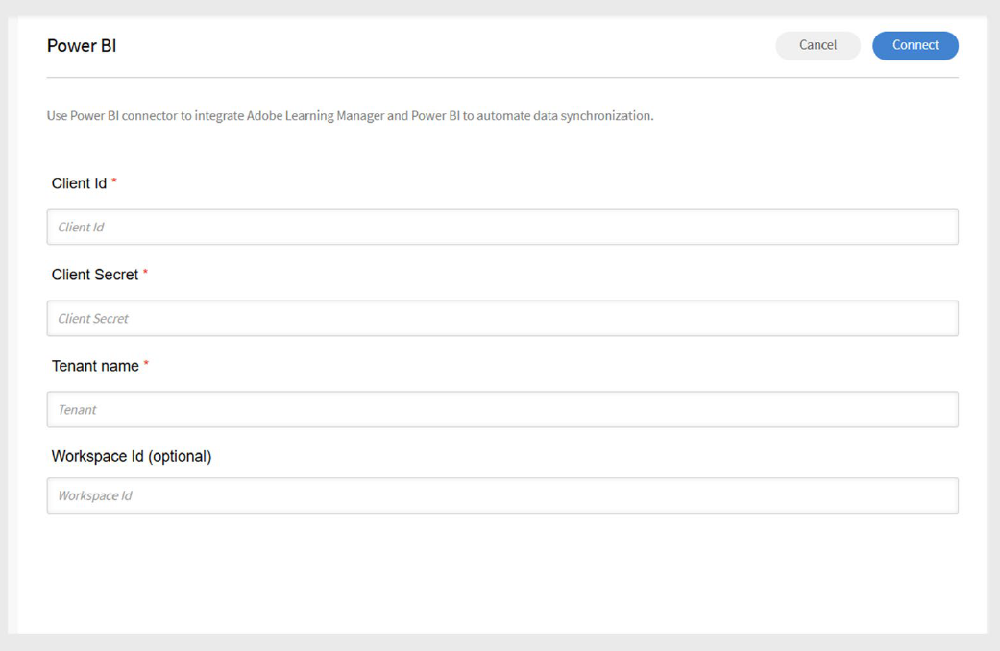
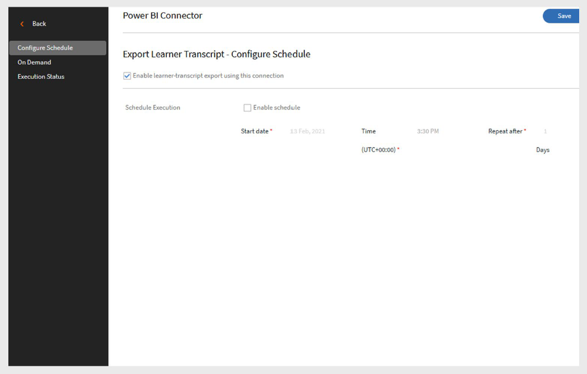
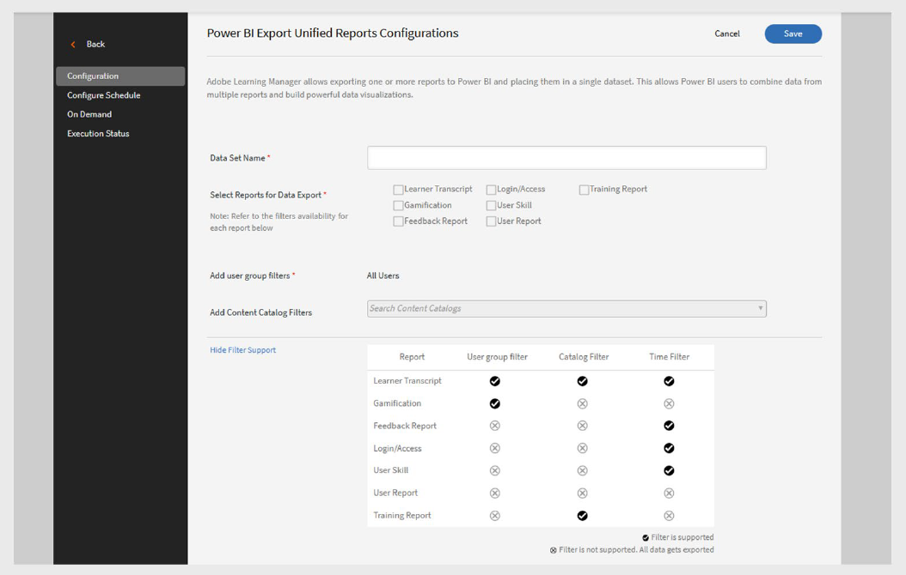

# Connettore Power BI in Adobe Learning Manager

## Introduzione

Il connettore Power BI consente di integrare Adobe Learning Manager con Microsoft Power BI (licenza commerciale) in modo da poter analizzare, visualizzare e condividere i dati di apprendimento.

Grazie a questa integrazione, l’Amministratore di integrazione può esportare automaticamente set di dati dinamici come le trascrizioni degli allievi, le abilità degli utenti e i report di attività xAPI direttamente in un’area di lavoro Power BI selezionata.

Una volta effettuata la connessione, è possibile utilizzare tutte le funzionalità di Power BI per creare dashboard e report personalizzati. Ciò consente all’organizzazione di ottenere informazioni più approfondite sui progressi degli Allievi, sui risultati delle abilità e sull’efficacia della formazione e di prendere decisioni informate in base ai dati di apprendimento in tempo reale.

>[!NOTE]
>
>Adobe Learning Manager supporta l’integrazione solo con la versione commerciale di Microsoft Power BI. L’integrazione con la versione Government Cloud non è supportata.

## Prerequisiti

- È supportato solo Microsoft Power BI con **licenza commerciale**.
- Assicurati di disporre delle autorizzazioni per la creazione di app e aree di lavoro Power BI.
- Ottenere il **nome tenant**, l&#39;**ID client app**, il **segreto client app** e l&#39;**ID area di lavoro** (facoltativo).

## Configurare il connettore Power BI

Per collegare ALM a Power BI:

1. Accedi a Adobe Learning Manager come amministratore di integrazione.
2. Passa il mouse sul riquadro del connettore **Power BI** e seleziona **Connect**.

   
   _Selezionare Connetti per configurare il connettore Power BI_

3. Digita i seguenti dettagli:

   - ID client
   - Segreto del client
   - Nome tenant
   - ID area di lavoro (facoltativo)

   
   _Digitare i dettagli necessari per configurare Power BI_

4. Seleziona **Connetti**.

## Registra l’app Power BI

Per registrare l’app Power BI:

1. Vai a [Registra l&#39;app Power BI](https://app.powerbi.com/embedsetup).
2. Seleziona **Incorpora per la tua organizzazione** e accedi al tuo account Microsoft.
3. Digita un nome per la tua app.
4. Selezionare **App Web lato server** in **Tipo di app**.
5. Nella sezione **URL di reindirizzamento**, seleziona **Usa un URL personalizzato** e digita [questo URL](https://learningmanager.adobe.com/ctr/app/azure/_callback): (sostituisci il dominio se necessario per il tuo ambiente.)
6. Nel campo **URL personale**, digita [questo URL](https://learningmanager.adobe.com/).
7. Nella sezione **Autorizzazioni**, selezionare **Leggi tutti i set di dati** e **Leggi e scrivi tutti i set di dati**.
8. Contatta il tuo amministratore di Power BI per ottenere il **nome tenant**.
9. Se non disponete di un ID area di lavoro, create un&#39;area di lavoro in Power BI (richiede Power BI Pro) e copiate l&#39;ID dall&#39;URL.
10. Seleziona **Registra app** e salva **ID client** e **Segreto client** per un utilizzo successivo.

>[!NOTE]
>
>Se devi autorizzare nuovamente la connessione in un secondo momento, crea una nuova app Power BI e utilizza l&#39;URL di reindirizzamento corretto per il tuo ambiente.

## Esportare i report in Power BI

Dopo aver configurato la connessione, puoi esportare i seguenti report:

- **Trascrizioni allievi**
- **Abilità utente**
- **Report di attività xAPI**
- **Report unificati** (una combinazione di più report)

### Trascrizione Allievo

#### Pianifica esportazioni

1. Seleziona **Trascrizioni Allievi** nel pannello a sinistra.
2. Seleziona **Abilita pianificazione** nella pagina Esporta.
3. Selezionare **data di inizio** e **ora**.
4. Definite l&#39;**intervallo** per la frequenza con cui l&#39;esportazione deve essere ripetuta (giornaliera, settimanale, ecc.).

   
   _Abilita l’esportazione della pianificazione per la trascrizione Allievo_

5. Seleziona **Salva**.

#### Esportazione su richiesta

- Puoi generare manualmente i report specificando la **data di inizio** ed eseguendo un&#39;esportazione su richiesta.
- Il report includerà i dati dalla data specificata a quella corrente.

### Abilità utente

#### Pianifica esportazioni

1. Seleziona **Abilità utente** nel pannello a sinistra.
2. Seleziona **Abilita pianificazione** nella pagina Esporta.
3. Selezionare **data di inizio** e **ora**.
4. Definite l&#39;**intervallo** per la frequenza con cui l&#39;esportazione deve essere ripetuta (giornaliera, settimanale, ecc.).

   
   _Abilita l&#39;esportazione della pianificazione del report delle abilità utente_

5. Seleziona **Salva**.

#### Esportazione su richiesta

- Puoi generare manualmente i report specificando la **data di inizio** ed eseguendo un&#39;esportazione su richiesta.
- Il report includerà i dati dalla data specificata a quella corrente.

### Gestisci report attività xAPI

È possibile esportare in Power BI anche **istruzioni xAPI**.

#### Configurare le esportazioni xAPI

1. Seleziona **Esporta report di attività xAPI**.
2. Seleziona **Configurazione** nel riquadro sinistro.

   - Compila i campi del percorso JSON in modo che corrispondano alle colonne CSV.
   - Selezionare **Aggiungi** per includere altri percorsi.
   - Utilizza **Modifica** per aggiornare i campi.
3. Seleziona **Salva**.

#### Pianifica esportazioni

1. Selezionare **Configura pianificazione**.
2. Seleziona **Abilita esportazione istruzioni xAPI utilizzando questa connessione**.
3. Impostare **data di inizio**, **ora** e **intervallo**.
4. Seleziona **Salva**.

#### Esportazione su richiesta

1. Selezionare **Su richiesta**.
2. Specificare la **data di inizio**.
3. Selezionare **Esegui**.

>[!NOTE]
>
>Se alcune istruzioni xAPI nell’LRS (Learning Record Store) non dispongono di percorsi JSON configurati, i relativi valori verranno visualizzati come N/A in Power BI.

#### Visualizza stato esecuzione

- Utilizza **Stato esecuzione** per visualizzare la cronologia delle esportazioni, inclusi ora di inizio, durata e stato.
- Un’icona di avviso indica esecuzioni non riuscite. Fai clic sul collegamento per scaricare i report degli errori come file .CSV.

### Report unificati

**I report unificati** combinano i dati da:

- Trascrizione Allievo
- Gamification
- Report Feedback
- Accesso
- Abilità utente
- Report utente
- Report dei corsi di formazione

In questo modo è possibile creare dashboard più potenti unendo i dati in Power BI.

#### Creazione di una configurazione di report unificata

1. Seleziona **Report unificati**, quindi seleziona **Configurazione**.
2. Digitare un nome univoco nel campo **Nome set di dati**.
3. Selezionare uno o più report da includere in questo set di dati in **Seleziona report per esportazione dati**.

   - Trascrizione Allievo
   - Accesso
   - Report dei corsi di formazione
   - Gamification
   - Abilità utente
   - Report Feedback
   - Report utente
4. Utilizza il campo **Aggiungi filtri gruppo di utenti** per selezionare i dati dei gruppi di utenti che desideri esportare. Per impostazione predefinita, è selezionato **Tutti gli utenti**.
5. Utilizza il campo **Aggiungi filtri catalogo contenuti** per filtrare i report in base al catalogo dei contenuti.
6. La tabella dei filtri mostra i report che supportano i filtri **Gruppo utenti**, **Catalogo** o **Ora**.

   
   _Creare una configurazione per report unificati_

7. Dopo aver selezionato report e filtri, seleziona **Salva** in alto a destra.

#### Filtra le trascrizioni Allievi in base allo stato

- **Tutti:** Tutti i record nell&#39;intervallo di date
- **Completate:** attività di apprendimento completate solo
- **In corso:** Solo attività in corso
- **Non avviati:** esclude i record non ancora avviati
- **Annullata iscrizione:** include record annullati

## Scarica modelli di Power BI

Adobe fornisce modelli di Power BI pronti per aiutarti a iniziare rapidamente.

- Scarica modelli, importa i tuoi report e personalizzali in base alle esigenze.
- Usa i modelli per creare dashboard accattivanti senza iniziare da zero.

## Impostazioni relative al percorso di apprendimento

La modalità di visualizzazione di **percorsi di apprendimento** nei report dipende dalle impostazioni dell’amministratore:

- **Connessioni esistenti:**

   - Se **Percorso di apprendimento** è disabilitato, non verranno incluse righe o colonne correlate.
   - Se questa opzione è attivata, il report include il percorso di apprendimento (livello superiore) per gli Allievi iscritti.

- **Nuove connessioni:**

   - Se Percorso di apprendimento è disattivato, le colonne mostrano:

      - **Percorso incorporato:** nome del programma di apprendimento.
      - **ID percorso incorporato:** ID per il programma di apprendimento.
      - **ID corso incorporato:** ID dei corsi all’interno del percorso di apprendimento.
   - Se questa opzione è attivata, la colonna **Tipo** utilizza il percorso di apprendimento (livello superiore), se pertinente.
   - Per le nuove connessioni, le modifiche vengono applicate dopo 30 giorni.

### Dove visualizzare i dati**

Tutti i dati esportati vengono visualizzati come set di dati nell’account di Power BI. Utilizzali per creare dashboard e visualizzazioni personalizzati.
