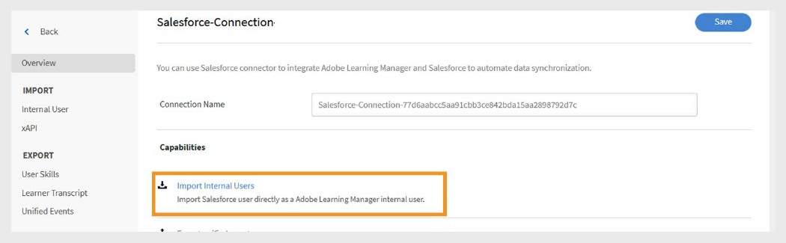

# Connettore Salesforce per Adobe Learning Manager

## Introduzione

Il connettore Salesforce integra gli account Salesforce e Adobe Learning Manager (ALM), consentendo l’importazione automatizzata degli utenti, la sincronizzazione dei dati e l’esportazione dei record di apprendimento. Questa guida spiega come configurare il connettore, gestire i dati utente e integrare le informazioni di apprendimento in Salesforce.

Il connettore Salesforce per Adobe Learning Manager consente l’integrazione senza problemi importando automaticamente gli utenti, supportando la mappatura dati personalizzata ed esportando i record della formazione in Salesforce.

Seguendo questa guida, imparerete a:

- Stabilire connessioni sicure tra Salesforce e Adobe Learning Manager.
- Configurare i processi automatizzati di importazione degli utenti da Salesforce.
- Mappatura efficace dei campi Salesforce agli attributi Adobe Learning Manager.
- Esporta i record della formazione in Salesforce per creare report completi.
- Impostare i filtri e la pianificazione per la sincronizzazione dei dati di destinazione.

## Che cos’è il connettore Salesforce?

Il connettore Salesforce è un potente strumento di integrazione che crea un ponte perfetto tra Salesforce CRM e Adobe Learning Manager. Questo connettore elimina l&#39;immissione manuale dei dati sincronizzando automaticamente le informazioni utente, i dati dei contatti e i record di apprendimento tra le due piattaforme.

## Funzionalità principali

### Mappatura degli attributi

Consente di creare collegamenti flessibili tra i campi Salesforce e gli attributi utente Adobe Learning Manager. Puoi mappare i campi standard come Nome, E-mail e Manager agli attributi corrispondenti in Learning Manager. Il connettore supporta inoltre campi personalizzati su entrambe le piattaforme, include la convalida dei campi obbligatoria per mantenere l’accuratezza dei dati e consente di salvare le configurazioni di mappatura per riutilizzarle nelle future importazioni.

### Importazione automatica degli utenti

Semplifica l&#39;onboarding e la manutenzione degli utenti attraverso processi di importazione automatizzati che eliminano la gestione manuale dei file CSV.

- Importazione diretta da oggetti utente Salesforce senza formati di file intermedi.
- Sincronizzazione in tempo reale delle modifiche apportate al profilo utente.
- Supporto per utenti standard e contatti esterni.

### Importazioni programmate automaticamente

Configurare pianificazioni di sincronizzazione automatizzate che gestiscano la valuta dei dati senza intervento manuale. Selezionare le opzioni di programmazione degli intervalli giornalieri, settimanali o personalizzati.

- Configurazione del fuso orario per le organizzazioni globali.
- Pianificazione picco/fuori picco per ottimizzare le prestazioni del sistema.

### Filtro utente

- Applicazione di criteri di filtro a gruppi specifici di utenti e ottimizzazione dell&#39;efficienza della sincronizzazione dei dati.
- Filtraggio basato sui ruoli per programmi di formazione mirati.
- Filtraggio geografico o basato sulla posizione per implementazioni regionali
- Filtraggio dei campi personalizzato mediante formule e criteri di Salesforce.

## Prerequisiti

Prima di configurare il connettore Salesforce, assicurati che l’ambiente in uso soddisfi i seguenti requisiti:

- [URL dell’organizzazione di Salesforce](https://myorg.salesforce.com)
- Credenziali di accesso amministratore per Salesforce e Adobe Learning Manager.
- Autorizzazioni amministratore di sistema o equivalenti in Salesforce.
- Account Adobe Learning Manager attivo con licenza appropriata

## Configurazione del connettore Salesforce

Il connettore Salesforce in Adobe Learning Manager consente agli Amministratori di integrazione di automatizzare la sincronizzazione dei dati utente e dei record di apprendimento tra Salesforce e Adobe Learning Manager.

Per creare un connettore Salesforce:

1. Accedi come Amministratore dell’integrazione.
2. Seleziona **Salesforce**, quindi seleziona **Connetti**.

   
   _Pagina connettori Adobe Learning Manager che mostra il connettore Salesforce con il pulsante Connetti evidenziato_

3. Digita l’URL dell’organizzazione Salesforce e seleziona **Connetti**. Viene aperta la pagina di accesso di Salesforce.

   
   _Modulo di accesso Salesforce con campi per l’immissione di nome utente e password_

4. Accedi con il tuo nome utente e la tua password. Completa tutti i passaggi di autenticazione aggiuntivi, come la verifica di due fattori o la risposta a domande di sicurezza.

   Dopo aver eseguito correttamente l’autenticazione, viene visualizzata la pagina con la panoramica del connettore, che conferma la connessione stabilita tra i sistemi.

   
   _Pagina con la panoramica del connettore Salesforce che mostra lo stato della connessione_

### Mapping attributi

L’associazione degli attributi per la mappatura degli attributi crea la connessione essenziale tra i campi di dati Salesforce e gli attributi utente Adobe Learning Manager, garantendo che le informazioni utente vengano trasferite in modo accurato tra i sistemi.

#### Requisiti di mappatura

- Tutti i campi Adobe Learning Manager obbligatori devono essere mappati ai campi Salesforce corrispondenti
- Le configurazioni di mappatura sono riutilizzabili e persistenti in più importazioni

Per mappare gli attributi:

1. Passa alla pagina con la panoramica del connettore Salesforce.
2. Seleziona **Utenti interni**, quindi seleziona **Configura mapping**.
3. Selezionate una delle seguenti opzioni:

   - **Utenti:** account Salesforce standard utilizzati da dipendenti o membri interni del team
   - **Contatti:** persone esterne come clienti, partner o fornitori.

4. Associa i campi attivi di Adobe Learning Manager alle colonne Salesforce nella pagina di mappatura. Il campo **Manager** deve essere mappato a un campo e-mail di user manager.

   
   _Interfaccia di mappatura dei campi che visualizza gli attributi utente di Adobe Learning Manager a sinistra e le selezioni a discesa dei campi Salesforce a destra_

5. Seleziona **Salva** per completare il mapping.

## Importazione di utenti e contatti

Il connettore Salesforce consente a Adobe Learning Manager di connettersi al tuo account Salesforce e di importare automaticamente gli utenti in base alla tua configurazione.

- **Utenti interni**: dipendenti e membri del personale con account utente Salesforce.
- **Contatti esterni**: clienti, partner, fornitori e altri stakeholder esterni.
- **Importazioni miste**: combinazione di utenti e contatti in un unico processo di sincronizzazione.
- **Importazioni filtrate**: sincronizzazione mirata in base a criteri specifici.

Il connettore Salesforce consente a Adobe Learning Manager di connettersi al tuo account Salesforce e di importare automaticamente gli utenti in base alla tua configurazione.

Il connettore supporta l’importazione di contatti oltre agli utenti Salesforce standard. Ciò consente di estendere i programmi di formazione a soggetti esterni, come clienti o partner.

Per importare i contatti:

1. Seleziona **Salesforce** nella pagina **Connettori**.
2. Seleziona **Importa utenti interni** nella pagina di connessione.

   
   _Pagina del connettore Salesforce con opzione Importa utenti interni evidenziata_

3. Seleziona **Contatti** nella pagina **Importa utenti**.
4. Selezionare **Sì** per l&#39;opzione **Filtra contatti prima dell&#39;importazione**. **
5. Configura le opzioni seguenti:

   - **Scegliere la colonna Contatti:** Selezionare il campo da importare in Adobe Learning Manager.
   - **Specificare i valori:** Selezionare i valori che rappresentano il campo selezionato.
   - Associa gli attributi Salesforce ai campi Adobe Learning Manager

   
   _Configurazione del contatto per l&#39;importazione che mostra le opzioni di filtro e la mappatura dei campi_

6. Seleziona **Salva**.
7. Se si seleziona **No. Importa tutti i contatti**, puoi associare direttamente i campi senza filtrare i contatti.

## Esportazione dei record della formazione

La funzionalità di esportazione dei record di apprendimento consente di condividere i dati Adobe Learning Manager con Salesforce, creando funzionalità complete di reporting e analisi che combinano i risultati dell’apprendimento con i dati CRM.

### Oggetti personalizzati in Salesforce

Prima di esportare i record della formazione da Adobe Learning Manager, crea oggetti personalizzati in Salesforce. Gli oggetti personalizzati consentono di memorizzare dati specifici per le esigenze dell&#39;organizzazione o del settore. Per ulteriori informazioni, consulta [Oggetti personalizzati di Salesforce](https://trailhead.salesforce.com/en/content/learn/modules/data_modeling/objects_intro).

### Installazione di pacchetti Adobe Learning Manager

Adobe fornisce pacchetti predefiniti che consentono di creare gli oggetti personalizzati necessari:

- [Pacchetto 1](https://test.salesforce.com/packaging/installPackage.apexp?p0=04t1k0000008WPJ): oggetti e campi di apprendimento di base
- [Pacchetto 2](https://test.salesforce.com/packaging/installPackage.apexp?p0=04t1k0000008WPT): oggetti di analisi di apprendimento estesi
- [Pacchetto 3](https://test.salesforce.com/packaging/installPackage.apexp?p0=04t1k0000008WPi): oggetti di reporting e integrazione aggiuntivi

>[!IMPORTANT]
>
>Sostituisci [test.salesforce.com](https://acrobat.adobe.com/home/test.salesforce.com) negli URL del pacchetto con il dominio effettivo dell’organizzazione Salesforce.

### Processo di installazione del pacchetto

Per installare i pacchetti:

1. Accedi a Salesforce come amministratore.
2. Passa all&#39;URL di ciascun pacchetto nel browser.
3. Segui la procedura guidata di installazione per ogni pacchetto e concedi le autorizzazioni appropriate agli utenti che accederanno ai dati di apprendimento.
4. Rinomina gli oggetti personalizzati in Salesforce.
5. Seleziona gli eventi e fai clic su **Salva**.

>[!NOTE]
>
>Assicurati che sia stato concesso l&#39;accesso come amministratore di sistema a tutti i campi attivi aggiunti dopo l&#39;installazione del pacchetto.

### Esportare i record

Per esportare i record in Salesforce:

1. Seleziona **Esporta record unificati** nella pagina dei connettori **Salesforce**.
2. Seleziona gli eventi tra i seguenti:

   - Aggiunta di nuovi utenti
   - Iscrizione al corso di formazione
   - Completamento del corso di formazione
   - Iscrizione abilità
   - Completamento delle abilità

3. Selezionare **Oggetto contatto** nell&#39;opzione **Collegamenti con**. In questo modo, gli utenti che esistono in Adobe Learning Manager ma non in Salesforce verranno creati in Salesforce.

   
   _Configurazione di esportazione del record di apprendimento che mostra le opzioni di selezione dell’evento e collegamento_

>[!NOTE]
>
>Puoi creare più connessioni in un singolo account. Ogni connessione può supportare fino a tre oggetti personalizzati in Salesforce. Per creare più connessioni per lo stesso account Salesforce, è possibile installare fino a tre pacchetti. Il numero di pacchetti installati deve corrispondere al numero di connessioni desiderate.

## Configurazione dell’applicazione Salesforce

Adobe Learning Manager fornisce un pacchetto dell’app Salesforce. Una volta installato e configurato nell’istanza di Salesforce, gli utenti delle vendite possono accedere e completare la formazione direttamente all’interno del portale Salesforce. L’app consente agli utenti di scoprire nuovi corsi, visualizzare consigli personalizzati e utilizzare i contenuti senza uscire da Salesforce.

### Accedere all’applicazione Salesforce

Per configurare l’applicazione Salesforce:

1. Accedi come Amministratore dell’integrazione.
2. Seleziona **Applicazioni**, quindi seleziona **App in primo piano**.
3. Seleziona **Salesforce**.

   
   _Pagina Applicazioni Adobe Learning Manager che mostra la sezione App in primo piano con il riquadro dell’app Salesforce evidenziato_

4. Prendi nota dell&#39;**ID applicazione** e del **segreto client** visualizzati nella casella di testo della descrizione.

   
   _Pagina dei dettagli dell’applicazione Salesforce in Adobe Learning Manager che mostra l’ID applicazione e il segreto client nella casella di descrizione_

5. Seleziona **Approva** per abilitare l&#39;applicazione.

### Genera token di accesso

Per generare token di accesso:

1. Accedi a **Risorse sviluppatore** in Adobe Learning Manager.
2. Seleziona **Token di accesso per test e sviluppo**.
3. Nella sezione **Ottieni codice OAuth**, digita l&#39;ID client (ID applicazione) e l&#39;ambito deve essere impostato su **admin:read,admin:write**.
4. Seleziona **Invia**.
5. Nella sezione **Ottieni token di aggiornamento**, digita **ID client** e **segreto client**.
6. Seleziona **Invia** e annota il token di aggiornamento e il token di accesso.

>[!IMPORTANT]
>
>Annota il token di aggiornamento generato e il token di accesso.

### Creazione di un account Salesforce

Se non disponi di un account Salesforce, segui questi passaggi per crearne uno utilizzando lo stesso indirizzo e-mail del tuo account Adobe Learning Manager. È possibile utilizzare l&#39;edizione Developer o Enterprise. È importante registrarsi utilizzando lo stesso ID e-mail associato al proprio account Adobe Learning Manager.

1. Passa alla [pagina di iscrizione per gli sviluppatori Salesforce](https://developer.salesforce.com/signup).
2. Digita i dettagli richiesti utilizzando lo stesso indirizzo e-mail utilizzato per il tuo account Adobe Learning Manager.
3. Controlla la tua casella di posta e verifica il tuo account tramite l’e-mail inviata da Salesforce.
4. Imposta la password e accedi a Salesforce.
5. Dopo aver effettuato l’accesso, annota l’URL di Salesforce (ad esempio, https://yourorg.lightning.force.com) da utilizzare durante la configurazione.

### Installazione del pacchetto Adobe Learning Manager

Questa sezione descrive l’installazione del pacchetto Adobe Learning Manager nell’ambiente Salesforce.

>[!IMPORTANT]
>
>L’app Adobe Learning Manager supporta solo la visualizzazione Salesforce Lightning. Prima di procedere, assicurati che Lightning Experience sia abilitato.

#### Installare il pacchetto

Per installare il pacchetto:

1. Apri l&#39;[URL del pacchetto Adobe Learning Manager](https://login.salesforce.com/packaging/installPackage.apexp?p0=04t1k0000008WOQ).
2. Digitare il nome utente e la password nella pagina di accesso.
3. Seleziona **Installa**. Nella pagina di installazione, mantieni selezionata l&#39;opzione Installa solo per amministratori; non modificarla.
4. Seleziona **Fine**. Verrà visualizzata la pagina **Pacchetti installati**, in cui è possibile visualizzare il pacchetto Adobe Learning Manager installato.

Verrai reindirizzato alla pagina Pacchetti installati, dove potrai verificare l’installazione del pacchetto Adobe Learning Manager

#### Configurare l’applicazione

Per configurare l&#39;applicazione:

1. Seleziona **Modulo di avvio app** (icona della griglia a 9 punti accanto a Configurazione)
2. Cerca Adobe Learning Manager.
3. Per configurare l&#39;app, seleziona **Configura**.
4. Seleziona **Nuovo** e aggiungi i seguenti dettagli:

   - **Configurazione:** immetti il nome che preferisci.
   - **ID client**: immetti il valore ottenuto nella prima sezione.
   - **Segreto client:** Immettere il valore ottenuto nella prima sezione.
   - **Token di aggiornamento:** Immettere il valore ottenuto nella prima sezione.
   - **LearningManagerBaseURL:** URL del sito in cui è ospitato Adobe Learning Manager.

### Configurazione del sito remoto

Salesforce richiede le impostazioni del sito remoto per consentire la comunicazione con servizi esterni come Adobe Learning Manager.

#### Aggiunta delle impostazioni del sito remoto

Per aggiungere le impostazioni del sito remoto:

1. In Salesforce, seleziona **Configurazione** nell’angolo in alto a destra.
2. Seleziona **Configurazione** nell&#39;angolo superiore destro della pagina.
3. Cercare **Impostazioni sito remoto** in **Ricerca rapida**.
4. Seleziona **Nuovo sito remoto**.
5. Immetti i seguenti dettagli:

   - **Nome sito remoto:** Digitare un nome desiderato, ad esempio Adobe Learning Manager.
   - **URL sito remoto:** Digitare l&#39;URL in cui è ospitato Adobe Learning Manager.
6. Seleziona **Salva**.

### Configurare le notifiche

Configura le notifiche per informare gli utenti sulle attività di apprendimento e sugli aggiornamenti.

#### Creazione di notifiche personalizzate

Per abilitare le notifiche:

1. Seleziona **Configurazione** nell&#39;angolo superiore destro.
2. Cerca **Notifiche personalizzate** e seleziona **Nuovo**.
3. Digita i seguenti dettagli:

   - **Nome notifica personalizzata:** LearningManagerNotification
   - **Nome API:** LearningManagerNotification

4. Seleziona entrambi i canali **Desktop** e **Mobile** come canali supportati.
5. Seleziona **Salva**.

#### Abilita le notifiche push per dispositivi mobili (facoltativo)

Per gli utenti che desiderano ricevere notifiche sui dispositivi mobili:

Per abilitare le notifiche push per i dispositivi mobili, esegui le operazioni descritte di seguito:

1. Installa l’app mobile Salesforce sul tuo cellulare.
2. Accedi all’app utilizzando le tue credenziali.
3. Passa a **Configurazione**, quindi seleziona **Impostazioni di invio delle notifiche**.
4. Aggiungi Salesforce per iOS e Android.

### Configurazione utente e autorizzazioni

Questa sezione descrive la configurazione dell’accesso utente e delle autorizzazioni per l’app Adobe Learning Manager all’interno di Salesforce.

#### Informazioni sui profili utente

L&#39;app Adobe Learning Manager supporta vari profili utente che corrispondono ai ruoli in Adobe Learning Manager:

- L’Amministratore
- Amministratore dell’integrazione
- Istruttore
- Allievo
- Profili personalizzati (in base alle esigenze)

#### Assegnare o creare profili utente

Puoi utilizzare i profili esistenti o creare profili personalizzati per gli utenti di Adobe Learning Manager:

**Usa profili esistenti**

1. Passa a **Configurazione** e seleziona **Utenti**.
2. Seleziona **Profili**.
3. Seleziona un profilo che si allinei ai ruoli degli utenti
4. Assegna questo profilo agli utenti durante l&#39;installazione del pacchetto.

**Creazione di profili personalizzati**

1. Passa a **Configurazione** e seleziona **&#x200B; utenti. &#x200B;**
2. Seleziona **Profili**.
3. Fai clic su **Nuovo profilo**.
4. Crea un profilo personalizzato basato su un profilo esistente, personalizzato in base agli utenti Adobe Learning Manager.

#### Configurare il profilo

Per configurare un profilo:

1. Dopo aver installato il pacchetto, seleziona **Configura** e quindi seleziona **Nuovo**.
2. Digita i seguenti dettagli:

   - **Nome configurazione**
   - **ID client**
   - **SegretoClient**
   - **LearningManagerBaseURL**
   - **Disattiva reindirizzamento**

>[!NOTE]
>
>Assicurati che l’app Adobe Learning Manager sia abilitata per tutti gli Allievi per visualizzarla.

#### Imposta autorizzazioni utente

Seleziona gli utenti e assegna le autorizzazioni necessarie per accedere all&#39;app Adobe Learning Manager.

#### Aggiorna impostazioni profilo

1. Seleziona un profilo (ad esempio, Profilo standard) e quindi seleziona **Modifica**.
2. Nella sezione **Impostazioni app personalizzate**, seleziona la casella **Adobe Learning Manager** per rendere l&#39;app accessibile.
3. Nella sezione **Impostazioni schede personalizzate**, imposta **Home Allievo** su **Attivato per impostazione predefinita**.
4. Seleziona **Salva** per applicare le modifiche.

Gli Allievi con i profili assegnati ora possono accedere all’app Adobe Learning Manager in Salesforce.

Hai configurato correttamente il connettore Salesforce per Adobe Learning Manager. Gli utenti possono ora accedere ai contenuti di apprendimento direttamente in Salesforce, migliorando l’adozione e il coinvolgimento con i programmi di formazione dell’organizzazione.
