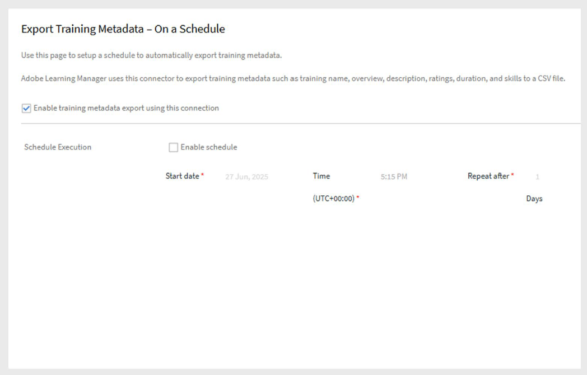

# Connettore Accesso ai dati di formazione in Adobe Learning Manager

## Introduzione

Il **connettore Accesso ai dati di formazione** consente di creare un&#39;esperienza di apprendimento headless che può essere autonoma o integrata in un&#39;interfaccia personalizzata creata con **Siti Adobe Experience Manager (AEM)**. Questo connettore consente di recuperare e visualizzare contenuti di formazione aggiornati per gli Allievi, con funzionalità di ricerca e filtro.

>[!IMPORTANT]
>
>- Questa funzione è disponibile solo se Adobe Learning Manager viene venduto come **componente aggiuntivo** a Adobe Experience Manager.
>- I dati del corso recuperati tramite questo connettore vengono aggiornati ogni 24 ore
>- Questo connettore non è self-service per la creazione di un&#39;esperienza headless o AEM-based non-logged-in. Per pianificare l’approccio corretto per il tuo caso d’uso, contatta Adobe.

## Come funziona

Una volta abilitato il connettore, Adobe Learning Manager espone un set di API pubbliche che forniscono i metadati di formazione, come corsi, percorsi di apprendimento e certificati. Puoi utilizzare queste API per creare un front-end personalizzato e con marchio che visualizzi il contenuto del corso di formazione e supporti le funzionalità di ricerca e filtro.

## Configurazione del connettore Accesso ai dati di formazione

Puoi integrare Adobe Learning Manager con il tuo sistema di archiviazione e ricerca dei dati per inviare i metadati di formazione ad AEM Sites o ad altre esperienze headless.

Per configurare il connettore:

1. Accedi a Adobe Learning Manager come amministratore di integrazione.
2. Passa il mouse sul riquadro **Accesso ai dati di formazione** e seleziona **Connetti**.

   
   _Selezionare Connetti per configurare il connettore Accesso ai dati di formazione_

3. Digitare un **nome connessione**.
4. Selezionare il **tipo di interfaccia**:

   - **Learning Manager nativo**: esperienza di accesso standard, disponibile per impostazione predefinita.
   - **Interfacce headless**: opzione Premium che espone le API pubbliche per un front-end headless non connesso.

   
   _Digitare i dettagli necessari per la configurazione del connettore Accesso ai dati di formazione_

5. Seleziona **Connetti**. Adobe Learning Manager genera automaticamente **l&#39;URL di base** e **l&#39;URL CDN**. Utilizzerai questi URL nel tuo sito o nella tua app personalizzata per recuperare i dati di formazione.

>[!NOTE]
>
>I clienti del piano Premium ricevono un URL API diverso da quello dei clienti standard.

## Esportare i metadati del corso di formazione

Per esportare i metadati del corso di formazione:

1. Seleziona **Esporta metadati di formazione** nella pagina del connettore.
2. Seleziona **Abilita esportazione dei metadati di formazione utilizzando questa connessione** per iniziare a inviare i dati di formazione al sistema di ricerca e recupero.
3. Selezionare **Abilita pianificazione** e impostare la data, l&#39;ora e l&#39;intervallo di inizio.

   
   _Pianifica l&#39;esportazione per i metadati del corso di formazione_

4. Seleziona **Salva**.

   - In questo modo verranno caricate automaticamente tutte le immagini del corso, del percorso di apprendimento e del certificato nel **CDN**.
   - Esporta anche i metadati associati nel sistema di ricerca.

### Esportazioni su richiesta

- **Esegui esportazioni su richiesta:** Vai a **Su richiesta**, imposta la **Data di inizio** e seleziona **Esegui** per eseguire un&#39;esportazione quando necessario.
- **Controllare lo stato di esecuzione:** Visualizzare lo stato di avanzamento e la cronologia dell&#39;esportazione nella pagina **Stato esecuzione**.

## Creare e pubblicare il sito Web in AEM

Per visualizzare i dati di formazione su un sito Web headless o basato su AEM Sites:

1. **Installare il pacchetto AEM** dal [repository GitHub di Adobe](https://github.com/adobe/adobe-learning-manager-reference-site/releases/tag/1.0.0) (prerequisito).
2. Utilizza **URL di base**, **URL CDN**, **ID client**, **Segreto client** e **Token di aggiornamento amministratore** per creare una configurazione in AEM.
3. Creare il sito utilizzando i componenti AEM.
4. Publish è il sito per gli Allievi.
5. Per informazioni dettagliate sulla configurazione completa, vedere [questo articolo](https://experienceleague.adobe.com/it/docs/learning-manager/using/integration/aem-sites/adobe-learning-manager-integration-aem) e [questo articolo](https://experienceleague.adobe.com/it/docs/learning-manager/using/integration/aem-sites/integrate-aem-learning-manager).

### Esperienza di apprendimento

Una volta che il sito è attivo:

- Nel sito Web vengono visualizzati tutti i **corsi**, **percorsi di apprendimento** e **certificati** recuperati da Adobe Learning Manager tramite il sistema di ricerca.
- Gli Allievi che **non hanno effettuato l’accesso** possono sfogliare e visualizzare i dettagli del corso.
- Quando un Allievo fa clic per iscriversi a un corso, a un percorso di apprendimento o a un certificato, gli viene richiesto di **accedere** per completare l’iscrizione e avviare il corso di formazione.

## Esperienza senza accesso

L’esperienza senza accesso consente di creare un’esperienza in tempo reale per gli utenti che non hanno effettuato l’accesso. Ad esempio, un&#39;esperienza senza accesso funge da pagina di destinazione per campagne di marketing per incoraggiare l&#39;iscrizione.

L&#39;esperienza senza accesso in Adobe Learning Manager può essere configurata utilizzando il connettore **Accesso ai dati di formazione**. Il connettore offre le seguenti offerte:

- Offerta standard
- Offerta premium

### Offerta standard

L’offerta standard prevede la creazione della versione nativa di Adobe Learning Manager. Gli utenti possono creare un’esperienza headless solo dimostrativa, senza accesso. L’esperienza headless dimostrativa non è scalabile e non deve essere utilizzata in un ambiente di produzione.

### Offerta premium

L&#39;offerta premium consente agli utenti di creare un&#39;interfaccia headless configurata dal connettore **Accesso ai dati di formazione**. Ciò consente agli utenti di ottenere dati in tempo reale sui dettagli del corso e del percorso di apprendimento come nome, descrizione, autore, abilità, durata, ecc. Per scenari di apprendimento misto, ottieni anche limiti di posti in tempo reale, posti occupati, limiti della lista d’attesa e conteggi delle liste d’attesa. I clienti possono utilizzare queste API per creare funzionalità di ricerca e filtro e un riepilogo completo del corso per gli Allievi non connessi.

I clienti possono acquistare un piano premium per creare questa esperienza altamente scalabile senza accesso.

>[!NOTE]
>
>Per acquistare il piano premium, contatta il team di supporto o il CSM.

Dopo che un utente ha acquistato un piano, il team CSM attiverà il piano premium per tale utente. Tramite il connettore Accesso ai dati di formazione, gli utenti possono configurare un’esperienza senza accesso con le funzioni menzionate in precedenza.
