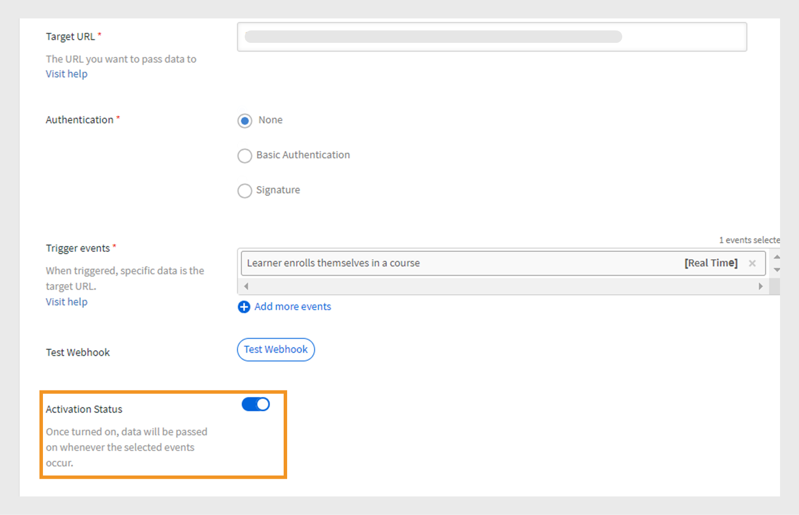

# Webhook

Un webhook consente a un’entità di inviare automaticamente dati o notifiche in tempo reale a un’altra entità quando si verifica un evento specifico. Ciò consentirà a un&#39;applicazione di fornire informazioni ad altre applicazioni senza richiederle costantemente. Ad esempio, se un utente completa un corso LMS (Learning Management System), un webhook può inviare automaticamente tali informazioni a un’altra piattaforma, ad esempio un CRM o uno strumento di reporting. I webhook sono spesso utilizzati nelle integrazioni per automatizzare i processi e ridurre la necessità di aggiornamenti manuali tra i sistemi. Configura i webhook fornendo un URL di richiamata a cui invieresti i dati.

## Webhook e API

I webhook e le API aiutano i sistemi a comunicare tra loro, ma funzionano in modi diversi. Con le API, le informazioni vengono condivise solo quando l’utente le richiede. Ad esempio, se un Allievo richiede i dati di avanzamento del corso, invia una richiesta all’API, che fornisce le informazioni. D’altra parte, i webhook inviano automaticamente i dati immediatamente quando si verifica un evento. Ad esempio, se un Allievo completa un corso, invierà immediatamente i dati all’URL del listener senza alcuna richiesta manuale.

## Cosa sono le API in tempo reale?

Le API in tempo reale consentono alle applicazioni di scambiarsi istantaneamente i dati quando si verifica un evento. A differenza delle API tradizionali, che aspettano che un utente richieda informazioni, le API in tempo reale condividono i dati nel momento in cui si verificano. I webhook agiscono come API in tempo reale e aiutano a condividere i dati immediatamente ogni volta che si verifica l’evento specificato. L&#39;API in tempo reale garantisce che il trasferimento dei dati avvenga immediatamente senza necessità di alcuna richiesta manuale, consentendo ai sistemi di rimanere aggiornati all&#39;istante.

## Eventi webhook

Gli eventi webhook sono azioni specifiche che si verificano in un sistema che invia automaticamente i dati a un URL del listener. Ad esempio, quando un Allievo si iscrive a un corso, viene attivato un evento webhook che invia i dettagli dell’iscrizione all’URL del listener.
Gli eventi webhook sono classificati in due categorie:

* **Eventi in tempo reale**: gli eventi vengono elaborati e inviati in tempo reale a un URL di destinazione
* **Eventi non in tempo reale**: gli eventi vengono elaborati in batch e inviati in orari specifici anziché in tempo reale

## URL listener

Un URL del listener è un endpoint o una destinazione che riceve informazioni sui dati quando si verifica un evento. Ogni volta che si verifica un evento specifico, ad esempio l’iscrizione di un utente a un corso, il sistema invia automaticamente i dettagli a questo URL senza alcuna richiesta manuale. L’URL del listener è l’indirizzo a cui vengono inviati tutti questi aggiornamenti.
Webhook invia le informazioni pertinenti in formato JSON. Ecco un payload di esempio per un evento attivato in Adobe Learning Manager:

```
{
  "accountId": 1010,
  "events": [
    {
      "eventId": "d5fb7071-10a9-46b2-9f9e-79dde346c052",
      "eventName": "COURSE_ENROLLMENT_BATCH",
      "timestamp": 1727414643000,
      "eventInfo": "1727414643000-047210-84242-0",
      "data": {
        "userId": 4279332,
        "loId": "course:7374992",
        "loInstanceId": "course:7376092_10250977",
        "loType": "course",
        "enrollmentSource": "ADMIN_ENROLL",
        "dateEnrolled": 1727414643
      }
    }
  ]
}
```

## Creazione e gestione dei webhook - Amministratore dell’integrazione

Segui i passaggi seguenti per creare l’integrazione Webhook in Adobe Learning Manager:

1. Accedi come **[!UICONTROL Amministratore dell’integrazione]**.
2. Nella pagina principale, seleziona **[!UICONTROL Webhook]** > **[!UICONTROL Aggiungi webhook]**.

   
   _Aggiungi un webhook_

3. Digita **[!UICONTROL Nome]** e **[!UICONTROL Descrizione]** del webhook.
4. Digitare l&#39;URL del listener come **[!UICONTROL URL di destinazione]** in cui si desidera passare i dati dell&#39;evento.
5. Seleziona uno dei metodi di autenticazione:
L’autenticazione nei webhook è un metodo di sicurezza per garantire che i dati inviati a un URL listener provengano da una fonte attendibile.
   * **[!UICONTROL Nessuno]**: nessuna autenticazione richiesta.
   * **[!UICONTROL Base]**: autenticazione basata su credenziali. Immetti il nome utente e la password.
   * **[!UICONTROL Firma]**: il sistema crea una firma speciale e la aggiunge ai dati del webhook. Il server ricevente controlla il codice per verificare che i dati siano reali e che non siano stati modificati. Genera una firma da utilizzare per l’autenticazione. Scarica la firma come JSON.
6. Seleziona gli eventi Webhook dal menu a discesa **[!UICONTROL Eventi trigger]**.

   >[!NOTE]
   >
   >Puoi anche testare i webhook selezionando l’opzione Verifica webhook dalla pagina Aggiungi webhook.

7. Seleziona l&#39;interruttore **[!UICONTROL Stato attivazione]** per abilitare il webhook. Una volta abilitata, i dati verranno passati ogni volta che si verificano gli eventi selezionati.

>[!NOTE]
>
>Puoi creare e gestire fino a 5 webhook.

### Modifica webhook - Amministratore dell’integrazione

Segui questi passaggi per modificare i webhook da Adobe Learning Manager:

1. Accedi come **[!UICONTROL Amministratore dell’integrazione.]**
2. Seleziona **[!UICONTROL Webhook]** nella pagina principale.
3. Seleziona il webhook da modificare.

   
   _Modificare il webhook_
4. Seleziona **[!UICONTROL Modifica]** per modificare i dettagli del webhook e seleziona **[!UICONTROL Salva]**.

### Rimuovere I Webhook - Amministratore Dell’Integrazione

Segui questi passaggi per modificare i webhook da Adobe Learning Manager:

1. Accedi come **[!UICONTROL Amministratore dell’integrazione]**.
2. Seleziona **[!UICONTROL Webhook]** nella pagina principale.
3. Seleziona il webhook da eliminare.
4. Seleziona **[!UICONTROL Elimina]** per rimuovere i webhook.


_Rimuovi il webhook_

### Rimozione dei webhook - Amministratore dell’integrazione

Segui questi passaggi per ritirare i webhook:

1. Accedi come **[!UICONTROL Amministratore dell’integrazione]**.
2. Seleziona **[!UICONTROL Webhook]** nella pagina principale.
3. Seleziona il webhook da modificare.
4. Seleziona **[!UICONTROL Modifica]** e disabilita **[!UICONTROL Stato attivazione]** per ritirare il webhook.


_Rimozione del webhook_
