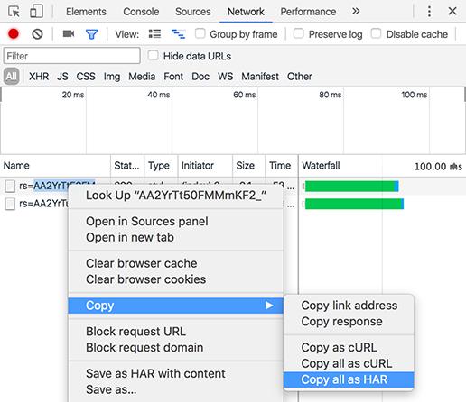

# Generazione di un file HAR

Continua a scoprire come generare file HAR in Google Chrome.

Per generare un file HAR, attieniti alla seguente procedura:

1. Apri una finestra di Google Chrome e apri una nuova scheda.
1. Apri gli strumenti per sviluppatori per la pagina e fai clic con il tasto destro del mouse su Ispeziona Elemento.
1. Apri la scheda **[!UICONTROL Rete]**. Assicurati che il pulsante di registrazione rosso sia attivo. Attiva la casella di controllo **[!UICONTROL Conserva registro]**.

   

   *Selezionare la casella di controllo Mantieni registro nella scheda Rete*

1. Accedi a [Learning Manager](https://learningmanager.adobe.com/acapindex.html) usando le tue credenziali e segui il corso. Esegui tutte le operazioni che provocheranno il problema.
1. Negli strumenti per sviluppatori, fai clic con il pulsante destro del mouse e seleziona **Salva tutto come HAR con contenuto**.

   In alcune versioni di Google Chrome, potrebbe essere necessario selezionare **[!UICONTROL Copia]** > **[!UICONTROL Copia tutto come HAR]**.

   

   *Copia tutti i file HAR*

1. Incolla il contenuto copiato in un file di blocco note. Salvalo sul desktop come **logs.har** e invialo tramite e-mail ad Adobe.
