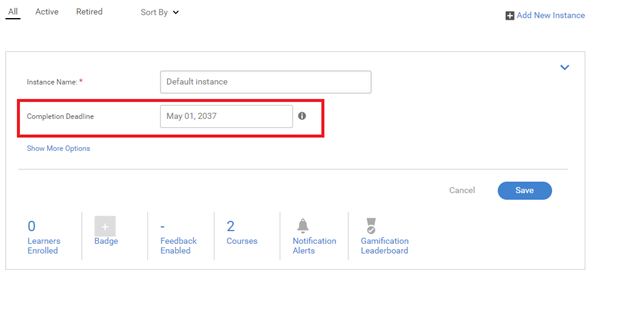

# Problemi relativi al ritiro di un programma di apprendimento

## Problema

Un programma di apprendimento viene automaticamente ritirato.

## Causa

In alcune situazioni un programma di apprendimento è stato ritirato senza che un Amministratore/Autore abbia esplicitamente ritirato il programma.

Questo problema si verifica perché un programma di apprendimento è una raccolta di corsi. I corsi di formazione di ordine superiore vengono ritirati se uno dei corsi al loro interno contiene un’istanza ritirata o se l’istanza del corso viene ritirata.

## Risoluzione

Per controllare il corso che contiene un&#39;istanza ritirata, segui i passaggi riportati di seguito:

1. Accedi come Amministratore e avvia il programma di apprendimento pertinente.

1. Fai clic **[!UICONTROL Istanze]** > **Ccorsi**. Nella pagina sono elencati tutti i corsi inclusi in questo programma di apprendimento. Potrai visualizzare il corso che contiene un’istanza ritirata.

   

   *Visualizza elenco di tutti i corsi*

1. Dopo aver individuato l’istanza del corso che è stata ritirata, fai clic su **[!UICONTROL Corsi]** > **[!UICONTROL Apri il corso]**.

1. Fai clic **[!UICONTROL Istanze]**. Nell&#39;istanza ritirata fare clic su **[!UICONTROL Modifica]** quindi modifica la data di completamento impostandola su una data futura in cui desideri che l’istanza venga ritirata.

   

   *Modificare la data di completamento di un corso*

1. Al termine, fai clic sul menu a discesa come illustrato nell’immagine seguente. Quindi fai clic su **[!UICONTROL Riapri istanza]**.

   

   *Riaprire l’istanza di un corso*

1. Visita il programma di apprendimento pertinente. Fai clic **[!UICONTROL Istanze]** ed eseguire il passaggio precedente per riaprire l’istanza del programma di apprendimento.
