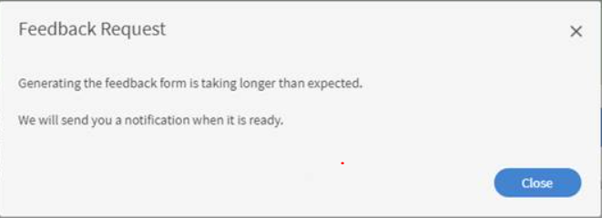

# Il popup automatico del feedback L1 non viene visualizzato

## Problema

Il popup automatico del feedback L1 non viene visualizzato per un Allievo dopo aver completato il corso.

## Causa

A volte può accadere che un Allievo non riceva il feedback L1 dopo aver completato un determinato corso o che riceva un messaggio come illustrato di seguito:

*Impossibile ricevere feedback L1*

Ciò può verificarsi per i seguenti motivi:

1. Il feedback non è impostato per essere visualizzato dopo il completamento del corso.
1. Promemoria disattivati.
1. Un promemoria è programmato per essere visualizzato dopo un determinato periodo di tempo.

## Risoluzione

1. Assicurati che l’opzione &quot;Mostra questionario immediatamente dopo il completamento del corso&quot; sia abilitata in **Corso** > **Istanze** > **Feedback L1**.
   <!---->
1. Come Amministratore, passa a **Impostazioni > Feedback**. Verifica quando è programmato il promemoria. Nel caso in cui sia programmato per **Dopo il corso** , modifica l’opzione in **Nel corso** completamento.
1. Abilita i seguenti modelli e-mail: **Modelli e-mail > Promemoria e aggiornamenti > Richiedi feedback dell’Allievo per corso**. Se l’opzione è disattivata, attivala e prova.
1. Se i passaggi precedenti non funzionano, elimina il promemoria presente in **Amministratore > Impostazioni > Feedback**. Creane uno per &quot;Al completamento del corso&quot; e imposta la ricorrenza in base ai requisiti.
