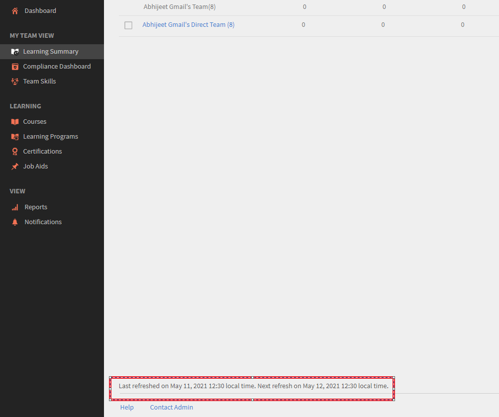

# In Riepilogo apprendimento non vengono visualizzati i dati correnti

## Problema

In Adobe Learning Manager, in Riepilogo apprendimento non vengono visualizzati i dati correnti per Iscrizione, Completamento o Progressi.

Si tratta dei casi in cui un Allievo completa un corso, ma i dati non sono visibili nel Riepilogo apprendimento quando visualizzato da un Amministratore o un Manager.

## Causa

Il problema si verifica perché il Riepilogo apprendimento viene aggiornato in momenti diversi, in base ai criteri selezionati.

## Durata aggiornamento

I dati nel Riepilogo apprendimento vengono aggiornati in base alle seguenti pianificazioni:

1. **Mese corrente:** i dati vengono aggiornati ogni giorno. Puoi visualizzare l’ultima ora di aggiornamento nella parte inferiore della pagina.
1. **Ultimi 3 mesi completi:** Questi dati vengono aggiornati una volta al mese.
1. **Ultimi 12 mesi completi:** Questi dati vengono aggiornati una volta al mese.

*Nella parte inferiore della pagina viene visualizzato un messaggio di aggiornamento dei dati*
