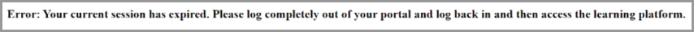

# Problemi di accesso in Learning Manager

## Il problema

Non è possibile accedere a Learning Manager.

## Errore

Durante il tentativo di accesso ad Adobe Learning Manager, compare il messaggio di errore riportato di seguito:

*Messaggio di errore per una sessione scaduta*

## Causa

Quando un utente accede tramite SSO, viene creato un cookie di sessione che viene archiviato nel browser. Consente inoltre all’utente di accedere ad altre applicazioni. La maggior parte degli SSO è configurata per la disconnessione dopo 24 ore. L’utente deve ripetere l’autenticazione per una nuova sessione.

In alcuni casi, un utente non è in grado di accedere al sistema a causa di cookie SSO non aggiornati. Questi cookie vengono inoltrati ad Adobe Learning Manager per l’autenticazione. La sessione non termina se un utente non chiude il browser per molto tempo o non si è disconnesso.

Adobe Learning Manager rifiuta questi cookie non aggiornati, con conseguente errore.

## Risoluzione

Se un cookie non aggiornato viene rifiutato da Adobe Learning Manager, prova le opzioni seguenti:

1. Cancella la cache e i cookie del browser. Per ulteriori informazioni, consulta questo [documento](unable-log-in-learning-manager.md).

   In alternativa, l’amministratore IDP può forzare la disconnessione dopo un determinato periodo di tempo impostato. Questo passaggio consente di autenticare nuovamente l’utente per iniziare una nuova sessione.

Ci sono altre cause per cui si verifica questo errore, ma questa è quella più comune.

## Collegamenti di riferimento:

[Microsoft: sessione di accesso condizionale nel corso della vita](https://docs.microsoft.com/it-it/azure/active-directory/conditional-access/howto-conditional-access-session-lifetime)
