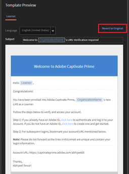

# I link e-mail attivati da modelli modificati generano un errore in Learning Manager

## Problema

Si verifica un errore quando si fa clic su un link all’interno di un’e-mail automatica, un’e-mail di benvenuto o un’email di iscrizione.

**Errore**

HTTP Status 400 - Bad request

## Causa

Questo di solito accade quando i modelli e-mail non sono personalizzati correttamente.

**Soluzione**

Per evitare errori relativi a link non funzionanti, che potrebbero verificarsi a causa della personalizzazione, segui la procedura riportata di seguito:

1. Accedi come Amministratore.
1. Nel pannello a sinistra, fai clic su **[!UICONTROL Modelli e-mail]**.

1. Individua il modello di cui hai bisogno e fai clic per modificarlo.

   In questo modo, si apre la finestra **Anteprima modello**.

   

   Quando modifichi un modello e-mail, ricorda quanto segue:

   * Ti consigliamo di modificare un modello e-mail a partire dall’interfaccia di Learning Manager.
   * Copia e incolla il modello modificato su un file Blocco note o Word per memorizzare una copia delle modifiche apportate.
   * Evita di sostituire il testo dinamico evidenziato in blu all’interno del modello. Ad esempio, &quot;**OrganizationName**&quot;, &quot;**Allievo**&quot;, &quot;**fai clic qui**&quot;, &quot;**CertificateName**&quot; e così via.

1. Fai clic su **[!UICONTROL Salva]** per confermare le modifiche applicate al modello.
1. Prova a far partire l’e-mail per verificare il corretto funzionamento dei link.
1. Ripristina le impostazioni originali facendo clic sull&#39;opzione **Ripristina originale** per il modello modificato.
