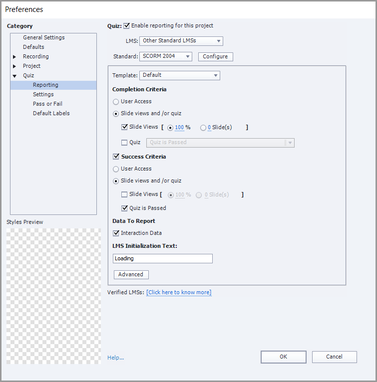

# Il modulo risulta incompleto al termine del corso su Adobe Learning Manager

## Il problema

Il modulo risulta incompleto anche dopo che un Allievo ha completato un corso in Adobe Learning Manager.

## Causa

SCORM 2004 definisce i criteri di successo e di completamento e invia i due riepiloghi separatamente.

Ad esempio, prendiamo il caso di un set di contenuti in cui **Criteri di completamento** sia impostato su 100% visualizzazioni diapositive e **Criteri di successo** su &quot;Quiz superato&quot;.

Un allievo completa il corso ma non supera il quiz. In questo caso, l’avanzamento è del 100%, ma il modulo risulta incompleto perché l’allievo non soddisfa i **criteri di successo**.

## Soluzione

Il problema riguarda le **Preferenze** di reporting impostate per il progetto. L’autore deve verificare i criteri di completamento e di successo del corso.

Se sono necessarie modifiche, l’autore può effettuarle con uno strumento di authoring dei contenuti, ad esempio Adobe Captivate Classic. L’autore può quindi aggiornare il modulo di conseguenza.

*Visualizza Captivate preferenze report classiche*
