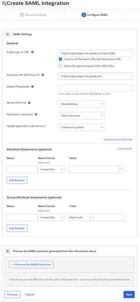
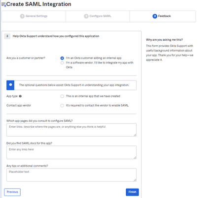

# Integrazione di Okta Active Directory con Adobe Learning Manager {#okta-active-directory-integration-with-adobe-learning-manager}

Questo documento descrive come integrare Adobe Learning Manager con Okta Active Directory (AD). Quando si integra Adobe Learning Manager con Okta AD, è possibile:

* Verificare l’accesso dell’utente di Learning Manager a Okta AD.
* Consentire agli utenti di accedere automaticamente ad Adobe Learning Manager con i loro account Okta AD.
* Gestire i propri account in una posizione centralizzata, ovvero il portale Okta.

Adobe Learning Manager supporta l’SSO avviato dal provider di identità (Identity Provider o IdP) e dal fornitore di servizi (Service Provider o SP).

## Crea un’applicazione in OKTA

1. Accedi come Amministratore a Okta AD.
1. Fai clic su **[!UICONTROL Applicazioni]**. Viene aperto l’Application Store di Okta.

   

   *Visualizza archivio applicazioni a Okta*

1. Fai clic su **[!UICONTROL Crea integrazione app]**.

   

   *Seleziona Crea Integrazione App*

1. Seleziona **[!UICONTROL SAML 2.0]** dalla nuova finestra di integrazione dell&#39;app.

   

   *Selezionare l&#39;opzione SAML2.0*

1. Seleziona **[!UICONTROL Crea integrazione SAML]** > **[!UICONTROL Pagina delle impostazioni generali]**. Immettere un nome applicazione.

   Può essere un nome qualsiasi per identificare in modo univoco l’applicazione. Una volta completata la procedura, fai clic su **[!UICONTROL Avanti]**.

   

   *Immettere il nome dell&#39;applicazione*

1. Nella pagina Configura impostazioni SAML, segui i passaggi riportati di seguito:

   **Per l&#39;installazione IDP:**

   1. Nel campo URL Single Sign-on, digita l&#39;URL: [https://learningmanager.adobe.com/saml/SSO](https://learningmanager.adobe.com/saml/SSO)
   1. Nel campo URL pubblico digitare l&#39;URL: [https://learningmanager.adobe.com](https://learningmanager.adobe.com/)
   1. Nella casella a discesa **Formato ID nome**, seleziona **Indirizzo e-mail**.
   1. Nel menu a discesa **Nome utente applicazione** seleziona Nome utente Okta.
   1. Se si desidera fornire attributi aggiuntivi, è possibile aggiungerli nella **Dichiarazione degli Attributi** (facoltativo)

   

   *Aggiungi attributi SAML*

   **Per l&#39;installazione dell&#39;SP:**

   1. Nel campo URL Single Sign-on, digita l&#39;URL: [https://learningmanager.adobe.com/saml/SSO](https://learningmanager.adobe.com/saml/SSO)
   1. Nel campo URL pubblico digitare l&#39;URL: [https://learningmanager.adobe.com](https://learningmanager.adobe.com/)
   1. Nella casella a discesa Formato ID Nome, seleziona **Indirizzo e-mail**.
   1. Nel menu a discesa Nome utente applicazione, seleziona Nome utente Okta.
   1. Fai clic su **Mostra impostazioni avanzate**.
   1. In **Algoritmo di firma**, seleziona RSA-SHA256
   1. In **Algoritmo di asserzione**, seleziona SHA256
   1. Nella casella a discesa **Crittografia di asserzione** seleziona **Crittografato**.

   1. Nell’opzione **Certificato di crittografia**, carica il file di certificato condiviso da Adobe.
   1. Se si desidera fornire attributi aggiuntivi, è possibile aggiungerli nella **Dichiarazione degli Attributi** (facoltativo).

   

   *Aggiungere attributi aggiuntivi*

   Una volta completata la procedura, fai clic su **[!UICONTROL Avanti]**.

1. La scheda **Feedback** è facoltativa. Dopo aver selezionato le opzioni e fornito il tuo feedback, fai clic su **[!UICONTROL Fine]**.

   

   *Completare la configurazione SAML*

## Estrai l’URL e il file di metadati avviati da IDP

Per visualizzare l’URL e il file di metadati avviati da IdP/SP, effettua le operazioni riportate di seguito:

1. Apri l’applicazione creata.
1. Nella scheda **Single Sign-On**, fai clic su **[!UICONTROL Visualizza istruzioni]**.

   

   *Selezionare la scheda SSO*

   **Per IDP:**

   1. L’URL Single Sign-On del provider di identità è l’URL avviato da IdP.
   1. Copia tutto il testo presente nel campo **Facoltativo**.
   1. Apri un nuovo documento di blocco note e incolla il testo copiato.
   1. Fai clic su **[!UICONTROL File]** > **[!UICONTROL Salva con nome]** > &quot;filename.xml&quot;. Questo sarà il file di metadati.

   **Per SP:**

   1. L’URL Single Sign-On del provider di identità è l’URL avviato da IdP.
   1. L’emittente del provider di identità è l’ID entità.
   1. Copia tutto il testo presente nel campo **Facoltativo**.
   1. Apri un nuovo documento di blocco note e incolla il testo copiato.
   1. Fai clic su **[!UICONTROL File]** > **[!UICONTROL Salva con nome]** > **[!UICONTROL nomefile.xml]**. Questo sarà il file di metadati.

   

   *Salva file XML SP*

   È necessario salvare il file in formato XML.

## Configurazione per l’SSO di Adobe Learning Manager

Per configurare l’SSO di Adobe Learning Manager, procedi come indicato nell’articolo riportato di seguito.

<!--

article not in TOC

[SSO Authentication](/help/migrated/kb/sso-authentication-for-learning-manager.md)
-->
