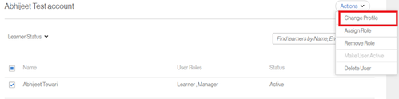

# Impossibile eseguire la registrazione come utente esterno

## Problema

Gli Allievi esterni non possono effettuare la registrazione a un profilo.

## Errore

ID e-mail già registrato. Utilizza un indirizzo e-mail diverso.

*Messaggio di errore di un messaggio di posta elettronica già registrato*

## Descrizione

Ci sono scenari in cui un utente non è in grado di registrarsi a un profilo esterno. Durante la registrazione, l’utente riceve il messaggio di errore di cui sopra.

## Causa

Questo problema si verifica in uno dei seguenti scenari:

* L’utente è già registrato con un altro profilo esterno.
* L’utente è già un Allievo interno.
* L’utente è in stato Eliminato.

## Risoluzione:

**Scenario 1** L’utente è già registrato con un altro profilo esterno.

1. Accedi come Amministratore.
1. Sotto **Gestisci**, fare clic su **[!UICONTROL Utenti]** > **[!UICONTROL Esterno]**.
1. Apri il profilo di cui l’utente fa già parte facendo clic su Postazioni utilizzate.

   

   *Apri profilo utente*

1. Seleziona l’utente, fai clic su **[!UICONTROL Azioni]** > **[!UICONTROL Modifica profilo]**.

   

   *Modifica profilo utente*

   Viene aperta una finestra per selezionare un nuovo profilo come indicato di seguito.

   

   *Selezionare il profilo utente*

1. Una volta selezionato, fai clic su **[!UICONTROL Modifica]**.

**Scenario 2** L’utente è presente come Allievo interno.

1. Accedi come Amministratore.
1. Sotto **Gestisci**, fare clic su **[!UICONTROL Utenti]** > **[!UICONTROL Interno]**.
1. Fai clic per aprire un profilo Allievo e fai clic sull’icona Modifica.

   

   *Aprire un profilo Allievo interno*

1. Modifica l’indirizzo e-mail dell’Allievo o aggiungi *_old* all’indirizzo e-mail esistente. In questo modo l’indirizzo e-mail sarà gratuito.

   Ad esempio, se l’indirizzo e-mail dell’Allievo è *<abc@adobe.com>,* modificalo in *<abc_old@adobe.com>*

1. Fai clic **Salva** per mantenere le modifiche apportate.

**Scenario 3**: all&#39;utente è attribuito lo stato Eliminato.

1. Accedi come Amministratore.
1. Sotto **Gestisci**, fare clic su **[!UICONTROL Utenti]** > **[!UICONTROL Pulizia utente]**.
1. Seleziona l’Allievo e fai clic sull’icona Modifica.

   

   *Modifica indirizzo e-mail utente*

1. Modifica l’indirizzo e-mail dell’Allievo o aggiungi *_old* all’indirizzo e-mail esistente. In questo modo l’indirizzo e-mail sarà gratuito.

   Ad esempio, se l’indirizzo e-mail dell’Allievo è **<abc@adobe.com>**, modificalo in **<abc_old@adobe.com>**.
