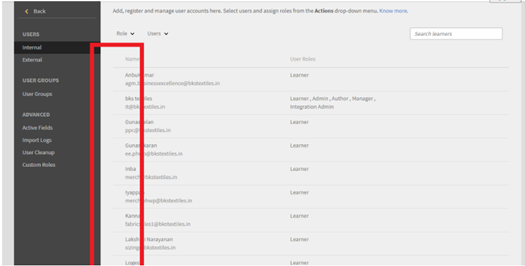

# I pulsanti di selezione non appaiono su Learning Manager

## Il problema

A causa della mancanza di pulsanti di scelta, un Amministratore non può eseguire le seguenti operazioni (non un elenco completo):

* assegnare o rimuovere ruoli;
* inviare email di benvenuto;
* eliminare utenti.

## Causa

Il problema è causato dalla presenza di temi errati nell’account.

*Pulsanti di scelta non visibili*

## Risoluzione

Ricarica i temi e correggi l’aspetto dei pulsanti di opzione. Segui i passaggi riportati di seguito:

1. Come Amministratore, clicca su **[!UICONTROL Branding]**.
1. Nella sezione **Temi**, fai clic su **[!UICONTROL Modifica].**
1. Scegli un tema e salva le modifiche.

   

   *Selezionare un tema*

1. Torna al tema precedente e salva le modifiche.
1. Esci da Adobe Learning Manager e accedi nuovamente.
