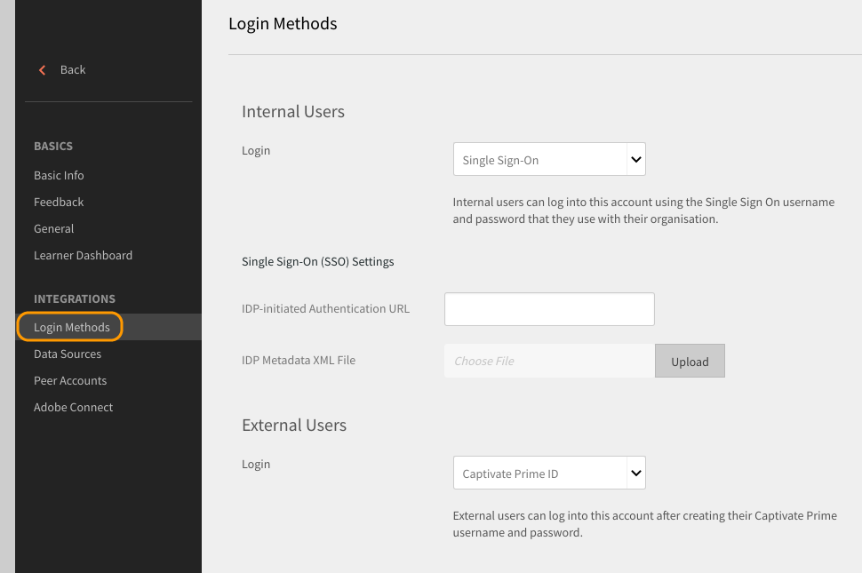

# Accesso a Learning Manager tramite autenticazione SSO

Questo documento consente di configurare l’autenticazione SSO per accedere all’account Learning Manager.

Per configurare l’autenticazione SSO, esegui i passaggi seguenti:

1. Apri **[!UICONTROL Impostazioni]** > **[!UICONTROL Metodi di accesso.]**

   

1. Scegli **[!UICONTROL Utenti interni]** o **[!UICONTROL Utenti esterni]** a seconda delle necessità.
1. Fai clic sul menu a discesa accanto all&#39;opzione **[!UICONTROL accesso]** e seleziona **[!UICONTROL Single Sign-On]**.

   

1. Per modificare le impostazioni Single Sign-On (SSO), fai clic su **[!UICONTROL Modifica.]**

   

1. Immetti l&#39;**[!UICONTROL URL di autenticazione avviato da IDP]** fornito dal tuo provider di servizi e carica il file XML facendo clic sul **[!UICONTROL file XML dei metadati IDP.]**

   

   L’SSO configurato in Learning Manager deve supportare SAML 2.0.

   Ora puoi accedere a Learning Manager tramite l’autenticazione SSO.
