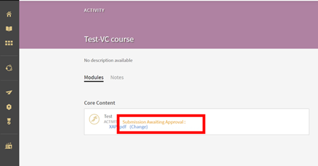

# Impossibile visualizzare i file inviati in Adobe Learning Manager

## Problema

Un Istruttore non è in grado di visualizzare i file inviati e caricati da un Allievo.

## Descrizione

Gli istruttori non sono in grado di visualizzare i file caricati dagli allievi nel **Modulo attività di invio**.

Ad esempio, un Allievo si è iscritto a un’istanza denominata **Istanza di test** di un corso, come illustrato di seguito:

*Visualizza istanza*

L’Allievo quindi apre il corso e carica un file nel modulo Attività.

Quando l’istruttore tenta di approvare l’invio, non è in grado di farlo.

*Caricare un file nel modulo Attività*

## Causa

Il problema si verifica se nell’istanza del corso a cui l’Allievo è iscritto non è presente un Istruttore.

## Risoluzione

Per verificare se un Istruttore è stato aggiunto all’istanza del corso, effettua le operazioni riportate di seguito:

1. Passa alle impostazioni del corso.
1. Nella **Gestisci** , fare clic su **[!UICONTROL Istanze].**
1. Nell’istanza a cui è iscritto l’Allievo, fai clic su **[!UICONTROL Sessioni]**.

   

   *Selezionare Sessioni nell&#39;istanza*

   Nessun istruttore assegnato a questa sessione.

1. Fai clic **[!UICONTROL Modifica]**. Aggiungi l’istruttore che si occupa di approvare l’invio dei file.

   

   *Aggiungere l’istruttore*
1. Salva le modifiche.

