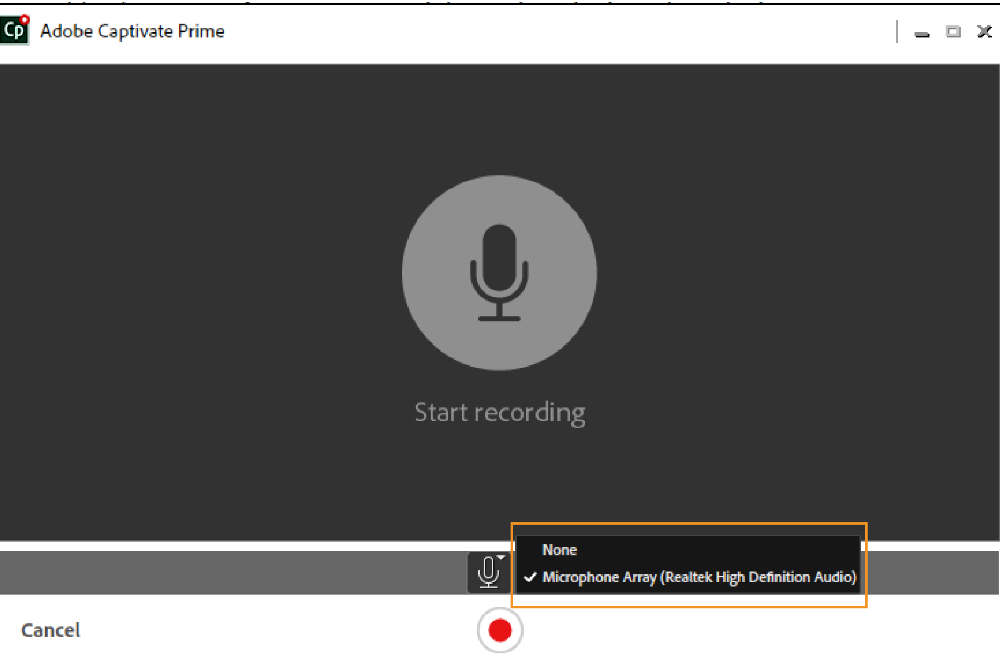

# Applicazione desktop Adobe Learning Manager

Scopri come utilizzare l’applicazione desktop Adobe Learning Manager per creare e arricchire i contenuti condivisibili in Apprendimento sociale.

L’applicazione desktop Adobe Learning Manager è pensata principalmente per gli Allievi che utilizzano Apprendimento sociale di Learning Manager. Una volta installata su un desktop, l’applicazione consente agli Allievi di creare contenuti e pubblicarli nelle bacheche di Learning Manager per facilitare l’apprendimento informale, collaborativo e sociale tra colleghi. Inoltre, l’applicazione desktop consente agli Allievi di ricevere notifiche di Apprendimento sociale sul desktop anche quando non hanno effettuato l’accesso all’applicazione Web di Learning Manager.

Gli Allievi possono creare contenuti complessi, come video, audio e schermate, e condividerli con altri Allievi. Il contenuto può essere letteralmente qualsiasi cosa: una demo software o una procedura dettagliata, una presentazione, un podcast o una schermata annotata di qualcosa che può essere condiviso.

Nella pagina Web di Apprendimento sociale di Learning Manager, fai clic su Nuovo post e seleziona la registrazione video o audio, l’acquisizione di una schermata, oppure la galleria Learning Manager per avviare l’applicazione desktop. Per ulteriori informazioni su Apprendimento sociale, [fai clic qui](feature-summary/social-learning-web-user.md).

Se gli utenti non dispongono dell’applicazione desktop, è possibile scaricarla dalla pagina desktop di Adobe Learning Manager. Se non riesci a effettuare il download, [fai clic qui](../kb/troubleshooting-issues-with-adobe-learning-manager-desktop-app.md).

Una volta che l’utente ha completato l’installazione dell’applicazione, deve eseguire l’accesso utilizzando le proprie credenziali da Allievo Learning Manager. La home page visualizzata è simile alla schermata riportata di seguito.

>[!NOTE]
>
>Gli Allievi non saranno in grado di utilizzare l’applicazione desktop se Apprendimento sociale è disabilitato per il loro account.

<!---->
<!--*Home page*-->

## Creazione di un video {#creatingavideo}

L’applicazione desktop consente agli utenti di registrare le attività della webcam, dello schermo o entrambi.

<!---->
<!--*Record web, screen, or both*-->

Effettua le seguenti operazioni per acquisire registrazioni video e pubblicarle sulla piattaforma Web di apprendimento sociale:

1. Assicurati che i requisiti hardware e software siano soddisfatti. Consulta [Requisiti di sistema](../system-requirements.md) per informazioni.
1. Per avviare una registrazione da Apprendimento sociale, seleziona l’icona di registrazione video (webcam, schermo, entrambi) per aprire l’applicazione desktop Learning Manager. Nell’applicazione desktop con utente connesso, il contenuto può essere creato e pubblicato.
1. Per avviare la registrazione dall’applicazione desktop, accedi all’applicazione utilizzando le tue credenziali di Learning Manager come Allievo.
1. Viene visualizzata la home page.
1. Per creare un post, puoi scegliere una delle tre opzioni disponibili nella home page. Per avviare la finestra di registrazione, fai clic sull’icona Registra video.
1. In base alle tue esigenze, puoi scegliere tra webcam, schermo o entrambi.

   **Webcam** La webcam cattura il narratore che sta dimostrando o presentando un progetto o un&#39;applicazione con audio. Seleziona l’icona della webcam dalle opzioni precedenti per visualizzare la finestra Dal vivo.

   **Schermata** Registra le azioni eseguite sullo schermo del monitor. Selezionando l’icona dello schermo, lo schermo viene messo in evidenza da una finestra di dialogo di registrazione al centro dello stesso.

   **Entrambi** Registra le azioni dell&#39;Assistente vocale e dello schermo. Selezionando l&#39;ultima icona, lo schermo viene evidenziato e l&#39;utente riceve una finestra dal vivo insieme ad essa.

1. Imposta le preferenze di registrazione.

   **Seleziona videocamera** Fai clic sull’icona della videocamera nella parte inferiore della finestra di registrazione video. Seleziona la videocamera che l’utente vorrebbe utilizzare dalle opzioni a disposizione.

   **Seleziona microfono** Fai clic sull&#39;icona del microfono nella parte inferiore della finestra video o audio e seleziona un microfono che l&#39;utente desidera utilizzare dalle opzioni fornite.

   >[!NOTE]
   >
   >Se l’utente non desidera registrare l’audio insieme allo schermo o al video, seleziona l’opzione **Nessuno** dall’elenco a discesa visualizzato quando fai clic sull’icona dell’audio.
   >
   >Quando gli utenti iniziano a registrare lo schermo o se stessi, viene visualizzata una finestra di dialogo che chiede loro di confermare se desiderano continuare a registrare senza supporto audio. Fai clic su Sì per continuare.

1. Usa il pulsante di registrazione per avviare la registrazione. La registrazione inizia dopo il conto alla rovescia (3 secondi).
1. Fai clic sul pulsante Sospendi o Riprendi per interrompere la registrazione e poi riavviarla, se necessario. Per modificare la registrazione, consulta [Modifica di una registrazione](adobe-learning-manager-app-for-desktop.md#Editing), per pubblicarla consulta invece [Pubblicazione di una registrazione](adobe-learning-manager-app-for-desktop.md#Publishing).

## Creazione di una registrazione audio {#creatinganaudio}

<!---->
*Registra audio*

Per registrare un file audio, effettua le seguenti operazioni:

1. Fai clic sull’icona di registrazione audio nella finestra di avvio dell’applicazione desktop Learning Manager.
1. Assicurati che il volume del microfono sia attivato facendo clic sull’icona del volume del microfono e regolando il volume.
1. Fai clic sul pulsante di registrazione per avviare la registrazione.
1. Una volta che gli utenti hanno finito di registrare l’audio, fai clic sul pulsante di pausa per interrompere la registrazione.
1. Per ascoltare l’anteprima della registrazione, fai clic sul pulsante di riproduzione.
1. Se gli utenti desiderano registrare un altro audio aggiungendolo allo stesso file, fai clic su **[!UICONTROL Riprendi]**. Una volta soddisfatta la registrazione desiderata, fai clic su **[!UICONTROL Avanti]** per salvare il file nella posizione desiderata. La registrazione viene salvata nella galleria dell’app desktop Adobe Learning Manager, nella quale gli utenti possono visualizzare le registrazioni e le schermate acquisite.
1. Per modificare la registrazione, consulta [Modifica di una registrazione](adobe-learning-manager-app-for-desktop.md#Editing), per pubblicarla consulta invece [Pubblicazione di una registrazione](adobe-learning-manager-app-for-desktop.md#Publishing).

## Acquisizione di una schermata {#creatingascreenshot}

Per acquisire una schermata, esegui le seguenti operazioni:

1. Fai clic sull’icona della schermata nella home page dell’applicazione desktop Learning Manager.
1. Per acquisire solo una parte dello schermo, fai clic sull’icona di acquisizione parziale dello schermo. Per acquisire l’intero schermo, fai clic sull’icona di acquisizione dell’intero schermo.

   <!--
   *Capture a screenshot*-->

1. Per aiutare gli altri allievi a comprendere e a conservare meglio la presentazione o i contenuti statici, aggiungi annotazioni ai contenuti.
1. Per modificare la schermata, [fai clic qui](adobe-learning-manager-app-for-desktop.md#Editing) e per pubblicare una schermata, [fai clic qui](adobe-learning-manager-app-for-desktop.md#Publishing).

## Modifica di video, audio e schermate {#editing}

Una volta salvato un file, nel sistema viene visualizzata immediatamente la finestra di modifica, nella quale è possibile modificare le registrazioni per renderle perfette e professionali utilizzando le seguenti opzioni:

## Annotazioni (registrazioni video e schermate) {#annotationsvideorecordingsandscreenshots}

È possibile aggiungere annotazioni a registrazioni video e schermate per evidenziare dettagli specifici o scrivere testi destinati a essere letti dagli altri utenti.

>[!NOTE]
>
>Per quanto riguarda i video, gli utenti possono inserire annotazioni solo sulla parte superiore dello schermo.

* I tipi di annotazione che è possibile selezionare sono **ellisse**, **linea**, **freccia**, **evidenziazione** e **testo**.

* Scegliere un colore per ogni annotazione dal pannello colori del pannello proprietà dell&#39;annotazione.
* Per il **Testo**, seleziona le seguenti proprietà: font, grassetto, corsivo, titolo, allineamento, colore e colore di sfondo.

>[!NOTE]
>
>Per visualizzare il colore di sfondo per il testo, imposta il colore di sfondo su Sì.

## Ritaglio (tutti i tipi di registrazione video e audio) {#trimalltypesofvideoandaudiorecordings}

Per tagliare o rimuovere parti di un file video o audio non necessarie, utilizza lo strumento di ritaglio.

Per tagliare, fai clic sul pulsante **[!UICONTROL Inizia taglio]** o sull&#39;icona più sulla timeline per iniziare il taglio. Quindi fai clic sul pulsante di pausa sul lettore per interrompere il ritaglio. Fai clic sul pulsante **[!UICONTROL Conferma]** per completare il ritaglio.

È possibile tagliare le registrazioni immettendo l&#39;ora nei campi di input **[!UICONTROL Ora inizio]** e **[!UICONTROL Ora fine]** dopo aver abilitato **[!UICONTROL Modifica orario]**.

*Avvia taglio*

*Conferma taglio*

## Panoramica e zoom (qualsiasi registrazione video) {#panampzoomanyvideorecording}

L&#39;azione Panning e zoom può essere eseguita solo sulle registrazioni video **Entrambe** (webcam e schermo). Per impostazione predefinita, è selezionata l’intera webcam o schermata. Seleziona un punto di manipolazione d’angolo e trascinalo per selezionare la parte di schermo che deve essere visualizzata o messa a fuoco. Fare doppio clic sulla finestra per visualizzare lo schermo intero.

*Panning e zoom*

## Branding (tutti i tipi di registrazione video) {#brandingalltypesofvideorecordings}

Per creare un nome univoco per un video e un tema coerente, seleziona lo strumento di branding. Lo scopo del branding è quello di garantire al video una presenza significativa e differenziarlo all’interno del sistema di gestione dell’apprendimento, in modo da attirare l’attenzione degli Allievi e spingerli a guardarlo per intero.

Per aggiungere un marchio o un tema a un video, procedi come indicato di seguito:

1. Fai clic sull’icona del branding dal pannello di navigazione a sinistra nella finestra di modifica.
1. Selezionate un **tema** dalle opzioni fornite oppure gli utenti possono personalizzare il proprio tema aggiungendo un video **start**, **background,** e **end** dal proprio sistema.

   >[!NOTE]
   >
   >Per scaricare altri temi, fai clic sul pulsante **Ottieni più risorse**.

1. Aggiungi un titolo al video e seleziona sulla griglia **Mostra su** la posizione in cui deve essere visualizzato.

   >[!NOTE]
   >
   >L’aggiunta del titolo è possibile solo per i video di branding. È necessario specificare un tema prima di assegnare un titolo al video di branding.

1. Aggiungi il nome e la qualifica del presentatore al video, se necessario. Digita un numero compreso nell’intervallo di tempo del video nel campo Visualizza in corrispondenza dell’indicatore di riproduzione per fare in modo che il nome e la qualifica del presentatore vengano visualizzati durante la riproduzione del video.
1. Aggiungi un’icona di branding sul lato sinistro o destro della schermata video, se necessario. Per selezionare un&#39;icona di branding, fai clic su **[!UICONTROL Seleziona]** > **[!UICONTROL Sfoglia dal sistema]**.
1. Per visualizzare l’anteprima del video, fai clic sul pulsante di riproduzione nella schermata di anteprima.

   

   *Branding*

## Registrazione di clip aggiuntivi (tutti i tipi di registrazione video e audio) {#recordingadditionalclipsalltypesofvideoandaudiorecordings}

È possibile aggiungere clip audio e video a un file video o audio esistente.

Per iniziare una nuova registrazione, fai clic sull’icona di registrazione di clip aggiuntivi. La nuova registrazione viene inserita in corrispondenza della testina di riproduzione nella registrazione in corso di modifica.

## Pubblicazione di registrazioni video, registrazioni audio e schermate {#publishing}

Una volta apportate tutte le modifiche, fai clic su **[!UICONTROL Condividi]** > digita o cerca una **abilità o una bacheca** che sia più correlata al post > **Post**.

<!---->
*Pubblicazione sul Web*

## Ricerca nella galleria Learning Manager desktop {#browsingcaptivateprimedesktopgallery}

Tutte le registrazioni e le schermate vengono salvate nell’applicazione desktop Adobe Learning Manager. Per sfogliare questi file, fai clic su **[!UICONTROL Galleria]** dal pannello di navigazione a sinistra della home page.

>[!NOTE]
>
>È possibile avviare la galleria anche da Apprendimento sociale facendo clic sull’icona **Galleria Learning Manager** durante la creazione di un post.

Dalla finestra della galleria, digita il nome del file che stai cercando nel campo di ricerca.

Per creare una nuova registrazione dalla finestra della galleria, fai clic sul pulsante **Registra nuovo**.

Per modificare o eliminare un file dalla galleria, fai clic sui tre punti nella parte inferiore del file e seleziona l’opzione dall’elenco a comparsa.

## Notifiche {#notifications}

Le notifiche in Learning Manager vengono visualizzate nella finestra delle notifiche anche se l’Allievo non ha effettuato l’accesso all’applicazione Web Learning Manager. Le notifiche includono post o bacheche creati o seguiti dagli utenti o a cui gli utenti hanno partecipato. Facendo clic sulla notifica, l’utente accede al Web di Apprendimento sociale di Learning Manager.

Per disattivare l&#39;audio delle notifiche, fare clic sul menu **[!UICONTROL Profilo*]* > &#x200B;** [!UICONTROL Impostazioni] > **[!UICONTROL Disattiva audio notifiche]**.

## Impostazioni dell’applicazione desktop Adobe Learning Manager {#settingsinadobecaptivateprimedesktopapplication}

Nella pagina **Impostazioni**, modifica le seguenti impostazioni:

Disattiva audio notifiche, Avvia automaticamente applicazione, Aggiorna automaticamente applicazione, Abilita miglioramento prodotto.

Gli utenti possono inoltre modificare la posizione della galleria facendo clic sul collegamento ipertestuale **Cambia**.

*Impostazioni app Adobe Learning Manager*
