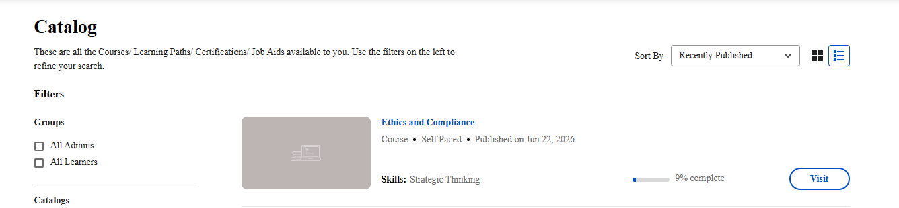

# Corsi adattativi per gli Allievi

## Introduzione

I corsi adattivi in Adobe Learning Manager sono corsi che ti vengono richiesti dall’Autore valutando i tuoi requisiti di apprendimento e personalizzandoli in base ai tuoi requisiti di apprendimento una volta che questa funzione è abilitata dal tuo Amministratore. Per ulteriori informazioni, consulta [Corsi adattativi](/help/migrated/administrators/feature-summary/adaptive-course-admin.md).

## Segui un corso adattivo come Allievo

Quando si segue un corso adattivo in Adobe Learning Manager, viene visualizzato un set personalizzato di moduli in base ai gruppi di utenti a cui si appartiene.

### Cosa succede quando si apre un corso adattivo

Quando si apre un corso adattivo, vengono visualizzati solo i moduli di interesse. I moduli assegnati ad altri gruppi di utenti non sono visibili.

La barra di avanzamento del completamento e il conteggio &quot;X di Y moduli completati&quot; riflettono solo i moduli richiesti. Un collega iscritto allo stesso corso può visualizzare un numero diverso di moduli, una combinazione diversa di obbligatori e facoltativi o una serie completamente diversa di contenuti, tutti in base ai gruppi di utenti.

### Iscrizione a un corso adattivo

L’iscrizione a un corso adattivo funziona come l’iscrizione a qualsiasi corso. Puoi iscriverti autonomamente dal catalogo oppure l’amministratore può iscriverti.

Se non hai moduli visibili nel corso in base ai gruppi di utenti correnti, non puoi iscriverti. In tal caso, contatta il tuo amministratore. Probabilmente significa che l&#39;assegnazione del gruppo di utenti deve essere aggiornata.

### Spostarsi tra i moduli nel lettore

Quando apri il lettore del corso, il sommario a sinistra mostra solo i moduli visibili. Puoi utilizzare i pulsanti di navigazione per spostarti tra i moduli in sequenza (per i corsi ordinati) o accedere a qualsiasi modulo in qualsiasi ordine (per i corsi non ordinati).

I moduli che appartengono a gruppi di utenti di altri allievi non vengono visualizzati nel sommario.

### Comprendere i requisiti di completamento

Il corso è stato completato al termine di tutti i moduli con etichetta **Obbligatorio**. I moduli opzionali non bloccano il completamento. Puoi finirli, rivederli o ignorarli completamente senza influire sui tuoi progressi verso il completamento.

### Cosa succede se una sessione in aula o in aula virtuale è piena

Se un modulo classe o aula virtuale è visibile ma non ha postazioni rimanenti, verrai iscritto al corso e inserito in una lista d’attesa per quella sessione specifica. Puoi comunque accedere e completare immediatamente tutti gli altri moduli. Solo la sessione completa è in attesa.

Mentre sei in lista d’attesa per una sessione:

* La sessione viene visualizzata nel lettore del corso, ma non è possibile avviarla o accedervi.
* L’avanzamento complessivo del corso continua normalmente tramite gli altri moduli.
* Riceverai una notifica quando un posto sarà disponibile e verrai rimosso dalla lista d’attesa.

Una volta assegnata una postazione, la sessione diventa accessibile e puoi parteciparvi o completarla.

### Cosa succede quando il tuo profilo cambia a metà corso

L’esperienza del corso adattivo è legata ai gruppi di utenti. Se i gruppi di utenti cambiano durante l’iscrizione, ad esempio a causa di modifiche al ruolo o alla posizione, il modulo viene aggiornato automaticamente.

* Se i gruppi di utenti aggiornati rendono visibili i moduli precedentemente nascosti, tali moduli verranno visualizzati nel corso. Se richiesti per il nuovo profilo, vengono aggiunti ai requisiti di completamento.
* Se i gruppi di utenti aggiornati non includono più un modulo, questo viene rimosso dalla visualizzazione. Se il modulo era richiesto in precedenza ma non è più disponibile, viene rimosso dal conteggio di completamento.
* I moduli già completati rimangono contrassegnati come completati, anche se i gruppi di utenti cambiano. Non è necessario ripetere il lavoro completato a meno che non sia stato precedentemente eseguito un modulo appena visibile.
* La data di inizio, le date di completamento per i moduli completati e il record di avanzamento complessivo rimangono invariati per tutte le modifiche del profilo.

### Cosa succede dopo aver completato il corso

Una volta completati tutti i moduli richiesti, il corso viene contrassegnato come completato. Riceverai tutti i punti di badge o gamification applicabili a quel punto.

Dopo il completamento, se i gruppi di utenti cambiano e diventano disponibili nuovi moduli obbligatori, il completamento potrebbe essere ripristinato e potrebbe essere necessario completare tali moduli aggiuntivi.

In tal caso:

* Il completamento originale rimane nella trascrizione come record storico.
* Il corso si riapre in uno stato di avanzamento che mostra solo il nuovo lavoro richiesto.
* Devi solo completare i nuovi moduli richiesti.
* Riceverai una notifica quando viene attivato un aggiornamento del completamento.
