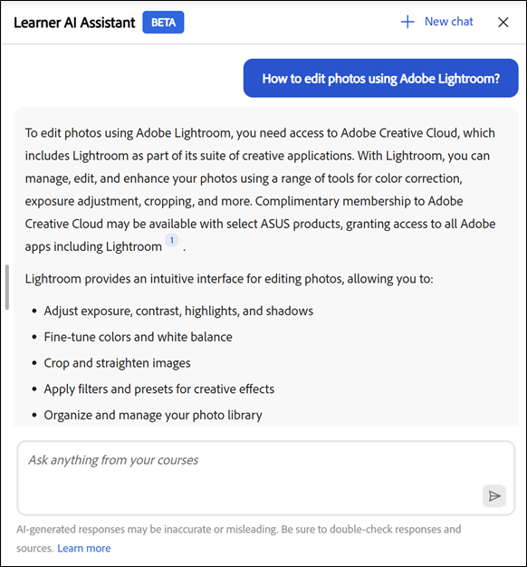

# Allievo assistente

L’Assistente all’intelligenza artificiale degli Allievi (Beta) consente agli Allievi di trovare rapidamente le risposte dai contenuti di apprendimento assegnati senza sfogliare l’intero corso. Puoi porre domande in un linguaggio semplice e ricevere risposte accurate e mirate con collegamenti sorgente al contenuto del corso pertinente.

>[!IMPORTANT]
>
>L’Assistente all’intelligenza artificiale degli Allievi è attualmente in versione beta e verrà rilasciato tramite un rollout graduale. L&#39;accesso può variare a seconda dell&#39;utente.

## Che cos’è l’Assistente all’intelligenza artificiale degli Allievi?

L’Assistente all’intelligenza artificiale degli allievi è un compagno di chat basato su GenAI in Adobe Learning Manager che fornisce risposte rapide e precise alle domande degli allievi utilizzando i contenuti di apprendimento affidabili disponibili in Adobe Learning Manager. Include anche le citazioni, in modo che gli Allievi conoscano sempre la fonte delle informazioni.

## Perché usarlo?

* Gli Allievi si trovano ad affrontare un sovraccarico di contenuti e spesso non sanno da dove iniziare o quale risorsa utilizzare.

* Le regole di catalogo e di accesso rendono difficile individuare i contenuti disponibili.

* I percorsi di apprendimento sono frammentati in più formati e tipi di formazione, come corsi, aule virtuali, risorse formative e valutazioni.

* Non esiste un modo semplice e unificato per recuperare informazioni specifiche da diversi formati come SCORM, PDF, documenti, video o trascrizioni.

* I diversi ruoli e settori degli Allievi (ad esempio, vendite, marketing, supporto, operazioni) hanno esigenze informative specifiche che richiedono risposte rapide e contestuali.

## Quali tipi di contenuti può trascrivere l&#39;Assistente AI

L’Assistente AI può trovare informazioni da tutti i tipi di contenuti di apprendimento assegnati all’utente, tra cui:

* **Documenti:** PDF, Word, PowerPoint, Excel, HTML

* **File multimediali:** audio (mp3, wav, m4a), video (mp4, mov, wmv)

* **Contenuto interattivo:** SCORM 1.2, SCORM 2004,

* **Tipo di oggetto di apprendimento:** corsi, percorsi di apprendimento, certificazioni, risorse formative

Adobe trascrive in modo sicuro il contenuto di apprendimento utilizzando servizi di elaborazione di terze parti affidabili ospitati nell’ambiente VPC privato di Adobe.

**IMPORTANTE**

L&#39;Assistente AI utilizza solo contenuti che sono:

* Disponibile nei cataloghi configurati per l’Assistente Allievo dagli Amministratori e

* Parte di cataloghi interni in Adobe Learning Manager.

I cataloghi condivisi, acquisiti, esterni o altri cataloghi non interni non sono supportati come origini di contenuto per l&#39;Assistente AI nella versione corrente.

Se non hai accesso a un corso, i relativi collegamenti alle citazioni non saranno accessibili. Le librerie di terze parti (come LinkedIn Learning o Go1) non sono incluse per il recupero delle risposte.

## Capacità di conversazione

L&#39;Assistente AI supporta sia domande singole che conversazioni a più turni. Viene visualizzato un promemoria delle query precedenti eseguite nella stessa sessione.

**Esempio di conversazione:**

Tu: &quot;Qual è la politica di rimborso?&quot;
Assistente: fornisce un riepilogo
Tu: &quot;E i rimborsi dopo 30 giorni?&quot;
Assistente: restituisce informazioni più specifiche

## Casi di utilizzo per Assistente AI

### Supporto per l’apprendimento just-in-time (tutti gli Allievi)

Gli Allievi spesso hanno bisogno di risposte rapide mentre lavorano, non di ripetizioni complete del corso. L&#39;assistente AI consente il recupero immediato di informazioni precise dai contenuti di apprendimento assegnati.

**Utilità di:**

* Ottieni risposte dirette a domande specifiche da corsi, risorse formative e documenti

* Passare a sezioni di riferimento esatte utilizzando le citazioni

* Riduzione del tempo impiegato per la ricerca in più oggetti di apprendimento

### Abilitazione delle vendite e conversazioni con i clienti

I team di vendita necessitano di informazioni rapide e precise su prodotti e processi durante le interazioni con i clienti. L&#39;assistente dell&#39;intelligenza artificiale funge da compagno di conoscenza on-demand.

**Utilità di:**

* Recuperare le funzionalità e il posizionamento aggiornati del prodotto

* Generazione rapida di script di vendita o di punti di discussione dai contenuti di formazione

* Confronto di versioni o offerte di prodotti utilizzando materiale didattico assegnato

* Migliora le conoscenze sulle vendite senza riprendere interi corsi

**Esempio 2**

**Scopo:** mostrare che l&#39;Assistente all&#39;intelligenza artificiale può aiutare i rappresentanti commerciali a rispondere istantaneamente alle domande sul confronto con i clienti.

**Suggerimento:** confrontare Adobe Learning Manager e un sistema LMS tradizionale per la formazione aziendale. Mostra il confronto in formato tabulare.

### Preparazione al marketing e alla campagna

I team di marketing hanno spesso bisogno di aggiornamenti rapidi prima di revisioni, lanci o discussioni con gli stakeholder. L&#39;assistente AI riassume i contenuti di apprendimento complessi in insights actionable.

**Utilità di:**

* Riepilogo di corsi o video lunghi in soluzioni principali

* Aggiornare la conoscenza dei processi o dei prodotti prima delle riunioni

* Scopri i contenuti di apprendimento correlati per approfondire l’esperienza

### Chiarimento operativo e dei processi

Le operazioni, il supporto e i team interni si basano su una documentazione accurata dei processi. L&#39;Assistente AI aiuta a chiarire istantaneamente le policy e i flussi di lavoro.

**Utilità di:**

* Trova le risposte relative ai processi interni, alle procedure operative standard e alle linee guida sulla conformità

* Chiarire i dettagli a livello di passaggio senza sfogliare documenti lunghi

* Ridurre la dipendenza dalle PMI per domande ripetitive

### Introduzione e transizioni di ruolo più rapide

I nuovi assunti e i nuovi dipendenti che acquisiscono nuovi ruoli spesso hanno difficoltà a spostarsi all’interno di grandi cataloghi di apprendimento. L&#39;assistente dell&#39;intelligenza artificiale accelera l&#39;accelerazione guidandoli verso le risposte pertinenti.

**Utilità di:**

* Rispondere alle domande di onboarding comuni dai contenuti assegnati

* Fornire una rapida spiegazione dei concetti specifici dei ruoli

* Supporto dell&#39;apprendimento autonomo senza sovraccarico di informazioni

### Aggiornamento delle conoscenze e apprendimento continuo

Gli Allievi esperti hanno bisogno di aggiornamenti rapidi anziché di un aggiornamento completo. L&#39;Assistente AI supporta l&#39;apprendimento continuo nel flusso di lavoro.

**Utilità di:**

* Aggiornare le conoscenze su richiesta senza rivedere i corsi

* Rafforzare i risultati dell’apprendimento dopo il completamento della formazione

* Favorire un coinvolgimento frequente e a basso impegno nei contenuti di apprendimento

## Come l’assistente di intelligenza artificiale degli Allievi utilizza i contenuti

L’assistente dell’intelligenza artificiale degli Allievi ti aiuta a trovare rapidamente risposte accurate durante l’apprendimento. Per utilizzarlo in modo efficace, è necessario comprendere quale contenuto viene utilizzato dall&#39;assistente, quali elementi non vengono utilizzati e come vengono generate le risposte.

### Quali contenuti utilizza l&#39;Assistente AI

L’Assistente all’intelligenza artificiale dell’Allievo risponde alle domande utilizzando solo i contenuti di apprendimento a te assegnati in Adobe Learning Manager.

* L’assistente utilizza contenuti dei cataloghi interni che l’amministratore abilita per l’assistente di intelligenza artificiale dell’Allievo.

* Durante il recupero delle informazioni, l&#39;assistente rispetta il ruolo, l&#39;appartenenza ai gruppi e le autorizzazioni del catalogo.

### Quali contenuti non utilizza l&#39;Assistente AI

L’Assistente all’intelligenza artificiale dell’Allievo limita le risposte all’ambito di apprendimento assegnato.

* Non utilizza contenuti di cataloghi predefiniti, condivisi, acquisiti, esterni o altri cataloghi non interni.

* Non recupera informazioni da librerie di contenuti di terze parti come LinkedIn Learning o Go1.

* Non naviga in Internet né accede a siti Web esterni per generare le risposte.

### Generazione delle risposte da parte di Assistente AI

L’Assistente all’intelligenza artificiale dell’Allievo analizza i contenuti di apprendimento assegnati per generare risposte mirate e contestuali.

* Ogni risposta include citazioni che fanno riferimento al contenuto sorgente originale.

* Puoi selezionare una citazione per passare direttamente al corso, al modulo o al documento pertinente.

* Le citazioni consentono di verificare le informazioni ed esplorare ulteriori contesti quando necessario.

### Usare l&#39;Assistente intelligenza artificiale in modo responsabile

Utilizza l’Assistente all’intelligenza artificiale dell’Allievo come strumento di apprendimento per esplorare, aggiornare e rafforzare la conoscenza.

* Tratta le risposte come guida in base ai contenuti di apprendimento disponibili.

* Per informazioni complete e autorevoli, fare riferimento al materiale sorgente citato.

### Come gli amministratori controllano l&#39;accesso

Gli amministratori gestiscono l’accesso all’Assistente all’intelligenza artificiale degli Allievi e controllano i contenuti utilizzati.

* Gli amministratori assegnano l’assistente a gruppi di utenti specifici.

* Gli amministratori selezionano i cataloghi interni che l&#39;assistente può utilizzare come origini di contenuto.

* Questi controlli assicurano che l’assistente fornisca solo contenuti di apprendimento approvati e pertinenti.

## Informazioni sui prompt incorporati

L’Assistente all’intelligenza artificiale degli Allievi include una serie di prompt incorporati per aiutare gli Allievi a iniziare rapidamente con domande e scenari comuni. Queste istruzioni guidano gli allievi su come interagire con l’assistente e mostrano i tipi di domande che possono porre.

Le richieste predefinite sono personalizzabili per account. Le organizzazioni possono personalizzare questi messaggi in base ai propri obiettivi di apprendimento, ai ruoli degli Allievi, alla terminologia o a casi d’uso specifici.

Gli amministratori possono collaborare con il proprio Customer Success Manager (CSM) per configurare, modificare o aggiornare le richieste incorporate per il proprio account. La personalizzazione dei prompt viene gestita a livello di account e non è configurabile direttamente nell’interfaccia utente di Adobe Learning Manager nella versione corrente.

Le richieste mostrate agli Allievi possono variare a seconda dell’account in base alla configurazione definita con Adobe.

## Abilitare l’Assistente AI Allievo

L’Assistente all’intelligenza artificiale (Beta) fornisce un supporto basato sull’intelligenza artificiale per aiutare gli Allievi a scoprire e utilizzare i contenuti in modo più efficace. Gli amministratori controllano l’accesso assegnando la funzione a gruppi di utenti e cataloghi specifici. Quando si configura l&#39;Assistente AI, è necessario utilizzare solo i cataloghi interni. Il contenuto dei cataloghi condivisi, acquisiti, esterni o altri cataloghi non interni non è supportato per la visualizzazione in risposte e citazioni dell&#39;Assistente all&#39;intelligenza artificiale.

Gli amministratori selezionano i gruppi di utenti e i cataloghi interni che possono accedere alla funzione Assistente intelligenza artificiale. Devono assicurarsi che i cataloghi assegnati includano solo i contenuti di apprendimento che è appropriato far emergere tramite risposte e citazioni dell&#39;intelligenza artificiale e che tali cataloghi siano interni, non condivisi, acquisiti o esterni.

Prima di configurare l’Assistente AI (Beta), confermate di disporre delle credenziali di amministratore e di aver identificato i gruppi di utenti e i cataloghi che devono avere accesso alla funzione.

### Configurazione dell’accesso Assistente Allievo

Per abilitare l’Assistente all’intelligenza artificiale dell’Allievo:

&#x200B;1. Accedi a Adobe Learning Manager come amministratore.

2.Selezionare **Impostazioni** dalla home page.

&#x200B;3. Seleziona **Assistente AI Allievo (Beta)** dal menu **Impostazioni**.

&#x200B;4. Seleziona l’interruttore per attivare **Assistente AI Allievo (Beta)**.

&#x200B;5. Selezionare uno o più gruppi di utenti dall&#39;opzione **Gruppi di utenti idonei**.

&#x200B;6. Selezionare **Salva** per applicare le impostazioni del gruppo di utenti.

&#x200B;7. Selezionare uno o più cataloghi dall&#39;opzione **Cataloghi idonei**.

&#x200B;8. Selezionare **Salva** per applicare le impostazioni del catalogo.

>[!IMPORTANT]
>
>Solo i cataloghi interni sono supportati da AI Assistant. Se viene selezionato un catalogo condiviso, acquisito, esterno o un altro catalogo non interno, il relativo contenuto non verrà visualizzato dall&#39;Assistente all&#39;intelligenza artificiale, anche se il catalogo viene visualizzato nell&#39;elenco Cataloghi idonei.

## Accedere all’Assistente all’intelligenza artificiale degli Allievi in Adobe Learning Manager

L’Assistente AI Allievo (Beta) di Adobe Learning Manager ti aiuta a trovare rapidamente le risposte durante l’apprendimento. Questo strumento intelligente risponde direttamente alle domande su corsi, contenuti e funzionalità della piattaforma, tutte dal tuo account Allievo.

L’Assistente AI può utilizzare solo contenuti di cataloghi interni abilitati dall’amministratore per l’Assistente Allievo. Non sono inclusi i contenuti che risiedono solo in cataloghi condivisi, acquisiti o esterni.

L’Assistente AI Allievo (Beta) è disponibile solo per gli Allievi selezionati.

### Avvia l&#39;Assistente AI

Per avviare l’Assistente all’intelligenza artificiale dell’Allievo:

&#x200B;1. Accedi a Adobe Learning Manager come Allievo.

&#x200B;2. Selezionare **Chiedi Assistente AI** nella home page.

&#x200B;3. Quando viene visualizzata la schermata **Assistente AI Allievo (Beta)**, seleziona **Introduzione**.

>[!NOTE]
>
>Quando avvii l&#39;Assistente all&#39;intelligenza artificiale per la prima volta, devi fornire il tuo consenso prima di utilizzarlo. La finestra di dialogo di consenso verrà visualizzata solo durante questo avvio iniziale. Per tutti gli avvii successivi, verrai indirizzato direttamente all&#39;Assistente AI per inserire le tue richieste.

&#x200B;4. Digita il messaggio nel campo di testo.

&#x200B;5. Premi **Invio** per ricevere una risposta. Rivedi la tua risposta, le tue fonti e i tuoi consigli.

Adobe consente la personalizzazione immediata a livello di account. Per configurare o aggiornare le richieste incorporate, contatta il Customer Success Manager (CSM) di Adobe.

Le risposte dell’Assistente AI includono citazioni con ogni risposta, in modo che gli allievi possano verificare facilmente da dove provengono le informazioni. Ogni riferimento citato rimanda al modulo del corso originale, alla risorsa formativa o ad altri contenuti di apprendimento.

Gli Allievi possono:

* Selezionare il numero di citazione in linea per passare alla sezione di riferimento esatta

* Aprire l&#39;elenco completo delle origini selezionando **Mostra origini** nella parte inferiore della risposta

L’Assistente Allievo include citazioni con ogni risposta per mostrare da dove provengono le informazioni. Ogni citazione si collega direttamente al corso, modulo o oggetto di apprendimento originale utilizzato per generare la risposta.

Puoi selezionare qualsiasi citazione per aprire la pagina del corso effettivo in Adobe Learning Manager e rivedere l’intero contenuto nel contesto. Le citazioni consentono di verificare le informazioni, esplorare ulteriori dettagli e continuare ad apprendere dalla fonte autorevole.

## Accedere all&#39;Assistente all&#39;intelligenza artificiale utilizzando la ricerca

Gli amministratori possono inoltre avviare l’Assistente all’intelligenza artificiale direttamente dalla barra di ricerca. È sufficiente digitare una domanda e selezionare **Richiedi Assistente AI** dalle opzioni visualizzate di seguito per ottenere le risposte dai contenuti di apprendimento assegnati.

## Fornisci feedback sulle risposte dell’assistente di intelligenza artificiale dell’Allievo (Beta)

Il tuo feedback sulle risposte generate dall’Assistente all’intelligenza artificiale degli allievi (Beta) aiuta a migliorarne l’accuratezza, la pertinenza e le prestazioni complessive.

### Mettere Mi piace o Non mi piace a una risposta

* Seleziona **Pollice in alto**, scegli gli elementi che hai trovato utili nella risposta, aggiungi facoltativamente commenti, quindi seleziona **Invia**.

* Seleziona **Pollice giù**, scegli il motivo per cui la risposta non è stata utile, aggiungi eventuali commenti, quindi seleziona **Invia**.

## Avvia una nuova chat in Assistente AI

Gli Allievi possono cancellare la conversazione corrente e avviare una nuova chat in qualsiasi momento.

* Seleziona **Nuova chat** nella schermata dell&#39;Assistente AI, quindi seleziona **Sì**.

