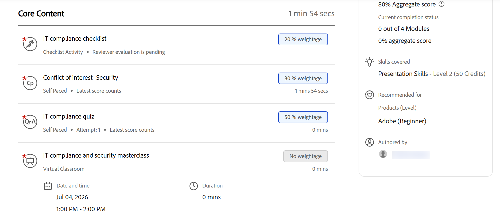
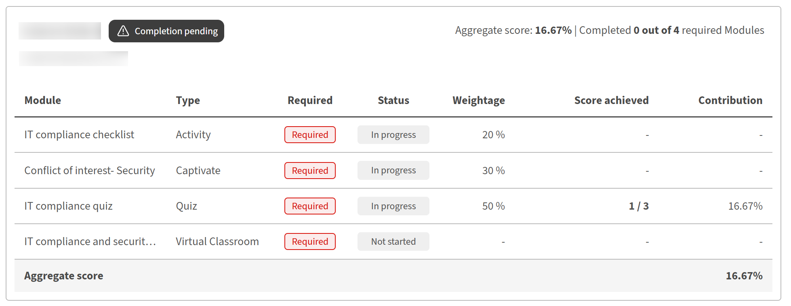

# Gradebook per gli Allievi

## Inizia un corso con Gradebook

Quando il blocco appunti è abilitato e visibile per un corso in Adobe Learning Manager, nella pagina della panoramica del corso viene visualizzata la scheda **Registro appunti**. Puoi utilizzarlo per visualizzare il punteggio ponderato di ogni modulo, il punteggio aggregato corrente e se hai superato o se devi ancora completare una parte maggiore del corso.

## Quando è disponibile il Gradebook

La scheda **Gradebook** viene visualizzata accanto a **Moduli**, **Note** e **Discussioni** nel lettore del corso quando l&#39;autore o l&#39;amministratore ha abilitato la visibilità dei gradebook per il corso. Se la scheda non è visibile, la funzionalità Gradebook non è stata abilitata per questo corso o l’amministratore ha disattivato la visibilità dell’Allievo. I punteggi potrebbero essere ancora registrati e visibili all&#39;amministratore.

Puoi aprire la scheda **Gradebook** in qualsiasi momento durante l&#39;iscrizione:

* **Prima di iniziare:** Dopo l&#39;iscrizione, viene visualizzato l&#39;elenco completo dei moduli con punteggio con le relative percentuali di peso, i punteggi massimi per ciascuno e i criteri di superamento impostati dall&#39;autore. Questo mostra esattamente come viene valutato il corso prima di iniziare.
* **Durante l&#39;esecuzione:** mentre si completano moduli e punteggi, il grafico viene aggiornato in modo da mostrare i punteggi ottenuti insieme ai moduli non ancora tentati o in attesa di valutazione.
* **Dopo aver completato:** il grafico mostra tutti i punteggi finali del modulo, il punteggio aggregato del corso calcolato e un risultato **Superato** nell&#39;intestazione.

## Visualizzare il grafico

* Da **Il mio apprendimento**, seleziona il tuo corso.
* Seleziona la scheda **Gradebook** dalla pagina del corso.

  L’intestazione del grafico mostra:

  

* **Criteri di superamento:** Punteggio aggregato minimo e numero di moduli richiesti
* Numero di moduli obbligatori completati rispetto al totale
* **Punteggio aggregato** corrente come percentuale
* Stato corrente del corso: **Non avviato**, **Completamento in sospeso**, **Superato** o **Non riuscito**

La tabella dei moduli sotto l’intestazione mostra le seguenti colonne per ogni modulo:

| **Colonna** | **Elementi visualizzati** |
|------------|-------------------|
| **Modulo** | Nome e tipo del modulo |
| **Stato** | Stato di completamento o punteggio per questo modulo (vedi il riferimento allo stato di seguito) |
| **Peso** | Percentuale di contributo del modulo al punteggio aggregato |
| **Punteggio** | Il tuo punteggio per questo modulo (ad esempio, 40/100) |
| **Contributo** | Punti percentuali effettivi aggiunti finora dal modulo al punteggio aggregato |

## Visualizzare la ponderazione del modulo dalla scheda Moduli

Puoi anche visualizzare il peso di ogni modulo dalla scheda **Moduli** senza aprire il grafico.

Dalla pagina del corso, seleziona la scheda **Moduli**.

Nella scheda **Moduli** vengono visualizzati la percentuale di ponderazione per ogni modulo e il numero di moduli necessari per completare il corso.

## Punteggi del modulo con più tentativi

Se un modulo consente più tentativi, il punteggio mostrato nel grafico dipende da come l’autore del corso lo ha configurato:

* **Massimo:** viene visualizzato il punteggio migliore di qualsiasi tentativo. Un punteggio inferiore in un tentativo successivo non riduce il punteggio registrato.
* **Ultime novità:** il punteggio ottenuto dal tentativo più recente viene sempre visualizzato. Un punteggio inferiore in un tentativo successivo sostituisce quello precedente.

## Comprendere lo stato del modulo

Ogni modulo nel blocco appunti mostra uno dei seguenti stati:

| **Stato** | **Cosa significa** |
|------------|-------------------|
| **Completato** | Modulo completato e punteggio registrato |
| **In corso** | Modulo avviato ma non ancora completato |
| **Non avviato** | Modulo non ancora aperto |
| **Non riuscito** | Il modulo ha ottenuto un punteggio e non ha raggiunto la soglia di superamento del modulo |
| **Revisione in sospeso** | Modulo completato ma in attesa di un punteggio da parte di un Istruttore o Amministratore |
| **Nessun peso** | Il tipo di modulo non supporta il punteggio (PDF, video e simili); non contribuisce all’aggregazione. |

## Come viene calcolato il punteggio aggregato

Il punteggio aggregato è la somma del contributo ponderato di ciascun modulo con punteggio:

(Punteggio ottenuto ÷ Punteggio massimo) × % ponderazione = Contributo modulo

La colonna **Contributo** nel diagramma mostra il contributo di ogni modulo all&#39;aggregazione corrente. I moduli contrassegnati con **Nessuna ponderazione** sono esclusi da questo calcolo.

Non è necessario che la scala di punteggio sia la stessa per tutti i moduli. Un modulo ha ottenuto un punteggio di 100 e un modulo ha ottenuto un punteggio di 10. Entrambi contribuiscono correttamente. La formula normalizza ciascuna di esse prima di applicare la ponderazione.

## Visualizzare e creare report sui punteggi dei gradebook

Gli Amministratori di Adobe Learning Manager possono visualizzare i punteggi ponderati dei gradienti per tutti gli Allievi iscritti a un corso, analizzare le prestazioni dei singoli Allievi per modulo, scaricare una Trascrizione Allievo filtrata e tenere traccia delle modifiche alla configurazione dei gradienti nel report di prova di verifica del contenuto.

## Visualizzare il blocco appunti per un corso

Quando il blocco appunti è abilitato per un corso, quando apri il corso viene visualizzata una nuova sezione **Feedback L2 - Gradebook** nel riquadro di navigazione a sinistra in **Report**.

* Accedi a Adobe Learning Manager come amministratore.
* Nella barra di navigazione a sinistra, seleziona **Corsi** e apri il corso che desideri rivedere.
* Nel riquadro di navigazione del corso in **Report**, seleziona **Feedback L2 - Gradebook**. Viene aperta la pagina **Active Feedback Gradebook**.

Viene visualizzato quanto segue:

1. Criteri di superamento del corso (moduli minimi richiesti e punteggio minimo aggregato)
2. Una riga di filtro per visualizzare gli Allievi per livello: **Superato**, **Non riuscito** o **In attesa di completamento**
3. La formula del punteggio aggregato: Punteggio aggregato = (Punteggio ottenuto ÷ Punteggio massimo) × Ponderazione, per ogni modulo
4. Un elenco di Allievi che mostra il **punteggio aggregato** di ciascun Allievo e il relativo punteggio per ogni modulo con punteggio
5. Menu a discesa di un’istanza per passare da un’istanza all’altra quando un corso ha più istanze

Gli Allievi che non hanno ancora tentato alcun modulo con punteggio mostrano trattini nelle colonne di punteggio. I moduli che non supportano punteggi, PDF, video, audio e simili non vengono visualizzati come colonne di punteggio.

## Visualizzare i punteggi di un singolo Allievo

In **Active Feedback Gradebook**, seleziona il nome di un Allievo.

La vista del singolo Allievo mostra:

1. Nome, e-mail e stato dell’Allievo (**Completamento in sospeso**, **Superato** o **Non riuscito**)
2. Punteggio aggregato e numero di moduli obbligatori completati dall’Allievo
3. Tabella dei moduli che mostra: nome del modulo, tipo, se richiesto, stato, peso, punteggio ottenuto e contributo all&#39;aggregazione

La tabella dei moduli include tutti i moduli con punteggio e quelli senza punteggio. I moduli con punteggi mostrano il loro punteggio e il loro contributo. I moduli senza punteggio mostrano trattini nelle colonne Punteggio e Contribuzione.

## Moduli punteggio

Il comportamento relativo al punteggio per amministratori e istruttori rimane invariato rispetto al flusso di lavoro corrente:

* **I moduli dei quiz SCORM, AICC, xAPI e nativi** vengono conteggiati automaticamente quando il contenuto sottostante riporta un punteggio.
* **Le sessioni in aula, le sessioni in aula virtuale e i moduli di attività** sono valutati da istruttori o amministratori nella pagina **Presenze e punteggi**.

## Scarica la Trascrizione Allievo per un corso

Puoi scaricare una Trascrizione Allievo filtrata per questo corso direttamente dalla pagina Gradebook in uno dei due modi:

* Nell’**Active Feedback Gradebook**, seleziona **Scarica trascrizione Allievo** nell’angolo superiore destro della pagina.
* Nella home page dell&#39;amministratore, seleziona **Report**, quindi seleziona **Report personalizzati**. Seleziona **Trascrizioni Allievi** dall’elenco dei report disponibili.

Per ulteriori informazioni, consulta Segnalazione delle modifiche nella versione.

## Eventi di prova di verifica del contenuto

L’audit trail del contenuto acquisisce due eventi di configurazione specifici del grafico:

| **Evento** | **Quando viene visualizzato** |
|-----------|---------------------|
| **Gradebook aggiornato** | Quando un Autore abilita o disabilita un libro di testo per un corso |
| **Peso del modulo aggiornato** | Quando un Autore modifica la percentuale di ponderazione per un modulo |

Per ulteriori informazioni, consulta Segnalazione delle modifiche nella versione.

Utilizzare queste voci per tenere traccia di chi ha modificato la configurazione e di quando dei gradebook, in particolare in ambienti in cui più autori collaborano allo stesso corso.

## Risoluzione dei problemi

**La sezione Feedback L2 - Gradebook non viene visualizzata nella navigazione del corso**

Durante la creazione del corso, l’autore del corso deve abilitare la funzione Gradebook. Conferma che l’Autore ha abilitato il libro di testo per la creazione di un corso. Se il corso è stato creato prima che fosse disponibile, non può essere aggiunto retroattivamente. È necessaria una nuova versione del corso.

**Il punteggio aggregato di un Allievo è 0 nonostante i moduli completati**

Conferma che al corso è assegnato almeno un modulo con punteggio. Se tutti i moduli completati dall’Allievo non hanno un punteggio (PDF, video, audio), non viene calcolato alcun punteggio aggregato. Inoltre, verificare che i moduli con punteggio non siano ancora in stato **Revisione in sospeso**. I moduli non valutati vengono esclusi dall’aggregato fino a quando un Istruttore non immette un punteggio.

**La colonna Peso non è presente nella Trascrizione Allievo scaricata**

Questa colonna viene visualizzata solo quando il file Gradebook è abilitato e almeno un modulo ha un valore di ponderazione salvato. Conferma che l’autore ha abilitato il file Gradebook e salvato un totale di 100% di valori di ponderazione.

**Un Allievo ha completato tutti i moduli richiesti ma mostra il completamento in sospeso**

Uno o più moduli potrebbero essere ancora in attesa di un punteggio da parte di un Istruttore o di un Amministratore (**In attesa di revisione**). Il corso non può essere completato finché tutti i moduli richiesti non hanno registrato il completamento e un punteggio. Immetti il punteggio in sospeso da **Frequenza e punteggio** per cancellare lo stato in sospeso.
