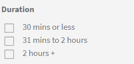

# Cataloghi

Scopri come usare i cataloghi in Learning Manager per visualizzare gli oggetti di apprendimento disponibili per un Allievo

**Il catalogo** comprende tutti i corsi, i programmi di apprendimento, le certificazioni e le risorse formative disponibili per un ruolo Allievo nell’account aziendale.

Gli Allievi possono visualizzare tutti gli oggetti di apprendimento assegnati e idonei (programmi di apprendimento, corsi e certificazioni) nel **Catalogo predefinito**. Questi oggetti di apprendimento sono specifici di ogni Allievo in base al ruolo, alla qualifica, al gruppo di utenti, al profilo e così via.

Puoi ordinare gli oggetti di apprendimento in base a diverse categorie, come Prodotti, Ruoli di lavoro, Tipi, Tempo necessario, Abilità e Parole chiave. Puoi anche filtrare utilizzando le opzioni nel riquadro a sinistra: per Oggetti di apprendimento, Abilità e Stato di completamento.

Utilizza la barra di ricerca nella parte superiore della pagina per immettere i nomi degli oggetti di apprendimento più comuni. Gli Allievi possono passare dalla visualizzazione a griglia a quella a elenco selezionando questa icona di .

*Visualizzare i cataloghi*

<!--As a learner, you can  filter training based on the format of training, for example, Classroom, Self-paced, or Virtual Classroom. In addition, the learner can also filter the trainings based on Training Duration. Skill Levels filter which is already available, can now be enabled/disabled by Administrator. -->

*Filtra il corso di formazione in base al formato*

Puoi anche filtrare in base alla durata di un corso di formazione. Il filtro relativo alla durata non comprende la durata del modulo di verifica o di quello precedente alla lavorazione.

*Filtra per durata del corso*

I filtri **Durata** e **Formato** dei corsi di formazione sono identificati in base al contenuto del training disponibile per l’istanza predefinita e per le impostazioni locali preferite dell’account.

Una volta pubblicato il corso di formazione, potrebbe essere necessaria fino a un’ora affinché i dati siano disponibili come filtro.

## Funzionalità di ordinamento nell’app per Allievi

La funzione di ordinamento nell’app per Allievi fornisce raccomandazioni personalizzate per i corsi in base al contenuto e alla lingua dell’interfaccia. &#x200B; Questo miglioramento semplifica il processo per gli Allievi di trovare i corsi nella lingua preferita e utilizza opzioni di ordinamento più intelligenti.

>[!NOTE]
>
>Questa funzione è disponibile sia sull&#39;app Web che su quella per dispositivi mobili.

Puoi ordinare i corsi in ordine alfabetico:

1. **[!UICONTROL Nome (A-Z)]**: visualizza i corsi in ordine alfabetico.
2. **[!UICONTROL Nome (Z-A)]**: visualizza i corsi in ordine alfabetico inverso.

I corsi vengono visualizzati nel seguente ordine di priorità in base alle preferenze della lingua:

1. **[!UICONTROL Lingua del contenuto]**: i corsi nella lingua del contenuto selezionata vengono visualizzati per primi.
2. **[!UICONTROL Lingua interfaccia]**: i corsi nella lingua dell’interfaccia sono elencati di seguito.
3. **[!UICONTROL Altre lingue]**: i corsi in lingue casuali vengono visualizzati per ultimi.

Se nell’account non è configurata alcuna lingua di contenuto o lingua di interfaccia, il sistema segue questa sequenza:

1. **[!UICONTROL Lingua browser]**: l’app assegna la priorità ai corsi in base alle impostazioni della lingua del browser.
2. **[!UICONTROL Lingua account]**: se la lingua del browser non è disponibile, viene considerata la lingua dell&#39;account ALM.
3. **[!UICONTROL Inglese predefinito]**: se la lingua del browser o dell&#39;account non è disponibile, i corsi vengono visualizzati in inglese.

Seleziona la pagina **[!UICONTROL Cataloghi]** nell’app per Allievi, quindi seleziona la tua opzione di ordinamento preferita: **[!UICONTROL Nome (A-Z)]** o **[!UICONTROL Nome (Z-A)]**. I corsi verranno visualizzati in base alle preferenze di ordinamento selezionate, con l’applicazione di una priorità basata sulla lingua.