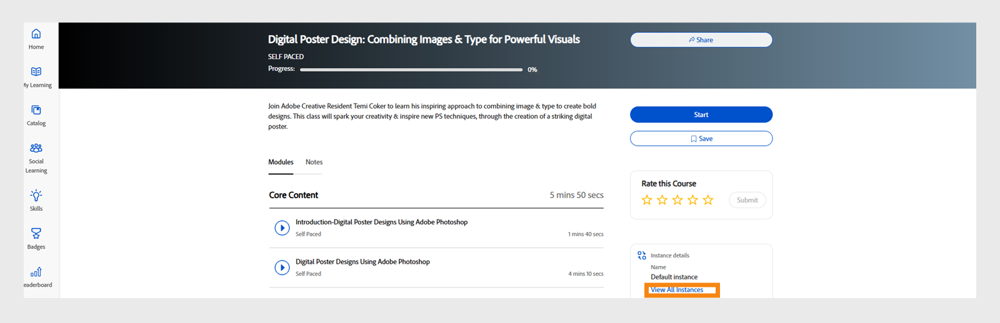

# I miei insegnamenti

Leggi questo articolo per sapere come visualizzare e utilizzare i corsi in Learning Manager. Partecipa alle discussioni e fornisci feedback.

I corsi vengono creati dagli Autori. Gli Allievi possono seguire i corsi e gli Amministratori possono tenere traccia delle loro prestazioni in base alla frequenza dei corsi.

## Panoramica {#overview}

Adobe Learning Manager consente agli Allievi di accedere ai corsi, ai programmi di apprendimento e alle certificazioni. Gli Allievi possono esplorare tutti i corsi disponibili tramite il catalogo o registrandosi ai corsi di propria scelta. Gli Allievi possono visualizzare tutti i corsi a cui sono iscritti e quelli a loro assegnati nella scheda Apprendimento.

>[!NOTE]
>
>Gli Allievi possono inoltre installare l’app Learning Manager per iPad dall’Apple Store e per Android da Google Play e accedere ai corsi sui dispositivi mobili. Tutte le funzioni del ruolo Allievo sono disponibili anche nell’applicazione. Gli Allievi possono inoltre frequentare corsi offline e ottenere un accesso semplificato dopo l’accesso online. Per ulteriori informazioni, fai riferimento alla funzionalità [Utenti di iPad e tablet Android](ipad-android-tablet-users.md).

## Visualizzazione degli oggetti di apprendimento {#viewingcourses}

Puoi visualizzare un elenco di tutti i corsi disponibili come Allievo. Fai clic su Il mio apprendimento dalla pagina Home o dal riquadro a sinistra per visualizzare tutti i corsi a cui ti sei iscritto.

*Visualizza corsi assegnati*

Se devi ancora avviare il corso, puoi fare clic sul pulsante Avvia accanto al corso. Se hai già iniziato a frequentare il corso, puoi fare clic sul pulsante Continua.

Per visualizzare un corso completato, fai clic sul pulsante Rivedi accanto al corso.

Possono essere presenti più istanze per ogni corso. Fai clic sul nome del corso per visualizzarne i dettagli. Nel riquadro destro puoi visualizzare la data di scadenza di ogni istanza del corso.

*Visualizzare un corso completato*

## Efficacia del corso {#courseeffectiveness}

La valutazione dell’efficacia dei corsi consente agli Allievi di scegliere i corsi più efficaci in base alle loro esigenze di apprendimento. L’efficacia dei corsi viene valutata per comprendere l’utilità di un corso per gli Allievi. Viene calcolata in base al feedback ricevuto da un dato numero di utenti per un corso specifico. Se la percentuale di Allievi che fornisce un feedback è più alta, la valutazione dell’efficacia del corso è elevata.

È una combinazione di risultati dei feedback degli allievi sul contenuto del corso, risultati del quiz sul corso per un Allievo e feedback del Manager che valuta un Allievo in base agli allievi del corso.

Nella pagina Corsi, un Allievo può visualizzare la valutazione dell’efficacia di un corso sulle miniature, come illustrato nell’immagine seguente. In questo caso, la valutazione del corso è 14.

*Visualizza valutazione dell’efficacia del corso*

Fai clic sul valore di efficacia del corso per visualizzare i dettagli relativi alla sua efficacia. Viene visualizzata una finestra a comparsa come illustrato di seguito.

*Visualizza l’efficacia del corso*

Fai clic sulla freccia rivolta verso il basso nell’angolo in basso a destra della finestra a comparsa per vedere come vengono effettuati i calcoli dell’efficacia dei corsi.

*Calcolo dell’efficacia del corso*

## Ricerca di corsi e programmi di apprendimento {#searchingcoursesandlearningprograms}

Adobe Learning Manager consente di individuare i corsi che cerchi rapidamente e con facilità. Puoi eseguire una ricerca tra i corsi nei modi seguenti:

1. Fai clic sull’icona di ricerca visualizzata nell’angolo in alto a destra. Viene visualizzato un campo di ricerca. Digita il nome del corso/programma di apprendimento o qualsiasi parola chiave associata ai tuoi corsi. Puoi cercare i corsi per metadati, note, abilità, distintivi o tag. I tag sono ricercabili all’interno del campo di ricerca, il che significa che vengono visualizzati nel campo di ricerca durante la digitazione.
1. Lo studente può perfezionare i risultati della ricerca nella pagina del catalogo utilizzando tipo, abilità, tag e stato.

Puoi ordinare i corsi per pertinenza, nome o data di pubblicazione facendo clic su Ordina per e scegliendo dal menu a discesa.

Nella pagina dei risultati della ricerca, puoi filtrare i corsi in base alla **durata** e al **formato**. Questo offre maggiore flessibilità nella ricerca di corsi e garantisce che i corsi siano adatti a te.

## Iscrizione ai corsi {#enrollingforcourses}

È possibile iscrivere gli Allievi ai corsi nei tre diversi modi qui elencati:

1. L’Amministratore/Manager iscrive alcuni Allievi ai corsi obbligatori in base alle esigenze dell’azienda.
1. Il Manager assegna alcuni corsi ai membri del team. Ricevi una notifica con l’opzione di accettare o rifiutare il corso/programma di apprendimento. Quando gli Allievi accettano l’assegnazione, vengono iscritti al corso/programma di apprendimento.
1. Gli Allievi possono iscriversi direttamente a un corso/programma di apprendimento:

   1. Se il corso/programma di apprendimento prevede l’iscrizione diretta, l’Allievo viene iscritto immediatamente.
   1. Se il corso o il programma di apprendimento è di tipo approvato dal manager, l’Allievo passa allo stato **approvazione in sospeso**. Dopo l’approvazione del Manager, l’Allievo è iscritto al corso.
   1. Se gli Allievi si iscrivono a un corso con lista d’attesa (se si tratta di un corso in aula), devono aspettare che qualcuno abbandoni il corso o che l’Amministratore approvi la loro richiesta per il corso.

Gli Allievi possono iscriversi direttamente a molti corsi in base alle loro esigenze. Nella scheda Corsi vengono visualizzati tutti i corsi registrati/assegnati.

Tuttavia, è possibile passare a uno dei corsi elencati nel catalogo passando il mouse sopra di esso e facendo clic su Esplora. Viene visualizzata la pagina di iscrizione. Fai clic su Iscrivimi nell’angolo superiore destro della pagina, per includere il corso nell’elenco.

Possono essere presenti più istanze/sessioni per ogni corso/programma di apprendimento. Nel catalogo, fai clic sul nome della sezione dedicata al corso/programma di apprendimento per visualizzarne i dettagli. Puoi visualizzare l’iscrizione all’istanza del corso/programma di apprendimento in base alla data di scadenza di ciascuna istanza del corso/programma di apprendimento.

**Registra interesse per i corsi**

Puoi esprimere il tuo interesse per qualsiasi corso in aula che non preveda sessioni pianificate. Ogni volta che la sessione di un corso inizia, riceverai una notifica che ti invita a partecipare al corso.

>[!NOTE]
>
>Gli Allievi dovrebbero visualizzare un messaggio di conflitto se si iscrivono a due sessioni diverse contemporaneamente o in orari sovrapposti.

## Commutazione di istanze

Un Allievo iscritto a una particolare istanza di un corso può visualizzare un elenco di tutte le istanze disponibili del corso e passare a un’altra istanza che trova più adatta alle sue esigenze. Il motivo del cambio potrebbe essere che l’Allievo non ha partecipato all’istanza precedente o che i tempi della sessione per la nuova istanza sono più adatti, oppure un altro motivo.

Tutti i progressi compiuti dall’Allievo come parte del corso, i punteggi dei quiz degli Allievi e altre informazioni vengono applicati alla nuova istanza. Questa funzione è principalmente destinata ai corsi in aula e a quelli misti, ma supporteremo tutti i tipi di corsi, compresi quelli autonomi.

L’opzione Visualizza tutte le istanze viene visualizzata indipendentemente dalle impostazioni di Commutazione istanza. Se sono presenti più istanze di un corso, gli Allievi visualizzeranno ora un’opzione per vedere tutte le istanze.

Se l’opzione Commutazione istanza è attivata, gli Allievi possono passare da un’istanza all’altra fino al completamento del corso. Se l’opzione è disattivata, gli Allievi possono visualizzare le istanze ma non potranno iscriversi al corso.

Quando l’Allievo seleziona **Visualizza tutte le istanze**, l’Allievo può visualizzare tutte le istanze del corso.

_Visualizza tutta la pagina dell’istanza dalla console dell’Allievo_

_Cambia istanza dalla pagina dell’Allievo_

Un amministratore può cambiare istanza per gli Allievi. Seleziona un corso da Admin Console, passa alla sezione **[!UICONTROL Allievi]**, scegli un utente e seleziona il pulsante **[!UICONTROL Azione]**. Quindi, seleziona **[!UICONTROL Cambia istanza]** e scegli l&#39;istanza desiderata.

_Cambia istanza da Admin Console_

_Messaggio per cambiare istanza_

Non puoi cambiare istanza finché nessuna istanza del corso non viene completata dall’app per Allievi o Amministratori.

Gli Autori, durante la creazione di un corso, possono alternare l’attivazione o la disattivazione di &quot;Instance Switch&quot;. Commutazione istanza è disponibile solo per i corsi gratuiti.

## Flusso di lavoro come Allievo

Come Allievo, potrai valutare un corso solo dopo l’iscrizione. Puoi visualizzare la media delle valutazioni a stelle per qualsiasi corso nella **pagina Home**, nella **pagina Il mio apprendimento** e nel **catalogo**.

1. Accedi come **Allievo**. Viene caricata la **home page**.

1. Cerca un corso inserendo il nome del corso nella barra di ricerca. In alternativa, puoi scegliere dall’elenco visualizzato dei corsi facendo clic su **Il mio apprendimento** o **Catalogo** nel riquadro a sinistra.

1. Dopo aver selezionato un corso, fai clic su **[!UICONTROL Iscriviti]**.

   
   *Iscriviti a un corso*

1. Seleziona il numero di stelle per valutare un corso, considerando che 1 è il minimo e 5 è il massimo. Quindi fai clic su **[!UICONTROL Invia]**.

   
   *Invio della valutazione del corso*

   Gli allievi possono inviare nuovamente il feedback e fornire la valutazione a stelle più di una volta. Sarà presa in considerazione la valutazione più recente.

1. Viene visualizzato un messaggio di conferma dopo l’invio.

   
   *Messaggio di conferma del feedback*

   Se desideri inviare nuovamente il feedback, puoi farlo facendo clic sul messaggio. Dopo l’invio, il messaggio di conferma viene visualizzato per tre secondi, al termine dei quali viene mostrata la valutazione. Se desideri modificarla, puoi selezionare un numero di stelle diverso e procedere con un nuovo invio.

Puoi ordinare i corsi in base alla media delle valutazioni fornite. Puoi ordinare i dati dal menu a discesa Ordina per nell&#39;angolo superiore destro, disponibile in **Catalogo**.

## Partecipazione a un corso {#consumingnbspacourse}

Dopo esserti iscritto a un corso, puoi iniziare a frequentarlo facendo clic su Avvio. In alternativa, fai clic su **[!UICONTROL Corsi]** nella scheda **[!UICONTROL Apprendimento]**. Scegli un corso che desideri iniziare.

Se devi ancora avviare un corso, fai clic sul pulsante Avvia accanto al titolo del corso.

Puoi visualizzare tutti i moduli del corso in una finestra del browser.

**Funzionalità del lettore**

**Sommario** - Durante l’inizio di un corso, il lettore visualizza un sommario del corso nel riquadro sinistro della finestra. Puoi fare clic su ciascun argomento per passare direttamente a esso.

**Segnalibri**: se uno dei moduli di corso include un sommario dei moduli, gli argomenti nel sommario dei moduli possono essere contrassegnati con un segnalibro per fare riferimento in un secondo momento. Una volta contrassegnata una voce del glossario, viene visualizzata un’icona a forma di nastro accanto a essa. I segnalibri possono essere eliminati facendo clic nuovamente sul nastro.

**Note**: è disponibile un provisioning per registrare le note durante l&#39;utilizzo del corso. Dopo la registrazione delle note, puoi salvare e scaricare come PDF o inviare tramite e-mail le note all’ID e-mail di qualsiasi Allievo registrato. Quando fai clic su Salva, puoi scegliere dove salvare il file delle note come PDF.

*Prendere appunti sul corso*

**Sottotitoli codificati** - Per i corsi sviluppati per Adobe Captivate, se i sottotitoli codificati vengono abilitati durante lo sviluppo del corso, l’Allievo può visualizzare i sottotitoli. Fai clic su CC nella parte inferiore del lettore. L’opzione sottotitoli codificati è disponibile solo per il contenuto HTML di Captivate 8.0.2. Per tutti gli altri tipi di moduli, l’opzione CC non viene visualizzata nella barra di riproduzione.

**Rivedi corso** - Puoi rivisitare un corso in due modalità in due possibili scenari:

* Facendo clic su Rivedi quando il corso è stato completato.
* Facendo clic su Continua quando il corso non è ancora stato completato.

**Schermo intero** Fai clic sull&#39;icona Schermo intero nell&#39;angolo in basso a destra del lettore per visualizzare il corso nella finestra a schermo intero.

**Pulsanti di navigazione** È possibile fare clic sulle frecce su/giù per spostarsi tra le diapositive nei contenuti PDF, docx e pptx. I tasti freccia della diapositiva possono essere utilizzati per passare agli argomenti successivi per tutti i tipi di contenuto.

**Chiudi il corso** Fai clic sull’icona di chiusura (x) nell’angolo superiore destro del lettore per uscire dal corso.

*Dopo aver chiuso il corso, puoi rivederlo facendo clic sul pulsante Rivedi nella pagina di descrizione del corso.*

## Istanze di iscrizione multiple

Se un corso ha più istanze, gli allievi avranno la possibilità di scegliere e iscriversi a un’istanza specifica. Se necessario, possono anche passare da un’istanza all’altra.

## Valutazione a stelle

Solo dopo l’iscrizione a un corso, l’Allievo può fornire un feedback a stelle al corso. Nella pagina della Panoramica del corso, l’Allievo può valutare il corso con le stelle (1 minimo, 5 massimo).

*Fornire una valutazione a stelle come feedback*

Un Allievo potrà selezionare un numero di stelle (su 5) e inviare la valutazione. L’Allievo può inoltre modificare la selezione facendo clic su un numero di stelle diverso. Una volta inviato, verrà visualizzato un messaggio di ringraziamento per il feedback.

Se l’Allievo desidera inviare nuovamente il feedback, può farlo facendo clic sul messaggio. Il pulsante **Invia** viene riabilitato. Un Allievo può fornire valutazioni a stelle più volte dopo l’iscrizione a un corso. Si terrà sempre in considerazione la valutazione più recente.

Una volta che l’Allievo fornisce una valutazione a stelle, la media di queste e il conteggio degli Allievi che hanno fornito un feedback compariranno nella pagina **Panoramica corso**.

*Panoramica del corso*

Per tutti gli account esistenti, questa funzione è disabilitata. Gli Amministratori possono abilitarla da Impostazioni. Solo a partire da quel momento gli Allievi potranno visualizzare le valutazioni a stelle.

## Contenuti del marketplace

L’opzione Contenuti del marketplace si trova nel riquadro a sinistra nell’app per gli Allievi. Facendo clic su questa opzione, puoi visualizzare tutti i corsi/intero catalogo e le playlist selezionate.

Puoi vedere i corsi presenti sull’intero catalogo nella pagina seguente. Ogni corso mostra la durata e l’argomento generale a cui appartiene. Puoi scegliere l’argomento dal filtro a sinistra della pagina.

Puoi visualizzare per due minuti l’anteprima di un corso.

*Anteprima del corso nel marketplace*

Quando l’Amministratore ti invita a esplorare e visualizzare in anteprima una gamma di corsi, visualizzerai una notifica.

In qualità di Allievo, nella sezione **Playlist selezionata** puoi esprimere interesse per un intero catalogo o per una qualsiasi playlist selezionata.

*Visualizza playlist selezionata*

Dopo aver espresso il tuo interesse per un corso o un training, questo viene memorizzato e l’Amministratore può quindi recuperare la registrazione.

Nell’app per Allievi, tutti gli Amministratori hanno accesso ai Contenuti del marketplace. Se l’Amministratore ha revocato l’accesso, gli allievi non possono visualizzare la scheda Contenuti del marketplace.

Gli Allievi invitati dall’Amministratore possono esplorare i Contenuti del marketplace.

>[!NOTE]
>
>Contenuti del marketplace non supportati in Internet Explorer 11.

Tutti i filtri e le altre opzioni sono mostrati nel seguente video.

### Anteprima del contenuto

Puoi esplorare e visualizzare in anteprima il corso e vedere se soddisfa le tue esigenze di apprendimento. Fai clic sul pulsante **Anteprima** e visualizza l’anteprima del corso. L’anteprima è disponibile per due minuti.

*Anteprima dei contenuti nel marketplace*

## Hub dei contenuti

L’Hub dei contenuti consente agli Amministratori e agli Esperti in materia (SME) di creare un elenco delle playlist richieste dall’app per Allievi. Una volta creato l’elenco, gli amministratori possono scaricare il modulo di richiesta di acquisto e condividerlo con l’agente di vendita Adobe.

Gli Amministratori possono invitare gli SME a creare elenchi con le playlist a cui sono interessati

L’Hub dei contenuti è disponibile nel ruolo Allievo per tutti gli Amministratori. Gli Amministratori consentono agli SME di elencare le playlist che sono interessati ad acquistare.

La pagina Hub dei contenuti è sempre visibile agli amministratori nel ruolo di Allievo, perché consente loro di creare comodamente elenchi di playlist. Per aiutarti a creare elenchi con le giuste playlist, gli Amministratori possono rendere questa pagina accessibile a un numero limitato di Esperti in materia sul loro account. Visita la pagina Formazione dell’azienda come Amministratore e procedi ai passaggi necessari per fornire l’accesso.

## Scegli l’istanza del corso {#choosecourseinstance}

Se sei un Allievo iscritto a un’istanza del corso la cui sessione è scaduta, puoi ora passare a una diversa sessione per fare progressi. Questa operazione può essere eseguita solo se il programma di apprendimento è flessibile.

Per modificare l’istanza del corso, effettua quanto segue:

1. Apri Cataloghi > Programma di apprendimento.

   
   *Selezionare un programma di apprendimento*

1. Utilizza i pulsanti di scelta per scegliere se visualizzare tutti i corsi o i corsi con istanze non selezionate. Tieni presente che se l’Allievo ha completato l’istanza, non può passare a un’altra istanza.

   
   *Visualizza tutti i corsi o i corsi con istanze non selezionate*

1. Il menu a discesa per il corso visualizza le istanze disponibili. Scegli l’istanza dall’elenco a discesa.

   
   *Selezionare un&#39;istanza*

1. Per applicare l’istanza selezionata, fai clic su **[!UICONTROL Aggiorna iscrizione]**. L’opzione Aggiorna iscrizione è disponibile nella parte superiore destra della pagina.

   L&#39;istanza appena selezionata viene registrata. Se un Allievo è iscritto a un’istanza del corso appartenente a un altro LO e aggiorna l’istanza del corso appartenente al programma di apprendimento flessibile, dopo un avviso verrà automaticamente annullato l’iscrizione agli altri oggetti di apprendimento.

## Gestione dell&#39;avanzamento basata sulla lingua

È possibile monitorare separatamente l’avanzamento dell’Allievo per ciascuna lingua, affinché il passaggio da una lingua all’altra nel lettore non influisca sull’avanzamento raggiunto in precedenza. L’avanzamento di ciascun modulo viene mantenuto in modo indipendente a livello di utente e di modulo, impedendo che venga sovrascritto quando gli allievi esplorano i contenuti in lingue diverse.

Ad esempio, se un Allievo raggiunge il 75% di avanzamento in inglese e poi passa allo spagnolo, il ritorno all’inglese riprende dal 75% anziché tornare allo 0%. Ogni lingua memorizza il proprio stato di avanzamento, consentendo agli Allievi di navigare e completare senza problemi i contenuti in più lingue senza perdere i singoli progressi.

I seguenti tipi di contenuto non sono supportati per l’avanzamento dell’Allievo in base alla lingua:

* Il contenuto video e audio non è supportato.
* I contenuti di terze parti, inclusi Go1, LinkedIn Learning, getAbstract e Harvard ManageMentor, non sono supportati.
* Per i contenuti che non inviano dati a Learning Record Store (LRS) non verrà registrato né salvato l’avanzamento.
* Gli utenti dell’app per dispositivi mobili non possono tenere traccia dell’avanzamento di questa funzione durante la modalità offline.

## Completamento di un corso {#completingacourse}

Come Allievo, puoi completare il numero richiesto di moduli in un corso per il completamento del corso. I criteri di completamento del corso dipendono dal numero di moduli impostati come obbligatori dall’Autore. Quando ti iscrivi a un corso con un criterio di completamento minimo, puoi visualizzare il criterio di completamento nel riquadro a destra della pagina Corso.

*Visualizza criteri di completamento*

Ad esempio, se un corso specifico presenta un criterio di completamento di uno di due moduli, il completamento di solo un modulo contrassegna il completamento di tale corso. In questo caso, quando completi il primo modulo, la barra di avanzamento visualizza uno stato di completamento del 100%.

Se i moduli sono impostati secondo l’ordine dell’Autore, devi completare il numero richiesto di moduli nell’ordine sequenziale partendo dal primo. Se i moduli non vengono ordinati, puoi completare il numero specificato di moduli in qualsiasi ordine.

Dopo aver completato un corso con il numero necessario di moduli, puoi rivedere il corso se desideri completare i moduli facoltativi.

## Visualizzazione e partecipazione alle discussioni {#viewingandpariticpatingindiscussions}

Come Allievo, puoi interagire con altri Allievi e Istruttori tramite la scheda Discussione. Puoi visualizzare i post per tutti i corsi che desideri visualizzare o a cui iscriverti. Se un amministratore ha attivato le discussioni per un corso, puoi visualizzare la scheda Discussione accanto alla scheda Note per tale corso.

Quando fai clic sulla scheda Discussione, puoi visualizzare i commenti e i post esistenti per tale corso. Se ti sei già iscritto al corso, puoi inoltre iniziare a digitare post o commenti per altri utenti. Dopo aver digitato il messaggio, fai clic sull’opzione di pubblicazione. La pubblicazione deve contenere almeno 10 caratteri.

La pubblicazione è visibile immediatamente nella scheda Discussioni. Puoi ordinare i post come Primi più recenti o Primi meno recenti ed eliminare i post che hai scritto. Anche dopo aver annullato l’iscrizione al corso, puoi ancora visualizzare tutti i post ed eliminare quelli da te creati.

*Visualizza discussioni partecipanti*

La scheda Discussione non è disponibile per gli utenti esterni.

*Scheda Discussione*

## Registra interesse per i corsi

Gli Allievi possono registrare il proprio interesse per i corsi che non hanno un’istanza attiva.

Per registrare gli interessi:

1. Accedi a Adobe Learning Manager come Allievo.
2. Passa al **[!UICONTROL Catalogo]** e seleziona il corso che non ha un&#39;istanza attiva.
3. Seleziona **[!UICONTROL Registra interesse]** nella pagina della panoramica del corso.

   
   _Sezione della panoramica del corso nell’interfaccia utente dell’Allievo, con evidenziazione dell’opzione Registra interesse_

## Ciclo di vita del corso {#courselifecycle}

Il ciclo di vita tipico di un corso è il seguente:

**Bozza** - Quando un Autore completa la creazione di un corso e lo salva. A questo punto, il corso non è ancora disponibile per gli allievi.

**Pubblicato** - Quando un Autore completa la pubblicazione di un corso. A questo punto, il corso è disponibile per l’iscrizione da parte degli Allievi.

**Ritirato** - Dopo aver pubblicato un corso, un Autore può attribuirgli lo stato Ritirato se desidera che il corso non venga più visualizzato nel catalogo dei corsi per gli allievi.

**Eliminato** - A un corso viene attribuito lo stato Eliminato quando viene rimosso completamente dall’applicazione Adobe Learning Manager. I corsi possono essere eliminati dagli Autori solo quando si trovano nello stato Bozza o Ritirato.

*Panoramica del ciclo di vita di un corso*
