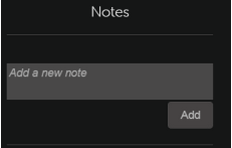

# Corsi

Leggi questo articolo per sapere come visualizzare e utilizzare i corsi in Learning Manager. Partecipa alle discussioni e fornisci feedback.

Gli Autori creano corsi. Gli Allievi possono seguire i corsi e gli Amministratori possono monitorare le prestazioni degli Allievi in base all’utilizzo dei corsi.

## Panoramica {#overview}

Adobe Learning Manager consente agli Allievi di accedere a corsi, programmi di apprendimento e certificazioni. Gli Allievi possono sfogliare tutti i corsi disponibili utilizzando il catalogo o registrandosi ai corsi di loro scelta. Gli Allievi possono visualizzare tutti i corsi a cui sono iscritti e quelli a loro assegnati nella scheda Apprendimento.

>[!NOTE]
>
>Gli Allievi possono inoltre installare l’app Learning Manager per iPad dall’Apple Store e per Android da Google Play e accedere ai corsi sui dispositivi mobili. Tutte le funzioni del ruolo Allievo sono disponibili anche nell’app. Gli Allievi possono anche portare i corsi offline e ottenere un accesso senza interruzioni dopo essere andati online. Fare riferimento a  [Utenti di iPad e tablet Android](ipad-android-tablet-users.md) per ulteriori informazioni.

## Visualizzazione dei corsi {#viewingcourses}

Puoi visualizzare un elenco di tutti i corsi disponibili come Allievo. Fai clic su Il mio apprendimento dalla pagina Home o dal riquadro a sinistra per visualizzare tutti i corsi a cui ti sei iscritto.

*Visualizzazione dei corsi assegnati*

Se devi ancora iniziare il corso, fai clic sul pulsante Inizia accanto al corso. Se hai già iniziato a utilizzare il corso, puoi fare clic sul pulsante Continua.

Per visualizzare un corso completato, fai clic sul pulsante Rivedi accanto al corso.

A un corso possono essere presenti più istanze. Fai clic sul nome del corso per visualizzare i dettagli. Nel riquadro a destra, puoi visualizzare la data di scadenza per ogni istanza del corso.

*Visualizzare un corso completato*

## Efficacia dei corsi {#courseeffectiveness}

Il punteggio di efficacia dei corsi aiuta gli allievi a prendere i corsi con il punteggio più efficace per le loro esigenze di apprendimento. L’efficacia dei corsi viene valutata per comprendere l’utilità di un corso per gli allievi. Viene calcolato in base al feedback ricevuto dal numero di utenti per un determinato corso. Se la percentuale di Allievi che fornisce feedback è maggiore, la valutazione dell’efficacia del corso è elevata.

È una combinazione di risultati dei feedback degli allievi sul contenuto del corso, risultati del quiz sul corso per un Allievo e feedback del Manager che valuta un Allievo in base agli allievi del corso.

Dalla pagina Corsi, un Allievo può visualizzare la valutazione dell’efficacia del corso nelle miniature, come mostrato nell’immagine seguente. Puoi visualizzare la valutazione di questo corso come 14.

*Visualizza valutazione dell’efficacia del corso*

Per visualizzare i dettagli sulla valutazione dell’efficacia del corso, fai clic sul valore di efficacia del corso. Viene visualizzata una finestra a comparsa come illustrato di seguito.

*Visualizza efficacia del corso*

Fai clic sulla freccia rivolta verso il basso nell’angolo in basso a destra della finestra a comparsa per vedere come vengono effettuati i calcoli dell’efficacia dei corsi.

*Calcolo dell’efficacia del corso*

## Ricerca di corsi e programmi di apprendimento {#searchingcoursesandlearningprograms}

Adobe Learning Manager consente di individuare i corsi che cerchi rapidamente e con facilità. Puoi cercare i corsi nei seguenti modi:

1. Fai clic sull’icona di ricerca visualizzata nell’angolo in alto a destra. Viene visualizzato un campo di ricerca. Digita il nome del corso/programma di apprendimento o qualsiasi parola chiave associata ai tuoi corsi. Puoi cercare i corsi per metadati, note, abilità, distintivi o tag. I tag sono ricercabili all’interno del campo di ricerca, il che significa che vengono visualizzati nel campo di ricerca durante la digitazione.
1. L’Allievo può perfezionare i risultati della ricerca nella pagina del catalogo utilizzando tipo, abilità, tag e stato.

Puoi ordinare i corsi per pertinenza, nome o data di pubblicazione facendo clic su Ordina per e scegliendo dal menu a discesa.

Nella pagina dei risultati della ricerca, puoi filtrare i corsi in base ai **durata** dei corsi e **formato** dei corsi. Questo ti offre maggiore flessibilità nella ricerca dei corsi e ti garantisce che i corsi siano adatti a te.

## Iscrizione ai corsi {#enrollingforcourses}

Gli Allievi sono iscritti ai corsi nei tre modi seguenti:

1. L’Amministratore/Manager iscrive alcuni Allievi ai corsi obbligatori in base alle esigenze dell’organizzazione.
1. Il Manager nomina alcuni corsi ai membri del team. Ricevi una notifica con l’opzione per accettare o rifiutare il corso o il programma di apprendimento. Quando gli Allievi accettano le candidature, vengono iscritti al corso/programma di apprendimento.
1. Gli Allievi possono iscriversi direttamente a un corso/programma di apprendimento:

   1. Se il corso/programma di apprendimento è di tipo iscrizione autonoma, l’Allievo viene iscritto immediatamente.
   1. Se il corso/programma di apprendimento è di tipo approvato dal Manager, l’Allievo passa a **approvazione in sospeso** stato. Dopo l’approvazione del Manager, l’Allievo è iscritto al corso.
   1. Se gli Allievi si iscrivono a un corso in lista di attesa (in caso di aula), devono attendere che qualcuno si ritiri dal corso o che l’Amministratore li approvi per il corso.

Gli Allievi possono iscriversi a un ampio elenco di corsi a seconda delle loro esigenze. La scheda Corsi visualizza tutti i corsi a cui sei iscritto/assegnato.

Tuttavia, è possibile passare a uno dei corsi elencati nel catalogo passando il mouse sopra di esso e facendo clic su Esplora. Viene visualizzata la pagina di iscrizione. Fai clic su Iscriviti nell’angolo in alto a destra della pagina per includere il corso nell’elenco Corsi.

A un corso o programma di apprendimento possono essere associate più istanze/sessioni. Nel catalogo, fai clic sul titolo del corso/programma di apprendimento per visualizzare i dettagli. È possibile visualizzare l’iscrizione a un corso/programma di apprendimento in base alla data di scadenza per ogni istanza del corso/programma di apprendimento.

**Registra interesse per i corsi**

Puoi registrarti per esprimere interesse per qualsiasi corso in aula che non abbia sessioni pianificate. Ricevi una notifica ogni volta che la sessione del corso inizia a partecipare al corso.

## Flusso di lavoro come Allievo

In qualità di Allievo, potrai valutare un corso solo dopo l’iscrizione. Puoi visualizzare la media delle valutazioni a stelle per qualsiasi corso sul **Home** Pagina, **Il mio apprendimento** pagina e **Catalogo**.

1. Accedi come **Allievo**. Viene caricato il **Home page**.

1. Cerca un corso inserendo il nome nella barra di ricerca. In alternativa, puoi scegliere dall’elenco visualizzato dei corsi facendo clic su **Il mio apprendimento** oppure **Catalogo** dal riquadro sinistro.

1. Dopo aver selezionato un corso, fai clic su **[!UICONTROL Iscrizione]**.

   
   *Iscrizione a un corso*

1. Seleziona il numero di stelle per valutare un corso di conseguenza, considerando che 1 è il minimo e 5 è il massimo. Quindi fai clic su **[!UICONTROL Invia]**.

   
   *Invia valutazione del corso*

   Gli Allievi possono inviare nuovamente il feedback e fornire la valutazione a stelle più di una volta. Sarà presa in considerazione la valutazione più recente.

1. Viene visualizzato un messaggio di conferma dopo l’invio.

   
   *Messaggio di conferma del feedback*

   Se desideri inviare nuovamente il feedback, puoi farlo facendo clic sul messaggio. Una volta inviata la valutazione, il messaggio viene visualizzato per tre secondi, quindi viene mostrata la valutazione. Se desideri modificare la valutazione, puoi selezionare un numero di stelle diverso e inviarlo.

I corsi possono essere ordinati in base alla media delle valutazioni fornite. Puoi ordinare i dati dal menu a discesa Ordina per nell’angolo in alto a destra, disponibile nelle opzioni **Catalogo**.

## Partecipazione a un corso {#consumingnbspacourse}

Dopo esserti iscritto a un corso, puoi iniziare a seguirlo facendo clic sul pulsante Inizia del corso. In alternativa, fai clic su **[!UICONTROL Corsi]** nel **[!UICONTROL Apprendimento]** scheda. Scegli un corso che desideri iniziare a frequentare.

Se non hai ancora iniziato un corso, fai clic sul pulsante Inizia accanto al titolo del corso.

Puoi visualizzare tutti i moduli del corso in una finestra del browser.

**Funzionalità del lettore**

**SOMMARIO** - Durante la partecipazione a un corso, il lettore visualizza un sommario del corso nel riquadro sinistro della finestra. Potete fare clic su ciascun argomento e passare direttamente ad esso.

**Segnalibri** - Se uno dei moduli di corso dispone di un sommario dei moduli, gli argomenti nel sommario dei moduli possono essere contrassegnati per fare riferimento in un secondo momento. Quando è contrassegnato con segnalibro, accanto alla voce del sommario viene visualizzata un&#39;icona a forma di barra multifunzione. È possibile eliminare i segnalibri facendo nuovamente clic sulla barra multifunzione.

**Note** - È disponibile un provisioning per registrare le note mentre si segue il corso. Dopo aver registrato le note, puoi salvarle e scaricarle come PDF oppure inviarle tramite e-mail agli ID e-mail di tutti gli Allievi registrati. Quando fai clic su Salva, viene visualizzata un’opzione per scegliere il percorso in cui salvarlo come file PDF.

*Prendi nota del corso*

**Sottotitoli** - Per i corsi sviluppati per Adobe Captivate, se i sottotitoli codificati vengono attivati durante lo sviluppo del corso, l’Allievo può visualizzare i sottotitoli. Fai clic su CC nella parte inferiore del lettore. L’opzione sottotitoli codificati è disponibile solo per il contenuto Captivate 8.0.2 HTML. Per tutti gli altri tipi di moduli, l’opzione CC non viene visualizzata sulla barra di riproduzione.

**Rivedi corso** - Puoi rivisitare un corso in due modalità in due possibili scenari:

* Fai clic su Rivedi mentre il corso è in stato completato.
* Fai clic su Continua quando il corso è in stato incompleto.

**Schermo intero** Fai clic sull’icona a schermo intero nell’angolo in basso a destra del lettore per visualizzare il corso nella finestra a schermo intero.

**Pulsanti di navigazione** Puoi fare clic sulle frecce su/giù per spostarti tra le diapositive nei contenuti PDF, docx e pptx. Le frecce possono essere utilizzate per passare agli argomenti successivi per tutti i tipi di contenuto.

**Chiudi il corso** Fai clic sull’icona di chiusura (x) nell’angolo superiore destro del lettore per uscire dal corso.

*Dopo aver chiuso il corso, puoi rivederlo facendo clic sul pulsante Rivedi nella pagina di descrizione del corso.*

## Valutazione a stelle

Solo dopo l’iscrizione a un corso, l’Allievo può fornire un feedback a stelle al corso. Nella pagina della Panoramica del corso, l’Allievo può valutare il corso con le stelle (1 minimo, 5 massimo).

*Fornisci una valutazione a stelle come feedback*

Un Allievo potrà selezionare un numero di stelle (su 5) e inviare la valutazione. L’Allievo può inoltre modificare la selezione facendo clic su un numero di stelle diverso. Una volta inviato, verrà visualizzato un messaggio di ringraziamento per il feedback.

Se l’Allievo desidera inviare nuovamente il feedback, può farlo facendo clic sul messaggio. Il pulsante **Invia **viene riabilitato. Un Allievo può fornire valutazioni a stelle più volte dopo l’iscrizione a un corso. La valutazione più recente sarà sempre presa in considerazione.

Una volta che l’Allievo fornisce una valutazione a stelle, la media di queste e il conteggio degli Allievi che hanno fornito un feedback compariranno nel **Panoramica del corso** pagina.

*Panoramica del corso*

Per tutti gli account esistenti, questa funzione è disabilitata. Gli amministratori possono abilitarla da Impostazioni. Solo a partire da quel momento gli Allievi potranno visualizzare le valutazioni a stelle.

## Contenuti del marketplace

L’opzione Contenuti del marketplace si trova nel riquadro a sinistra nell’app per Allievi. Facendo clic su questa opzione, puoi visualizzare tutti i corsi/intero catalogo e le playlist selezionate.

Puoi vedere i corsi presenti sull’intero catalogo nella pagina seguente. Ogni corso mostra la sua durata e l’argomento più ampio a cui appartiene. Puoi scegliere l’argomento dal filtro a sinistra della pagina.

Puoi visualizzare in anteprima un corso per due minuti esatti.

*Anteprima del corso nel marketplace*

Quando l’Amministratore ti invita a esplorare e visualizzare in anteprima un’ampia gamma di corsi, viene visualizzata una notifica.

In qualità di Allievo, puoi esprimere interesse per un intero catalogo o per qualsiasi playlist selezionata nel **Playlist selezionata** sezione.

*Visualizza playlist selezionata*

Dopo aver espresso il tuo interesse per un corso o un corso di formazione, questo viene registrato e l’Amministratore può quindi recuperare la registrazione.

Nell’app per Allievi, tutti gli Amministratori hanno accesso ai Contenuti del marketplace. Se l’Amministratore ha revocato l’accesso, gli allievi non possono visualizzare la scheda Contenuti del marketplace.

Gli Allievi invitati dall’Amministratore possono esplorare i Contenuti del marketplace.

>[!NOTE]
>
>Contenuti del marketplace non supportati in Internet Explorer 11.

Tutti i filtri e le altre opzioni sono mostrati nel video seguente.

### Anteprima del contenuto

Puoi esplorare e visualizzare in anteprima il corso e vedere se soddisfa le tue esigenze di apprendimento. Fai clic sul pulsante **Anteprima **e visualizza l’anteprima del corso. L’anteprima è disponibile per due minuti.

*Anteprima dei contenuti nel marketplace*

## Hub dei contenuti

L’Hub dei contenuti consente agli Amministratori e agli Esperti in materia (SME) di creare un elenco delle playlist richieste dall’app per Allievi. Una volta creato l’elenco, gli amministratori possono scaricare il modulo di richiesta di acquisto e condividerlo con l’agente di vendita Adobe.

Un Amministratore può invitare gli SME a creare elenchi con le playlist a cui sono interessati.

L’Hub dei contenuti è disponibile nel ruolo Allievo per tutti gli Amministratori. Gli Amministratori consentono agli SME di creare elenchi con le playlist che sono interessati ad acquistare.

La pagina Hub dei contenuti è sempre visibile agli amministratori nel ruolo di Allievo, in quanto consente di creare comodamente elenchi di playlist. Per aiutarti a creare elenchi con le giuste playlist, gli Amministratori possono rendere questa pagina accessibile a un numero limitato di Esperti in materia nel loro account. Visita la pagina Formazione dell’azienda come Amministratore e procedi ai passaggi necessari per fornire l’accesso.

## Scegli l’istanza del corso {#choosecourseinstance}

Se sei un Allievo iscritto a un’istanza del corso la cui sessione è scaduta, ora puoi passare a un’altra sessione per continuare. Questo può essere fatto solo se il programma di apprendimento è flessibile.

Per modificare l’istanza del corso, effettua le seguenti operazioni:

1. Apri Cataloghi > Programma di apprendimento.

   
   *Seleziona un programma di apprendimento*

1. Utilizza i pulsanti di scelta per scegliere se visualizzare tutti i corsi o i corsi con istanze non selezionate. Tieni presente che se l’Allievo ha completato l’istanza, non può passare a un’altra istanza.

   
   *Visualizzare tutti i corsi o i corsi con istanze non selezionate*

1. Il menu a discesa delle istanze per il corso visualizza le istanze disponibili. Scegli l’istanza dall’elenco a discesa.

   
   *Seleziona un’istanza*

1. Per applicare l&#39;istanza selezionata, fare clic su **[!UICONTROL Aggiorna iscrizione]**. L’opzione Aggiorna iscrizione è disponibile nella parte superiore destra della pagina.

   L&#39;istanza appena selezionata viene registrata. Se un Allievo è iscritto a un’istanza del corso appartenente a un altro LO e aggiorna l’istanza del corso appartenente al programma di apprendimento flessibile, dopo un avviso verrà automaticamente annullato l’iscrizione agli altri oggetti di apprendimento.

## Completamento di un corso {#completingacourse}

In qualità di Allievo, puoi completare il numero richiesto di moduli in un corso per il completamento del corso. I criteri di completamento del corso dipendono dal numero di moduli impostati come obbligatori dall’Autore. Quando ti iscrivi a un corso con un criterio di completamento minimo, puoi visualizzare i criteri di completamento nel riquadro a destra della pagina del corso.

*Visualizza criteri di completamento*

Ad esempio, se per un corso specifico i criteri di completamento corrispondono a uno su due moduli, il completamento di un solo modulo ne indica il completamento. In questo caso, quando completi il primo modulo, sulla barra di avanzamento viene visualizzato lo stato di completamento al 100%.

Se i moduli vengono impostati come ordinati dall’autore, è necessario completare il numero di moduli richiesto in ordine sequenziale a partire dal primo. Se i moduli non sono ordinati, è possibile completare il numero specificato di moduli in qualsiasi ordine.

Dopo aver completato un corso con il numero richiesto di moduli, se desideri completare i moduli opzionali, puoi rivisitare il corso.

## Visualizzazione e partecipazione alle discussioni {#viewingandpariticpatingindiscussions}

In qualità di Allievo, puoi interagire con altri Allievi e con i tuoi Istruttori utilizzando la scheda Discussione. Puoi visualizzare i post per qualsiasi corso visualizzato o a cui ti iscrivi. Se un Amministratore ha abilitato le discussioni per un corso, puoi visualizzare la scheda Discussione accanto alla scheda Note di tale corso.

Quando fai clic sulla scheda Discussioni, puoi visualizzare i post e i commenti esistenti per quel corso. Se hai già effettuato l’iscrizione al corso, puoi anche iniziare a digitare post o commenti che altri utenti potranno visualizzare. Dopo aver digitato il messaggio, fai clic su Pubblica. Il post deve contenere almeno 10 caratteri.

Il post è immediatamente visibile nella scheda Discussioni. Puoi ordinare i post come Primi nuovi o Primi meno recenti ed eliminare i post che hai scritto. Anche dopo aver annullato l’iscrizione al corso, puoi comunque visualizzare tutti i post ed eliminare quelli che hai scritto.

*Visualizza discussioni partecipanti*

La scheda Discussione non è abilitata per gli utenti esterni.

*Scheda Discussione*

## Ciclo di vita del corso {#courselifecycle}

Il ciclo di vita tipico di un corso è il seguente:

**Bozza** - Quando un Autore completa la creazione di un corso e lo salva. A questo punto, il corso non è ancora disponibile per gli Allievi.

**Pubblicato** - Quando un Autore completa la pubblicazione di un corso. A questo punto, il corso è disponibile per l’iscrizione da parte degli Allievi.

**Ritirato** - Dopo aver pubblicato un corso, un Autore può attribuirgli lo stato Ritirato se desidera che il corso non venga più visualizzato nel catalogo dei corsi per gli Allievi.

**Eliminato** - A un corso viene attribuito lo stato Eliminato quando viene rimosso completamente dall’applicazione di Learning Manager per Adobi. I corsi possono essere eliminati dagli Autori solo quando sono in stato Bozza o Ritirato.

*Panoramica del ciclo di vita di un corso*
