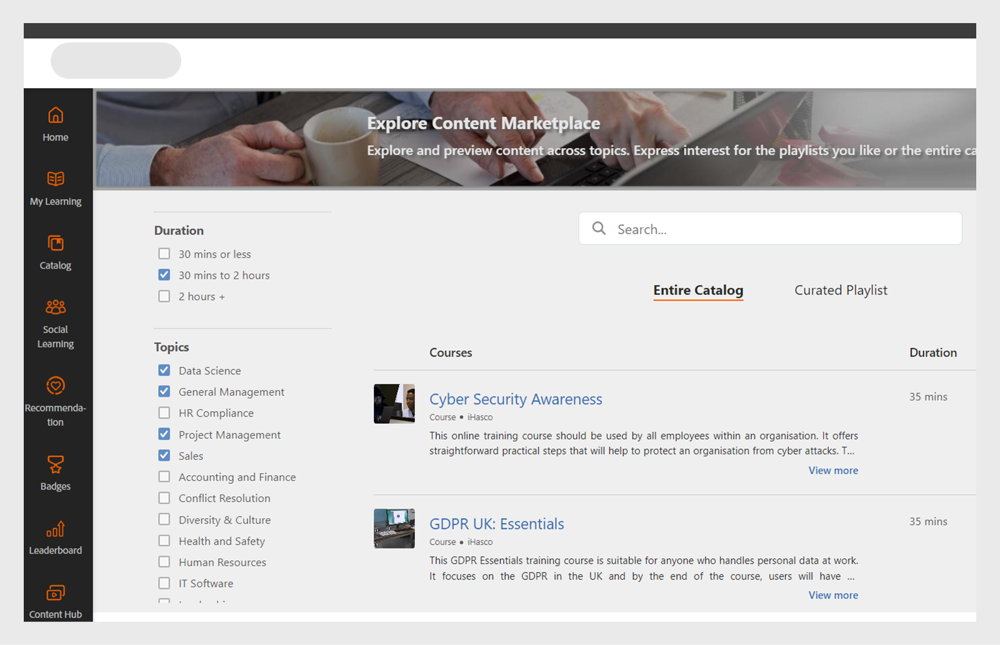

# Corsi

Leggi questo articolo per sapere come visualizzare e utilizzare i corsi in Learning Manager. Partecipa alle discussioni e fornisci feedback.

I corsi vengono creati dagli Autori. Gli Allievi possono seguire i corsi e gli Amministratori possono tenere traccia delle loro prestazioni in base alla frequenza dei corsi.

## Panoramica {#overview}

Adobe Learning Manager consente agli Allievi di accedere ai corsi, ai programmi di apprendimento e alle certificazioni. Gli Allievi possono esplorare tutti i corsi disponibili tramite il catalogo o registrandosi ai corsi di propria scelta. Gli Allievi possono visualizzare tutti i corsi registrati e i corsi assegnati nella scheda Apprendimento.

>[!NOTE]
>
>Gli Allievi possono inoltre installare l&#39;app Learning Manager per iPad dall&#39;Apple Store e Learning Manager per Android da Google Play e accedere ai corsi sui dispositivi mobili. Tutte le funzioni del ruolo Allievo sono disponibili anche nell’applicazione. Gli Allievi possono inoltre frequentare corsi offline e ottenere un accesso semplificato dopo l’accesso online. Fai riferimento alla funzionalità per gli utenti](ipad-android-tablet-users.md) di [iPad e tablet Android per ulteriori informazioni.

## Visualizzazione dei corsi {#viewingcourses}

Puoi visualizzare un elenco di tutti i corsi disponibili come Allievo. Fai clic su Il mio apprendimento nella home page o nel riquadro a sinistra per visualizzare tutti i corsi a cui sei iscritto.

*Visualizzazione dei corsi assegnati*

Se devi ancora avviare il corso, puoi fare clic sul pulsante Avvia accanto al corso. Se hai già iniziato a frequentare il corso, puoi fare clic sul pulsante Continua.

Per visualizzare un corso completato, fai clic sul pulsante Rivedi accanto al corso.

Possono essere presenti più istanze per ogni corso. Fai clic sul nome del corso per visualizzarne i dettagli. Nel riquadro destro puoi visualizzare la data di scadenza di ogni istanza del corso.

*Visualizzare un corso completato*

## Efficacia del corso {#courseeffectiveness}

La valutazione dell’efficacia dei corsi consente agli Allievi di scegliere i corsi più efficaci in base alle loro esigenze di apprendimento. L’efficacia dei corsi viene valutata per comprendere l’utilità di un corso per gli Allievi. Viene calcolata in base al feedback ricevuto da un dato numero di utenti per un corso specifico. Se la percentuale di Allievi che fornisce un feedback è più alta, la valutazione dell’efficacia del corso è elevata.

È una combinazione di risultati del feedback degli Allievi sul contenuto del corso, risultati del quiz sul corso per un Allievo e feedback del Manager che valuta un Allievo in base a ciò che ha appreso nel corso.

Nella pagina Corsi, un Allievo può visualizzare la valutazione dell’efficacia di un corso sulle miniature, come illustrato nell’immagine seguente. In questo caso, la valutazione del corso è 14.

*Visualizza la valutazione dell&#39;efficacia del corso*

Fai clic sul valore di efficacia del corso per visualizzare i dettagli relativi alla sua efficacia. Viene visualizzata una finestra a comparsa come illustrato di seguito.

*Visualizza l&#39;efficacia del corso*

Fai clic sulla freccia rivolta verso il basso nell’angolo in basso a destra della finestra a comparsa per vedere come vengono effettuati i calcoli dell’efficacia dei corsi.

*Calcolo dell&#39;efficacia del corso*

## Ricerca di corsi e programmi di apprendimento {#searchingcoursesandlearningprograms}

Adobe Learning Manager consente di individuare i corsi che cerchi rapidamente e con facilità. Puoi eseguire una ricerca tra i corsi nei modi seguenti:

1. Fai clic sull’icona di ricerca visualizzata nell’angolo in alto a destra. Viene visualizzato un campo di ricerca. Digita il nome del corso/programma di apprendimento o delle parole chiave associate ai corsi. Puoi cercare i corsi per metadati, note, abilità, distintivi o tag. I tag sono ricercabili all’interno del campo di ricerca, il che significa che vengono visualizzati nel campo di ricerca durante la digitazione.
1. Lo studente può perfezionare i risultati della ricerca nella pagina del catalogo utilizzando tipo, abilità, tag e stato.

Puoi ordinare i corsi per pertinenza, nome o data di pubblicazione facendo clic su Ordina per e scegliendo dal menu a discesa.

Nella pagina dei risultati della ricerca, puoi filtrare i corsi in base alla **durata** dei corsi e al **formato** dei corsi. Questo offre maggiore flessibilità nella ricerca di corsi e garantisce che i corsi siano adatti a te.

## Iscrizione ai corsi {#enrollingforcourses}

È possibile iscrivere gli Allievi ai corsi nei tre diversi modi qui elencati:

1. L’Amministratore/Manager iscrive alcuni Allievi ai corsi obbligatori in base alle esigenze dell’azienda.
1. Il Manager assegna alcuni corsi ai membri del team. Ricevi una notifica con l’opzione di accettare o rifiutare il corso/programma di apprendimento. Quando gli Allievi accettano l’assegnazione, vengono iscritti al corso/programma di apprendimento.
1. Gli Allievi possono iscriversi direttamente a un corso/programma di apprendimento:

   1. Se il corso/programma di apprendimento prevede l’iscrizione diretta, l’Allievo viene iscritto immediatamente.
   1. Se il corso/programma di apprendimento deve essere approvato dal Manager, l&#39;Allievo passa allo stato in attesa **di** approvazione. Dopo l&#39;approvazione del Manager, l&#39;Allievo viene iscritto al corso.
   1. Se gli Allievi si iscrivono a un corso con lista d’attesa (se si tratta di un corso in aula), devono aspettare che qualcuno abbandoni il corso o che l’Amministratore approvi la loro richiesta per il corso.

Gli Allievi possono iscriversi direttamente a molti corsi in base alle loro esigenze. Nella scheda Corsi vengono visualizzati tutti i corsi registrati/assegnati.

Tuttavia, hai la possibilità di scorrere tra i corsi elencati nel catalogo passando il mouse su di esso e facendo clic su Esplora. Viene visualizzata la pagina di iscrizione. Fai clic su Iscrivimi nell’angolo superiore destro della pagina, per includere il corso nell’elenco.

Possono essere presenti più istanze/sessioni per ogni corso/programma di apprendimento. Nel catalogo, fai clic sul nome della sezione dedicata al corso/programma di apprendimento per visualizzarne i dettagli. Puoi visualizzare l’iscrizione all’istanza del corso/programma di apprendimento in base alla data di scadenza di ciascuna istanza del corso/programma di apprendimento.

**Registra interesse per i corsi**

Puoi esprimere il tuo interesse per qualsiasi corso in aula che non preveda sessioni pianificate. Ogni volta che la sessione di un corso inizia, riceverai una notifica che ti invita a partecipare al corso.

>[!NOTE]
>
>Gli Allievi dovrebbero visualizzare un messaggio di conflitto se si iscrivono a due sessioni diverse contemporaneamente o in orari sovrapposti.

## Flusso di lavoro come Allievo

Come Allievo, potrai valutare un corso solo dopo l’iscrizione. Puoi visualizzare le valutazioni medie a stelle per ogni corso nella pagina principale **, nella pagina Il mio apprendimento** e **nel** catalogo ****.

1. Accedi come **Allievo**. In questo modo viene caricata la **home page**.

1. Cerca un corso inserendo il nome del corso nella barra di ricerca. In alternativa, puoi scegliere dall&#39;elenco dei corsi visualizzato facendo clic su **Il mio apprendimento** o **Catalogo** nel riquadro a sinistra.

1. Dopo aver selezionato un corso, fai clic su **[!UICONTROL Iscrivimi]**.

   
   *Iscriviti a un corso*

1. Seleziona il numero di stelle per valutare un corso, considerando che 1 è il minimo e 5 è il massimo. Quindi fai clic su **[!UICONTROL Invia]**.

   
   *Invia la valutazione del corso*

   Gli allievi possono inviare nuovamente il feedback e fornire la valutazione a stelle più di una volta. Sarà presa in considerazione la valutazione più recente.

1. Viene visualizzato un messaggio di conferma dopo l’invio.

   
   *Messaggio di conferma del feedback*

   Se desideri inviare nuovamente il feedback, puoi farlo facendo clic sul messaggio. Dopo l’invio, il messaggio di conferma viene visualizzato per tre secondi, al termine dei quali viene mostrata la valutazione. Se desideri modificarla, puoi selezionare un numero di stelle diverso e procedere con un nuovo invio.

Puoi ordinare i corsi in base alla media delle valutazioni fornite. Puoi ordinare i casi dal menu a discesa Ordina per nell&#39;angolo in alto a destra, disponibile nel **catalogo**.

## Seguire un corso {#consumingnbspacourse}

Dopo esserti iscritto a un corso, puoi iniziare a frequentarlo facendo clic su Avvio. In alternativa, fai clic su **[!UICONTROL Corsi]** nella **[!UICONTROL scheda Apprendimento]** . Scegli un corso che desideri iniziare.

Se devi ancora avviare un corso, fai clic sul pulsante Avvia accanto al titolo del corso.

Puoi visualizzare tutti i moduli del corso in una finestra del browser.

**Funzionalità del lettore**

**** Sommario - Mentre inizi un corso, il lettore visualizza un sommario del corso nel riquadro sinistro della finestra. Puoi fare clic su ciascun argomento per passare direttamente a esso.

**Segnalibri** - Se uno dei moduli del corso dispone di un sommario, gli argomenti all&#39;interno del sommario possono essere inseriti tra i preferiti per riferimento futuro. Una volta contrassegnata una voce del glossario, viene visualizzata un’icona a forma di nastro accanto a essa. I segnalibri possono essere eliminati facendo clic nuovamente sul nastro.

**Note** - È disponibile una disposizione per registrare note mentre si segue il corso. Dopo la registrazione delle note, puoi salvare e scaricare come PDF o inviare tramite e-mail le note all’ID e-mail di qualsiasi Allievo registrato. Quando fai clic su Salva, puoi scegliere dove salvare il file delle note come PDF.

*Prendi appunti sul corso*

**Sottotitoli** codificati - Per i corsi sviluppati per Adobe Captivate, se i sottotitoli codificati vengono attivati durante lo sviluppo del corso, l&#39;Allievo può visualizzare i sottotitoli. Fai clic su CC nella parte inferiore del lettore. L’opzione sottotitoli codificati è disponibile solo per il contenuto HTML di Captivate 8.0.2. Per tutti gli altri tipi di moduli, l’opzione CC non viene visualizzata nella barra di riproduzione.

**Rivedi corso** - Puoi rivedere un corso in due modalità in due possibili scenari:

* Facendo clic su Rivedi quando il corso è stato completato.
* Facendo clic su Continua quando il corso non è ancora stato completato.

**Schermo** intero Fai clic sull&#39;icona Schermo intero nell&#39;angolo inferiore destro del lettore per visualizzare il corso in una finestra a schermo intero.

**Pulsanti** di navigazione È possibile fare clic sulle frecce su/giù per spostarsi tra le diapositive nel contenuto pdf, docx e pptx. I tasti freccia della diapositiva possono essere utilizzati per passare agli argomenti successivi per tutti i tipi di contenuto.

**Chiudi il corso** Fai clic sull’icona di chiusura (x) nell’angolo superiore destro del lettore per uscire dal corso.

*Dopo essere uscito dal corso, puoi rivederlo facendo clic sul pulsante Rivedi nella pagina di descrizione del corso.*

## Valutazione a stelle

Solo dopo essersi iscritto a un corso, un Allievo può fornire un feedback stellare al corso. Nella pagina Panoramica corso di un corso, l&#39;Allievo può valutare il corso come stelle (1 minimo, 5 più alto).

*Fornire una valutazione a stelle come feedback*

Un Allievo potrà selezionare una stella specifica (su 5) e inviare la valutazione. L&#39;Allievo può anche modificare la selezione facendo clic su una stella diversa. Una volta inviato, verrà visualizzato un messaggio di ringraziamento per il feedback.

Se l’Allievo desidera inviare nuovamente il feedback, può farlo facendo clic sul messaggio. Il **pulsante Invia** viene riattivato. Un Allievo può assegnare una valutazione a stelle più volte dopo l&#39;iscrizione a un corso. Si terrà sempre in considerazione la valutazione più recente.

Una volta che l&#39;Allievo fornisce una valutazione, la valutazione media a stelle e il numero di Allievi che hanno fornito la funzionalità di valutazione a stelle nella pagina Panoramica **del** corso.

*Panoramica del corso*

Per tutti gli account esistenti, questa funzione è disabilitata. Gli Amministratori possono abilitarla da Impostazioni. Solo a partire da quel momento gli Allievi potranno visualizzare le valutazioni a stelle.

## Contenuti del marketplace

L’opzione Contenuti del marketplace si trova nel riquadro a sinistra nell’app per gli Allievi. Quando fai clic sull&#39;opzione, puoi visualizzare tutti i corsi/l&#39;intero catalogo e le playlist curate.

Puoi vedere i corsi presenti sull’intero catalogo nella pagina seguente. Ogni corso mostra la durata e l’argomento generale a cui appartiene. Puoi scegliere l’argomento dal filtro a sinistra della pagina.

Puoi visualizzare per due minuti l’anteprima di un corso.

*Anteprima del corso nel marketplace*

Quando l’Amministratore ti invita a esplorare e visualizzare in anteprima una gamma di corsi, visualizzerai una notifica.

Come Allievo, puoi esprimere interesse per un intero catalogo o qualsiasi playlist curata nella **sezione Playlist** curate.

*Visualizza playlist curate*

Dopo aver espresso il tuo interesse per un corso o un training, questo viene memorizzato e l’Amministratore può quindi recuperare la registrazione.

Nell&#39;applicazione Allievo, tutti gli amministratori hanno accesso a Content Marketplace. Se l&#39;accesso viene revocato dall&#39;Amministratore, gli Allievi non possono visualizzare la scheda Marketplace dei contenuti.

Gli Allievi invitati dall’Amministratore possono esplorare i Contenuti del marketplace.

>[!NOTE]
>
>Content Marketplace non è supportato in Internet Explorer 11.

Tutti i filtri e le altre opzioni sono mostrati nel seguente video.

### Anteprima del contenuto

Puoi esplorare e visualizzare in anteprima il corso e vedere se soddisfa le tue esigenze di apprendimento. Fai clic sul **pulsante Anteprima** per visualizzare l&#39;anteprima del corso. L’anteprima è disponibile per due minuti.

*Visualizzare in anteprima il contenuto nel marketplace*

## Hub dei contenuti

Content Hub consente agli amministratori e agli esperti in materia (PMI) di selezionare le playlist richieste dall&#39;app per Allievi. Una volta selezionato l&#39;elenco dei candidati, gli amministratori possono scaricare il modulo di richiesta di acquisto e condividerlo con l&#39;agente di vendita Adobe.

Gli Amministratori possono invitare gli SME a creare elenchi con le playlist a cui sono interessati

Content Hub è disponibile nel ruolo Allievo per tutti gli amministratori. Gli Amministratori consentono agli SME di elencare le playlist che sono interessati ad acquistare.

La pagina Hub dei contenuti è sempre visibile agli amministratori nel ruolo di Allievo, perché consente loro di creare comodamente elenchi di playlist. Per aiutarti a creare elenchi con le giuste playlist, gli Amministratori possono rendere questa pagina accessibile a un numero limitato di Esperti in materia sul loro account. Visita la pagina Formazione dell’azienda come Amministratore e procedi ai passaggi necessari per fornire l’accesso.

## Scegli l’istanza del corso {#choosecourseinstance}

Se sei un Allievo iscritto a un’istanza del corso la cui sessione è scaduta, puoi ora passare a una diversa sessione per fare progressi. Questa operazione può essere eseguita solo se il programma di apprendimento è flessibile.

Per modificare l’istanza del corso, effettua quanto segue:

1. Apri Cataloghi > Programma di apprendimento.

   
   *Seleziona un programma di apprendimento*

1. Utilizza i pulsanti di opzione per scegliere se visualizzare tutti i corsi o i corsi con istanze non selezionate. Tieni presente che se l&#39;Allievo ha completato l&#39;istanza, non può passare a un&#39;altra istanza.

   
   *Visualizzare tutti i corsi o i corsi con istanze non selezionate*

1. Il menu a discesa per il corso visualizza le istanze disponibili. Scegli l’istanza dall’elenco a discesa.

   
   *Seleziona un&#39;istanza*

1. Per applicare l’istanza selezionata, fai clic su **[!UICONTROL Aggiorna iscrizione]**. L’opzione Aggiorna iscrizione è disponibile nella parte superiore destra della pagina.

   L&#39;istanza appena selezionata è stata registrata. Se un Allievo è iscritto a un&#39;istanza del corso parte di un altro oggetto di apprendimento e aggiorna l&#39;istanza del corso che fa parte del programma di apprendimento flessibile, la sua iscrizione verrà automaticamente annullata dagli altri oggetti di apprendimento dopo un avviso.

## Completamento di un corso {#completingacourse}

Come Allievo, puoi completare il numero richiesto di moduli in un corso per il completamento del corso. I criteri di completamento del corso dipendono dal numero di moduli impostati come obbligatori dall’Autore. Quando ti iscrivi a un corso con un criterio di completamento minimo, puoi visualizzare il criterio di completamento nel riquadro a destra della pagina Corso.

*Visualizzare i criteri di completamento*

Ad esempio, se un corso specifico presenta un criterio di completamento di uno di due moduli, il completamento di solo un modulo contrassegna il completamento di tale corso. In questo caso, quando completi il primo modulo, la barra di avanzamento visualizza uno stato di completamento del 100%.

Se i moduli sono impostati secondo l’ordine dell’Autore, devi completare il numero richiesto di moduli nell’ordine sequenziale partendo dal primo. Se i moduli non vengono ordinati, puoi completare il numero specificato di moduli in qualsiasi ordine.

Dopo aver completato un corso con il numero necessario di moduli, puoi rivedere il corso se desideri completare i moduli facoltativi.

## Visualizzazione e partecipazione alle discussioni {#viewingandpariticpatingindiscussions}

Come Allievo, puoi interagire con altri Allievi e Istruttori tramite la scheda Discussione. Puoi visualizzare i post per tutti i corsi che desideri visualizzare o a cui iscriverti. Se un amministratore ha attivato le discussioni per un corso, puoi visualizzare la scheda Discussione accanto alla scheda Note per tale corso.

Quando fai clic sulla scheda Discussione, puoi visualizzare i commenti e i post esistenti per tale corso. Se ti sei già iscritto al corso, puoi inoltre iniziare a digitare post o commenti per altri utenti. Dopo aver digitato il messaggio, fai clic sull’opzione di pubblicazione. La pubblicazione deve contenere almeno 10 caratteri.

La pubblicazione è visibile immediatamente nella scheda Discussioni. Puoi ordinare i post dal più recente al meno recente ed eliminare quelli che hai scritto. Anche dopo aver annullato l’iscrizione al corso, puoi ancora visualizzare tutti i post ed eliminare quelli da te creati.

*Visualizzare le discussioni dei partecipanti*

La scheda Discussione non è disponibile per gli utenti esterni.

*Scheda Discussione*

## Ciclo di vita del corso {#courselifecycle}

Il ciclo di vita tipico di un corso è il seguente:

**Bozza** - Quando un autore completa la creazione di un corso e lo salva. A questo punto, il corso non è ancora disponibile per gli allievi.

**Pubblicato** - Quando un Autore completa la pubblicazione di un corso. A questo punto, il corso è disponibile per l’iscrizione da parte degli Allievi.

**Ritirato** - Dopo aver pubblicato un corso, un Autore può portarlo allo stato Ritirato se desidera che il corso non venga visualizzato nel catalogo per gli Allievi.

**Eliminato** - A un corso viene attribuito lo stato Eliminato quando viene rimosso completamente dall&#39;applicazione Adobe Learning Manager. I corsi possono essere eliminati dagli Autori solo quando si trovano nello stato Bozza o Ritirato.

*Panoramica del ciclo di vita di un corso*
