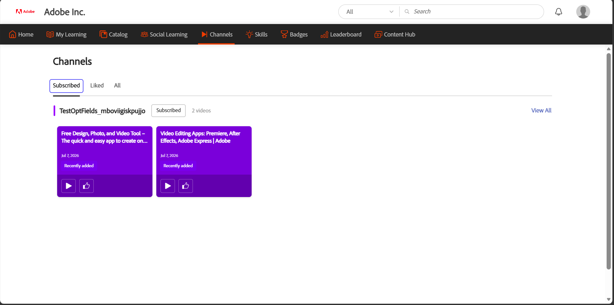
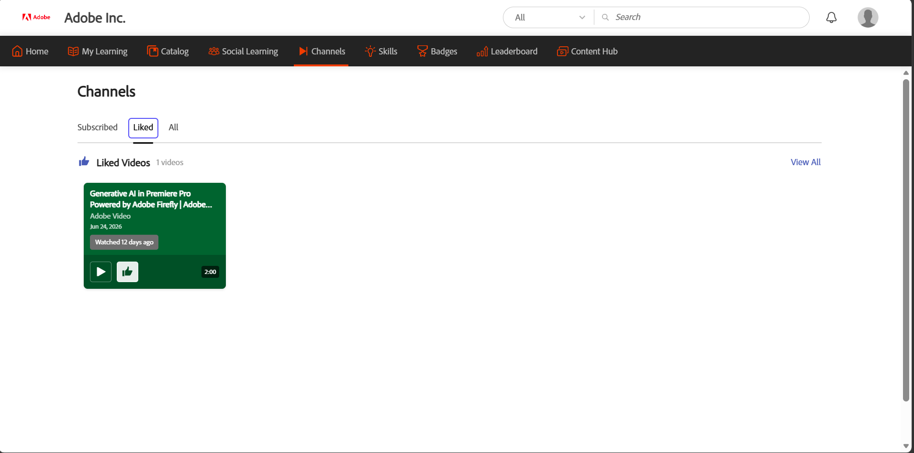

# Scopri e interagisci con i canali

I canali aiutano gli Allievi a scoprire e accedere a contenuti di apprendimento informale basati su video, selezionati nelle pagine Web e Cloud Confluence all’interno di Adobe Learning Manager. Gli amministratori creano i canali collegandoli alle pagine Web aziendali o alle pagine Cloud Confluence che ospitano sessioni di condivisione e trasferimento delle conoscenze registrate.

Invece di eseguire ricerche in più siti interni, puoi sfogliare il contenuto del canale direttamente in Learning Manager. I canali forniscono una posizione centralizzata per la scoperta di video rilevanti, rimanere informati sui nuovi contenuti e interagire con le risorse di apprendimento autonome della tua organizzazione.

**Vantaggi principali**

- Accedi ai contenuti video da pagine Web aziendali e pagine Cloud Confluence in un&#39;unica posizione.
- Scopri le risorse di apprendimento senza navigare in più siti Web interni.
- Abbonati ai canali per ricevere informazioni quando vengono aggiunti nuovi contenuti.
- Guarda e aggiungi Mi piace ai video direttamente in Adobe Learning Manager.
- Partecipa alle discussioni e collabora con altri Allievi sui contenuti condivisi.
- Esplora le raccolte esclusive di video pertinenti al tuo ruolo e ai tuoi interessi.

## Trova canali

Utilizza la pagina **Canali** per scoprire nuovi contenuti, accedere ai canali a cui hai effettuato l&#39;iscrizione e visualizzare i video che ti sono piaciuti.

1. Accedi ad Adobe Learning Manager.

1. Seleziona **Canali** dalla barra di navigazione superiore.

     La pagina **Canali** viene aperta con la scheda **Tutti** visualizzata per impostazione predefinita.

   Scheda 

   *La scheda Tutti della pagina Canali, in cui è possibile individuare e sottoscrivere i canali disponibili.*

1. Utilizza le seguenti schede per sfogliare il contenuto del canale:

   | **Scheda** | **Descrizione** |
   |----|----|
   | **Tutti** | Visualizza tutti i canali disponibili. Utilizza questa scheda per scoprire e abbonarti a nuovi canali. |
   | **Abbonato** | Visualizza solo i canali sottoscritti. |
   | **Mi piace** | Visualizza tutti i video che ti sono piaciuti su tutti i canali. |

1. Seleziona **Visualizza tutto** per un canale per visualizzare tutti i video disponibili in quel canale.

## Abbonati a un canale

Abbonati ai canali per accedere rapidamente ai contenuti di tuo interesse e rimani aggiornato quando aggiungi nuovi video.

1. Nella scheda **Tutti**, seleziona il canale a cui desideri iscriverti.

1. Selezionare il pulsante **Abbonati**.

     Il canale è stato aggiunto alla scheda **Abbonato**.

1. Selezionare la scheda **Abbonato**.

     Vengono visualizzati tutti i canali sottoscritti.

   

   *I canali sottoscritti sono raccolti nella scheda Abbonati per un accesso rapido.*

### Annullare l’iscrizione a un canale

Se non desideri più seguire un canale, seleziona nuovamente il pulsante **Abbonato**. Il canale viene rimosso dalla scheda **Abbonato** e rimane disponibile nella scheda **Tutti**, a cui è possibile accedere in qualsiasi momento.

## Guarda un video

Guarda i video dei canali della tua organizzazione per accedere alla condivisione della conoscenza e ai contenuti di apprendimento selezionati.

Per guardare un video, accedete a un canale e selezionate la miniatura o l’icona di riproduzione del video. Nella pagina dei dettagli del video, seleziona il pulsante **Guarda video** per aprire e riprodurre il video.

## Aggiungere Mi piace a un video

Metti Mi piace ai video per salvarli nella scheda **Mi piace** e trovarli rapidamente in un secondo momento.

Per aggiungere Mi piace a un video, seleziona il pulsante **Mi piace** su una scheda video o nella pagina dei dettagli del video. Il conteggio Mi piace è stato aggiornato e il video è stato aggiunto alla scheda **Mi piace** per un facile accesso.

La scheda Mi piace, in cui i video che ti piacciono vengono salvati in modo da poterli trovare in un secondo momento.

## Partecipa alla discussione

Utilizza la discussione su ogni video per condividere informazioni, fornire feedback e porre domande. Ogni video ha un proprio thread di discussione.

Per pubblicare un commento:

1. Apri il video di cui vuoi parlare.

1. Passare alla sezione **Avvia discussione**.

1. Immetti il commento nella casella **Aggiungi un commento**.

1. Seleziona **Post**.

     Il commento viene aggiunto al thread di discussione ed è visibile agli altri Allievi che visualizzano il video.

   

   *Guarda un video, visualizzane gli elementi simili e visualizza i conteggi e partecipa alla discussione dalla pagina dei dettagli del video.*
