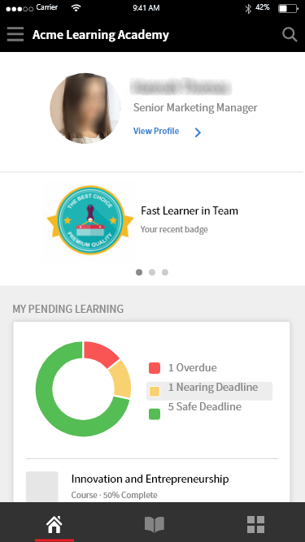

# Applicazione Allievo per dispositivi mobili e tablet

Leggi questo articolo per scoprire come scaricare l’applicazione Allievo di Learning Manager per smartphone e tablet. Scopri come seguire i corsi tramite il tuo dispositivo mobile o tablet.

## Panoramica {#overview}

L’app Learning Manager per Allievi è disponibile per gli utenti di telefoni Android e iPhone. Accedi a Google Play Store (Android OS) o App Store (macOS) e scarica l’app Learning Manager.

Dopo aver scaricato e installato l’applicazione, accedi tramite le credenziali dell’Allievo. Quando apri l&#39;app mobile Learning Manager, per impostazione predefinita viene visualizzata la seguente schermata.

*Pagina iniziale dell&#39;app Learning Manager*

## Home page {#homepage}

Per tutti gli account per i quali è attivata l&#39;opzione Layout immersivo, è disponibile una nuova home page per supportare la configurazione del layout immersivo. La home page è organizzata come un elenco di schede per:

|  |  |
|---|---|
|  |  |

*Elenco delle schede nella home page*

*Feed social dell&#39;Allievo*

## Valutazione feedback {#feedbackrating}

Learning Manager chiede all’Allievo di fornire un feedback sulla propria esperienza con l’app mobile. Questo feedback viene visualizzato una volta al mese e fornisce un intervallo di tempo sufficiente per consentire agli utenti di provare l&#39;app e quindi fornire il feedback.

<!--
|  | |
|---|---|
-->

Gli utenti esistenti dovrebbero visualizzare il popup di feedback alla chiusura di Windows Media Player per la prima volta dopo aver aggiornato l&#39;app alla versione più recente.

Tieni presente che la raccolta di commenti è anonima e viene visualizzata solo per gli utenti che hanno attivato l&#39;opzione **Condividi dati** di utilizzo tramite una configurazione nelle impostazioni dell&#39;app.

## Scarica badge {#downloadbadge}

Gli Allievi possono scaricare i loro distintivi in formato PDF e Immagine. Nella sezione Profilo utente, scorri verso il basso e fai clic su qualsiasi collegamento per scaricare un distintivo. Il badge scaricato viene salvato nella cartella predefinita del dispositivo. L&#39;app consente di aprire la cartella o il file immediatamente dopo il completamento del download.

|  |
|---|

*Scarica un badge*

## Layout reattivo per il Web mobile {#responsive}

Un&#39;esperienza web mobile completamente reattiva che garantisce che gli Allievi utilizzino i propri dispositivi per seguire la formazione anche se non hanno installato l&#39;app per dispositivi mobili.

Quando accedi per la prima volta all’app per studenti tramite il browser del tuo dispositivo, l’app per studenti viene visualizzata sotto forma di un layout mobile e reattivo.

Il supporto per l’interfaccia utente reattiva per il Web mobile è disponibile solo quando un account **è configurato solo per il layout coinvolgente**. L’interfaccia utente reattiva **non è disponibile per il layout classico**.

<!--
<table>
 <tbody>
  <tr>
   <td>
    
<strong>Home page</strong>

    
<strong>View options</strong>

    
<strong>Start course</strong>
</td>
   <td>
    
<strong>My Learning List</strong>

    
<strong>View catalog</strong>

    
<strong>Apply filters</strong>
</td>
   <td>
    
<strong>Recommendations based on interest</strong>

    
<strong>View notifications</strong>

    
<strong>Share url</strong>
</td>
  </tr>
 </tbody>
</table>
-->

## Prompt di download nel Web ALM

Quando gli utenti aprono un collegamento ALM o utilizzano il Web ALM sui propri dispositivi mobili, dovrebbero visualizzare un messaggio che chiede loro di scaricare l&#39;app per un&#39;esperienza migliore.

_Scarica l&#39;app ALM_

## Funzionalità non supportate nell’esperienza mobile immersiva {#unsupportedfeaturesinmobileimmersiveexperience}

I seguenti flussi di lavoro vengono visualizzati nell’esperienza classica di un Allievo:

* Tentativi multipli
* Programma di apprendimento flessibile
* Stato di caricamento del file
* Invia feedback L1

Altre funzionalità dell’app non supportate sono:

* App Social: un Allievo viene reindirizzato all’esperienza classica se fa clic sul widget Social nella pagina principale
* Impostazioni profilo/Modifica profilo
* Visualizza distintivo/competenze
* Classifica: un Allievo viene reindirizzato all’esperienza classica se fa clic sul widget Classifica nella pagina principale
* Download delle risorse formative in corso.
* Opzioni filtro in Cerca.

Apprendimento sociale ora supporta le esperienze web immersive per dispositivi mobili.

Alcune funzioni non sono supportate dall’app immersiva per dispositivi mobili. Questi sono:

| **Area** | **Non supportato** |
|---|---|
| Bacheca | Creazione della bacheca, Modifica della bacheca, Copia URL, Elimina, Report, Ordina, Filtro |
| Pubblica | Tipo di sondaggio Creazione post, Modifica , Allegato multiplo al post, Copia URL, Aggiungi in alto |
| Commento/ Risposta | Modifica, Contrassegna come risposta corretta, Caricamento di immagini/video/audio in commento o risposta |
| Media | Acquisizione audio; solo caricamento di file audio |
| Altri | Notifiche, visualizzazione post, classifica social, persone seguite, profilo utente |

## Consentire agli Allievi di scaricare una risorsa formativa {#download-job-aid}

Nella modalità immersiva per dispositivi mobili, un Allievo può scaricare una risorsa formativa. Tocca **Impostazioni, quindi Cataloghi******. Scarica una risorsa formativa dall&#39;elenco visualizzato.

|  |
|---|

*Scarica una risorsa formativa*

## Consentire agli Allievi di scaricare Trascrizione Allievo {#download-learner-transcript}

Nella modalità immersiva per dispositivi mobili, un Allievo può scaricare le trascrizioni degli Allievi.

|  |  |
|---|---|

*Scarica le trascrizioni degli Allievi*

## Visualizzazione di distintivi e abilità {#viewbadgesandskills}

**Visualizzazione di badge, abilità e punti di gamification**

La schermata predefinita mostra i badge, le abilità e i punti di gamification ottenuti di recente appena sotto le informazioni del profilo. Se si utilizza un telefono, vengono visualizzati i badge ottenuti di recente. Scorri verso destra per visualizzare ulteriori informazioni.

**Il mio apprendimento in sospeso**

Per impostazione predefinita la schermata mostra i corsi a cui sei iscritto. Il diagramma a torta mostra il ritardo nell’apprendimento, gli apprendimenti vicini alla scadenza e gli apprendimenti in corso.

Tocca un corso per visualizzare i dettagli del corso, la data di completamento (se applicabile). Puoi continuare o rivedere il corso in questa schermata, a seconda dello stato di completamento.

*Visualizza gli apprendimenti in sospeso*

**Visualizzazione dei cataloghi**

Tocca l’icona accanto all’icona del libro nella parte inferiore della schermata. Puoi visualizzare immediatamente il catalogo con tutti gli oggetti di apprendimento associati. Potete scegliere di visualizzarli nel layout a griglia o scegliere la vista dettagliata. Seleziona i consigli per vedere i consigli sui corsi in base alla tua cronologia di apprendimento.

*Visualizza i consigli per i corsi*

## Ordinare e filtrare gli Oggetti di apprendimento {#sortandfilterlearningobjects}

**Ordinamento e filtro**

Fai clic sull’icona di ordinamento nell’angolo superiore destro della schermata del catalogo o dei corsi per ordinare gli oggetti di apprendimento in ordine alfabetico (ascendente o decrescente) o per data di pubblicazione. Puoi inoltre filtrare gli oggetti di apprendimento per tipo, stato di completamento, abilità o tag. Tocca e seleziona il filtro e tocca Applica per applicare il filtro.

**Utilizzo della funzionalità di ricerca**

Nell’angolo superiore destro dello schermo del telefono, puoi visualizzare un’icona di ricerca. Tocca l’icona per cercare gli oggetti di apprendimento per metadati corso, ID univoco, abilità e così via.

**Gestione di profilo, impostazioni e notifica**

Tocca  il menu nell&#39;angolo in alto a sinistra dello schermo per visualizzare il profilo, le notifiche e le impostazioni dell&#39;account.

Questo menu consente inoltre di eseguire la scansione del codice QR per contrassegnare la partecipazione ai corsi.

Tutto quello che devi fare è toccare l&#39;opzione **Scansiona codice QR** ed eseguire la scansione del codice.

**Consumo offline di corsi**

Quando si consumano corsi scaricati mentre sei online, Learning Manager accederà al corso scaricato invece di effettuare chiamate al server.

## Scansione del codice QR per l’iscrizione {#qrcode}

Puoi eseguire la scansione di un codice QR e iscriverti a un corso. Dopo che l’Amministratore dell’apprendimento ha generato un codice QR, puoi eseguire la scansione del codice QR dall’app e iscriverti a un corso.

1. Per eseguire la scansione del codice QR, tocca  l&#39;angolo in alto a sinistra dello schermo.
1. Tocca **Leggi codice QR**.

La funzione di scansione QR consente allo studente di eseguire una delle azioni indicate di seguito, in base al codice QR generato dall’Amministratore dell’apprendimento:

* **Iscrizione:** consente all&#39;Allievo di iscriversi a un corso scansionando il codice QR.
* **Completamento:** consente allo studente di contrassegnare il corso come completato mediante la scansione del codice QR.
* **Iscrizione e completamento:** consente allo studente di iscriversi e contemporaneamente di contrassegnare il completamento mediante la scansione del codice QR.
* **Contrassegna partecipazione:** consente all&#39;Allievo di contrassegnare la partecipazione a una determinata sessione scansionando il codice QR.

## Rinominare gli oggetti di apprendimento {#renaminglearningobjects}

Gli amministratori possono rinominare la terminologia relativa agli oggetti di apprendimento. Per rinominare gli oggetti, consultare [Rinominare gli oggetti di apprendimento](../../administrators/feature-summary/settings.md#main-pars_header_1570157145).

## Apprendimento sociale {#socialmobile}

In questo aggiornamento, le seguenti funzionalità non sono supportate. Non è possibile:

* Creare o seguire una bacheca.
* Copiare un URL in un post.
* Aggiungi post come storia o aggiungi come post come preferito o aggiungi in cima.
* Visualizza una classifica social.

Apprendimento sociale è una piattaforma nell’app mobile Learning Manager che consente agli utenti di condividere idee e informazioni significative in un ambiente informale. Si tratta di una metodologia che integra il concetto di apprendimento tradizionale.

L’Apprendimento sociale consente agli utenti di utilizzare esperienza di chi li circonda per ottenere informazioni esatte e concise. Gli Allievi possono applicare rapidamente tali informazioni per completare un’attività e raggiungere un obiettivo.

Utilizzando l’app mobile, gli utenti possono interagire tra loro condividendo contenuti e ottenere la convalida per i contenuti condivisi.

I vari tipi di contenuti che possono essere condivisi su questa piattaforma sono video, audio, schermate, testi, domande e sondaggi. Gli utenti possono inoltre condividere i propri programmi di apprendimento online con i colleghi.

Questa funzione è disponibile solo sull’app dispositivo una volta che l’Amministratore ha abilitato **l’Apprendimento sociale** per l’account.

## Avviare Apprendimento sociale in Captivate Prime {#launchsociallearningontheapp}

All’avvio dell’app, tocca l’icona **Social**.

*Visualizza l&#39;apprendimento sociale*

## Creare un post su una bacheca {#createapostinaboard}

Come su qualsiasi altra piattaforma social, nell’app mobile Learning Manager è possibile creare post su una bacheca, in modo che tutti gli Allievi appartenenti alla stessa bacheca possano visualizzarlo, aggiungere commenti e caricare file insieme al commento.

Per creare un post, tocca l&#39;icona  in basso a destra dello schermo.

Vengono visualizzate le seguenti schermate.

*Aggiungi un post*

<table>
 <tbody>
  <tr>
   <td>
    

</td>
   <td>
    
Scrivi un post o incolla qualsiasi URL.
</td>
  </tr>
  <tr>
   <td>
    

</td>
   <td>
    
Scatta una foto con la fotocamera del tuo dispositivo mobile e caricala con il tuo post.
</td>
  </tr>
  <tr>
   <td>
    

</td>
   <td>
    
Registra un video con la fotocamera del tuo dispositivo mobile.
</td>
  </tr>
  <tr>
   <td>
    
 
</td>
   <td>
    
Registra audio con il tuo dispositivo mobile.
</td>
  </tr>
  <tr>
   <td>
    

</td>
   <td>
    
Carica qualsiasi documento o file sulla bacheca.
</td>
  </tr>
  <tr>
   <td>
    
 
</td>
   <td>
    
Fai una domanda.
</td>
  </tr>
  <tr>
   <td>
    
 
</td>
   <td>
    
Crea un sondaggio con il tuo post.
</td>
  </tr>
 </tbody>
</table>

## Formati di contenuto supportati {#supportedcontentformat}

<table>
 <tbody>
  <tr>
   <td>
    
<strong>Tipo di contenuto</strong>
</td>
   <td>
    
<strong>Estensioni</strong>
</td>
  </tr>
  <tr>
   <td>
    
Video
</td>
   <td>
    
wmv, f4v, asf, 3gp, 3g2, avi, mov, h264, m4v, mp4, MPEG, mpg
</td>
  </tr>
  <tr>
   <td>
    
Audio
</td>
   <td>
    
mp3, amr, m4a, wav, wma, aac
</td>
  </tr>
  <tr>
   <td>
    
File statici
</td>
   <td>
    
PDF, ppt, pptx, doc, docx, xls, xlsx
</td>
  </tr>
  <tr>
   <td>
    
Immagine
</td>
   <td>
    
jpg, jpeg, png, bmp, gif
</td>
  </tr>
 </tbody>
</table>

Dopo aver creato un post, scegli la bacheca su cui desideri caricarlo. Tocca Seleziona bacheca e cerca la bacheca richiesta.

Dopo aver creato un post, tocca Pubblica e pubblica il tuo commento affinché altri Allievi possano visualizzarlo.

Nell’app mobile non è possibile creare una bacheca. Per creare una bacheca, è necessario accedere alla web app come Allievo. Per ulteriori informazioni sulla creazione delle bacheche, consulta Apprendimento sociale in [Learning Manager](/help/migrated/learners/feature-summary/social-learning-web-user.md).

## Azioni eseguibili su un post {#actionsthatcanbeperformedonapost}

* Commenta un post e, in base alle autorizzazioni, visualizza il post su una bacheca.
* Modifica o elimina i commenti in una bacheca.
* Modifica o elimina un post in base alle autorizzazioni.
* Segnala un abuso relativo a un post se quest’ultimo viola la loro privacy o se il suo contenuto è inappropriato. Una volta che un post è stato segnalato, viene inviata una notifica all’Amministratore e ai moderatori della bacheca per consentire loro di intraprendere ulteriori azioni.
* Mi piace    o non mi piace     un post.
* Mi piace   o non mi piace  un commento.

## Creare un post su altre bacheche {#createapostinotherboards}

Puoi creare post anche su altre bacheche.

Tocca **Tutte le bacheche** per visualizzare le attività eseguite da altri Allievi sulla bacheca.

*Visualizza tutte le attività del consiglio di amministrazione*

Passa alla bacheca richiesta e pubblica il tuo commento.

## Condividere di media su una bacheca {#sharemedia}

<!---->

Condividi foto, documenti o file audio o video su qualsiasi bacheca, in modo che gli altri membri possano visualizzare il tuo post e avviare un’interazione. Per condividere qualsiasi media,

1. Aprite i file multimediali che desiderate condividere.
1. Tocca il pulsante di condivisione e scegli Learning Manager.
1. Scegliete la bacheca in cui desiderate condividere i file multimediali.
1. Tocca Pubblica ****.

Puoi anche pubblicare qualsiasi contenuto da un’app esterna, ad esempio puoi condividere un commento da Reddit o Quora.

## Carica le risorse nel certificato esterno come prova di completamento {#externalcert}

Effettua le seguenti operazioni:

1. Accedi all’app del dispositivo utilizzando le tue credenziali di Allievo.
1. Cerca il certificato creato dall’Autore.
1. Nell’elenco dei certificati esterni, seleziona il certificato richiesto e iscriviti al certificato.
1. Tocca **Prova di completamento** e carica un file, ad esempio un pdf o un&#39;immagine.

   |  |  |
   |---|---|

*Carica una prova di completamento*

1. Dopo aver caricato un file, seleziona **Invia**. Viene visualizzato un messaggio di conferma.

**Caricamento di un file**

1. Dopo aver caricato un file, tocca **Invia**.

   Puoi caricare un solo file come prova di completamento. Quando provi a caricare più file, viene visualizzato il seguente messaggio:

   **Le modifiche apportate andranno perse. Continuare?**

1. Lo stato passa a **In attesa di approvazione**, visualizzato in arancione.

   Non è possibile visualizzare o scaricare il file caricato nell’app mobile.

Dopo che il Manager ha approvato l’invio, lo stato diventa **Approvato**, visualizzato in verde.

Se il Manager rifiuta l’invio, lo stato diventa **Rifiutato**, visualizzato in rosso.

|  |  |  |
|---|---|---|

*Visualizzare lo stato dell&#39;invio*

Se l’invio viene rifiutato, puoi ancora caricare un file come prova del completamento.

* È possibile inviare un file solo quando lo stato è **In attesa di invio e Rifiutato**.
* Non è possibile inviare un file quando lo stato è **In attesa di approvazione e Approvato**.

## Segui corsi da LinkedIn Learning {#linkedin}

Learning Manager supporta già i corsi di LinkedIn Learning all’interno della piattaforma di apprendimento. Ora gli Allievi possono seguire i corsi di LinkedIn Learning nell’app mobile Learning Manager. Nell’app per dispositivi, cerca un corso e poi avvialo.

Se l’app LinkedIn è stata già installata il corso si aprirà nell’app, altrimenti si aprirà nel browser predefinito, dove dovrai accedere con le tue credenziali di LinkedIn.

Se stai seguendo il corso tramite l&#39;app LinkedIn, i tuoi progressi non verranno monitorati all&#39;interno di Learning Manager. Pertanto, si consiglia di avviare il corso nel browser anziché nell&#39;app LinkedIn Learning.

>[!NOTE]
>
>Puoi seguire i corsi solo se hai una connessione Internet attiva.

|  |  |  |
|---|---|---|

*Iscrivi corsi a LinkedIn Learning*

Il tempo di apprendimento impiegato per i corsi di LinkedIn Learning viene comunicato dalla piattaforma LinkedIn content/LinkedIn alla piattaforma di apprendimento Learning Manager.

Se LinkedIn Learning non invia il tempo di apprendimento impiegato, non sarà possibile registrarlo sulla nostra piattaforma di apprendimento. In tal caso, il tempo impiegato per l&#39;apprendimento visualizzato da Learning Manager è pari a zero.

## Invio di file per moduli classe e attività {#submitfile}

Come Allievo, puoi inviare al tuo istruttore file come prova del completamento del corso. L’istruttore può approvare o rifiutare l’invio, in base al contenuto del file.

Un Autore può creare solo moduli di aula e di attività che un Allievo può utilizzare nell&#39;applicazione per dispositivi mobili.

Dopo che l&#39;Allievo ha iniziato un corso, può visualizzare lo stato **Invio** file come in sospeso insieme al collegamento per caricare il file, come mostrato nella schermata seguente.

*Stato dell&#39;invio del file*

Per caricare il file, fai clic su **Carica file**.

Carica un file qualsiasi e fai clic sul **pulsante Invia** .

 

*Invia un file*

## Tipi di file supportati per il caricamento {#supportedfiletypesforupload}

<table>
 <tbody>
  <tr>
   <td>
    
<b>Tipo di contenuto</b>
</td>
   <td>
    
<b>Estensioni</b>
</td>
  </tr>
  <tr>
   <td>
    
Video
</td>
   <td>
    
wmv, f4v, asf, 3gp, 3g2, avi, mov, h264, m4v, mp4, MPEG, mpg
</td>
  </tr>
  <tr>
   <td>
    
Audio
</td>
   <td>
    
mp3, amr, m4a, wav, wma, aac
</td>
  </tr>
  <tr>
   <td>
    
File statici
</td>
   <td>
    
PDF, ppt, pptx, doc, docx, xls, xlsx
</td>
  </tr>
  <tr>
   <td>
    
Immagine
</td>
   <td>
    
jpg, jpeg, png, bmp, gif
</td>
  </tr>
 </tbody>
</table>

## Approvazione o rifiuto di invii {#approvalorrejectionofsubmission}

Dopo aver caricato il file, lo stato cambia in **In attesa di approvazione.**. L&#39;istruttore visualizza quindi l&#39;elenco degli invii  in sospeso e approva o rifiuta l&#39;invio tramite la web app dell&#39;istruttore.

Quando l’istruttore approva l’invio, lo stato nell’app mobile dell’Allievo diventa **Approvato**.

<!---->

Quando l&#39;istruttore rifiuta l&#39;invio, lo stato dell&#39;applicazione per dispositivi mobili Allievo diventa **Rifiutato**.

<!---->

Per inviare nuovamente il file, fai clic sul collegamento **Carica file**.

## Learning Manager per iPad e tablet {#captivateforipadandtablets}

Nell&#39;applicazione Learning Manager per iPad o tablet Android, dopo aver effettuato l&#39;accesso come Allievo, puoi visualizzare la seguente **schermata iniziale** :

<!---->

Per accedere alle funzionalità di apprendimento e del catalogo, tocca il menu a discesa Menu e scegli l&#39;opzione **** appropriata.

<!---->

Puoi scegliere di visualizzare l’insieme di corsi in una visualizzazione a elenco, anziché su schede/riquadri.

## Accesso all’app non in linea {#accesstheappoffline}

Puoi accedere all’app di Learning Manager per iPad e tablet Android quando non sei in linea. Inoltre, puoi scaricare corsi e programmi di apprendimento. Puoi seguire i corsi e i programmi di apprendimento in modalità non in linea, quindi sincronizzare il contenuto nell’app online appena ti connetti alla rete.

1. Tocca **il menu a discesa Menu** in alto e tocca **l&#39;opzione Apprendimento** . Viene visualizzato un elenco di tutti i corsi disponibili all’interno di riquadri.
1. Tocca l’icona di download nella parte inferiore di ogni riquadro relativo agli oggetti di apprendimento per scaricare il contenuto di apprendimento.

   

   *Scarica il contenuto*

   Viene visualizzato un messaggio in una barra nella parte superiore dell’applicazione che riporta lo stato di rete del dispositivo.

   * La barra rossa indica che la rete non è disponibile per il dispositivo.
   * La barra verde indica che la rete è nuovamente online.

L&#39;utente può tornare alla modalità online facendo clic sul **pulsante Visualizza contenuto** online nella barra verde. Il contenuto nel dispositivo viene sincronizzato quando l&#39;utente passa alla modalità online.

## Supporto del carrello multi-articolo su dispositivi mobili immersivi

Gli Allievi possono ora aggiungere diversi corsi, percorsi di apprendimento o certificazioni al carrello e acquistarli insieme. Visualizza [carrello multi-articolo in ALM](/help/migrated/learners/feature-summary/multi-item-cart.md)

<!--## Track device storage {#trackdevicestorage}

You can monitor your device storage periodically.

Tap the profile icon at the upper-right corner of the app and tap **Device Storage** menu option.

An app storage information dialog appears as shown below.

Using the app storage information, you can check the total space of device, app and the downloaded courses. This information enables you to download courses accordingly. To delete the downloaded courses in the device, tap delete icon adjacent to each course name.-->
