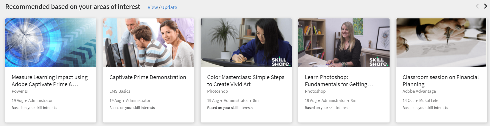

# Home page Allievo

## Panoramica {#overview}

Dopo che l’Amministratore ha abilitato il layout immersivo, l’Allievo, dopo aver effettuato l’accesso all’app, viene accolto con un’interfaccia utente completamente rinnovata.

>[!NOTE]
>
>Layout immersivo non supportato nel browser IE11.

A seconda che un widget sia stato abilitato o meno, l’Allievo rileva quanto segue:

## Titolo {#masthead}

Presenta un carosello di video o immagini con un URL incorporato. La [L’Amministratore può caricare qualsiasi immagine o video](../../administrators/feature-summary/announcements.md#masthead) risorsa come masthead e impostarne la visibilità per un gruppo di allievi.

*Visualizza masthead*

## Elenco Il mio apprendimento {#mylearninglist}

Visualizza il corso di formazione seguito dall’Allievo. Questi corsi di formazione sono visualizzati come schede allineate orizzontalmente. Puoi fare clic sul pulsante destro o sinistro per sfogliare i corsi.

*Visualizza elenco Il mio apprendimento*

Puoi anche scorrere a destra e a sinistra per spostarti nella lista.

Per riprendere un corso, fai clic su **[!UICONTROL Continua]** su una scheda e il lettore verrà avviato.

La visualizzazione delle icone su ogni scheda di formazione può essere abilitata/disabilitata dall&#39;Amministratore tramite l&#39;app Amministratore (**Impostazioni** > **Generale** > **Attiva icone per la scheda di formazione**).

**Aggiungi all’elenco Il mio apprendimento**

Se passi con il mouse su una scheda del corso nella **Consigliato in base alle tue aree di interesse** e **Consigliato in base agli elenchi di attività dei colleghi**, è disponibile un’opzione per aggiungere il corso al **Elenco Il mio apprendimento**. Fai clic **[!UICONTROL +]** nella scheda del corso e il corso verrà aggiunto al **Elenco Il mio apprendimento**.

*Aggiungi all’elenco Il mio apprendimento*

## Scegli i livelli di abilità {#chooseskilllevels}

In qualità di Allievo, puoi filtrare il catalogo dei corsi in base ai seguenti livelli:

* Principiante
* Intermedio
* Avanzate

Scegli un’opzione e vedrai il catalogo dei corsi in base a questa selezione.

*Seleziona livelli di abilità*

## Calendario {#calendar}

Mostra le sessioni e i corsi di formazione pianificati. Esplora il calendario per visualizzare i corsi di formazione per i mesi successivi.

*Visualizza calendario per sessioni pianificate*

Il widget Calendario dispone delle seguenti funzionalità. Puoi visualizzare:

* I corsi di formazione vengono organizzati per mese. Scorri verso sinistra o verso destra.
* I prossimi corsi in aula o virtuali disponibili per l&#39;iscrizione.
* I prossimi corsi in aula o virtuali a cui ti sei iscritto.
* I corsi in aula o virtuali approvati dal Manager.

## Feed dei social {#socialfeed}

*Visualizza feed social*

Scopri di cosa stanno parlando gli altri utenti.

Il widget riepiloga l&#39;attività per un periodo. In particolare:

* Visualizza gli utenti attivi e le loro attività degli utenti che si trovano nel tuo ambito o gruppo.
* Visualizza i post creati nelle ultime due settimane.

## Abilità profilo {#profileskills}

Le abilità di profilo vengono utilizzate per i consigli sui corsi. Se l’Amministratore assegna un’abilità a un utente o a un gruppo di utenti, questa viene aggiunta alle abilità di profilo dell’Allievo. Se l’Allievo aggiunge un’abilità al suo profilo, tutti i livelli dell’abilità vengono aggiunti alle abilità di profilo dell’Allievo. Quando un Allievo passa il mouse su un’abilità, può visualizzarne nome, metodo di aggiunta, livello, percentuale di completamento e crediti.

*Visualizzare le abilità di profilo*

Se un Allievo si iscrive a un corso, solo le abilità esterne basate su un punteggio vengono aggiunte alle abilità di profilo. Inoltre, un Allievo può cercare, selezionare e aggiungere abilità esterne al proprio profilo.Se un Allievo accede all’app per Allievi per la prima volta e se le sue abilità sono già presenti, le abilità verranno visualizzate in Profilo personale.

## Consiglio in base alla tua area di interesse {#recommendationbasedonyourareaofinterest}

Visualizza i corsi di formazione in base all’area di interesse selezionata. Il consiglio è guidato da un algoritmo di apprendimento automatico.

*Visualizza corsi consigliati*

Per suggerimenti più mirati, puoi aggiornare le tue competenze facendo clic su **Visualizza/Aggiorna**.

Dopo aver aggiunto un’abilità, i consigli futuri saranno più mirati e focalizzati in base alle tue preferenze.

Se l’Amministratore ha disattivato l’opzione **Esplora abilità**, potresti aggiungere interesse alle tue abilità.

I corsi consigliati vengono visualizzati come schede. Quando passi il mouse su una scheda, puoi visualizzare ulteriori dettagli del corso.

È supportata anche la terminologia del prodotto.

**Abilità allineate al settore**

Potrai visualizzare il grafico delle abilità se l’Amministratore ha abilitato l’opzione **Allineato al settore** nell’app di amministrazione.

Queste abilità possono essere visualizzate solo quando l’Amministratore imposta il tipo di corso di formazione su Abilità allineate al settore.

Nella visualizzazione Mappa abilità, puoi cercare una o più abilità e aggiungerle.

*Visualizzazione mappa delle abilità*

Abilita l’opzione **Mostra le abilità per le quali sono presenti corsi di formazione nel mio account**, se desideri visualizzare tutte le abilità presenti nel tuo account.

Dopo aver aggiunto un’abilità, puoi visualizzare il grafico forza diretta con l’abilità selezionata come vertice principale e le abilità associate come vertici più piccoli.

Le abilità selezionate vengono visualizzate anche nel **Abilità selezionate** sezione.

*Abilità selezionate*

Per aggiungere le abilità, fai clic su **[!UICONTROL Aggiungi]**.

## Consiglio basato sull’attività dei colleghi {#recommendationbasedonpeeractivity}

Visualizza i corsi di formazione in base a ciò che stanno seguendo i colleghi. Anche questo è guidato da un algoritmo di apprendimento automatico. I consigli si basano sulla formazione per Allievi personalizzati e allineati al settore.
