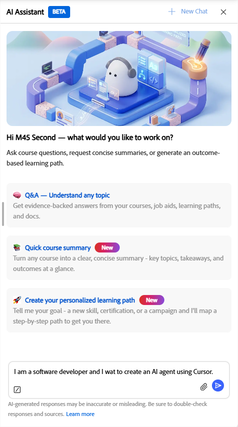
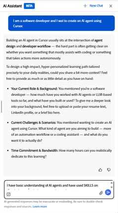
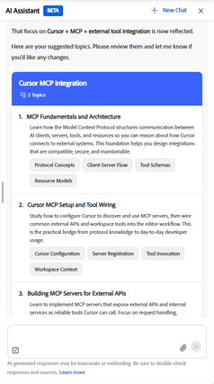
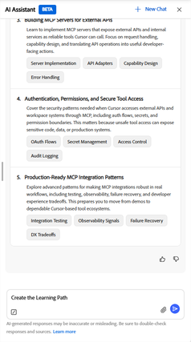

# Che cos’è Learning Path Agent

Un agente del percorso di apprendimento crea un percorso di apprendimento strutturato utilizzando l’assistente AI. A differenza dei percorsi di apprendimento standard assegnati dall’amministratore, tali percorsi vengono generati attraverso una conversazione guidata. Descrivi il tuo obiettivo e l&#39;agente crea un percorso che corrisponde alle tue esigenze di apprendimento.

L’agente disegna prima i contenuti dal catalogo dei corsi interni della tua organizzazione, dando la priorità ai corsi approvati e pertinenti per il tuo team. Se l’amministratore ha abilitato i contenuti di terze parti, l’agente può anche includere corsi da fornitori esterni collegati per colmare eventuali lacune nella copertura. L’iscrizione ai corsi all’interno del percorso salvato è sempre automatica, per consentirti di iniziare immediatamente l’apprendimento.

I percorsi di apprendimento personalizzati sono progettati per due casi d&#39;uso principali:

- **Sviluppo mirato delle abilità**: quando è necessario raggiungere un risultato aziendale specifico o raggiungere rapidamente un obiettivo di prestazioni, ad esempio prepararsi per una nuova responsabilità o colmare una lacuna nelle abilità identificata in una revisione.
- **Sviluppo di competenze approfondite**: quando si desidera passare da principianti a esperti in un dominio, una tecnologia o una disciplina selezionati su un arco di tempo più lungo.

## Come funziona l&#39;approccio basato sulla conversazione

L&#39;agente ti incontra dove sei. Si inizia descrivendo ciò che si desidera apprendere in un linguaggio semplice, con tutti i dettagli che si hanno. L&#39;agente quindi pone domande di follow-up per comprendere il tuo ruolo, le tue sfide specifiche e quanto tempo puoi dedicare all&#39;apprendimento ogni settimana.

Dalle tue risposte, l’agente identifica 3-5 argomenti di apprendimento con livelli di esperienza consigliati. Puoi esaminare questi argomenti, richiedere modifiche o confermarli prima che l’agente cerchi corsi corrispondenti. L’agente genera quindi un percorso di apprendimento denominato che mostra ogni corso, la sua descrizione, la durata e il conteggio dei moduli. Potete regolare ulteriormente il tracciato prima di salvarlo.

Quando salvi il percorso, verrai automaticamente iscritto a tutti i corsi. Il percorso viene visualizzato nella home page della sezione _Percorsi di apprendimento personalizzati_, pronto per l&#39;avvio.

### Origini dei contenuti e selezione del corso

L’agente seleziona i corsi in base alla pertinenza con l’obiettivo dichiarato, al livello di esperienza corrente, al tempo totale disponibile e alla data di aggiornamento del contenuto. Quando l’agente non trova corsi corrispondenti per un argomento specifico nel catalogo disponibile, ti informa e suggerisce di contattare l’amministratore per richiedere contenuto aggiuntivo per quell’area.

### Percorsi di apprendimento personalizzati nella home page

Tutti i percorsi di apprendimento personalizzati salvati vengono visualizzati nella striscia _Percorsi di apprendimento personalizzati_ nella home page. Ogni scheda mostra il nome del percorso, il numero di corsi e un pulsante _Continua_ per riprendere da dove avevi interrotto.

### Condivisione di un percorso di apprendimento

Una volta salvato un percorso di apprendimento personalizzato, è possibile condividerlo con i colleghi. La condivisione invia loro un collegamento o un invito e-mail. Quando un collega apre un percorso condiviso, può iscriversi con una singola azione. La condivisione è utile quando diverse persone del tuo team hanno obiettivi di apprendimento simili e desideri che seguano lo stesso piano strutturato.

### Procedure ottimali

- Descrivi il tuo obiettivo di apprendimento nel modo più specifico possibile quando inizi la conversazione. Più contesto ha l&#39;agente, più rilevante sarà il tuo percorso.
- Assicura in anticipo il tuo impegno di tempo, in modo che il percorso generato si adatti al tuo programma effettivo. L&#39;agente comprende il linguaggio naturale: &quot;due serate a settimana&quot; o &quot;30 minuti al giorno&quot; sono entrambi validi.
- Consulta gli argomenti suggeriti prima di chiedere all’agente di generare corsi. La conferma o la regolazione degli argomenti in questa fase consente di risparmiare tempo rispetto alla successiva revisione dell’elenco dei corsi.
- Se in un argomento non viene visualizzato contenuto corrispondente, prendi nota dell’argomento e contatta l’amministratore per richiedere che i corsi pertinenti vengano aggiunti al catalogo.

## Configurazione dell’agente del percorso di apprendimento personalizzato

L’agente del percorso di apprendimento personalizzato è abilitato per impostazione predefinita in Adobe Learning Manager quando si abilita l’opzione Assistente all’intelligenza artificiale in Impostazioni.

>[!NOTE]
>
> La visibilità dei contenuti segue le regole di accesso al catalogo esistenti. Un Allievo vedrà e riceverà corsi solo dai cataloghi a cui ha già accesso\. L’agente del percorso di apprendimento personalizzato non ignora le restrizioni del catalogo.

All’interno di ciascuna fonte, l’agente classifica i corsi in base alla pertinenza rispetto all’obiettivo dell’Allievo e alla corrispondenza tra il livello del corso e le competenze dichiarate dell’Allievo.

Se per un argomento del catalogo non sono disponibili corsi corrispondenti, l’agente informa l’Allievo e suggerisce di contattare un Amministratore per richiedere il contenuto per quell’area.

<!-- 
### Monitor credit usage

The Personalized Learning Path agent consumes AI credits each time a learner generates a path. To monitor and manage usage:

1. In the left navigation of the administrator's home page, select **Billing**.
2. Select the **AI Credits** tab. The **Learning Path** agent appears as a line item in the features list.
3. Review current usage and adjust the credit allocation or usage limit as needed.

>[!CAUTION]
>
>If the credit limit for the Learning Path agent is reached, learners receive an in-app message that the agent is unavailable and are directed to contact an administrator. Increase the allocation to restore access. 
-->

## Creazione di un percorso di apprendimento personalizzato con l’assistente di intelligenza artificiale dell’Allievo

Utilizza l’assistente dell’intelligenza artificiale dell’Allievo in Adobe Learning Manager per generare un percorso di apprendimento personalizzato che corrisponda all’obiettivo, allo sfondo e al tempo disponibile. Quindi salvalo nel tuo profilo e inizia subito a imparare.

### Apri l’assistente dell’intelligenza artificiale dell’Allievo e avvia una conversazione.

1. Seleziona **Assistente AI** dalla tua home page.
2. Digita il tuo obiettivo di apprendimento nel campo di testo. Sii il più specifico possibile. Ad esempio:
   - *Sono uno sviluppatore di software e desidero creare un agente di intelligenza artificiale utilizzando il cursore.*
   - *Sono appena stato promosso a manager e desidero imparare a gestire conversazioni difficili.*
   - *Desidero padroneggiare la modellazione finanziaria come analista.*
     

3. Facoltativamente, seleziona _+ Nuova chat_ per avviare una nuova conversazione se hai sessioni precedenti aperte.

Note:

- Facoltativamente, allega un documento utilizzando l&#39;icona _paperclip_, ad esempio un curriculum, un&#39;e-mail di feedback del manager o una descrizione del progetto. L&#39;agente utilizza il documento per ottenere più contesto sull&#39;obiettivo di apprendimento e sullo sfondo.
- Seleziona _Invia_.

### Descrivi il tuo obiettivo e il tuo sfondo

L&#39;agente risponde con un messaggio che conferma il tuo obiettivo e chiede un contesto aggiuntivo per personalizzare il tuo percorso. In genere vengono richieste informazioni su:

- _Il tuo ruolo attuale e il tuo background_ ciò che già conosci, per quanto tempo sei stato nel tuo ruolo o qualsiasi esperienza pertinente.
- _Le sfide o gli scenari specifici_ le situazioni reali che è necessario affrontare immediatamente per questo apprendimento.
- _Il tuo impegno in termini di tempo_ indica il numero di ore settimanali che puoi dedicare realisticamente all&#39;apprendimento.

Non devi rispondere a ogni domanda. L’unico input richiesto è il tuo obiettivo di apprendimento o la tua sfida. L&#39;agente procederà con il contesto specificato.

>[!TIP]
>
>L&#39;agente capisce le espressioni del tempo naturale. Puoi dire &quot;due serate a settimana&quot;, &quot;circa 30 minuti al giorno&quot; o &quot;un paio d&#39;ore nei fine settimana&quot;, e l&#39;agente lo converte in ore settimanali per fare una stima e confermarla con te.

Digita la risposta e seleziona _Invia_.

Continuare la conversazione finché l&#39;agente non presenta gli argomenti suggeriti.

### Rivedi gli argomenti suggeriti

Dopo aver raccolto un contesto sufficiente, l’agente presenta un elenco di 3-5 argomenti di apprendimento, ciascuno con un titolo, una breve descrizione e un livello di esperienza consigliato.

1. Leggete attentamente l&#39;elenco degli argomenti. L&#39;agente seleziona i livelli di esperienza in base a ciò che hai condiviso, ma puoi richiedere le modifiche.
2. Per modificare un argomento, ad esempio per cambiare il livello di esperienza o scambiare un argomento, digita il tuo feedback nella chat. Per esempio, ho già una certa conoscenza del primo argomento. Puoi impostarlo su intermedio?
3. Se sei soddisfatto degli argomenti suggeriti, confermali rispondendo nella chat o selezionando la richiesta di conferma suggerita se ne viene visualizzata una.

### Revisione del percorso di apprendimento

L’agente cerca il catalogo disponibile e crea un percorso di apprendimento denominato. Il percorso mostra:

- Nome del percorso e durata totale stimata
- Titolo del corso, descrizione, durata e numero di moduli
- Indicazione se per alcuni argomenti non è disponibile contenuto corrispondente

Se alcuni argomenti non hanno contenuto corrispondente:

L’agente informa l’utente che non è stato possibile trovare corsi per tali argomenti specifici e suggerisce di contattare l’amministratore per richiedere il contenuto per tali aree. Il percorso viene ancora generato per gli argomenti in cui sono stati trovati i corsi.

<!-- - Review the path. If you want to change something, for example, remove a course, adjust the scope, or explore different topics. Type your request in the chat\. For example, Can you remove the first course and replace it with something shorter? -->
Quando sei soddisfatto del percorso, chiedi all’agente di salvarlo digitando salva il percorso di apprendimento.

### Salvare e accedere al percorso di apprendimento

Quando salvi il percorso, l’agente conferma il salvataggio e ti iscrive automaticamente a tutti i corsi compresi nel percorso.

Per accedere al percorso:

- Seleziona _Vai al percorso di apprendimento_ dal messaggio di conferma per aprirlo immediatamente oppure
- Puoi trovarlo in qualsiasi momento nell’area _Percorsi di apprendimento personalizzati_ della tua home page.

### Condivisione del percorso di apprendimento

Dalla pagina di panoramica del percorso, puoi condividere il percorso salvato con i colleghi.

1. Apri il percorso salvato dalla striscia _Percorsi di apprendimento personalizzati_ nella home page.
2. Seleziona _Condividi_.
3. Condividi il collegamento generato o immetti gli indirizzi e-mail per inviare un invito diretto.

Un collega che riceve il collegamento condiviso può iscriversi al percorso con una singola azione.

## Procedure ottimali

- Fornisci un contesto relativo al tuo ruolo e alle sfide attuali. Più sei specifico, più pertinente è la selezione del corso.
- Menziona il tuo impegno settimanale nel linguaggio naturale. L&#39;agente confermerà la propria interpretazione prima di generare il percorso.
- Prima di richiedere la generazione del percorso, rivedi gli argomenti suggeriti. Regolare gli argomenti in quella fase è più veloce che rivedere l’elenco dei corsi in seguito\.
- Se il percorso generato include corsi già completati, informa l’agente. Può suggerire alternative.

## Domande frequenti

_Dove si trovano i percorsi di apprendimento personalizzati salvati?_

Tutti i percorsi salvati vengono visualizzati nella striscia _Percorsi di apprendimento personalizzati_ nella home page. Ogni scheda mostra il nome del percorso e un pulsante _Continua_. Puoi anche aprire un percorso da lì per visualizzare l&#39;elenco completo dei corsi e i progressi.

_Quanti percorsi di apprendimento personalizzati è possibile salvare?_

La striscia _Percorsi di apprendimento personalizzati_ nella home page mostra un massimo di 10 percorsi.

_Quali informazioni è necessario fornire per ottenere un percorso di apprendimento pertinente?_

Come minimo, descrivi il tuo obiettivo di apprendimento o la sfida specifica che stai cercando di affrontare. Più contesto fornisci, migliore sarà il percorso. Le informazioni utili includono il ruolo attuale, la durata del lavoro svolto, qualsiasi esperienza precedente pertinente e quante ore settimanali è possibile dedicare realisticamente all&#39;apprendimento.

_Cosa succede se l&#39;agente non trova corsi corrispondenti per i miei argomenti?_

L’agente ti informa direttamente nella conversazione che non è stato possibile trovare corsi corrispondenti per uno o più argomenti. Genera il percorso utilizzando solo gli argomenti in cui erano disponibili i corsi.

Se l’agente non trova corsi per nessuno dei tuoi argomenti, ti informerà che non è in grado di creare un percorso per quell’obiettivo. In entrambi i casi, contatta l’Amministratore dell’apprendimento e fai sapere quali argomenti non avevano contenuti disponibili. Possono aggiungere corsi pertinenti al catalogo in modo da coprire le richieste di percorsi futuri.

<!-- 
_How does the agent decide which courses to include?_

The agent prioritizes your organization's internal course catalog above external sources. It selects courses based on relevance to your stated goal, whether the course level matches your proficiency, how recently the content was published or updated, and quality signals such as ratings and completion rates\. Your administrator controls which content sources are available. 
-->

_È possibile modificare gli argomenti del percorso di apprendimento?_

Sì. Durante la conversazione, puoi chiedere all&#39;agente di aggiungere, rimuovere o modificare gli argomenti prima che venga generato il percorso. L&#39;agente aggiornerà l&#39;elenco di argomenti e rigenererà il percorso in modo che corrisponda.

_È possibile modificare i singoli corsi in un percorso generato?_

N. Una volta che l’agente genera un percorso, la selezione del corso viene corretta. Non è possibile scambiare, rimuovere o sostituire singoli corsi. Ciò che l&#39;agente consiglia è ciò che il percorso contiene.

Se i corsi suggeriti non sono adatti, l’approccio migliore è tornare indietro e regolare i tuoi argomenti prima di generare. L’agente seleziona i corsi in base agli argomenti che confermi, quindi se si cambia l’ambito dell’argomento o il livello di esperienza, viene generato un set di corsi diverso.

_Perché l&#39;agente continua a porre domande di follow-up?_

L’agente deve fare sufficiente chiarezza sull’obiettivo di apprendimento per identificare gli argomenti pertinenti. Se il tuo messaggio iniziale era ampio, come &quot;Voglio imparare il marketing&quot;, porrà domande per restringere l&#39;ambito. Se fornisci dettagli più specifici sul tuo ruolo, sulle sfide che affronti e su cosa vuoi essere in grado di fare dopo l&#39;apprendimento, l&#39;agente potrà passare alla generazione di argomenti più velocemente.