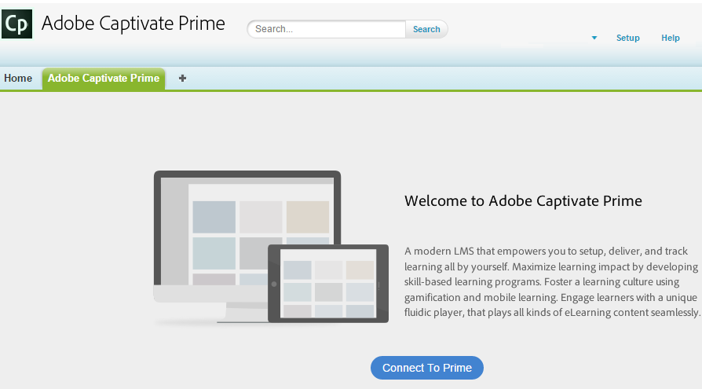

# App Learning Manager per Salesforce

## Panoramica {#overview}

Salesforce™ è la soluzione CRM più diffusa tra i team di vendita e marketing. Utilizzando l’app Learning Manager di Adobe in Salesforce, gli Allievi possono accedere a tutti i contenuti di apprendimento all’interno dell’interfaccia Salesforce. Gli Allievi possono accedere ai contenuti di apprendimento assegnati come corsi, programmi di apprendimento e risorse formative da Salesforce. Gli utenti possono inoltre ricevere notifiche relative a iscrizioni e annunci dall’Amministratore.

Questa app sarà disponibile in Salesforce solo quando l’Amministratore dell’account Learning Manager avrà completato le attività di configurazione richieste. Per ulteriori dettagli, consulta [App Learning Manager per Salesforce](../../integration-admin/feature-summary/sfdc-app.md)e richiedi all’Amministratore di installare l’app Learning Manager per Salesforce.

## Individua l’app in Salesforce {#locateappinsalesforce}

Come Allievo, puoi fare clic sul pulsante **App** nell’angolo destro della pagina e seleziona l’Adobe Learning Manager.

Se non riesci a individuare l’app nel menu a discesa, contatta il tuo amministratore Salesforce.

Dopo aver selezionato l’app, puoi passare all’app Adobe Learning Manager, come mostrato nell’istantanea seguente.

<!---->

## Istruzioni di accesso e utilizzo {#loginandusageinstructions}

Fai clic **[!UICONTROL Connetti a Learning Manager]** nell’Adobe Learning Manager, come mostrato nell’istantanea sopra, e accedi con le credenziali dell’account Learning Manager.

Puoi connetterti all’app Learning Manager e utilizzarla dall’interno di Salesforce.

In alternativa, puoi anche accedere all’account Learning Manager in Salesforce utilizzando il componente delle notifiche di Learning Manager di Adobe nel riquadro a sinistra della home page. Gli Allievi possono visualizzare questo componente solo quando l’Amministratore configura il componente Adobe Notifiche di Learning Manager in Salesforce.

Un’istantanea rappresentativa della vista Allievo nell’app di Learning Manager di Adobe viene mostrata di seguito come riferimento.

*visualizzazione dell’app di Learning Manager di Adobe*

## Disconnetti dall&#39;app {#disconnectfromtheapp}

Puoi fare clic sul collegamento di disconnessione nella parte inferiore della pagina degli Allievi, come indicato nell’istantanea sopra, per **Disconnetti** dall’app Adobe Learning Manager. Dopo la disconnessione, verrai reindirizzato alla pagina di benvenuto dell’app di Learning Manager di Adobe.

Puoi connetterti o disconnetterti dall&#39;app più volte.
