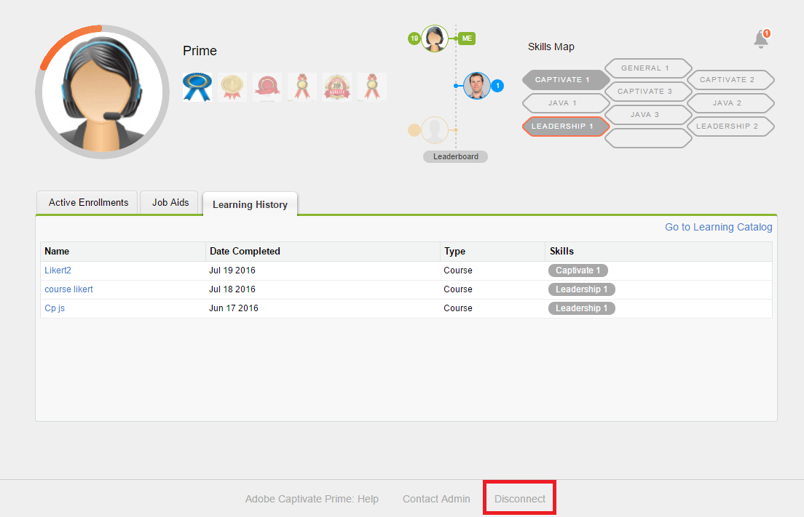

# App Learning Manager per Salesforce

## Panoramica {#overview}

Salesforce™ è la soluzione CRM più popolare tra i team di marketing e vendite. Tramite l’app Adobe Learning Manager in Salesforce, gli Allievi possono accedere a tutti i contenuti di apprendimento all’interno dell’interfaccia Salesforce. Gli Allievi possono accedere ai contenuti di apprendimento assegnati come corsi, programmi di apprendimento e risorse formative dall’interno di Salesforce. Gli utenti possono inoltre ricevere notifiche relative a iscrizioni e annunci dall’Amministratore.

Questa app sarà disponibile in Salesforce solo quando l’amministratore dell’account Learning Manager avrà completato le attività di configurazione richieste. Per ulteriori informazioni, consulta [App Learning Manager per Salesforce](../../integration-admin/feature-summary/sfdc-app.md) e richiedi all’Amministratore di installare l’app Learning Manager per Salesforce.

## Individua l’app in Salesforce {#locateappinsalesforce}

Come Allievo, puoi fare clic sul menu a discesa **App** nell&#39;angolo a destra della pagina e selezionare Adobe Learning Manager.

Se riesci a individuare l’app nel menu a discesa, contatta l’amministratore di Salesforce.

Una volta selezionata l’app, puoi passare all’app Adobe Learning Manager, come mostrato nell’istantanea seguente.

<!---->

## Istruzioni di accesso e utilizzo {#loginandusageinstructions}

Fai clic su **[!UICONTROL Connetti a Learning Manager]** nel Adobe Learning Manager come mostrato nell’istantanea sopra e accedi con le credenziali dell’account Learning Manager.

Puoi eseguire la connessione all’app Learning Manager e utilizzarla dall’interno di Salesforce.

In alternativa, puoi anche accedere all’account Learning Manager all’interno di Salesforce tramite il componente delle notifiche di Adobe Learning Manager nel riquadro a sinistra della home page. Gli Allievi possono visualizzare questo componente solo quando l’Amministratore configura il componente delle notifiche di Adobe Learning Manager in Salesforce.

Un’istantanea rappresentativa della vista Allievo nell’app Adobe Learning Manager viene mostrata di seguito come riferimento.

*visualizzazione dell&#39;app Adobe Learning Manager*

## Disconnessione dall’app {#disconnectfromtheapp}

Puoi fare clic sul collegamento di disconnessione nella parte inferiore della pagina degli Allievi, come indicato nell’istantanea sopra, per eseguire la **disconnessione** dall’app Adobe Learning Manager. Dopo la disconnessione, verrai reindirizzato alla pagina di benvenuto dell&#39;app Adobe Learning Manager.

Puoi eseguire la connessione o la disconnessione dall’app ogni volta che vuoi.
