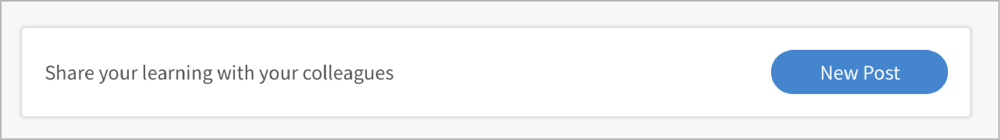
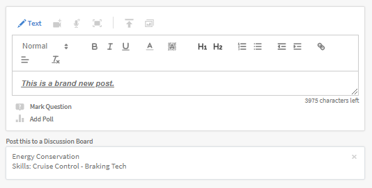
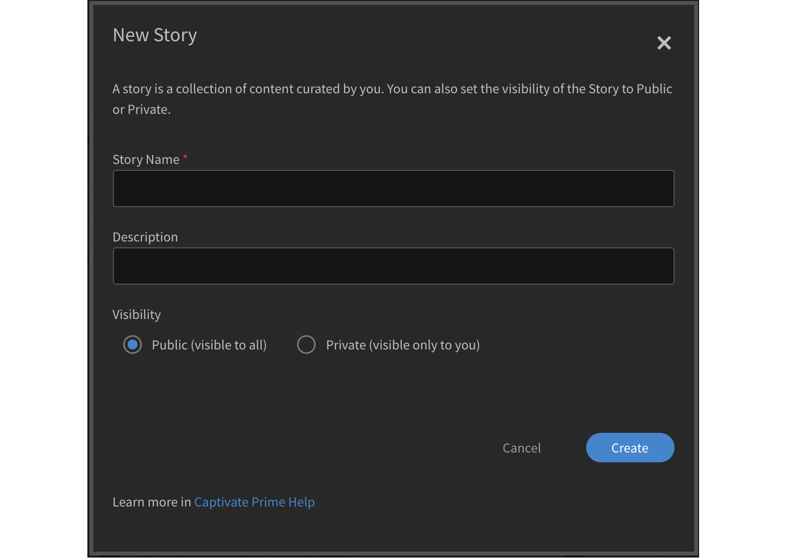
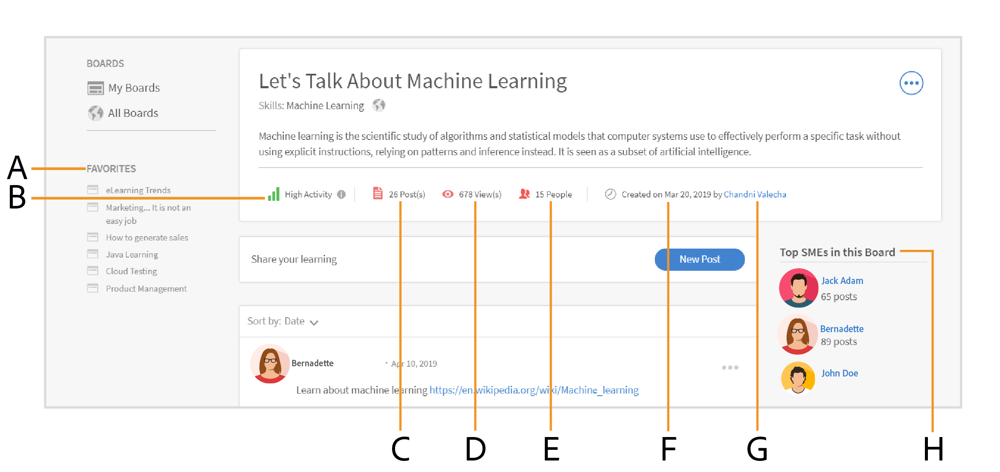
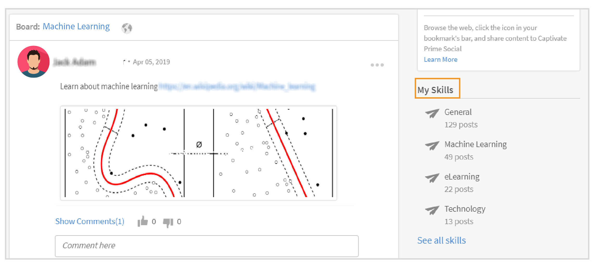

# Apprendimento sociale in Learning Manager

Scopri come utilizzare il Web di Apprendimento sociale come Allievo

Apprendimento sociale è una piattaforma di Learning Manager che consente agli utenti di condividere idee e informazioni significative in un ambiente informale. Si tratta di una metodologia che integra l&#39;idea dell&#39;apprendimento tradizionale. Il completamento di un corso online non offre agli utenti il vantaggio di interagire con i colleghi a livello sociale.

La semplice partecipazione a un corso di formazione non garantisce agli utenti la conservazione di tutto ciò che viene insegnato. D&#39;altra parte, l&#39;apprendimento sociale consente agli utenti di utilizzare l&#39;esperienza che li circonda per ottenere esattamente le informazioni di cui hanno bisogno. A loro volta, gli utenti possono applicare rapidamente tali informazioni per completare un’attività e raggiungere un obiettivo.

Allo stesso modo, la funzione di apprendimento sociale di Learning Manager consente agli utenti di interagire tra loro condividendo e imparando dai contenuti.

Su questa piattaforma, i diversi tipi di contenuti che possono essere condivisi sono video, audio, schermate, testo, domande e sondaggi. Gli utenti possono inoltre condividere i propri programmi di apprendimento online con i colleghi utilizzando **Condividi sul bookmarklet Social**. Per ulteriori informazioni, consulta  [Condividi su Apprendimento sociale](share-to-social.md).

Il contenuto può anche essere pubblicato all&#39;interno di una bacheca con l&#39;aiuto del **Adobe dell’applicazione desktop Learning Manager**. Per ulteriori informazioni, consulta  [Adobe dell’app Learning Manager per desktop](../adobe-learning-manager-app-for-desktop.md).

Solo se l’Amministratore abilita Apprendimento sociale, la funzione è visibile a un Allievo .

 

*Visualizza dashboard di apprendimento*

<table>
 <tbody>
  <tr>
   <td>
    
<b>Sl. No.</b>
</td>
   <td>
    
<b>Terminologia o concetto</b>
</td>
   <td>
    
<b>Breve spiegazione</b>
</td>
  </tr>
  <tr>
   <td>
    
1
</td>
   <td>
    
Le mie bacheche
</td>
   <td>
    
Una bacheca <code>
      collection
     </code> di post creati da un utente. Nelle mie bacheche sono visualizzati tutti i post a cui l’utente ha partecipato, creato e seguito.
</td>
  </tr>
  <tr>
   <td>
    
2
</td>
   <td>
    
Tutte le schede
</td>
   <td>
    
Nella pagina Tutte le bacheche, gli utenti possono visualizzare le bacheche create da tutti gli Allievi che condividono l’ambito dell’attività.
</td>
  </tr>
  <tr>
   <td>
    
3
</td>
   <td>
    
Commento
</td>
   <td>
    
Gli utenti possono commentare e visualizzare i post creati nelle bacheche. 
</td>
  </tr>
  <tr>
   <td>
    
4
</td>
   <td>
    
Rispondi
</td>
   <td>
    
Gli utenti possono rispondere ai commenti aggiunti ai post all’interno di una bacheca.
</td>
  </tr>
  <tr>
   <td>
    
5
</td>
   <td>
    
Voto a favore/sfavore
</td>
   <td>
    
Fai clic sul pulsante Voto a favore e Voto a sfavore per aggiungere Mi piace o non mi piace a un post.
</td>
  </tr>
  <tr>
   <td>
    
6
</td>
   <td>
    
Classifica sociale
</td>
   <td>
    
Nella classifica social, gli utenti possono visualizzare i nomi degli Allievi con il numero di punti guadagnati partecipando a Apprendimento sociale.
</td>
  </tr>
  <tr>
   <td>
    
7
</td>
   <td>
    
Persone che seguo
</td>
   <td>
    
Qui gli utenti possono visualizzare i nomi degli altri Allievi che seguono e il numero di post che hanno creato.
</td>
  </tr>
  <tr>
   <td>
    
8
</td>
   <td>
    
Abilità popolari
</td>
   <td>
    
Nelle sezioni Tutte le bacheche, le abilità utilizzate frequentemente dagli Allievi possono essere visualizzate insieme al numero di post creati utilizzando tale abilità.
</td>
  </tr>
  <tr>
   <td>
    
9
</td>
   <td>
    
Condividi sui social
</td>
   <td>
    
Condividi sul social è un bookmarklet che consente agli utenti di condividere i propri programmi di apprendimento online, come pagine Web e blog, direttamente su Apprendimento sociale di Learning Manager.
</td>
  </tr>
  <tr>
   <td>
    
10
</td>
   <td>
    
Nuovo post
</td>
   <td>
    
Il nuovo pulsante di pubblicazione consente agli utenti di creare e pubblicare contenuti all’interno delle bacheche.
</td>
  </tr>
 </tbody>
</table>

## Creazione di contenuto come post {#creatingcontentasapost}

Il contenuto viene creato come post all’interno di una bacheca. Per creare un post, segui i passaggi seguenti:

1. Fai clic **[!UICONTROL Nuovo post].**

   
   *Seleziona nuovo post*

1. Seleziona uno dei seguenti tipi di contenuti da pubblicare: testo, domanda, video, audio, sondaggio e schermata. I contenuti esistenti possono essere caricati dal sistema degli utenti o dalla galleria dell’applicazione desktop Learning Manager di Adobe.

   Utilizza l’app desktop Learning Manager di Adobe per registrare video o audio e acquisire una schermata. Per ulteriori informazioni, consulta [Adobe dell’applicazione desktop Learning Manager](../adobe-learning-manager-app-for-desktop.md).

   <!---->

1. Cerca una bacheca o un’abilità correlata al post. Se la bacheca non esiste, fare clic su **[!UICONTROL Crea una nuova bacheca]**.

   

   *Creare una bacheca*

   Se sei un utente esterno o interno e l’Amministratore ti ha concesso l’accesso per creare una bacheca, puoi crearne una. Se non disponi delle autorizzazioni per creare una bacheca, il collegamento **Crea una nuova bacheca** non viene visualizzato.

1. Nella finestra a comparsa, compila i dettagli e seleziona il seguente tipo di bacheca:

   * **Pubblico** - La partecipazione e la visibilità dei post sono disponibili per tutti gli utenti.
   * **Privato** - Il post è visibile solo al creatore della bacheca, ai moderatori e agli utenti aggiunti alla bacheca.
   * **Limitato** - Solo il proprietario della bacheca, l’amministratore e i moderatori della bacheca possono creare post. Altri utenti possono partecipare commentando/rispondendo, votando a favore o contro e così via.

   <!---->

   >[!NOTE]
   >
   >Nell’app Social Learning, solo un **Amministratore** è in grado di creare una scheda privata con gruppi utente (interni/esterni).
   >
   >Qualsiasi altro utente tranne Amministratore, Autore, Allievo, Manager, Istruttore, ecc. **non può** crea schede private con gruppi utente. Non possono visualizzare la sezione di **gruppi di utenti** nel corso della creazione di una scheda privata.

   Solo amministratore: quando scegli **Privato**, vengono visualizzate due opzioni: **Utenti** e **Gruppi di utenti**. Scegli l’opzione **Gruppi di utenti**, quindi aggiungi i gruppi di utenti con cui desideri condividere la bacheca privata.

   Nel campo Gruppi utente, puoi scegliere gruppi interni, esterni o personalizzati. La bacheca privata sarà quindi visibile a tutti i gruppi di utenti specificati, indipendentemente dalle impostazioni dell’ambito.

1. Per condividere il contenuto, fai clic su **[!UICONTROL Post]**. Facendo clic su Pubblica, l&#39;utente riceve una notifica.

   Il contenuto viene pubblicato in base all’impostazione di cura impostata dall’amministratore per i contenuti di Apprendimento sociale che possono essere selezionati da  [Moderatori del consiglio di amministrazione/Esperti in materia](social-learning-web-user.md#HowtobecomeaSubjectMatterExpertSME).

   <!---->

1. Gli utenti ricevono notifiche quando il loro post viene approvato o rifiutato, se l&#39;amministratore ha impostato l&#39;impostazione della cura su Cura solo manuale. Se il post viene rifiutato, fai clic sul pulsante **Fai clic per rivedere** collegamento ipertestuale per rivedere i commenti forniti dai moderatori del consiglio di amministrazione o dagli esperti in materia (PMI).

   I contenuti creati dagli utenti sono curati da moderatori di bacheche o esperti in materia.

   <!---->

Quando crei o rispondi a un post in Apprendimento sociale, puoi comporre un post utilizzando l’Editor di testo RTF e applicare diversi tipi di formattazione.

*Utilizzare Editor di testo RTF per creare un post*

Inoltre, durante la creazione di una bacheca, puoi accedere allo stesso set di opzioni nell’Editor di testo RTF.

*Utilizzare Editor di testo RTF per creare un post*

## Visualizzazione dei contenuti approvati {#viewingapprovedcontent}

Una volta approvato, un post viene visualizzato in una bacheca di Apprendimento sociale. Gli utenti possono ora, commentare, rispondere, votare a favore o contro il post.

Gli utenti possono utilizzare i seguenti tipi di contenuti per fare un commento: Registra schermata, webcam o entrambi, Registra audio, Acquisisci schermata, Carica file, Galleria Learning Manager.

<!---->

## Contenuto in Social player {#contentinsocialplayer}

In Learning Manager, i video e i contenuti statici, come presentazioni e immagini, vengono pubblicati in Social player in una bacheca. Adobe Puoi caricare un file dal sistema, registrare un video o uno schermo e acquisire una schermata con l’assistenza dell’applicazione desktop Learning Manager.

Una volta che l’utente ha completato la pubblicazione di alcuni contenuti, questi possono essere visualizzati da altri Allievi nel loro ambito di attività. Su Social player gli Allievi possono visualizzare, commentare/rispondere, votare a favore/contro e segnalare un abuso.

<!---->

**Per commentare/rispondere, votare a favore/sfavore su Social player, segui i passaggi seguenti:**

1. Fai clic sul pulsante Schermo intero nell’angolo in basso a destra del lettore social.
1. Per visualizzare i controlli del lettore sullo schermo, fare clic sulla freccia rivolta verso il basso.
1. Per visualizzare la sezione dei commenti, fai clic sull’icona dei commenti nell’angolo in basso a sinistra dello schermo.
1. Gli utenti possono commentare/rispondere, votare a favore/contro e segnalare un abuso.
1. Fai clic sul tasto Esc per uscire dalla modalità a schermo intero.

## Visualizzazione della bacheca nel social {#board-view-social}

Un Allievo può visualizzare tutte le bacheche in una visualizzazione a elenco. Accedi all’app per gli Allievi e nella pagina di Apprendimento sociale, fai clic sul pulsante come illustrato di seguito:

*Visualizzazione della bacheca nel social*

Quando visualizzi i post in formato bacheca, puoi ordinarli in base a **Post** e **Collaboratore**.

* Se si sceglie **Post**, le bacheche verranno ordinate in base al numero di post inseriti nella bacheca.
* Se si sceglie **Collaboratori**, le bacheche verranno ordinate in base al numero di utenti che hanno commentato o risposto nei thread.

### Filtro Abilità {#skillfilter}

*Ordinare i post*

Utilizzando il filtro Abilità, puoi selezionare più abilità per filtrare le bacheche. Puoi anche cancellare i filtri una volta selezionate le abilità.

### Filtro livello di attività {#activitylevelfilter}

*Filtra livelli di attività*

Utilizzando il filtro Attività, puoi ordinare le bacheche in base all’entità delle interazioni in una bacheca. Puoi ordinarli in base a:

* Attività elevata
* Attività normale
* Attività bassa

Nella bacheca, puoi eseguire le azioni tipiche di livello bacheca.

<!---->

## Scarica post {#downloadposts}

Gli Allievi possono scaricare il contenuto, con allegati, dalla piattaforma di Apprendimento sociale, in modo da poterlo utilizzare offline.

*Scarica un post sui social*

Puoi scaricare il contenuto dalle sezioni Post o Commenti o Risposte. Puoi scaricare un solo file alla volta.

Entrambi i tipi di utenti (interni o esterni) devono essere in grado di scaricare il contenuto.

Il pulsante Scarica può essere visualizzato anche nei risultati della ricerca di post o commenti o risposte.

Non è ancora possibile scaricare un post nell’app per dispositivi. Questa funzione sarà disponibile a breve.

## Formati di contenuto supportati {#supportedcontentformats}

<table>
 <tbody>
  <tr>
   <td>
    
<b>Tipo di contenuto</b>
</td>
   <td>
    
<b>Estensioni</b>
</td>
  </tr>
  <tr>
   <td>
    
Video
</td>
   <td>
    
wmv, f4v, asf, 3gp, 3g2, avi, mov, h264, m4v, mp4, MPEG, mpg
</td>
  </tr>
  <tr>
   <td>
    
Audio
</td>
   <td>
    
mp3, amr, m4a, wav, wma, aac
</td>
  </tr>
  <tr>
   <td>
    
File statici
</td>
   <td>
    
PDF, ppt, pptx, doc, docx, xls, xlsx
</td>
  </tr>
  <tr>
   <td>
    
Immagine
</td>
   <td>
    
jpg, jpeg, png, bmp, gif
</td>
  </tr>
 </tbody>
</table>

## Bacheca visibile solo agli utenti selezionati {#selected-users}

Un Allievo che dispone anche di un **amministratore** role può aggiungere un gruppo di utenti a una bacheca privata. Qualsiasi gruppo di utenti può essere aggiunto alla bacheca privata e gli utenti appartenenti al gruppo di utenti hanno accesso solo alla bacheca.

Se al gruppo di utenti viene aggiunto un nuovo utente, entrambi gli utenti possono visualizzare la bacheca privata.

Se un utente viene rimosso dalla bacheca privata, l’utente non può più visualizzarla.

Se vengono aggiunti alla bacheca privata più gruppi di utenti, tutti gli utenti di entrambi i gruppi ottengono l’accesso alle bacheche private.

<!---->

## Azioni che possono essere eseguite su un post {#actionsthatcanbedoneonapost}

Fai clic sull&#39;icona del menu compresso dall&#39;angolo superiore destro di un post per visualizzarne le opzioni. Viene visualizzato il seguente elenco di menu: Modifica, Aggiungi alla mia storia, Copia URL, Elimina e Report.

Solo alcuni utenti dispongono delle autorizzazioni necessarie per eseguire determinate attività. I seguenti tipi di utenti sono i proprietari del contenuto, i moderatori delle bacheche e l&#39;amministratore dell&#39;organizzazione.

<table>
 <tbody>
  <tr>
   <td>
    
<b>Sl. No.</b>
</td>
   <td>
    
<b>Azione</b>
</td>
   <td>
    
<b>Descrizione</b>
</td>
  </tr>
  <tr>
   <td>
    
1
</td>
   <td>
    
Modifica
</td>
   <td>
    
Modifica consente all'autore del contenuto di correggere o modificare il post.
</td>
  </tr>
  <tr>
   <td>
    
2
</td>
   <td>
    
Aggiungi alla mia storia
</td>
   <td>
    
Una storia è una raccolta di contenuti curati da un utente. Gli utenti possono impostare la visibilità del contenuto su Privato o Pubblico.
</td>
  </tr>
  <tr>
   <td>
    
3
</td>
   <td>
    
Copia URL
</td>
   <td>
    
Questa opzione consente a tutti gli utenti di copiare l’URL di una bacheca o post e condividerlo.
</td>
  </tr>
  <tr>
   <td>
    
4
</td>
   <td>
    
Elimina
</td>
   <td>
    
L’opzione Elimina rimuove il post dopo la conferma dell’utente.
</td>
  </tr>
  <tr>
   <td>
    
5
</td>
   <td>
    
Report
</td>
   <td>
    
Ogni utente ha le autorizzazioni per segnalare un abuso di un post se questo viola la propria privacy o se il suo contenuto non è appropriato.

    
Una volta segnalato un post, viene inviata una notifica all’amministratore e ai moderatori della bacheca per ulteriori azioni.
</td>
  </tr>
 </tbody>
</table>

**Aggiungi alla mia storia**

La storia social consente agli utenti di aggiungere o creare storie con post creati da loro o da altri utenti.

Per aggiungere un post a un brano, effettuate le seguenti operazioni:

1. Fai clic sull&#39;icona del menu compresso nell&#39;angolo superiore destro di un post e fai clic su **[!UICONTROL Aggiungi alla mia storia]**.

   

   *Aggiungi a un brano*

1. Dal menu **Seleziona brano** seleziona un brano pertinente per aggiungere il post. Se non sono presenti brani pertinenti, create un brano facendo clic su **Nuova storia**.

   

   *Creare una storia*

1. Nella finestra di dialogo Nuovo brano, compilate i campi Nome brano e Descrizione. Potete anche impostare la visibilità della storia su Pubblica o Privata.

   

   *Aggiungere il nome e la descrizione del brano*

   Per visualizzare le storie create dagli utenti, fai clic sul nome dell’utente nelle opzioni del menu del profilo.

## Privilegi utente per eseguire le azioni su un post {#userprivilegesforperformingtheactionsonapost}

<table>
 <tbody>
  <tr>
   <td>
    
 
</td>
   <td>
    
<b>Proprietario contenuto</b>
</td>
   <td>
    
<b>Qualsiasi utente</b>
</td>
   <td>
    
<b>Moderatori bacheca</b>
</td>
   <td>
    
<b>Amministratore</b>
</td>
  </tr>
  <tr>
   <td>
    
<b>Modifica</b>
</td>
   <td>
    
Sì
</td>
   <td>
    
No
</td>
   <td>
    
No
</td>
   <td>
    
No
</td>
  </tr>
  <tr>
   <td>
    
<b>Aggiungi alla mia storia</b>
</td>
   <td>
    
Sì
</td>
   <td>
    
Sì
</td>
   <td>
    
Sì
</td>
   <td>
    
Sì
</td>
  </tr>
  <tr>
   <td>
    
<b>Copia URL</b>
</td>
   <td>
    
Sì
</td>
   <td>
    
Sì
</td>
   <td>
    
Sì
</td>
   <td>
    
Sì
</td>
  </tr>
  <tr>
   <td>
    
<b>Elimina</b>
</td>
   <td>
    
Sì
</td>
   <td>
    
No
</td>
   <td>
    
Sì
</td>
   <td>
    
Sì
</td>
  </tr>
  <tr>
   <td>
    
<b>Report</b>
</td>
   <td>
    
Sì
</td>
   <td>
    
Sì
</td>
   <td>
    
Sì
</td>
   <td>
    
Sì
</td>
  </tr>
 </tbody>
</table>

## Visualizzazione dei contenuti nei pannelli {#viewingcontentinboards}

Le bacheche sono una raccolta di post. Ogni bacheca in Apprendimento sociale viene creata in base a un’abilità. In Apprendimento sociale, gli utenti possono visualizzare **Tutte le schede** pagina e **Le mie bacheche** pagina.

Nella pagina Tutte le bacheche, sono visibili i post o le bacheche creati da tutti gli utenti in un ambito di attività. Tuttavia, nella pagina Le mie bacheche, sono visibili solo le bacheche create, seguite e partecipate da un utente.

Nella pagina Le mie bacheche, le bacheche visibili possono essere filtrate nel modo seguente: **Tutti**, **Creato da me**, **Commentato dall&#39;utente corrente**, **Seguito da me**.

*Filtra le bacheche visibili*

In entrambe le bacheche, Le mie bacheche e Tutte, gli utenti possono ordinare le bacheche per **Pertinenza** oppure **Data**.

*Ordina i pannelli per pertinenza e data*

Durante la creazione di un post, se non ci sono bacheche pertinenti per il post, fai clic su [Crea una nuova bacheca](social-learning-web-user.md#Creatingcontentasapost).  Per visualizzare, modificare, eliminare, segnalare, copiare l’URL e aggiungere una bacheca all’elenco delle bacheche preferite, segui i passaggi riportati di seguito:

1. Fai clic sul nome della bacheca o su **[!UICONTROL Vai alla bacheca]**.
1. Nella pagina delle bacheche, fai clic sull’icona del menu compresso e seleziona un’opzione dall’elenco a discesa.

   <!---->

**Gli utenti possono visualizzare le seguenti opzioni nella pagina delle bacheche:**

* In questa pagina è visibile il numero di post, visualizzazioni e persone che seguono la bacheca. Viene visualizzato anche il nome del creatore della bacheca e la data di creazione della bacheca, insieme ai primi SME della bacheca.

* Vengono visualizzati anche i nomi delle bacheche aggiunte all’elenco delle bacheche preferite di un utente.

<!---->

## Condividi sui social {#sharetosocial}

Condividi sui social è un bookmarklet che consente agli utenti di condividere i propri programmi di apprendimento online, come pagine Web e blog, direttamente sulla pagina social come post. Per ulteriori informazioni, consulta [Condividi su Apprendimento sociale](share-to-social.md).

*Condividi su Apprendimento sociale*

## Le mie abilità {#myskills}

Gli utenti possono visualizzare le abilità e il numero di post o bacheche creati utilizzando un’abilità nella pagina Le mie bacheche. Per visualizzare tutte le abilità utilizzate dall’utente durante la creazione di una bacheca, fai clic su **[!UICONTROL Vedi tutte le abilità]**.

*Visualizza tutte le abilità*

## Persone che seguo {#peopleifollow}

Nella pagina Le mie bacheche, gli utenti possono visualizzare i nomi delle persone che seguono e il numero di post che hanno creato.

*Persone seguite da un Allievo*

Per seguire altri utenti, procedi come segue:

1. Per visualizzare la pagina del profilo di un altro utente, fai clic sul suo nome.
1. Fate clic sul pulsante Segui/Non seguire per eseguire l’azione desiderata.

   

   *Seguire o non seguire più un utente*

## Scheda Social Leader {#socialleaderboard}

La classifica social migliora la gamification. I punti attività vengono assegnati agli utenti sulla creazione di un nuovo post/bacheca, su come ottenere un voto per il suo post, su come fornire la risposta giusta a una domanda e su altre partecipazioni in Apprendimento sociale.

Il numero totale di punti e nuovi post per tutti gli utenti dello stesso ambito è visibile nell&#39;elenco della classifica social. L’Allievo con il numero massimo di punti viene visualizzato in cima all’elenco della classifica sociale seguito di conseguenza dagli altri Allievi.

Fai clic **[!UICONTROL Vai alla classifica]** nella **Le mie bacheche** pagina per visualizzare tutti gli allievi e il numero di punti che hanno ottenuto.

*Visualizza tutti gli Allievi*

## Punti attività {#activitypoints}

Il numero di punti attività assegnati agli utenti si basa sulle attività social eseguite.

**I punti attività vengono assegnati agli utenti per quanto segue:**

* 5 punti per creare una bacheca.
* 5 punti per aggiungere un post come testo o tipo di domanda.
* 2 punti per commentare qualsiasi post.
* 1 punto viene assegnato all’utente che è il primo a iniziare a utilizzare una bacheca. Gli utenti guadagnano un totale di 20 punti per i primi 20 nuovi post pubblicati in quella bacheca.

## Come diventare un esperto in materia (SME) {#howtobecomeasubjectmatterexpertsme}

Un esperto in materia (SME) è una persona con competenze specifiche. In Apprendimento sociale di Learning Manager, gli utenti vengono designati come SME in base al numero massimo di punti attività loro assegnati per un’abilità.

I principali SME hanno il privilegio di curare i contenuti dell’Allievo prima che vengano pubblicati in una bacheca in Apprendimento sociale.

L’Amministratore dell’organizzazione ha anche il privilegio di aggiungere più punti a un Allievo per renderlo una SME per un’abilità.

## Come curare i contenuti come SME? {#howtocuratecontentasasme}

1. Al momento della creazione di un nuovo post o bacheca da parte di un utente, lo SME riceve una notifica che mostra che un post su una bacheca è in attesa di cura.

   <!---->

1. Per moderare il post, fai clic sul pulsante **Fai clic per rivedere** link. Questa azione consente di passare alla pagina di moderazione del contenuto, simile alla schermata seguente.

   <!---->

1. Per valutare il contenuto in base alla percentuale di pertinenza di una bacheca rispetto alle sue competenze, seleziona il colore nella scala di pertinenza. Il primo colore viene classificato come irrilevante (pertinenza 10%) e l&#39;ultimo colore rappresenta molto rilevante (pertinenza 100%).
1. Si raccomanda alle PMI di digitare un commento in base a un particolare punteggio di rilevanza. Gli utenti capiscono meglio perché il loro post viene rifiutato quando leggono il commento.

<!--## AI-enabled auto curation {#autocuration}-->

## Ricerca nell&#39;apprendimento formale e informale {#searchinformalandinformallearning}

Ogni pagina di Apprendimento sociale ha il campo di ricerca che consente agli utenti di cercare qualsiasi bacheca, abilità o contenuto. Cerca digitando nel campo di ricerca e fai clic sull&#39;icona di ricerca o premi il tasto Invio sulla tastiera.

<!---->

Le seguenti pagine dell’apprendimento informale hanno un campo di ricerca: **Le mie bacheche**, **Tutte le schede**, **Pagina delle bacheche**, dell&#39;utente **Pagina Profilo** e **pagina del profilo di un altro allievo**.

Quando un utente cerca un contenuto nell’apprendimento informale , viene visualizzato il numero totale di risultati della ricerca per il contenuto nell’apprendimento informale e formale di Learning Manager.

Allo stesso modo, il numero di risultati della ricerca trovati nell’apprendimento informale viene visualizzato durante la ricerca dei contenuti in una pagina di apprendimento formale.

*Risultati della ricerca per l’apprendimento*

Nella pagina della bacheca di apprendimento informale, è possibile effettuare solo ricerche relative alla bacheca. Qualsiasi ricerca non correlata a una bacheca non viene visualizzata.

## Visualizzare il profilo utente {#viewuserprofile}

Se l’Apprendimento sociale è abilitato per un Allievo, l’utente può visualizzare il suo profilo facendo clic sull’immagine del profilo nell’angolo superiore destro di Apprendimento sociale e quindi sul suo nome dall’elenco a discesa.

*Visualizzare il profilo utente*

Nella pagina del profilo, gli Allievi possono visualizzare il numero totale di punti guadagnati, il numero di post creati e il numero di follower di cui dispongono.

Gli Allievi possono inoltre visualizzare le abilità per le quali sono designati come Esperti in materia.

La pagina dell’Allievo mostra anche **storie curate**, **attività recenti** eseguite e **persone seguite** da loro.

## Notifiche {#notifications}

Quando un post viene approvato o rifiutato da SME, gli utenti ricevono una notifica che può essere visualizzata facendo clic sull&#39;icona delle notifiche nell&#39;angolo superiore destro della finestra. Gli utenti sono in grado di visualizzare le notifiche Apprendimento sociale e Attività di apprendimento formale.

<!---->
