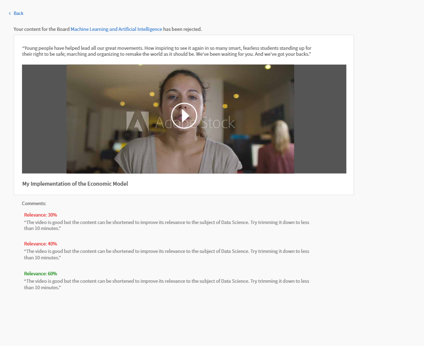
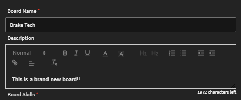
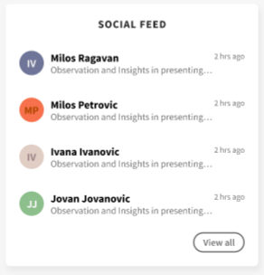

# Apprendimento sociale in Learning Manager

Scopri come utilizzare il Web di Apprendimento sociale come Allievo

Apprendimento sociale è una piattaforma di Learning Manager che consente agli utenti di condividere idee e informazioni significative in un ambiente informale. Si tratta di una metodologia che integra il concetto di apprendimento tradizionale. Il completamento di un corso online non offre agli utenti alcun vantaggio in termini di interazione con i propri pari a livello sociale.

La semplice frequentazione di un corso di formazione non garantisce la memorizzazione di tutti i contenuti da parte degli utenti. Per contro, l’apprendimento sociale consente agli utenti di sfruttare l’esperienza di chi li circonda per ottenere esattamente le informazioni di cui hanno bisogno. A loro volta, gli utenti possono applicare rapidamente tali informazioni per completare un’attività e raggiungere un obiettivo.

Allo stesso modo, la funzione di apprendimento sociale di Learning Manager consente agli utenti di interagire tra loro condividendo e imparando dai contenuti.

I vari tipi di contenuti che possono essere condivisi su questa piattaforma sono video, audio, schermate, testi, domande e sondaggi. Gli utenti possono inoltre condividere i propri programmi di apprendimento online con i colleghi utilizzando il **bookmarklet Condividi sul social**. Per ulteriori informazioni, consulta [Condividere su Apprendimento sociale](share-to-social.md).

È possibile pubblicare contenuti anche in una bacheca con l&#39;aiuto dell&#39;**applicazione desktop Adobe Learning Manager**. Per ulteriori informazioni, consulta [App Adobe Learning Manager per desktop](../adobe-learning-manager-app-for-desktop.md).

Solo se l’Amministratore abilita Apprendimento sociale, la funzione è visibile agli Allievi.

 

*Visualizza dashboard di apprendimento*

<table>
 <tbody>
  <tr>
   <td>
    
<b>N. N.</b>
</td>
   <td>
    
<b>Terminologia o concetto</b>
</td>
   <td>
    
<b>Breve spiegazione</b>
</td>
  </tr>
  <tr>
   <td>
    
1
</td>
   <td>
    
Le mie bacheche
</td>
   <td>
    
Una bacheca è <code>
      collection
     </code> di post creati da un utente. In Le mie bacheche vengono visualizzati tutti i post a cui l’utente ha partecipato, che ha creato e seguito.
</td>
  </tr>
  <tr>
   <td>
    
2
</td>
   <td>
    
Tutte le bacheche
</td>
   <td>
    
Nella pagina Tutte le bacheche, gli utenti possono visualizzare le bacheche create da tutti gli Allievi che condividono l’ambito di attività.
</td>
  </tr>
  <tr>
   <td>
    
3
</td>
   <td>
    
Commento
</td>
   <td>
    
Gli utenti possono commentare e visualizzare i post creati nelle bacheche. 
</td>
  </tr>
  <tr>
   <td>
    
4
</td>
   <td>
    
Risposta
</td>
   <td>
    
Gli utenti possono rispondere ai commenti che vengono fatti sui post all’interno di una bacheca.
</td>
  </tr>
  <tr>
   <td>
    
5
</td>
   <td>
    
Voto a favore/sfavore
</td>
   <td>
    
Fai clic sul pulsante di voto a favore e voto a sfavore per mettere Mi piace o Non mi piace a un post.
</td>
  </tr>
  <tr>
   <td>
    
6
</td>
   <td>
    
Classifica social
</td>
   <td>
    
Nella classifica social, gli utenti possono visualizzare i nomi degli Allievi e il numero di punti da loro ottenuti partecipando all’apprendimento sociale.
</td>
  </tr>
  <tr>
   <td>
    
7
</td>
   <td>
    
Persone che seguo
</td>
   <td>
    
In questa sezione, gli utenti possono visualizzare i nomi degli Allievi che seguono e il numero di post che hanno creato.
</td>
  </tr>
  <tr>
   <td>
    
8
</td>
   <td>
    
Abilità popolari
</td>
   <td>
    
Nelle sezioni Tutte le schede, è possibile visualizzare le abilità frequentemente utilizzate dagli Allievi insieme al numero di post creato da questi ultimi utilizzando quella specifica abilità.
</td>
  </tr>
  <tr>
   <td>
    
9
</td>
   <td>
    
Condividi sul social
</td>
   <td>
    
Il bookmarklet Condividi sul social consente agli utenti di condividere i propri programmi di apprendimento online come pagine Web e blog direttamente in Apprendimento sociale di Learning Manager.
</td>
  </tr>
  <tr>
   <td>
    
10
</td>
   <td>
    
Nuovo post
</td>
   <td>
    
Il pulsante Nuovo post consente agli utenti di creare e pubblicare contenuti all’interno delle bacheche.
</td>
  </tr>
 </tbody>
</table>

## Creazione di contenuti come post {#creatingcontentasapost}

I contenuti vengono creati come post all’interno di una bacheca. Per creare un post, procedi come indicato di seguito:

1. Fai clic su **[!UICONTROL Nuovo post].**

   
   *Seleziona nuovo post*

1. Seleziona uno dei seguenti tipi di contenuti per la pubblicazione: testo, domanda, video, audio, sondaggio e schermata. I contenuti esistenti possono essere caricati dal sistema degli utenti o dalla galleria dell’applicazione desktop Adobe Learning Manager.

   Utilizza l’app desktop Adobe Learning Manager per registrare video o audio e acquisire una schermata. Per ulteriori informazioni, vedere [Applicazione desktop Adobe Learning Manager](../adobe-learning-manager-app-for-desktop.md).

   <!---->

1. Cerca una bacheca o un’abilità correlata al post. Se la bacheca non esiste, fare clic su **[!UICONTROL Crea una nuova bacheca]**.

   

   *Creare una bacheca*

   Se sei un utente esterno o interno e se l’Amministratore ti ha concesso l’accesso per la creazione di una bacheca, puoi crearne una. Se non disponi delle autorizzazioni necessarie per creare una bacheca, il collegamento **Crea una nuova bacheca** non viene visualizzato.

1. Nella finestra di dialogo a comparsa, inserisci i dettagli e seleziona il seguente tipo di bacheca:

   * **Pubblico** - La partecipazione e la visibilità dei post sono disponibili per tutti gli utenti.
   * **Privato** - Il post è visibile solo al creatore della bacheca, ai moderatori e agli utenti aggiunti alla bacheca.
   * **Limitato** - Solo il proprietario, l’amministratore e i moderatori della bacheca possono creare post. Altri utenti possono partecipare commentando/rispondendo, votando a favore o contro e così via.

   <!---->

   >[!NOTE]
   >
   >Nell’app Social Learning, solo un **Amministratore** è in grado di creare una scheda privata con gruppi utente (interni/esterni).
   >
   >Qualsiasi altro utente tranne Amministratore, Autore, Allievo, Manager, Istruttore, ecc. **impossibile** creare bacheche private con gruppi utente. Non possono visualizzare la sezione **gruppi di utenti** durante la creazione di una scheda privata.

   Solo Amministratore: quando scegli **Privato**, vengono visualizzate due opzioni: **Utenti** e **Gruppi utente**. Scegli l’opzione **Gruppi utente**, quindi aggiungi i gruppi di utenti con cui desideri condividere la bacheca privata.

   Nel campo Gruppi utente, puoi scegliere gruppi interni, esterni o personalizzati. La bacheca privata sarà quindi visibile a tutti i gruppi di utenti specificati, indipendentemente dalle impostazioni dell’ambito.

1. Per condividere il contenuto, fai clic su **[!UICONTROL Post]**. Facendo clic su Pubblica, l’utente riceve una notifica.

   Il contenuto viene pubblicato in base all’impostazione di cura impostata dall’amministratore per i contenuti di Apprendimento sociale che possono essere curati da [Moderatori della bacheca/Esperti in materia](social-learning-web-user.md#HowtobecomeaSubjectMatterExpertSME).

   <!---->

1. Gli utenti ricevono una notifica quando il post viene approvato o rifiutato, se l’Amministratore ha impostato la cura su Cura solo manuale. Se il post viene rifiutato, fai clic sul collegamento ipertestuale **Fai clic per esaminare** per verificare i commenti dei moderatori della bacheca o degli esperti in materia (SME).

   I contenuti creati dagli utenti sono curati dai moderatori della bacheca o dagli esperti in materia.

   <!---->

Quando crei o rispondi a un post in Apprendimento sociale, puoi comporre un post utilizzando l’Editor di testo RTF e applicare diversi tipi di formattazione.

*Utilizzare Editor di testo RTF per creare un post*

Inoltre, durante la creazione di una bacheca, puoi accedere allo stesso set di opzioni nell’Editor di testo RTF.

*Utilizzare Editor di testo RTF per creare un post*

## Visualizzazione dei contenuti approvati {#viewingapprovedcontent}

Una volta che un post è stato approvato, viene visualizzato in una bacheca di Apprendimento sociale. Gli utenti possono ora commentare, rispondere e assegnare voti a favore/a sfavore al post.

Gli utenti possono utilizzare i seguenti tipi di contenuti per fare un commento: Registra schermata, webcam o entrambi, Registra audio, Acquisisci schermata, Carica file, Galleria Learning Manager.

<!---->

## Contenuti in Social player {#contentinsocialplayer}

In Learning Manager, i video e i contenuti statici quali presentazioni e immagini vengono pubblicati in Social player in una bacheca. Puoi caricare un file dal tuo sistema, registrare un video/l’attività dello schermo e acquisire una schermata utilizzando l’applicazione desktop Adobe Learning Manager.

Una volta che l’utente ha finito di pubblicare alcuni contenuti, tali contenuti possono essere visualizzati da altri Allievi nel rispettivo ambito di attività. In Social player, gli Allievi possono visualizzare, commentare/rispondere, assegnare un voto a favore/sfavore e segnalare abusi.

<!---->

**Per commentare/rispondere o esprimere un voto a favore/sfavore su Social player, procedi come indicato di seguito:**

1. Fai clic sul pulsante della modalità schermo intero nell’angolo in basso a destra del social player.
1. Per visualizzare i controlli del player sullo schermo, fai clic sulla freccia rivolta verso il basso.
1. Per visualizzare la sezione dei commenti, fai clic sull’icona dei commenti nell’angolo inferiore sinistro dello schermo.
1. Gli utenti possono commentare/rispondere, assegnare un voto a favore/sfavore e segnalare abusi.
1. Fai clic sul tasto ESC per uscire dalla modalità a schermo intero.

## Visualizzazione della bacheca nel social {#board-view-social}

Un Allievo può visualizzare tutte le bacheche in una visualizzazione a elenco. Accedi all’app per gli Allievi e nella pagina di Apprendimento sociale, fai clic sul pulsante come illustrato di seguito:

*Visualizzazione della bacheca nel social*

Quando visualizzi i post in formato bacheca, puoi ordinarli in base a **Post** e **Collaboratore**.

* Se scegli **Post**, le bacheche verranno ordinate in base al numero di post inseriti nella bacheca.
* Se scegli **Collaboratori**, le bacheche verranno ordinate in base al numero di utenti che hanno commentato o risposto nei thread.

## Applicare tag agli utenti nelle bacheche social

Gli Allievi con accesso alla bacheca social possono assegnare tag ad altri utenti in post e commenti di apprendimento sociale utilizzando il formato @username. L’assegnazione di tag funziona tramite l’app o le API. Solo gli utenti con accesso alla bacheca possono essere contrassegnati, mantenendo le interazioni pertinenti e private.

* Gli utenti con tag ricevono notifiche in-app e e-mail
* Le notifiche includono collegamenti diretti al contenuto
* Gli utenti esterni alla bacheca non possono essere taggati
* Gli utenti eliminati vengono visualizzati come &quot;Anonimi&quot;

>[!NOTE]
>
>Gli Allievi non possono assegnare tag ai gruppi di utenti o utilizzare @all menzioni per impedire la posta indesiderata.

### Applicare tag agli utenti nei post delle bacheche social

Puoi assegnare tag a specifici membri della bacheca in post o commenti utilizzando @username. L’assegnazione di tag è limitata ai membri con accesso a quella bacheca.
Per assegnare tag agli utenti in una bacheca social:

1. Accedi a Adobe Learning Manager come Allievo.
2. Seleziona **[!UICONTROL Apprendimento sociale]** nel riquadro di navigazione a sinistra.

   
   _Abilita l’apprendimento collaborativo selezionando Apprendimento sociale per accedere alle aree discussioni, condividere approfondimenti e assegnare tag agli utenti per il coinvolgimento interattivo_

3. Seleziona **[!UICONTROL Nuovo post]**.

   
   _Avvia una nuova discussione selezionando Nuovo post in Apprendimento sociale per condividere le conoscenze con gli utenti con tag_

4. Prima di assegnare i tag agli utenti, selezionare la bacheca dall&#39;opzione **[!UICONTROL Pubblica in un&#39;area discussioni]**.

   
   _Seleziona un&#39;area discussioni per pubblicare post e assegnare tag agli utenti, consentendo conversazioni collaborative mirate in Apprendimento sociale_

5. Digita i dettagli del post, quindi assegna un tag a un utente inserendo il simbolo @ seguito dal nome (ad esempio, @andrew). Quando si digita @ seguito dalle prime tre lettere del nome dell&#39;utente, viene visualizzato un elenco di utenti corrispondenti.

   
   _Per aggiungere tag agli utenti nel post di discussione, digita @ seguito dal nome utente per abilitare la collaborazione mirata nelle bacheche di apprendimento sociale_

6. Seleziona l’utente desiderato dall’elenco.
7. Seleziona **[!UICONTROL Post]**.

Gli utenti con tag ricevono notifiche in-app e e-mail con un collegamento diretto al post. Ciò rende le discussioni più mirate e collaborative.

### Applicazione di tag agli utenti in base all’ambito della bacheca

L’assegnazione di tag con restrizioni di ambito consente di assegnare tag solo agli Allievi autorizzati ad accedere a una bacheca specifica. In questo modo si mantiene la privacy impedendo l’assegnazione di tag agli utenti al di fuori dell’ambito.

Se tenti di assegnare tag agli Allievi che non rientrano nell’ambito della bacheca, non verrà visualizzato alcun suggerimento e non potrai assegnarli.

### Applicare tag agli utenti eliminati

Se a un utente eliminato viene assegnato un tag in un post di Apprendimento sociale, il suo nome viene visualizzato come &quot;Anonimo&quot; nel post. Il commento e il tag rimangono visibili per il contesto, ma i collegamenti o i dettagli del profilo non vengono visualizzati.

_Post di Apprendimento sociale che evidenzia come un utente eliminato appare anonimo quando viene taggato_

### Filtro abilità {#skillfilter}

*Ordinare i post*

Utilizzando il filtro Abilità, puoi selezionare più abilità per filtrare le bacheche. È inoltre possibile cancellare i filtri dopo aver selezionato le abilità.

### Filtro livello di attività {#activitylevelfilter}

*Filtra livelli attività*

Utilizzando il filtro Attività, puoi ordinare le bacheche in base all’entità delle interazioni in una bacheca. Puoi ordinarle in base a:

* Attività elevata
* Attività normale
* Attività bassa

Nella bacheca, puoi eseguire le azioni tipiche di livello bacheca.

<!---->

## Download di post {#downloadposts}

Gli Allievi possono scaricare i contenuti, inclusi gli allegati, dalla piattaforma di Apprendimento sociale, in modo da poterne disporre offline.

*Scarica un post sui social*

Puoi scaricare il contenuto dalle sezioni Post o Commenti o Risposte. Puoi scaricare un solo file alla volta.

Entrambi i tipi di utenti (interni o esterni) devono essere in grado di scaricare il contenuto.

Il pulsante Scarica può essere visualizzato anche nei risultati della ricerca di post o commenti o risposte.

Non è ancora possibile scaricare un post nell’app per dispositivi mobili. Questa funzione sarà disponibile a breve.

## Formati contenuto supportati {#supportedcontentformats}

<table>
 <tbody>
  <tr>
   <td>
    
<b>Tipo di contenuto</b>
</td>
   <td>
    
<b>Estensioni</b>
</td>
  </tr>
  <tr>
   <td>
    
Video
</td>
   <td>
    
wmv, f4v, asf, 3gp, 3g2, avi, mov, h264, m4v, mp4, MPEG, mpg
</td>
  </tr>
  <tr>
   <td>
    
Audio
</td>
   <td>
    
mp3, amr, m4a, wav, wma, aac
</td>
  </tr>
  <tr>
   <td>
    
File statici
</td>
   <td>
    
PDF, ppt, pptx, doc, docx, xls, xlsx
</td>
  </tr>
  <tr>
   <td>
    
Immagine
</td>
   <td>
    
jpg, jpeg, png, bmp, gif
</td>
  </tr>
 </tbody>
</table>

## Bacheca visibile solo agli utenti selezionati {#selected-users}

Un Allievo che ha anche il ruolo di **Amministratore** può aggiungere un gruppo di utenti a una bacheca privata. Qualsiasi gruppo di utenti può essere aggiunto alla bacheca privata e gli utenti appartenenti al gruppo hanno accesso solo alla bacheca.

Se al gruppo di utenti viene aggiunto un nuovo utente, entrambi gli utenti possono visualizzare la bacheca privata.

Se un utente viene rimosso dalla bacheca privata, non può più visualizzarla.

Se vengono aggiunti alla bacheca privata più gruppi di utenti, tutti gli utenti di entrambi i gruppi ottengono l’accesso alle bacheche private.

<!---->

## Azioni eseguibili su un post {#actionsthatcanbedoneonapost}

Fai clic sull’icona del menu compresso nell’angolo in alto a destra di un post per visualizzarne le opzioni. Viene visualizzato il seguente elenco a menu: Modifica, Aggiungi alla mia storia, Copia URL, Elimina e Segnala.

Solo alcuni utenti dispongono delle autorizzazioni necessarie per eseguire determinate attività. I seguenti tipi di utenti sono i proprietari dei contenuti, i moderatori della bacheca e l’Amministratore dell’organizzazione.

<table>
 <tbody>
  <tr>
   <td>
    
<b>N. N.</b>
</td>
   <td>
    
<b>Azione</b>
</td>
   <td>
    
<b>Spiegazione</b>
</td>
  </tr>
  <tr>
   <td>
    
1
</td>
   <td>
    
Modifica
</td>
   <td>
    
Modifica consente all’Autore del contenuto di correggere o modificare il proprio post.
</td>
  </tr>
  <tr>
   <td>
    
2
</td>
   <td>
    
Aggiungi alla mia storia
</td>
   <td>
    
Una storia è una raccolta di contenuti curata da un utente. Gli utenti possono impostare la visibilità del contenuto su Privato o Pubblico.
</td>
  </tr>
  <tr>
   <td>
    
3
</td>
   <td>
    
Copia URL
</td>
   <td>
    
Questa opzione consente a tutti gli utenti di copiare l’URL di una bacheca o di un post e condividerlo.
</td>
  </tr>
  <tr>
   <td>
    
4
</td>
   <td>
    
Elimina
</td>
   <td>
    
L’opzione Elimina rimuove il post dopo la conferma dell’utente.
</td>
  </tr>
  <tr>
   <td>
    
5
</td>
   <td>
    
Segnala
</td>
   <td>
    
Tutti gli utenti sono autorizzati a segnalare un abuso relativo a un post se quest’ultimo viola la loro privacy o se il suo contenuto è inappropriato.

    
Una volta che un post è stato segnalato, viene inviata una notifica all’Amministratore e ai moderatori della bacheca per consentire loro di intraprendere ulteriori azioni.
</td>
  </tr>
 </tbody>
</table>

**Aggiungi alla mia storia**

La storia social consente agli utenti di aggiungere o creare storie con post creati da loro stessi o da altri utenti.

Per aggiungere un post a una storia, procedi come indicato di seguito:

1. Fai clic sull&#39;icona del menu compresso nell&#39;angolo superiore destro di un post e seleziona **[!UICONTROL Aggiungi alla mia storia]**.

   

   *Aggiungi a una storia*

1. Nella finestra di dialogo **Seleziona storia**, seleziona una storia pertinente da aggiungere al post. Se non sono disponibili storie pertinenti, crea una storia facendo clic su **Nuova storia**.

   

   *Creare una storia*

1. Nella finestra di dialogo Nuova storia, compila i campi relativi al nome e alla descrizione della storia. Puoi anche impostare la visibilità della storia su Pubblica o Privata.

   

   *Aggiungi nome e descrizione del brano*

   Per visualizzare le storie create dagli utenti, fai clic sul nome dell’utente nelle opzioni del menu del profilo.

## Privilegi dell’utente per l’esecuzione delle azioni su un post {#userprivilegesforperformingtheactionsonapost}

<table>
 <tbody>
  <tr>
   <td>
    
 
</td>
   <td>
    
<b>Proprietario del contenuto</b>
</td>
   <td>
    
<b>Qualsiasi utente</b>
</td>
   <td>
    
<b>Moderatori bacheca</b>
</td>
   <td>
    
<b>Amministratore</b>
</td>
  </tr>
  <tr>
   <td>
    
<b>Modifica</b>
</td>
   <td>
    
Sì
</td>
   <td>
    
No
</td>
   <td>
    
No
</td>
   <td>
    
No
</td>
  </tr>
  <tr>
   <td>
    
<b>Aggiungi alla mia storia</b>
</td>
   <td>
    
Sì
</td>
   <td>
    
Sì
</td>
   <td>
    
Sì
</td>
   <td>
    
Sì
</td>
  </tr>
  <tr>
   <td>
    
<b>Copia URL</b>
</td>
   <td>
    
Sì
</td>
   <td>
    
Sì
</td>
   <td>
    
Sì
</td>
   <td>
    
Sì
</td>
  </tr>
  <tr>
   <td>
    
<b>Elimina</b>
</td>
   <td>
    
Sì
</td>
   <td>
    
No
</td>
   <td>
    
Sì
</td>
   <td>
    
Sì
</td>
  </tr>
  <tr>
   <td>
    
<b>Report</b>
</td>
   <td>
    
Sì
</td>
   <td>
    
Sì
</td>
   <td>
    
Sì
</td>
   <td>
    
Sì
</td>
  </tr>
 </tbody>
</table>

## Visualizzazione dei contenuti delle bacheche {#viewingcontentinboards}

Le bacheche sono delle raccolte di post. Tutte le bacheche di Apprendimento sociale vengono create sulla base di un’abilità. In Apprendimento sociale, gli utenti possono visualizzare la pagina **Tutte le bacheche** e la pagina **Le mie bacheche**.

Nella pagina Tutte le bacheche, sono visibili tutti i post o le bacheche creati dagli utenti in un ambito di attività. Nella pagina Le mie bacheche, invece, sono visibili solo le bacheche create e seguite dall’utente e a cui l’utente partecipa.

Nella pagina Le mie bacheche, le bacheche visibili possono essere filtrate in base a quanto segue: **Tutte**, **Create da me**, **Commentato da me**, **Seguito da me**.

*Filtra le bacheche visibili*

Sia in Le mie bacheche che in Tutte le bacheche gli utenti possono ordinare le bacheche per **Rilevanza** o **Data**.

*Ordina le bacheche per pertinenza e data*

Durante la creazione di un post, se non sono presenti bacheche pertinenti per il post, fai clic su [Crea una nuova bacheca](social-learning-web-user.md#Creatingcontentasapost).  Per visualizzare, modificare, eliminare, segnalare, copiare l’URL e aggiungere una bacheca all’elenco delle bacheche preferite, segui i passaggi riportati di seguito:

1. Fai clic sul nome della bacheca o su **[!UICONTROL Vai alla bacheca]**.
1. Dalla pagina delle bacheche, fai clic sull’icona del menu compresso e seleziona un’opzione dall’elenco a discesa.

   <!---->

**Gli utenti possono visualizzare le seguenti opzioni sulla pagina delle bacheche:**

* Su questa pagina viene visualizzato il numero di post, visualizzazioni e persone che seguono la bacheca. Vengono inoltre visualizzati il nome del creatore della bacheca e la data in cui la bacheca è stata creata, oltre ai principali esperti in materia della bacheca.

* Anche i nomi delle bacheche aggiunte all’elenco delle bacheche preferite dell’utente vengono visualizzati qui.

<!---->

## Condividi sul social {#sharetosocial}

Il bookmarklet Condividi sul social consente agli utenti di condividere i propri contenuti di apprendimento online quali pagine Web e blog direttamente sulla pagina social come post. Per ulteriori informazioni, consulta [Condivisione su Apprendimento sociale](share-to-social.md).

*Condividi su Apprendimento sociale*

## Le mie abilità {#myskills}

Gli utenti possono visualizzare le abilità e il numero di post o bacheche creati utilizzando un’abilità nella pagina Le mie bacheche. Per visualizzare tutte le abilità utilizzate dall’utente durante la creazione di una bacheca, fai clic su **[!UICONTROL Visualizza tutte le abilità]**.

*Visualizza tutte le abilità*

## Persone che seguo {#peopleifollow}

Nella pagina Le mie bacheche, gli utenti possono visualizzare i nomi delle persone che seguono e il numero di post che hanno creato.

*Seguono le persone seguite da un Allievo*

Per seguire altri utenti, procedi come indicato di seguito:

1. Per visualizzare la pagina del profilo di un altro utente, fai clic sul suo nome.
1. Fai clic sul pulsante Segui/Non seguire più per eseguire l’azione desiderata.

   

   *Seguire o non seguire più un utente*

## Classifica social {#socialleaderboard}

La classifica social migliora la gamification. Agli utenti vengono assegnati punti attività quando creano un nuovo post/una nuova bacheca, quando un loro post ottiene un voto a favore, quando rispondono correttamente a una domanda o quando partecipano in altri modi all’Apprendimento sociale.

Il numero totale di punti e nuovi post per tutti gli utenti nello stesso ambito viene visualizzato nella classifica social. L’Allievo con il numero massimo di punti viene visualizzato al primo posto nella classifica social, seguito dagli altri Allievi.

Fai clic su **[!UICONTROL Vai alla classifica]** nella pagina **Le mie bacheche** per visualizzare tutti gli Allievi e il numero di punti da loro ottenuto.

*Visualizza tutti gli Allievi*

## Punti attività {#activitypoints}

Il numero di punti attività assegnati agli utenti si basa sulle attività social da loro svolte.

**I punti attività vengono assegnati agli utenti nel modo seguente:**

* 5 punti per la creazione di una bacheca.
* 5 punti per l’aggiunta di un post come testo o tipo di domanda.
* 2 punti per l’aggiunta di commenti a un post.
* 1 punto viene assegnato all’utente che inizia a utilizzare una bacheca prima di tutti gli altri. Gli utenti ottengono un totale di 20 punti per i primi 20 nuovi post pubblicati in quella bacheca.

## Come si diventa esperti in materia (SME) {#howtobecomeasubjectmatterexpertsme}

Un esperto in materia (SME) è un utente che possiede competenze specifiche in una particolare abilità. In Apprendimento sociale di Learning Manager, gli utenti vengono designati come SME in base al numero massimo di punti attività loro assegnati per un’abilità.

I principali SME hanno il privilegio di curare i contenuti dell’Allievo prima che vengano pubblicati in una bacheca in Apprendimento sociale.

L’Amministratore dell’organizzazione dispone inoltre dei privilegi necessari per assegnare ulteriori punti a un Allievo affinché ottenga la qualifica di SME per una data abilità.

## Come si curano i contenuti in qualità di SME? {#howtocuratecontentasasme}

1. Quando un utente crea un nuovo post o una nuova bacheca, l’SME riceve una notifica che comunica la presenza di un post in attesa di cura su una bacheca.

   <!---->

1. Per moderare il post, fai clic sul collegamento **Fai clic per rivedere**. Questa azione indirizza l’SME alla pagina di moderazione dei contenuti, che ha l’aspetto della schermata riportata di seguito.

   <!---->

1. Per valutare il contenuto in base alla percentuale di pertinenza con l’abilità di una bacheca, seleziona il colore opportuno nella scala di pertinenza. Il primo colore indica una percentuale irrilevante (10% di pertinenza), mentre l’ultimo colore indica una percentuale molto rilevante (100% di pertinenza).
1. È opportuno che l’SME inserisca un commento sulla base di uno specifico punteggio di pertinenza fornito. Leggendo il commento, gli utenti possono comprendere meglio il motivo per cui il loro post è stato rifiutato.

<!--## AI-enabled auto curation {#autocuration}-->

## Cerca in apprendimento formale e informale {#searchinformalandinformallearning}

In tutte le pagine di Apprendimento sociale è presente il campo di ricerca, che consente agli utenti di cercare una bacheca, un’abilità o un contenuto particolari. Per effettuare una ricerca, digita nel campo di ricerca e fai clic sull’icona di ricerca o premi il tasto Invio sulla tastiera.

<!---->

Le seguenti pagine dell’apprendimento informale hanno un campo di ricerca: **Bacheche personali**, **Tutte le bacheche**, **Pagina delle bacheche**, **Pagina del profilo** dell’utente e **Pagina del profilo di un altro Allievo**.

Quando un utente cerca un contenuto nell’apprendimento informale, il numero totale di risultati della ricerca per tale contenuto viene visualizzato nell’apprendimento formale e informale di Learning Manager.

Analogamente, il numero di risultati di ricerca trovati nell’apprendimento informale viene visualizzato durante la ricerca di contenuti in una pagina di apprendimento formale.

*Risultati della ricerca per l’apprendimento*

Nella pagina della bacheca di apprendimento informale, è possibile effettuare solo ricerche relative alla bacheca. Eventuali ricerche non correlate a una bacheca non vengono visualizzate.

## Visualizzazione del profilo utente {#viewuserprofile}

Se Apprendimento sociale è abilitato per un Allievo, l’utente può visualizzare il profilo facendo clic sull’immagine di profilo nell’angolo in alto a destra di Apprendimento sociale e selezionando il relativo nome nell’elenco a discesa.

*Visualizza profilo utente*

Nella pagina del proprio profilo, gli Allievi possono visualizzare il numero totale di punti ottenuti, il numero di post creati e il numero di follower.

Inoltre, possono visualizzare le abilità per le quali hanno ottenuto la qualifica di esperti in materia.

La pagina dell’Allievo mostra anche le **storie selezionate**, le **attività recenti** dell’Allievo eseguite e le **persone da lui seguite**.

## Notifiche {#notifications}

In seguito all’approvazione o al rifiuto di un post da parte dell’SME, gli utenti ricevono una notifica, che può essere visualizzata facendo clic sull’icona delle notifiche nell’angolo superiore destro della finestra. Gli utenti possono visualizzare le notifiche relative alle attività di Apprendimento sociale e Apprendimento formale.

<!---->
